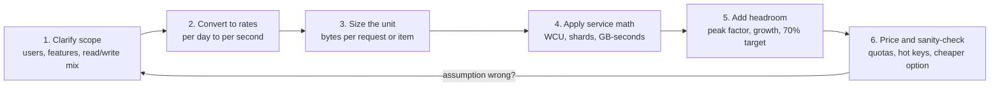
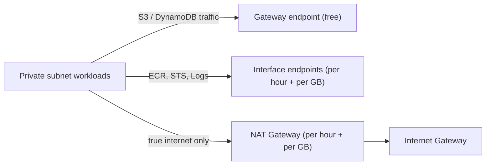

# Back-of-the-Envelope Sizing for AWS Architects

A "numbers every architect should know" reference plus worked estimation problems for system design and Solutions Architect interviews. The goal is to show a **repeatable method**: state your assumptions, do the arithmetic out loud, add headroom, then sanity-check cost and limits.

> **Read this first:** Every AWS quota below is a **default, verify current docs**. Many are soft limits you can raise through Service Quotas, and AWS changes them often. All prices are **approximate us-east-1 list prices** used only to demonstrate the method. Interviewers care about your reasoning, not the exact dollar figure.

Related deep dives: [Databases on AWS](../concepts/databases-on-aws.md) · [Storage on AWS](../concepts/storage-on-aws.md) · [Serverless Architecture](../concepts/serverless-architecture.md) · [Streaming & Search](../concepts/streaming-and-search-kafka-opensearch.md) · [Cost Optimization](../concepts/cost-optimization.md) · [Networking & API Fundamentals](../concepts/networking-and-api-fundamentals.md)

---

## 🧭 The Estimation Method

**Interview habits that score points:**

- Round aggressively (86,400 s/day ≈ 100K) and say so.
- Separate **average** from **peak** (peak is usually 2-5x average; bursty consumer apps can hit 10x).
- Always ask "what is the binding constraint?" — bandwidth, records/sec, item size, connections, or cost.
- Finish with the **cheaper or safer alternative** (caching, compression, tiering, endpoints, batching).

---

## 🔢 Handy Conversions

| Quantity | Value | Shortcut |
| :--- | :--- | :--- |
| Seconds per day | 86,400 | ≈ 10^5 |
| Seconds per month (30 d) | 2,592,000 | ≈ 2.6M |
| Hours per month (AWS billing) | 730 | Use 730 for on-demand hourly pricing |
| 1M requests/day | ≈ 11.6 req/s | "1M/day ≈ 12 QPS" |
| 1B requests/month | ≈ 386 req/s | "1B/month ≈ 400 QPS" |
| 1 Gbps | 125 MB/s | Divide bits by 8 |
| 1 MB/s sustained for a month | ≈ 2.6 TB | MB/s × 2.6 = TB/month |
| 1 KB, MB, GB, TB, PB | 10^3 … 10^15 bytes (decimal) | Binary (KiB, MiB) is ~2-12% larger; fine to ignore in interviews |
| Availability 99.9% | ≈ 43 min downtime per 30-day month | 99.99% ≈ 4.3 min/month |

---

## ⚡ Latency Numbers (Order of Magnitude)

Classic figures (popularized by Jeff Dean / Peter Norvig), rounded for modern hardware. Memorize the **ratios**, not the digits.

| Operation | Approx. Latency | Mental Model |
| :--- | :--- | :--- |
| L1 cache reference | ~1 ns | Instant |
| Main memory reference | ~100 ns | 100x L1 |
| Compress 1 KB (fast codec) | ~2-10 µs | CPU is cheap |
| Read 1 MB sequentially from memory | ~10-50 µs | |
| NVMe SSD random read (4 KB) | ~20-100 µs | ~1,000x memory |
| Read 1 MB sequentially from SSD | ~0.2-1 ms | |
| Round trip within the same AZ | ~0.1-0.5 ms | |
| Round trip across AZs (same region) | ~0.5-2 ms (single-digit ms max) | Why sync replication across AZs is fine |
| ElastiCache (Redis/Valkey) GET | Sub-millisecond | Cache hot reads |
| DynamoDB GetItem | Single-digit ms | DAX brings it to microseconds |
| EBS gp3 I/O | Low single-digit ms | io2 Block Express: sub-ms |
| HDD seek | ~5-10 ms | Avoid random I/O on HDD (st1/sc1) |
| S3 GET first byte | ~10-100+ ms | Great throughput, not low latency |
| Round trip us-east-1 ↔ us-west-2 | ~60-80 ms | |
| Round trip us-east-1 ↔ eu-west-1 | ~70-90 ms | |
| Round trip us-east-1 ↔ ap-southeast-2 | ~180-220 ms | Why global apps need regional read replicas / edge |
| Lambda cold start | ~100 ms to >1 s | Depends on runtime, package size, VPC, SnapStart |

**Takeaway:** a cross-region call costs about the same as ~100,000 memory reads. Chatty cross-region designs fail latency SLOs before they fail anything else.

---

## 📏 AWS Limits and Unit Math (Default, Verify Current Docs)

| Service | Limit / Unit | Value | Notes |
| :--- | :--- | :--- | :--- |
| **Lambda** | Max timeout | 15 min (900 s) | Hard limit. Longer work → Step Functions, ECS/Fargate, Batch |
| | Memory | 128 MB - 10,240 MB | vCPU scales with memory (~1 vCPU at 1,769 MB, up to 6 vCPU) |
| | Ephemeral `/tmp` | 512 MB - 10 GB | |
| | Concurrency per region | 1,000 (default) | Soft limit; new accounts may start lower |
| | Sync payload | 6 MB request/response | Async payload is smaller; check current value |
| | Deployment package | 50 MB zipped / 250 MB unzipped; 10 GB container image | |
| **DynamoDB** | Max item size | 400 KB | Includes attribute names. Big blobs → S3 + pointer |
| | 1 WCU | 1 write/s for item ≤ 1 KB | Round **up** per KB. Transactional = 2x |
| | 1 RCU | 1 strongly consistent read/s ≤ 4 KB | Eventually consistent = 2 reads/s; transactional = 2x cost |
| | Per partition | 3,000 RCU / 1,000 WCU, ~10 GB | Hot keys throttle even when table capacity is fine |
| **Kinesis Data Streams** | Shard ingest | 1 MB/s **or** 1,000 records/s | Whichever hits first |
| | Shard egress | 2 MB/s shared across standard consumers | Enhanced fan-out: 2 MB/s **per consumer** per shard |
| | Retention | 24 h default, up to 365 days | |
| **S3** | Request rate per prefix | 3,500 PUT/COPY/POST/DELETE and 5,500 GET/HEAD per second | Scales with more prefixes; no limit on number of prefixes |
| | Single PUT | 5 GB | Use multipart above ~100 MB (max 10,000 parts) |
| | Max object size | 5 TB historically (AWS raised this in late 2025; verify) | |
| **SQS** | Standard throughput | Nearly unlimited | At-least-once, best-effort ordering |
| | FIFO throughput | 300 API calls/s per action (3,000 msgs/s with batching of 10) | High-throughput FIFO mode is much higher |
| | Message size | 256 KB historically; raised to 1 MiB in 2025 (verify) | Larger → S3 pointer (extended client) |
| | Retention | 4 days default, 60 s - 14 days | |
| | Visibility timeout | 30 s default, max 12 h | |
| | Long polling wait | Max 20 s | |
| **API Gateway** | Integration timeout | 29 s default | REST regional/private can request higher; HTTP API max 30 s |
| | Account throttle | 10,000 RPS steady, 5,000 burst (per region) | Soft limit, shared across APIs in the account |
| | Payload | 10 MB | |
| **NAT Gateway** | Bandwidth | Scales to ~100 Gbps | ~$0.045/hr + ~$0.045/GB processed (approx) |
| **EventBridge** | PutEvents | Region-dependent soft limit (thousands/s) | Check Service Quotas |

---

## 🧮 Worked Estimation Problems

### Problem 1 — DynamoDB capacity for 10K writes/sec of 3 KB items

**Assumptions:** 10,000 writes/s, 3 KB items, plus 30,000 reads/s of the same items. Steady traffic (flat 24x7).

**Writes:**

- WCU per write = ceil(3 KB / 1 KB) = **3 WCU**
- Required = 10,000 × 3 = **30,000 WCU**
- With 70% target utilization for auto scaling headroom: 30,000 / 0.7 ≈ **43,000 WCU provisioned**

**Reads:**

- Strongly consistent: ceil(3 KB / 4 KB) = 1 RCU → 30,000 RCU
- Eventually consistent: 0.5 RCU → **15,000 RCU** (half the cost; use it when staleness of ~1 s is acceptable)

**Cost comparison (writes only, approx. prices):**

| Mode | Price (approx.) | Arithmetic | Monthly |
| :--- | :--- | :--- | :--- |
| Provisioned | ~$0.00065 per WCU-hour | 43,000 × 0.00065 × 730 | ≈ **$20K** |
| On-demand | ~$0.625 per million write request units | 30,000 WRU/s × 2.6M s = 78B WRU → 78,000 × $0.625 | ≈ **$49K** |

**Verdict:** For steady, predictable load, provisioned (plus reserved capacity) is roughly 2-3x cheaper. On-demand wins for spiky, unknown, or low-utilization tables (rule of thumb: if average utilization of provisioned capacity would sit below ~30-40%, on-demand is competitive).

**Sanity checks:**

- 30,000 WCU / 1,000 WCU per partition = at least **30 partitions**. The partition key must spread writes evenly (add a suffix / write sharding for hot keys).
- Could you shrink items? Compressing 3 KB to under 2 KB saves 33% of WCU instantly.

---

### Problem 2 — Kinesis shards for 50 MB/s ingest

**Assumptions:** 50 MB/s producer throughput, average record 1 KB, three independent consumers (Lambda, Firehose, analytics app).

**Ingest:**

- By bandwidth: 50 MB/s / 1 MB/s = **50 shards**
- By records: 50 MB/s / 1 KB = 50,000 rec/s / 1,000 = **50 shards**
- Both agree → 50 shards; add ~25% headroom → **~63 shards**

**What if records are 100 bytes?** 50 MB/s / 100 B = 500,000 rec/s → **500 shards** by record count. Fix: aggregate records with the KPL (many user records per Kinesis record) to get back to ~50-63 shards.

**Egress:**

- 3 consumers × 50 MB/s = 150 MB/s. Shared read limit is 2 MB/s per shard → 150 / 2 = 75 shards, and the 5 GetRecords calls/s per shard limit also gets contended.
- Better: **enhanced fan-out** gives each consumer its own 2 MB/s per shard, so 63 shards is enough.

**Cost (approx.):** 63 shards × $0.015/shard-hour × 730 ≈ **$690/month** plus PUT payload units (~$0.014 per million 25 KB units). 50K records/s × 2.6M s ≈ 130B units ≈ **$1,820/month**. Enhanced fan-out adds per-consumer-shard-hour and per-GB charges. Compare against **on-demand mode** and **MSK** if throughput is flat and very high.

---

### Problem 3 — NAT Gateway cost for 20 TB/month and how to cut it

**Assumptions:** Private subnets in 3 AZs, one NAT Gateway per AZ, 20 TB/month flows through NAT. Traffic breakdown discovered via VPC Flow Logs: 60% to S3, 10% to ECR / other AWS APIs, 30% to the internet.

**Current cost (approx.):**

| Line item | Arithmetic | Monthly |
| :--- | :--- | :--- |
| NAT hours | 3 × 730 h × $0.045 | ≈ $99 |
| NAT data processing | 20,000 GB × $0.045 | ≈ $900 |
| Internet egress (only the 30%) | 6,000 GB × ~$0.09 | ≈ $540 |
| **Total** | | **≈ $1,540** |

**Optimization:**

1. **S3 Gateway endpoint** (free): 12 TB to S3 no longer touches NAT → saves 12,000 × $0.045 ≈ **$540/month**. Same-region S3 transfer is free. Do the same for DynamoDB.
2. **Interface endpoints** for ECR (api + dkr), STS, CloudWatch Logs: 2 TB now costs ~$0.01/GB + ~$0.01/hr per endpoint per AZ. 2,000 × ($0.045 - $0.01) ≈ $70 saved, minus endpoint hours (4 endpoints × 3 AZ × 730 × $0.01 ≈ $88). **Only worth it above a break-even volume** — do the math per service (security/private connectivity may justify it anyway).
3. Remaining internet traffic: cache container images (ECR pull-through cache), compress payloads, and avoid cross-AZ NAT hops (route each AZ to its own NAT).

**Result:** ≈ $1,540 → ≈ $1,000/month (~35% saved) with one gateway endpoint and route table changes. See [Cost Optimization](../concepts/cost-optimization.md).

---

### Problem 4 — Photo storage for 100M users over 5 years with S3 tiering

**Assumptions:** 100M users, each uploads 50 photos/year. Original ≈ 2 MB, derived sizes (thumbnail + medium) ≈ 0.5 MB. User base flat for simplicity.

**Volume:**

- Per photo: 2.5 MB
- Per year: 100M × 50 × 2.5 MB = 12.5 × 10^15 B = **12.5 PB/year**
- Objects per year: 100M × 50 × 3 renditions = **15B objects/year**
- After 5 years: **62.5 PB**, 75B objects

**Access pattern:** photos are hot for ~30 days, occasionally viewed for a year, rarely afterward, but must load instantly when viewed.

**Tiering plan (lifecycle rules):** Standard for the current year, Standard-IA for year 2, Glacier Instant Retrieval for years 3-5.

**Monthly storage bill at end of year 5 (approx. prices, 1 PB ≈ 1M GB):**

| Tier | Data | Price/GB-month | Monthly |
| :--- | :--- | :--- | :--- |
| S3 Standard (large-volume tier) | 12.5 PB | ~$0.021 | ≈ $262K |
| Standard-IA | 12.5 PB | ~$0.0125 | ≈ $156K |
| Glacier Instant Retrieval | 37.5 PB | ~$0.004 | ≈ $150K |
| **Tiered total** | 62.5 PB | | **≈ $568K** |
| All in Standard | 62.5 PB | ~$0.021 | ≈ $1.31M |

**Gotchas to mention:**

- **Minimum billable object size of 128 KB** for IA and Glacier IR: thumbnails (~20-50 KB) are billed as 128 KB. Keep small renditions in Standard or regenerate them on demand.
- **Lifecycle transition requests cost money** (per 1,000 objects). 15B objects/year × ~$0.01-0.02 per 1,000 ≈ $150K-$300K/year in transitions. Consider transitioning only originals.
- **Minimum storage duration** (30 days IA, 90 days Glacier IR) and **retrieval fees** on IA/GIR.
- **S3 Intelligent-Tiering** avoids guessing the access pattern for a small monitoring fee per object (objects under 128 KB are not monitored or tiered).
- Serve reads through **CloudFront** so hot images rarely hit S3 at all. See [Storage on AWS](../concepts/storage-on-aws.md).

---

### Problem 5 — Lambda cost for 50M requests/month

**Assumptions:** 50M invocations/month, 200 ms average duration, 512 MB memory, x86.

| Line item | Arithmetic | Monthly (approx.) |
| :--- | :--- | :--- |
| Requests | 50M × $0.20 per 1M | $10 |
| Compute (GB-seconds) | 50M × 0.2 s × 0.5 GB = 5M GB-s × ~$0.0000166667 | ≈ $83 |
| Free tier (if applicable) | −1M requests, −400K GB-s | ≈ −$7 |
| **Lambda total** | | **≈ $86-93** |

**Levers:** Graviton (arm64) is ~20% cheaper per GB-s; right-size memory with Lambda Power Tuning (more memory can be *cheaper* if duration drops proportionally).

**The real surprise — the front door:**

- API Gateway REST API: 50M × ~$3.50/M ≈ **$175**
- API Gateway HTTP API: 50M × ~$1.00/M ≈ **$50**
- Plus CloudWatch Logs ingestion if every invocation logs 1 KB: 50 GB × ~$0.50/GB ≈ $25

**Break-even sanity check:** 50M req/month ≈ 19 req/s average. A pair of small containers could serve that for similar money; Lambda wins on zero ops and spiky traffic. At sustained hundreds of req/s with long durations, Fargate or EC2 usually becomes cheaper. See [Serverless Architecture](../concepts/serverless-architecture.md).

---

### Problem 6 — QPS from Daily Active Users

**Assumptions:** 10M DAU, each user makes 20 API calls/day, read:write = 10:1, peak = 4x average.

- Requests/day = 10M × 20 = 200M
- Average QPS = 200M / 86,400 ≈ **2,300 QPS** (shortcut: 200 × 11.6 ≈ 2,300)
- Peak QPS = 2,300 × 4 ≈ **~9,300 QPS**, call it **10K QPS**
- Reads ≈ 9,000 QPS, writes ≈ 900 QPS at peak

**Design implications:**

- 10K QPS is at the **API Gateway default account throttle** → request an increase or front with ALB.
- With a 90% cache hit rate, the database sees only ~900 read QPS at peak.
- Storage growth: average writes ≈ 900 / 4 ≈ 225/s × 1 KB × 86,400 ≈ 20 GB/day ≈ **7 TB/year**.

---

### Problem 7 — Bandwidth for video streaming

**Assumptions:** 200K peak concurrent viewers, adaptive bitrate averaging 5 Mbps (1080p), 1M DAU watching 1 hour/day.

- Peak egress = 200,000 × 5 Mbps = 1,000,000 Mbps = **1 Tbps**
- Data per viewing-hour = 5 Mbps / 8 = 0.625 MB/s × 3,600 s = **2.25 GB/hour**
- Daily = 1M × 2.25 GB = 2.25 PB/day → **~67.5 PB/month**

**Implications:**

- No origin serves 1 Tbps — this is a **CDN problem** (CloudFront with Origin Shield). Target >95% cache hit ratio so origin sees <50 Gbps.
- At this volume CDN pricing is **negotiated** (private pricing / committed spend); list price per GB is meaningless. Show the per-GB formula and say that.
- Storage side: each title is encoded to ~5 renditions (240p → 4K) for ABR; the encoding ladder multiplies storage by roughly 3-5x the 1080p size.
- Levers: better codecs (HEVC/AV1 cut bitrate roughly 30-50%), per-title encoding, lower default bitrate on mobile.

---

### Problem 8 — RDS vs Aurora sizing sanity check

**Assumptions:** OLTP app, 2 TB today growing 100 GB/month, 3,000 writes/s and 40,000 reads/s at peak, working set ~200 GB.

**Sanity checks, in order:**

1. **Memory:** a 200 GB working set should fit in buffer cache → writer needs ~256 GB+ RAM (for example an r-family 8xlarge class instance).
2. **Reads:** 40K reads/s on one instance is risky → offload to replicas and a cache. Aurora supports up to 15 low-lag replicas sharing one storage volume; RDS read replicas are async copies with their own storage.
3. **Storage growth:** 2 TB + 100 GB × 36 months ≈ 5.6 TB in 3 years. Fine for both (RDS gp3/io2 up to 64 TiB; Aurora auto-grows, 128 TiB default max, verify current).
4. **I/O cost (Aurora Standard):** suppose 15,000 I/O ops/s average → 15,000 × 2.6M s ≈ 39B I/Os × ~$0.20 per million ≈ **$7,800/month** in I/O alone. When I/O exceeds ~25% of total Aurora spend, **Aurora I/O-Optimized** is usually cheaper.
5. **Failover:** RDS Multi-AZ (instance) failover is typically 60-120 s; Aurora typically under 30 s (faster with RDS Proxy).
6. **Connections:** thousands of Lambda functions or containers → put **RDS Proxy** in front regardless.

**Verdict framework:** RDS when the workload is modest and steady and you want the lowest price; Aurora when you need fast failover, many readers, storage auto-growth, Global Database, or high I/O with predictable I/O-Optimized billing. See [Databases on AWS](../concepts/databases-on-aws.md).

---

### Problem 9 — Log ingestion: CloudWatch Logs vs S3

**Assumptions:** 500 instances/pods, each emitting 1 GB/day of logs, 30-day hot search, 1-year retention.

- Volume = 500 GB/day ≈ **15 TB/month**
- CloudWatch Logs standard ingestion ≈ 15,000 GB × ~$0.50 = **~$7,500/month** (plus storage ~$0.03/GB-month)
- Firehose → S3 (compressed ~10:1 → 1.5 TB/month) + Athena on demand: Firehose ≈ 15,000 GB × ~$0.029 ≈ $435, S3 ≈ tens of dollars/month growing with retention
- Middle ground: **CloudWatch Logs Infrequent Access log class** (roughly half the ingest price) for logs you rarely query live

**Verdict:** send high-value application/error logs to CloudWatch (alarms, Logs Insights), and bulk debug/access logs to S3 with lifecycle rules. Drop DEBUG logs in production at the source. See [Observability & Monitoring](../concepts/observability-and-monitoring.md).

---

## ✅ Interview Checklist

| Step | Say It Out Loud |
| :--- | :--- |
| Assumptions | "I'll assume 10M DAU, 20 calls each, 4x peak — correct me if the traffic shape differs." |
| Units | "3 KB rounds up to 3 WCU; eventually consistent halves RCU." |
| Binding constraint | "For tiny records, Kinesis is limited by records/s, not MB/s." |
| Headroom | "I'll provision for 70% utilization and 12 months of growth." |
| Quotas | "10K QPS hits the default API Gateway throttle — raise it early." |
| Cost | "Prices are approximate; the ratio between options is what matters." |
| Alternative | "Gateway endpoints remove most NAT charges for S3 traffic." |
