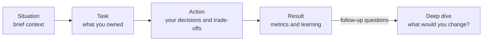

# Behavioral & Leadership Interviews (STAR Method)

A practical guide to behavioral rounds for DevOps Engineer, Solutions Architect, and SRE roles. It covers the STAR method, then 12 common questions. Each question lists what the interviewer is really assessing, a model answer outline set in a fictional but realistic AWS context, and the pitfalls that sink otherwise strong candidates.

> The model answers are **templates, not scripts**. Replace every detail with a real story of your own. Interviewers probe with follow-ups ("What would you do differently?", "What was the metric?"), and invented stories fall apart under a second question.

Related: [SA Interview Patterns](sa-interview-patterns.md) · [SRE & DevOps Complete Guide](sre-devops-complete-guide.md) · [DevOps Architect Prep](devops-architect-prep.md) · [High Availability & DR](../concepts/high-availability-and-dr.md) · [Cost Optimization](../concepts/cost-optimization.md)

---

## ⭐ The STAR Method

| Part | What to Say | Share of Answer |
| :--- | :--- | :--- |
| **S — Situation** | Context in 1-2 sentences: team, system, scale, stakes. | ~10% |
| **T — Task** | *Your* responsibility or the goal you owned. | ~10% |
| **A — Action** | What **you** did, step by step, and *why*. Decisions, trade-offs, who you convinced. | ~60% |
| **R — Result** | Measurable outcome (MTTR, cost, adoption %, incidents avoided) plus what you learned. | ~20% |

**Rules that separate strong answers from average ones:**

- **"I", not "we".** Credit the team, but the interviewer is hiring you. Say "I proposed", "I wrote", "I convinced".
- **Quantify the result.** "Cut deploy time from 45 to 8 minutes" beats "made deployments faster".
- **Aim for 2-3 minutes.** Leave room for follow-ups instead of front-loading every detail.
- **Include a trade-off or a mistake.** Answers where everything went perfectly sound rehearsed.
- **Close with the learning.** Show that the experience changed how you work.
- **Prepare 6-8 stories** that you can bend to fit many questions. One strong incident story can answer "ownership", "pressure", and "bias for action".

### Story Bank Planner

| Story | Can Answer |
| :--- | :--- |
| Major production incident | Ownership, pressure, customer obsession, postmortem culture |
| Architecture disagreement | Conflict, influence, having backbone, data-driven decisions |
| Platform or tool rollout | Influence without authority, driving adoption, long-term thinking |
| A failure or rollback | Learning, humility, resilience |
| Cost savings project | Frugality, business impact, data analysis |
| Mentoring someone | Leadership, developing others, communication |

---

## 🔥 Q1 — Tell me about a production incident you owned, including the postmortem

**Really assessing:** Ownership under pressure, structured troubleshooting, communication during an incident, and whether you fix *systems* rather than blame *people*.

**Model STAR outline:**

- **S:** Checkout API on EKS started returning 5xx errors during a Friday evening sale; error rate climbed to 30%.
- **T:** I was the on-call incident commander and owned mitigation and the follow-up.
- **A:**
  - Declared a SEV-1, opened an incident channel, and assigned a separate communications lead so I could focus on mitigation.
  - Correlated the spike with a deploy 20 minutes earlier using deployment markers in dashboards; **rolled back first, investigated second**.
  - Root cause: a new ORM version opened a connection per request and exhausted Aurora `max_connections`.
  - Ran a blameless postmortem with a 5-whys analysis. Action items: RDS Proxy, connection-count alarms, and a canary stage in the pipeline gated on error rate.
- **R:** Mitigated in 18 minutes. The canary gate caught two similar regressions over the next quarter before they reached users. MTTR for deploy-related incidents dropped ~40%.

**Pitfalls:** Blaming the developer who shipped the change. Spending the whole answer on technical debugging and skipping communication. No follow-up actions. Choosing a trivial incident.

See [Observability & Monitoring](../concepts/observability-and-monitoring.md) and [Chaos Engineering](../concepts/chaos-engineering-and-resilience-testing.md).

---

## ⚔️ Q2 — Tell me about a time you disagreed with a senior engineer's architecture

**Really assessing:** Backbone with respect, using data instead of opinion, and "disagree and commit" once a decision is made.

**Model STAR outline:**

- **S:** A principal engineer proposed a self-managed Kafka cluster on EC2 for a new event pipeline carrying about 2 MB/s.
- **T:** I was responsible for the platform's operating cost and on-call load, and I believed the choice was over-engineered.
- **A:**
  - Asked questions about requirements (ordering, replay, retention) before arguing about solutions.
  - Built a one-page comparison: self-managed Kafka vs MSK Serverless vs Kinesis. It covered cost, operational hours per month, and failure modes.
  - Ran a two-day spike with Kinesis to show that it met the latency target.
  - Presented the analysis 1:1 first, not in a big meeting, so the principal engineer did not feel ambushed.
- **R:** We agreed on MSK Serverless, which kept Kafka APIs for future portability (the principal's real concern) with zero broker management. That removed an estimated ~20 ops hours/month.

**Pitfalls:** Framing the senior engineer as wrong or foolish. "I just went along with it" (no backbone). "I escalated to my manager" as the first move. Winning the argument but damaging the relationship.

---

## 🚀 Q3 — How did you drive platform adoption across teams?

**Really assessing:** Product thinking for internal platforms, empathy for developers, and influence at scale.

**Model STAR outline:**

- **S:** 25 product teams used 6 different CI systems; security patches took weeks to roll out.
- **T:** I led a standardized GitHub Actions and Terraform "golden path", with no mandate to force anyone onto it.
- **A:**
  - Interviewed 8 teams to find the top pain points (slow builds, manual AWS credentials).
  - Built reusable workflows with OIDC to AWS (no long-lived keys), built-in caching, and security scanning.
  - Onboarded 2 friendly "lighthouse" teams first, then published their before-and-after metrics.
  - Held office hours, wrote migration guides, and wrote a one-command migration script.
- **R:** 20 of 25 teams migrated within 2 quarters. Median build time fell from 22 to 9 minutes. Credential-related incidents dropped to zero.

**Pitfalls:** "We mandated it." Measuring success by features shipped instead of adoption and developer outcomes. Ignoring teams that had good reasons to stay. See [CI/CD & GitOps](../concepts/cicd-and-gitops.md).

---

## 💥 Q4 — Tell me about a failed migration or project

**Really assessing:** Honesty, self-awareness, and whether you learn from failure. They want a *real* failure, not a disguised success.

**Model STAR outline:**

- **S:** I led a lift-and-shift migration of a legacy reporting app from on-premises to EC2 with a hard cut-over date.
- **T:** I owned the migration plan and the cut-over.
- **A:**
  - I under-tested network dependencies. The app called an on-premises LDAP server and file share that were not in the dependency map.
  - After cut-over, report generation went from 2 minutes to 40 because every call crossed the VPN.
  - I rolled back within 4 hours using the plan we had prepared, then ran application discovery (AWS Application Discovery Service plus traffic captures) to map every dependency.
- **R:** The second attempt succeeded 3 weeks later, with the dependencies moved or cached in AWS. I now require a dependency map and a production-like performance test as exit criteria for every migration wave.

**Pitfalls:** Choosing a "failure" that was really someone else's fault. A humble-brag ("I worked too hard"). No concrete change in your behavior afterward. See [Hybrid Cloud & Migration](../concepts/hybrid-cloud-and-migration.md).

---

## 😮‍💨 Q5 — How did you handle on-call burnout on your team?

**Really assessing:** Care for people, a systemic fix instead of heroics, and SRE maturity around toil.

**Model STAR outline:**

- **S:** Our 5-person SRE rotation averaged 40 pages a week, most of them overnight; two engineers were considering leaving.
- **T:** As the senior SRE, I owned the health of the rotation.
- **A:**
  - Exported 90 days of PagerDuty data and categorized every page: 60% were non-actionable (flapping CPU alarms, disk warnings with no runbook).
  - Deleted or downgraded non-actionable alerts and switched to SLO burn-rate alerts for customer impact.
  - Negotiated with my manager to reserve 30% of sprint capacity for toil reduction and to give a recovery day after heavy overnight shifts.
  - Automated the top 3 remediations (disk cleanup, stuck pod restart, certificate renewal) with SSM Automation.
- **R:** Pages fell from 40 to 6 per week in two months. Both engineers stayed, and team engagement scores rose.

**Pitfalls:** "I took extra shifts myself" (heroics do not scale). Treating burnout only as a scheduling problem. No data. See [AIOps on AWS](../concepts/aiops-on-aws.md).

---

## 🛑 Q6 — Tell me about pushing back on a deadline for reliability or security

**Really assessing:** Judgment about risk, the courage to say no, and whether you offer alternatives instead of just blocking.

**Model STAR outline:**

- **S:** Product wanted to launch a partner API in 2 weeks. The design exposed an S3 bucket with a public-read policy and had no rate limiting.
- **T:** I was the reviewing Solutions Architect and needed to either sign off or raise the risk formally.
- **A:**
  - Quantified the risk in business terms: data exposure of partner PII, and a potential contract breach.
  - Did not simply say "no"; I offered **three options**: (1) delay 1 week to add CloudFront signed URLs and API Gateway usage plans, (2) launch with 2 pilot partners behind an IP allowlist, (3) launch as planned with a documented risk acceptance signed by the VP.
  - Offered to pair with the team to build option 1 myself.
- **R:** Leadership chose option 2, and we completed the full fix a week later. The launch happened on time for the pilot partners, with no exposure.

**Pitfalls:** Being the "department of no". Pushing back on style preferences instead of real risk. Not escalating a genuine security risk. Failing to translate technical risk into business impact. See [Security & Compliance](../concepts/security-and-compliance.md).

---

## 🤝 Q7 — How have you influenced without authority?

**Really assessing:** Persuasion, coalition-building, and understanding what other teams care about.

**Model STAR outline:**

- **S:** Service teams in 40 AWS accounts ran without consistent tagging, so cost allocation was impossible.
- **T:** I was on the cloud platform team with no authority over the service teams' backlogs.
- **A:**
  - Found each team's incentive: finance wanted showback, and team leads wanted to prove their efficiency.
  - Built a per-team cost dashboard that showed "untagged" as a visible, embarrassing slice.
  - Made compliance easy: tag defaults in Terraform modules and an automated PR bot that added missing tags.
  - Only after adoption passed 80% did I propose an SCP that denied creating untagged resources, and teams voted it in.
- **R:** Tag coverage rose from 35% to 96% in one quarter, which enabled accurate chargeback and exposed $30K/month in orphaned resources.

**Pitfalls:** Using your manager's authority and calling it influence. Describing only persuasion in meetings with no mechanism. Ignoring the other side's incentives. See [Multi-Account Strategy](../concepts/multi-account-strategy.md).

---

## 🌱 Q8 — Tell me about mentoring someone

**Really assessing:** Whether you grow other people, adapt your style, and measure growth by *their* outcomes.

**Model STAR outline:**

- **S:** A junior engineer on my team was strong at coding but avoided on-call and was anxious about production.
- **T:** I volunteered to prepare them to join the rotation within one quarter.
- **A:**
  - Started with shadowing: they joined my on-call shifts, and I narrated my thinking aloud.
  - Moved to reverse shadowing, where they led and I stayed silent unless asked.
  - Ran monthly "game days" in staging using AWS Fault Injection Service so they could practice failure safely.
  - Gave them ownership of rewriting two runbooks, which built their expertise and confidence.
- **R:** They joined the rotation in 10 weeks, handled a SEV-2 on their own within 3 months, and later ran the game-day program for new hires.

**Pitfalls:** Mentoring as "I answered their questions". No measurable change for the mentee. Taking credit for their achievements.

---

## 💰 Q9 — Describe a cost reduction initiative you led

**Really assessing:** Frugality with judgment (not cutting reliability), data analysis, and business impact.

**Model STAR outline:**

- **S:** Our AWS bill grew 45% year over year while traffic grew 15%; finance flagged it.
- **T:** I owned a target of cutting 20% of run-rate without affecting SLOs.
- **A:**
  - Used Cost Explorer and CUR in Athena to rank spend. The top three drivers were over-provisioned EKS nodes, NAT Gateway data processing, and gp2 volumes.
  - Moved EKS to Karpenter with Spot for stateless workloads and Graviton instances.
  - Added S3 and DynamoDB gateway endpoints, which removed most NAT processing charges.
  - Migrated gp2 to gp3 (cheaper per GB, same or better baseline IOPS) with zero downtime.
  - Bought Compute Savings Plans only *after* rightsizing, to avoid committing to waste.
- **R:** Monthly spend fell 31% (~$85K/month) with no SLO breaches. Weekly cost anomaly reports kept it from creeping back.

**Pitfalls:** Buying Savings Plans or RIs before rightsizing. Cutting redundancy (single-AZ) to save money without calling out the risk. No sustaining mechanism. See [Cost Optimization](../concepts/cost-optimization.md) and [Back-of-Envelope Sizing](back-of-envelope-sizing.md).

---

## 🌫️ Q10 — Tell me about a decision you made with incomplete data

**Really assessing:** Bias for action balanced with risk management. Do you know which decisions are reversible ("two-way doors") and which are not ("one-way doors")?

**Model STAR outline:**

- **S:** During a regional S3 and Lambda degradation in our primary region, our status page was down and AWS had not yet published a root cause.
- **T:** I had to decide whether to fail over customer traffic to our warm-standby region, which we had never done in production.
- **A:**
  - Set a 15-minute timebox to gather signals: error rates, the AWS Health Dashboard, and our synthetic canaries from 3 locations.
  - Framed the decision: failover was **reversible** (Route 53 failback), and the downside of waiting was growing customer impact.
  - Confirmed that our data replication lag was under 1 minute, which meant acceptable data loss (within our RPO).
  - Made the call, communicated it to stakeholders with the reasoning, and assigned someone to watch for recovery signals.
- **R:** Traffic recovered in 12 minutes while competitors were down for 3 hours. We then made the failover a quarterly drill and automated the health checks.

**Pitfalls:** Waiting for perfect data. Acting recklessly on a one-way-door decision. Not explaining how you reduced uncertainty. See [High Availability & DR](../concepts/high-availability-and-dr.md).

---

## 😤 Q11 — Tell me about working with a difficult stakeholder

**Really assessing:** Empathy, professionalism, and whether you can find the real need behind a hard position.

**Model STAR outline:**

- **S:** A business unit director escalated repeatedly because his team's environment requests took 3 weeks, and he copied executives on angry emails.
- **T:** I owned the provisioning process and needed to repair both the relationship and the process.
- **A:**
  - Met him 1:1 and listened. His real problem was that a delayed demo environment had cost him a customer deal.
  - Acknowledged the problem without being defensive, and agreed a weekly 15-minute check-in during the fix.
  - Built a self-service environment catalog (Service Catalog backed by Terraform) with pre-approved guardrails.
  - Shared progress proactively before he had to ask.
- **R:** Provisioning time fell from 3 weeks to 25 minutes. He became one of the loudest advocates for the platform in the next planning cycle.

**Pitfalls:** Describing the stakeholder as unreasonable. A story where you simply gave in. No insight into *why* they behaved that way.

---

## 🙋 Q12 — "Tell me about yourself" and "Why this company?"

**Really assessing:** Clarity, relevance to the role, and genuine motivation. These are framing questions, not STAR stories, but they set the tone for the whole loop.

**"Tell me about yourself" — Present → Past → Future (90 seconds):**

| Part | Example Framing |
| :--- | :--- |
| **Present** | "I'm a senior DevOps engineer running the EKS platform for 30 product teams at a fintech company, focused on reliability and developer experience." |
| **Past** (2 highlights) | "Before that I led a 200-application AWS migration, and I built our SLO and incident program, which cut MTTR by half." |
| **Future** (link to role) | "I'm looking for a role where I can shape platform strategy at larger scale, which is why this Solutions Architect position appeals to me." |

**"Why this company?" — three specific hooks:**

1. **Their problem:** Something specific about their scale, product, or technical challenge (read their engineering blog).
2. **Your fit:** A direct link to experience you have ("You're moving to multi-region active-active; I've done that for a payments system").
3. **Growth:** What you want to learn there, framed as contribution, not only consumption.

**Pitfalls:** Reciting your résumé chronologically. Generic praise ("great culture, great products"). Talking mostly about salary or escaping your current job. Going beyond 2 minutes.

---

## 🧠 Final Tips

| Tip | Why It Matters |
| :--- | :--- |
| Map stories to the company's values (for example, Amazon Leadership Principles) | Many interviewers score answers against a specific rubric |
| Keep a written story bank with metrics | Numbers are the first detail you forget under pressure |
| Practice aloud, with a timer | 2-3 minutes feels much shorter when you speak |
| Prepare for "What would you do differently?" | Every story should have an honest answer |
| Ask good questions at the end | "What does on-call look like here?" or "How are architecture decisions recorded?" signal seniority |
