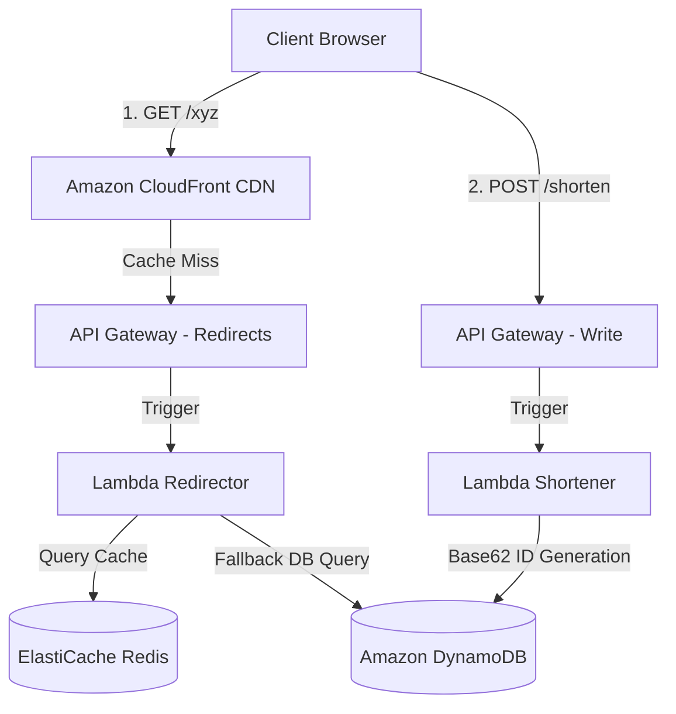
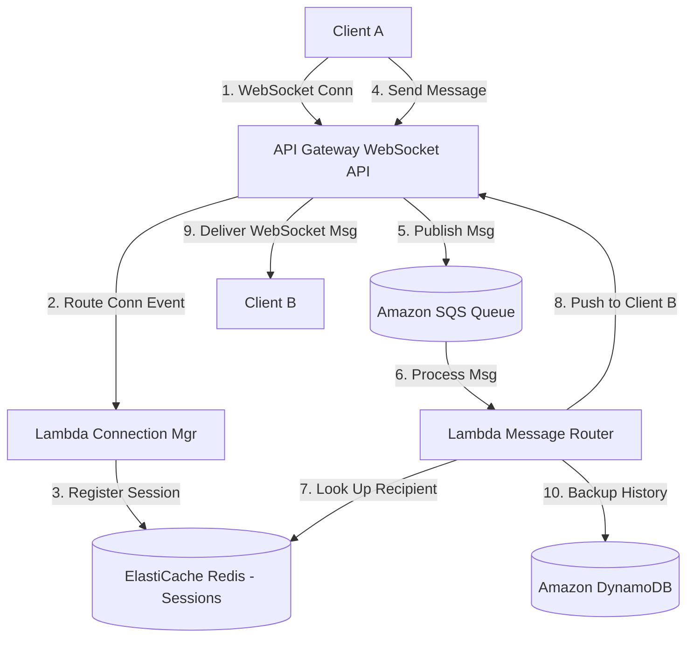
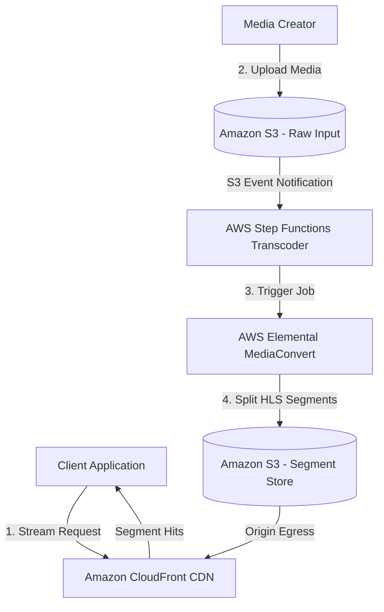
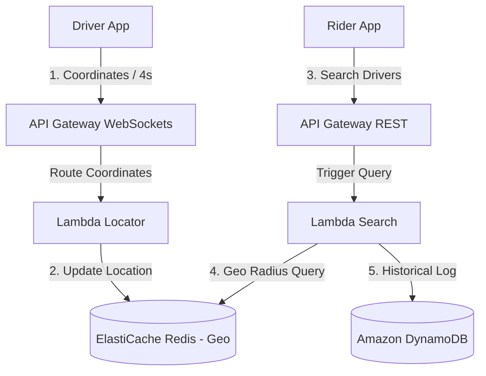
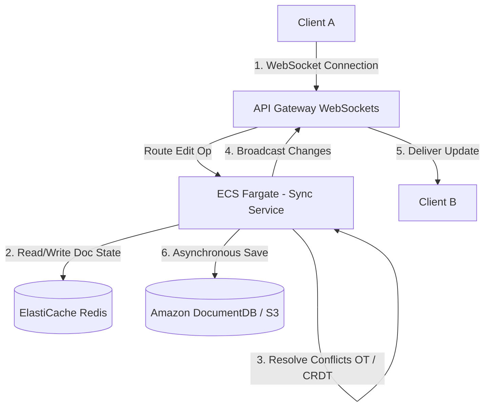
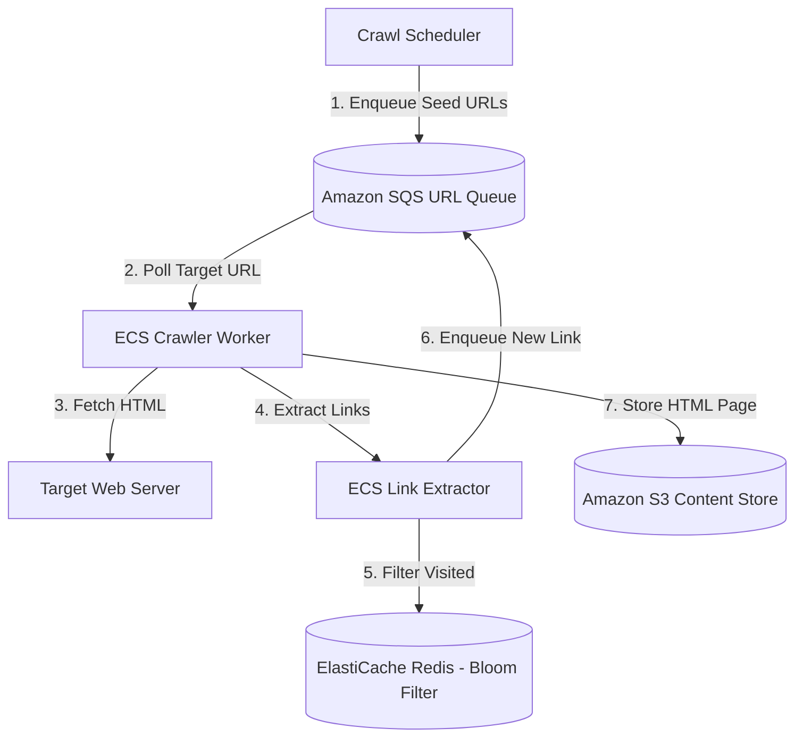
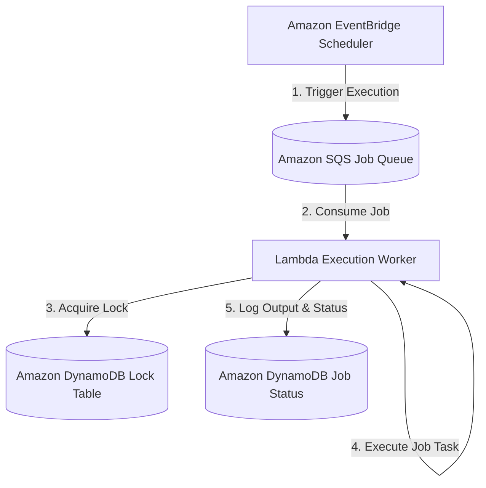
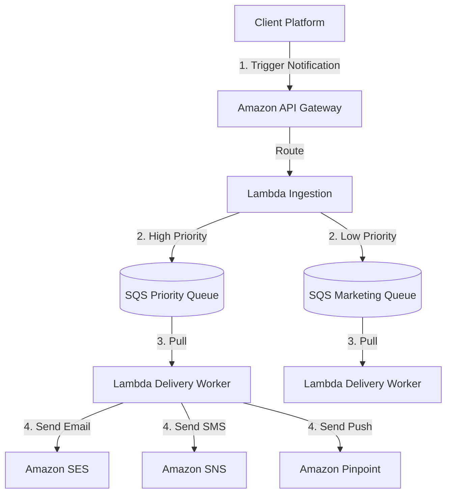

# Classic System Design Interview Questions on AWS

A cheat sheet mapping 10 classic system design interview problems to AWS-native architectures. Each scenario details the scale, core trade-offs, failure modes, and contains a Mermaid diagram.

---

## 1. Design a URL Shortener (TinyURL)

### Architecture Diagram


### Architectural Details
*   **Scale**: 100M URLs created/day; 10B redirects/day (115,000 read requests/sec).
*   **Storage**: 100M URLs $\times$ 500 bytes/URL = 50 GB/day. Use DynamoDB partition scaling.
*   **Mechanism**: Base62 encoding ($[a-z, A-Z, 0-9]$) of an auto-incrementing ID or hash value. A 7-character string supports $62^7 \approx 3.5 \text{ Trillion}$ URLs.
*   **Cache Strategy**: CloudFront caches popular short URL redirects globally. Local read cache in **ElastiCache Redis** handles hot redirects (90% read cache hit ratio target).
*   **Failure Modes**: Cold cache hits database limits. Mitigation: Use DynamoDB read autoscaling and overprovision Redis.

---

## 2. Design WhatsApp (Real-time Messaging)

### Architecture Diagram


### Architectural Details
*   **Scale**: 1B active users/day, 100B messages/day (1.15M messages/sec).
*   **Mechanism**: Persistent WebSockets established via API Gateway WebSocket API. API Gateway manages the persistent connections at its edge, calling Lambda dynamically.
*   **Presence & Session Store**: ElastiCache Redis stores mapping of `userId -> connectionId` and online status.
*   **History & Offline Storage**: DynamoDB partition key: `chatId`, sort key: `messageId`.
*   **Failure Modes**: Connection stampede during network reconnects. Mitigation: Backoff and jitter on client reconnect logic; scale API Gateway endpoints.

---

## 3. Design Spotify / Video Streaming

### Architecture Diagram


### Architectural Details
*   **Scale**: 100M active listeners, 5M songs played concurrently.
*   **Mechanism**: Audio/Video is split into small segments (usually 6-second fragments) and encoded into different bitrates using HTTP Live Streaming (HLS) or Dynamic Adaptive Streaming over HTTP (DASH).
*   **Storage & CDN**: Source raw media is saved in S3. **AWS Elemental MediaConvert** encodes media into HLS profiles. **CloudFront** caches segments near users.
*   **Failure Modes**: Mid-stream lag due to network drops. Mitigation: Adaptive Bitrate Streaming (ABR) automatically switches clients to lower quality profiles dynamically.

---

## 4. Design Uber / Yelp (Proximity Service)

### Architecture Diagram


### Architectural Details
*   **Scale**: 10M active drivers updating locations every 4 seconds (2.5M updates/sec).
*   **Mechanism**: Geo-hashing (dividing the physical map into grid zones). ELastiCache Redis natively supports Geospatial indexes (`GEOADD`, `GEORADIUS`) using sorted sets (ZSETs).
*   **Matching Flow**: Riders query surrounding drivers within a geohash prefix. Real-time driver paths are synchronized via API Gateway WebSocket routes.
*   **Failure Modes**: Hotspots in dense urban areas (e.g., Manhattan). Mitigation: Dynamic partition splitting of Redis Geospatial clusters or scaling grids dynamically (QuadTree algorithms).

---

## 5. Design a Distributed Rate Limiter

### Architecture Diagram
```mermaid
graph TD
    Client[Client App] -->|1. API Call| CloudFront[Amazon CloudFront CDN]
    CloudFront -->|2. Forward Request| APIGW[Amazon API Gateway]
    APIGW -->|3. Authorize & Limit| CustomAuth[Lambda Authorizer]
    CustomAuth -->|4. Check Window Counter| Redis[(ElastiCache Redis)]
    
    alt Under Limit
        CustomAuth -->|Allow| BackendLambda[Lambda Application Service]
    else Rate Limited
        CustomAuth -->|Deny - 429 Too Many Requests| Client
    end
```

### Architectural Details
*   **Scale**: 1M API requests/sec across a multi-tenant client base. Low latency overhead (< 5ms).
*   **Mechanism**: Token Bucket or Sliding Window Counter.
*   **Redis Lua Scripting**: The Lambda Authorizer runs an atomic Lua script on Redis:
    ```lua
    local key = KEYS[1]
    local limit = tonumber(ARGV[1])
    local current = tonumber(redis.call('get', key) or "0")
    if current + 1 > limit then
        return 0
    else
        redis.call("INCRBY", key, 1)
        redis.call("EXPIRE", key, 1)
        return 1
    end
    ```
*   **Failure Modes**: Redis availability outage blocks all API traffic. Mitigation: Fail-open fallback (if Redis queries time out, allow requests but trigger alerts).

---

## 6. Design Google Docs (Collaborative Editing)

### Architecture Diagram


### Architectural Details
*   **Scale**: 10M active documents, 1M users editing concurrently.
*   **Mechanism**: Conflict resolution using Operational Transformation (OT) or Conflict-Free Replicated Data Types (CRDTs).
*   **Server Cluster**: Persistent WebSockets route editing operations to ECS Fargate task containers. The containers run the collaboration engine, caching documents in ElastiCache Redis.
*   **Failure Modes**: Connection drops cause local edits to diverge. Mitigation: Client buffers operations and performs delta updates upon reconnection.

---

## 7. Design a Unique ID Generator (Snowflake ID)

### Architecture Diagram
```mermaid
graph TD
    Client[Client App] -->|Request Unique ID| APIGW[Amazon API Gateway]
    APIGW -->|Route Request| LambdaGen[Lambda ID Generator]
    
    subgraph Snowflake ID Layout (64-Bits)
        SignBit[1-Bit Sign]
        Timestamp[41-Bits Millisecond Epoch]
        MachineID[10-Bits Worker ID]
        Sequence[12-Bits Counter]
    end
```

### Architectural Details
*   **Scale**: Generate 100,000 unique, chronologically ordered IDs per second.
*   **Layout**:
    *   *Sign bit*: 1 bit.
    *   *Timestamp*: 41 bits (gives 69 years of millisecond resolution).
    *   *Machine/Worker ID*: 10 bits (supports 1,024 concurrent worker nodes).
    *   *Sequence number*: 12 bits (supports 4,096 unique IDs per millisecond per node).
*   **Implementation**: Lambdas retrieve their unique Worker ID dynamically from ECS metadata or DynamoDB lease registers.
*   **Failure Modes**: Clock drift (system time goes backward). Mitigation: Reject ID generation requests if local server clock is behind the last logged timestamp.

---

## 8. Design a Web Crawler

### Architecture Diagram


### Architectural Details
*   **Scale**: Crawl 5B web pages per month.
*   **Mechanism**: SQS holds target URL queues. ECS Crawler Workers fetch pages, respecting `robots.txt` rate limits (politeness policies).
*   **Deduplication**: ElastiCache Redis stores a **Bloom Filter** to determine if a URL has already been visited, avoiding infinite crawl loops.
*   **Storage**: S3 stores parsed HTML content, compressed via Gzip.
*   **Failure Modes**: Trapped in spider traps (infinite generated pages). Mitigation: Limit crawl depth per host domain.

---

## 9. Design a Distributed Job Scheduler

### Architecture Diagram


### Architectural Details
*   **Scale**: Execute 10M scheduled jobs/day; guarantee at-least-once or exactly-once delivery.
*   **Mechanism**: **Amazon EventBridge Scheduler** scales to trigger cron or one-time jobs, forwarding payloads to SQS.
*   **Concurrence & Safety**: DynamoDB serves as the lease locking table. Worker threads acquire a lock on a target job before executing to guarantee a job isn't processed by multiple workers concurrently.
*   **Failure Modes**: Worker crashes during job execution. Mitigation: Configure SQS visibility timeouts to return failed jobs back to the queue automatically if a heartbeat is not updated.

---

## 10. Design a Scalable Notification Service

### Architecture Diagram


### Architectural Details
*   **Scale**: Send 1B notifications/day (Email, SMS, Push alerts).
*   **Mechanism**: Decouple ingest from delivery. Incoming payloads are classified into Priority Queues (e.g., SQS High Priority for OTP/2FA, SQS Low Priority for Marketing).
*   **AWS Delivery Integrations**: SNS handles SMS and push alerts, SES handles transactional emails, and Amazon Pinpoint handles campaign targeting.
*   **Failure Modes**: Downstream provider throttling (e.g., carrier SMS block). Mitigation: Configure SQS Dead Letter Queues (DLQs) to retry failed notifications automatically with exponential backoff.
