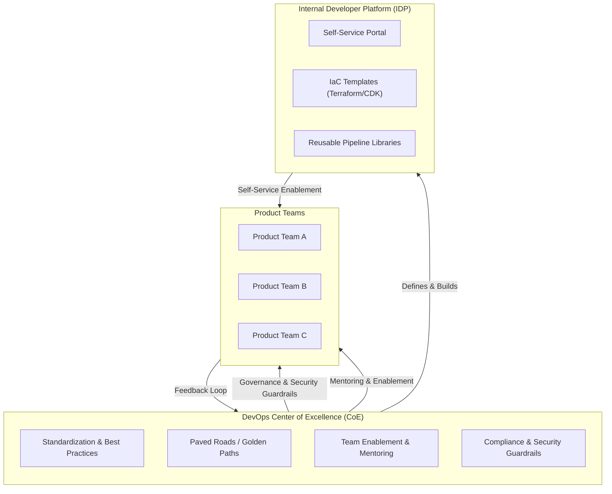
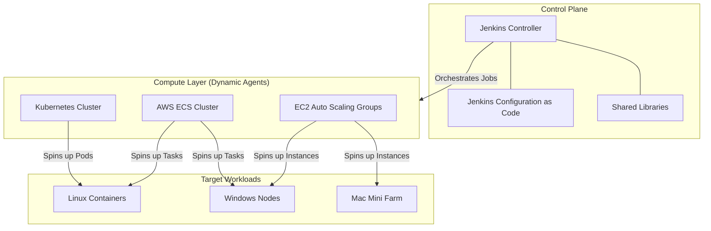
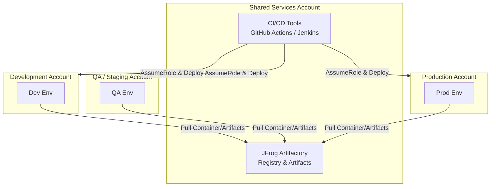
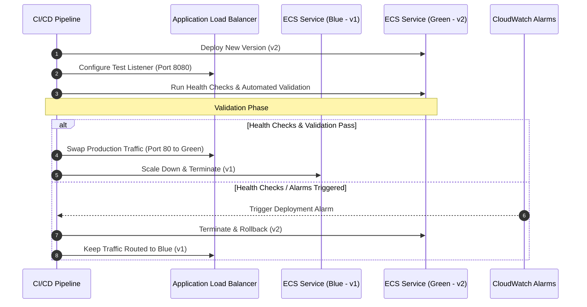

# DevOps Architect Interview Preparation Guide

A structured 5-day study plan containing detailed answers, architectural patterns, comparison tables, and Mermaid diagrams for common enterprise DevOps Architect interview questions.

---

## 📅 DAY 1 — DevOps Transformation + CoE + Governance

### Topic 1 — How would you establish a DevOps Center of Excellence (CoE) in a large enterprise?

Establishing a DevOps Center of Excellence (CoE) in a large enterprise is a strategic initiative aimed at standardizing practices, fostering collaboration, and driving continuous improvement across development and operations teams. My approach would involve several key steps:

1. **Current State Assessment**: Begin by evaluating the existing DevOps maturity across various teams. This includes assessing CI/CD maturity, deployment frequency, tool sprawl, security integration, manual approval bottlenecks, and infrastructure provisioning approaches. Often, enterprises exhibit significant inconsistency due to independent tool adoption (e.g., Jenkins, GitHub Actions, Bamboo, custom scripts).
2. **Define Target Operating Model**: Based on the assessment, define a clear target operating model for enterprise DevOps. This involves outlining the desired state of processes, tools, and organizational structure that promotes efficiency, scalability, and security.
3. **Standardize Platforms**: Establish a standardized enterprise DevOps platform strategy. This includes defining and implementing:
   - **Standard CI/CD templates**: Reusable pipeline definitions that encapsulate best practices.
   - **Shared reusable pipeline libraries**: Common functions and steps that can be consumed across pipelines.
   - **Artifact governance**: Utilizing tools like Artifactory to manage artifact promotion and metadata tagging.
   - **Security scanning standards**: Integrating SAST, DAST, SCA, and secret scanning tools.
   - **Infrastructure-as-Code (IaC) standards**: Defining preferred IaC tools (e.g., CDK, Terraform) and best practices for module creation and management.
   - **Release governance models**: Formalizing approval workflows and release criteria.
   
   The goal is to create golden paths for developers, enabling teams to onboard quickly and consistently without reinventing pipelines.
4. **Governance & Security**: While governance is crucial, it should not be restrictive. I advocate for enablement through:
   - **Approved templates**: Guiding teams towards secure and efficient practices.
   - **Automated compliance checks**: Integrating policy-as-code to ensure adherence to organizational standards.
   - **Built-in security scanning**: Embedding security tools directly into the CI/CD pipeline.
   
   This approach fosters adoption naturally by making the secure and compliant path the easiest path.
5. **Self-Service Enablement**: Provide self-service capabilities through an Internal Developer Platform (IDP) where developers can provision infrastructure, deploy applications, and access tools with minimal friction.
6. **Metrics & Continuous Improvement**: Track key DevOps metrics to measure transformation progress and identify areas for improvement. Important metrics include Deployment Frequency, Change Failure Rate, Lead Time for Changes, and Mean Time to Recovery (MTTR).

#### Architectural Relationship: CoE & Internal Developer Platform (IDP)

Below is an architectural overview of a DevOps CoE and its interaction with an Internal Developer Platform:

> [!NOTE]
> **Real-Life Example**: In a previous role, we faced significant inconsistency across multiple repositories and cloud services. By introducing reusable GitHub Actions workflows and centralizing deployment logic, we significantly reduced duplicated effort and improved consistency across teams. This initiative was driven by the CoE’s mandate to standardize and optimize delivery pipelines.

---

### Topic 2 — How do you standardize DevOps practices across teams?

Standardization should primarily occur through enablement, not enforcement. My strategy involves:

- **Reference Architectures**: Providing well-documented and proven architectural patterns for common application types and deployment scenarios.
- **Shared Pipeline Templates**: Developing and maintaining versioned templates for CI/CD pipelines that encapsulate best practices for building, testing, and deploying applications.
- **Common Branching Strategies**: Recommending and enforcing consistent branching models (e.g., GitFlow, GitHub Flow) to streamline collaboration and release management.
- **Security Controls**: Integrating security as a first-class citizen by embedding security checks and policies directly into the development and deployment workflows.
- **Artifact Management Standards**: Establishing clear guidelines for artifact naming, versioning, promotion, and retention using a centralized artifact repository like Artifactory.

While standardization is critical, it’s equally important to allow for controlled flexibility. Every application or team may have unique requirements that necessitate slight deviations from the standard. The goal is to provide paved roads, not roadblocks, enabling developers to move quickly and efficiently while adhering to enterprise standards.

---

### Topic 3 — DORA Metrics

DORA (DevOps Research and Assessment) metrics are crucial for measuring the performance of software delivery and operational stability. The four key metrics are:

- **Deployment Frequency**: How often an organization successfully releases to production. A high deployment frequency indicates efficient and automated release processes.
- **Lead Time for Changes**: The time it takes for a commit to be deployed to production. A shorter lead time signifies faster feedback loops and quicker delivery of value.
- **Mean Time to Recovery (MTTR)**: The average time it takes to restore service after an incident. A low MTTR indicates effective incident response and recovery capabilities.
- **Change Failure Rate**: The percentage of deployments that result in a degraded service or require remediation. A low change failure rate points to high quality and stable deployments.

#### Scenario Answer: Improving Low Deployment Frequency
If deployment frequency is low, I would investigate several potential bottlenecks:
1. **Manual Approvals**: Identify and automate any manual approval steps in the CI/CD pipeline.
2. **Long Testing Cycles**: Optimize testing strategies, introduce parallel testing, and leverage test automation frameworks to reduce testing time.
3. **Environment Instability**: Address issues related to environment provisioning, configuration drift, and ensure environments are consistent and reliable.
4. **Slow Infrastructure Provisioning**: Implement Infrastructure as Code (IaC) and self-service capabilities to accelerate environment setup.
5. **Pipeline Inefficiencies**: Analyze pipeline execution logs to identify slow stages, optimize build processes, and leverage caching mechanisms.

After identifying the root causes, I would implement incremental automation and optimization to improve deployment frequency and overall delivery performance.

---

## 📅 DAY 2 — CI/CD Architecture + Jenkins + ADO + GitHub Actions

### Topic 1 — Enterprise Jenkins Architecture

**Interview Question**: *"How would you design Jenkins for enterprise scale?"*

Designing Jenkins for enterprise scale requires a robust, distributed, and highly available architecture. My approach would involve:

1. **Separate Controller and Agents**: The Jenkins controller should remain lightweight, primarily managing job orchestration, plugin management, and user interfaces. All build and test workloads should be offloaded to distributed agents.
2. **Dynamic Agents**: Instead of static agents, I prefer ephemeral, dynamic agents that can scale on demand. This can be achieved using:
   - **Kubernetes**: Jenkins agents can run as pods in a Kubernetes cluster, leveraging its scaling and resource management capabilities.
   - **AWS ECS**: Agents can be launched as tasks in an Amazon ECS cluster, providing container orchestration and auto-scaling.
   - **EC2 Auto Scaling**: For workloads requiring specific operating systems (e.g., Windows, macOS), EC2 Auto Scaling groups can provision and terminate instances as needed.
   
   Dynamic agents improve scalability, reduce maintenance overhead, and ensure consistent build environments.
3. **High Availability (HA) Strategy**: For enterprise-grade reliability, implement HA for Jenkins:
   - **Configuration as Code (JCasC)**: Manage Jenkins configuration, jobs, and plugins as code in a version control system.
   - **Externalize State**: Store Jenkins home directory, build artifacts, and logs on external, highly available storage (e.g., Amazon EFS, S3).
   - **Shared Libraries**: Centralize pipeline logic and reusable components in shared libraries to promote consistency and reduce duplication.
   - **Infrastructure as Code**: Provision Jenkins infrastructure using IaC tools like AWS CDK or Terraform.

#### Scalable Jenkins Architecture Setup

Below is an architectural diagram illustrating a scalable Jenkins setup:

> [!NOTE]
> **My Experience**: I have experience working with distributed Jenkins agents, including Windows and Mac systems, for automation workloads, particularly in browser automation pipelines. This involved configuring agents to run specific tests and deployments across diverse environments.

---

### Topic 2 — Jenkins vs Azure DevOps

Choosing between Jenkins and Azure DevOps (ADO) depends on the enterprise’s specific needs, existing ecosystem, and strategic direction. Here’s a comparison:

| Feature | Jenkins | Azure DevOps (ADO) |
| :--- | :--- | :--- |
| **Flexibility** | Very high; open-source, highly customizable | Moderate; opinionated, but extensible |
| **Governance** | Manual; requires custom implementation | Strong built-in; policy-as-code, approval gates |
| **Plugin Ecosystem** | Vast and community-driven | Controlled and integrated with Microsoft ecosystem |
| **Enterprise Mgmt.** | Harder; requires significant operational effort | Easier; integrated suite, centralized administration |
| **Customization & Integration** | Excellent; Groovy DSL, custom plugins | Moderate; YAML pipelines, extensions |
| **Cost Model** | Free (open-source), but high operational cost | Subscription-based, managed service |

> [!TIP]
> **Smart Interview Statement**: *"For enterprises prioritizing integrated project management, strong built-in governance, and traceability within the Microsoft ecosystem, Azure DevOps is often easier to standardize and manage at scale. Jenkins, on the other hand, excels in environments requiring deep customization, legacy system integration, or a fully open-source toolchain."*

---

### Topic 3 — Reusable Pipelines

**Scenario Question**: *"How do you standardize pipelines across 500 repositories?"*

Standardizing pipelines across a large number of repositories is critical for consistency, maintainability, and efficiency. My approach would involve:

1. **Shared Pipeline Templates**: Create a central repository for pipeline templates (e.g., YAML templates for GitHub Actions, Jenkins Shared Libraries). These templates define the common stages and steps for different application types (e.g., frontend, backend, microservice).
2. **Versioned Reusable Workflows/Libraries**: Implement versioning for these templates and libraries, allowing teams to consume specific versions and providing a clear upgrade path.
3. **Central Governance**: Establish a governance model that defines how these templates are created, reviewed, and updated. This ensures that security and compliance standards are embedded by default.
4. **Self-Service Onboarding**: Provide tools and documentation that enable teams to easily adopt and integrate these standardized pipelines into their repositories.

Teams would then consume these templates rather than writing pipelines from scratch, significantly reducing duplication, improving consistency, and accelerating onboarding. This approach promotes a platform-thinking mindset where the platform team provides the 'paved road' for developers.

> [!NOTE]
> **Use Your Experience**: I have implemented reusable GitHub Actions workflows across numerous repositories to reduce duplication and improve consistency. This involved creating a central repository for common workflows and actions, which teams could then reference in their own `.github/workflows` files. This approach significantly streamlined our CI/CD processes and ensured adherence to organizational standards.

---

### Topic 4 — Artifact Management

**Interview Question**: *"How do you manage artifact promotion across environments?"*

Effective artifact management is crucial for maintaining consistency, traceability, and security throughout the software delivery lifecycle. My preferred approach is based on the principle of immutable artifacts:

1. **Immutable Artifacts**: The same artifact (e.g., Docker image, npm package, JAR file) should be promoted through all environments (Dev &rarr; QA &rarr; UAT &rarr; Production) without being rebuilt. Rebuilding artifacts for each environment introduces inconsistency and deployment risk.
2. **Centralized Artifact Repository**: Utilize a centralized artifact repository like JFrog Artifactory to store, manage, and secure all build artifacts. Artifactory provides capabilities for:
   - **Version Management**: Assigning unique versions to artifacts to ensure traceability.
   - **Metadata Tagging**: Attaching metadata (e.g., build number, commit ID, security scan results) to artifacts for enhanced visibility and governance.
   - **Promotion**: Managing the lifecycle of artifacts by promoting them from one repository (e.g., `dev-local`) to another (e.g., `qa-local`, `prod-release`) based on successful testing and approvals.
   - **Retention Policies**: Implementing policies to automatically clean up old or unused artifacts, optimizing storage and performance.
3. **Security and Compliance**: Secure artifact repositories with fine-grained access controls (IAM roles in AWS), integrate with security scanning tools (e.g., Xray for Artifactory) to identify vulnerabilities, and ensure compliance with organizational policies.

> [!IMPORTANT]
> **Important Enterprise Architect Statement**: *"Rebuilding artifacts for every environment introduces inconsistency and deployment risk."* This statement emphasizes the importance of immutable artifacts and a robust promotion strategy.

---

## 📅 DAY 3 — AWS + IaC + ECS + Platform Engineering

### Topic 1 — Multi-Account AWS Strategy

**Interview Question**: *"Explain your multi-account AWS architecture strategy."*

My multi-account AWS strategy is designed to enhance security, improve cost visibility, reduce blast radius, and ensure compliance separation. A typical setup involves several dedicated accounts:

- **Shared Services Account**: Hosts centralized services like CI/CD tools (e.g., Jenkins, GitHub Actions runners), artifact repositories (e.g., Artifactory), and core networking components.
- **Development Account**: Dedicated for development teams to build and test applications in isolated environments.
- **QA / Staging Account**: Used for quality assurance, integration testing, and pre-production staging.
- **Production Account**: Hosts live production workloads, with the strictest security and access controls.
- **Security Account**: Centralizes security tools, logging, and auditing capabilities (e.g., AWS Security Hub, GuardDuty, CloudTrail).
- **Logging Account**: Aggregates logs from all other accounts for centralized analysis and retention.

This segregation provides clear boundaries, simplifies governance, and allows for tailored security policies for each environment.

#### Multi-Account CI/CD & Artifact Flow

Below is an architectural diagram illustrating a multi-account AWS setup:

---

### Topic 2 — Cross-Account CI/CD

**Interview Question**: *"How do you manage CI/CD deployments across multiple AWS accounts?"*

Managing CI/CD deployments across multiple AWS accounts is achieved through a centralized CI/CD account that orchestrates deployments into target accounts using IAM role assumption. This approach ensures centralized governance while maintaining environment isolation:

1. **Centralized CI/CD**: All CI/CD pipelines (e.g., GitHub Actions, Jenkins, AWS CodePipeline) are managed and executed from the Shared Services Account.
2. **IAM Roles**: In each target account (Dev, QA, Prod), an IAM role is created with specific permissions to deploy resources. This role trusts the CI/CD account.
3. **Role Assumption**: The CI/CD pipeline in the Shared Services Account assumes the appropriate IAM role in the target account before performing deployment actions. This limits the blast radius and adheres to the principle of least privilege.
4. **Infrastructure as Code (IaC)**: Deployments are performed using IaC tools (e.g., AWS CDK, Terraform) to ensure consistency and idempotency across environments.

> [!NOTE]
> This directly matches my experience with CDK, where we designed cross-account CDK pipelines to deploy infrastructure and applications into various environments securely.

---

### Topic 3 — ECS Deployment Strategy

**Interview Question**: *"How do you reduce downtime during deployments?"*

To reduce downtime during deployments in Amazon ECS, I primarily leverage blue-green deployments or rolling updates with robust health checks and automated rollback mechanisms:

1. **Blue-Green Deployments**: This strategy involves running two identical environments, "Blue" (current production) and "Green" (new version). The new version is deployed to the Green environment, and traffic is routed to it only after successful validation.
2. **Validation Phase**: Before cutting over traffic, comprehensive health checks and automated tests are executed against the Green environment. This ensures the new version is stable and functioning correctly.
3. **Traffic Cutover**: Once validation passes, the Application Load Balancer (ALB) is updated to route production traffic to the Green environment. The Blue environment is typically kept running for a short period to facilitate rapid rollback if necessary.
4. **Automated Rollback**: CloudWatch alarms are configured to monitor key metrics (e.g., error rates, latency). If an alarm is triggered during or immediately after the deployment, the deployment controller automatically rolls back traffic to the Blue environment.

#### ECS Blue-Green Deployment Flow

Here is a sequence diagram illustrating the ECS Blue-Green deployment flow:

---

### Topic 4 — Infrastructure as Code (IaC)

**Interview Question**: *"Terraform vs CloudFormation vs CDK — which do you prefer and why?"*

Infrastructure should always be version-controlled and reproducible. My preference depends on the specific context and team composition:

| Tool | Best Use Case | Key Characteristics |
| :--- | :--- | :--- |
| **CloudFormation** | Native AWS simple stacks | Deep integration with AWS services, declarative YAML/JSON templates. |
| **AWS CDK** | Complex reusable architectures | Developer-heavy teams. Allows abstraction and reusable constructs using standard programming languages (TypeScript, Python, Go, Java). |
| **Terraform** | Multi-cloud standardization | Consistent workflow across different cloud providers (AWS, Azure, GCP), declarative HCL, state management. |

> [!TIP]
> **Excellent Interview Answer**: *"I prefer CDK when teams are developer-heavy because it allows abstraction and reusable constructs. It bridges the gap between application code and infrastructure code, enabling developers to define infrastructure using the languages they already know."*

---

### Topic 5 — Platform Engineering

**Interview Question**: *"What is an Internal Developer Platform (IDP)?"*

Platform engineering focuses on developer enablement. Instead of DevOps teams manually supporting every deployment, platforms provide an Internal Developer Platform (IDP) that offers:

- **Self-service infrastructure**: Developers can provision necessary resources (e.g., databases, message queues) on demand.
- **Golden templates**: Pre-configured, secure, and compliant templates for common application architectures.
- **Automated onboarding**: Streamlined processes for adding new developers, teams, and applications to the platform.
- **Centralized observability**: Integrated monitoring, logging, and tracing capabilities out of the box.
- **Security guardrails**: Built-in security checks and policies that prevent non-compliant deployments.

> [!IMPORTANT]
> **Strong Interview Line**: *"DevOps scales teams. Platform engineering scales DevOps itself."* This highlights the shift from manual support to automated enablement.

---

## 📅 DAY 4 — DevSecOps + Security + SRE + Observability

### Topic 1 — DevSecOps

**Interview Question**: *"What does DevSecOps mean in practical implementation?"*

DevSecOps means integrating security into the delivery lifecycle instead of treating it as a final gate. It involves embedding security practices and tools throughout the CI/CD pipeline to identify and remediate vulnerabilities early in the development process.

#### Enterprise Security Layers

| Layer | Tool Type | Description | Examples |
| :--- | :--- | :--- | :--- |
| **SAST** | Static Application Security Testing | Analyzes source code for vulnerabilities. | SonarQube, Checkmarx |
| **DAST** | Dynamic Application Security Testing | Analyzes running applications for vulnerabilities. | OWASP ZAP |
| **SCA** | Software Composition Analysis | Scans dependencies for known vulnerabilities and license issues. | Snyk, JFrog Xray |
| **Container Scanning** | Container Image Vulnerability Scans | Scans container images for vulnerabilities. | Trivy, Clair |
| **Secrets Detection** | Repository Scanning for Hardcoded Secrets | Scans code repositories for hardcoded secrets. | GitLeaks, TruffleHog |

---

### Topic 2 — Pipeline Security

**Interview Question**: *"How do you secure CI/CD pipelines?"*

Securing CI/CD pipelines is critical to prevent supply chain attacks and ensure the integrity of the software delivery process. My approach includes:

1. **Credentials Management**: Avoid hardcoding secrets. Use secure secret management solutions (e.g., AWS Secrets Manager, HashiCorp Vault) and prefer short-lived credentials (e.g., IAM roles, OIDC) over static secrets.
2. **Artifact Integrity**: Sign artifacts and verify signatures before deployment to ensure they haven’t been tampered with.
3. **Role-Based Access Control (RBAC)**: Implement strict RBAC for CI/CD tools and repositories, adhering to the principle of least privilege.
4. **Branch Protections**: Enforce branch protection rules (e.g., requiring pull request reviews, passing status checks) to prevent unauthorized code changes.
5. **Build Agent Isolation**: Run build agents in isolated environments (e.g., ephemeral containers, dedicated VPCs) to minimize the impact of a compromised agent.
6. **Audit Logging**: Enable comprehensive audit logging for all CI/CD activities to facilitate incident investigation and compliance reporting.

#### Secure DevSecOps Pipeline Flow

Below is an architectural diagram illustrating the integration of security layers within a DevSecOps pipeline:

```mermaid
flowchart LR
    Commit[Code Commit] --> Secrets[Secrets Scan<br/>GitLeaks]
    Secrets --> SAST[SAST<br/>SonarQube]
    SAST --> SCA[SCA<br/>Snyk / Xray]
    SCA --> Build[Build & Package]
    Build --> Container[Container Scan<br/>Trivy / Clair]
    Container --> DeployStg[Deploy to Staging]
    DeployStg --> DAST[DAST<br/>OWASP ZAP]
    DAST --> Compliance[Compliance Check<br/>Policy-as-Code]
    Compliance --> Prod[Production Release]

    style Commit fill:#f9f,stroke:#333,stroke-width:2px
    style Prod fill:#9f9,stroke:#333,stroke-width:2px
```

---

### Topic 3 — Observability

**Interview Question**: *"What observability stack would you recommend?"*

Observability is essential for understanding the internal state of complex systems. A comprehensive observability strategy should include:

- **Metrics**: Quantitative data about system performance (e.g., CPU usage, request rate).
- **Logs**: Detailed records of events occurring within the system.
- **Traces**: Information about the flow of requests across distributed components.
- **Alerting**: Automated notifications based on predefined thresholds or anomalies.

For enterprise systems, commonly integrated tools include:
- **CloudWatch**: Native AWS monitoring and observability service.
- **Prometheus**: Open-source systems monitoring and alerting toolkit, often used with Kubernetes.
- **Grafana**: Open-source platform for observability dashboards and visualization.
- **ELK Stack (Elasticsearch, Logstash, Kibana)**: Popular open-source stack for log management and analysis.
- **OpenTelemetry**: Open-source observability framework for generating, collecting, and exporting telemetry data (metrics, logs, traces).

---

### Topic 4 — SRE Concepts

Understanding Site Reliability Engineering (SRE) concepts is crucial for designing and operating resilient systems. Key concepts include:

| Concept | Meaning |
| :--- | :--- |
| **SLA (Service Level Agreement)** | A formal agreement with customers defining the expected level of service (e.g., 99.9% uptime). |
| **SLO (Service Level Objective)** | An internal target for service reliability, typically stricter than the SLA. |
| **SLI (Service Level Indicator)** | A specific metric used to measure compliance with an SLO (e.g., error rate, latency). |
| **Error Budget** | The acceptable amount of failure or downtime over a specific period. It balances reliability with the need for rapid innovation. |

> [!TIP]
> **Strong Interview Statement**: *"Reliability should be engineered proactively, not reactively."* This emphasizes the importance of incorporating reliability considerations early in the design and development phases.

---

## 📅 DAY 5 — Leadership + Mock Interview + Executive Communication

### Topic 1 — Influencing Without Authority

**Interview Question**: *"How do you influence teams without direct authority?"*

As an architect, influencing teams without direct authority is a critical skill. My approach focuses on:

1. **Alignment**: Ensuring that architectural initiatives align with broader business goals and team objectives.
2. **Shared Goals**: Fostering a sense of shared ownership and collaboration.
3. **Developer Pain Points**: Identifying and addressing the specific challenges and pain points faced by developers.
4. **Business Impact**: Demonstrating the tangible business value of proposed changes.

Instead of forcing standards, I show measurable benefits like faster delivery, reduced failures, and better developer productivity. By providing ‘paved roads’ that make their jobs easier, teams are more likely to adopt new practices voluntarily.

---

### Topic 2 — Handling Resistance

**Interview Question**: *"Teams resist standardization. How do you handle it?"*

Resistance to standardization is common. I avoid forcing immediate, widespread migration. Instead, my strategy involves:

1. **Start with Pilot Teams**: Identify early adopters or teams facing significant challenges and partner with them to implement the new standards.
2. **Demonstrate Quick Wins**: Focus on delivering immediate, tangible benefits to the pilot teams to build momentum and credibility.
3. **Build Reusable Accelerators**: Provide tools, templates, and documentation that make it easy for other teams to adopt the standards.
4. **Provide Onboarding Support**: Offer training, mentoring, and hands-on assistance to teams transitioning to the new practices.

Adoption increases naturally when teams see the value and experience the benefits firsthand.

---

### Topic 3 — Executive Communication

**Interview Question**: *"How do you communicate architecture decisions to executives?"*

Executives care about business outcomes, not technical details. When communicating architecture decisions, I translate technical metrics into business impact:

| Technical Metric | Business Translation |
| :--- | :--- |
| **Deployment Frequency** | Faster feature delivery, quicker time-to-market. |
| **MTTR** | Reduced downtime, improved customer experience, protected revenue. |
| **Automation** | Lower operational cost, increased efficiency, reduced manual errors. |
| **Standardization** | Reduced risk, improved compliance, easier onboarding and knowledge transfer. |

> [!TIP]
> **Strong Executive-Level Statement**: *"My goal is not just automation. It is improving delivery predictability, reliability, and developer productivity at enterprise scale."* This statement clearly articulates the strategic value of DevOps and platform engineering initiatives.

---

### Final Interview Strategy

When answering questions, especially scenario-based ones, I always structure my response in the following order:

1. **Problem**: Clearly define the challenge or issue.
2. **Architecture Approach**: Outline the proposed technical solution or architectural pattern.
3. **Governance/Security**: Explain how the solution addresses security and compliance requirements.
4. **Automation**: Describe how the solution will be automated and integrated into existing workflows.
5. **Metrics**: Identify the key metrics used to measure success and track progress.
6. **Business Impact**: Summarize the ultimate value delivered to the organization.

This structured approach demonstrates a comprehensive, enterprise-architect mindset, focusing on both technical excellence and business outcomes.
