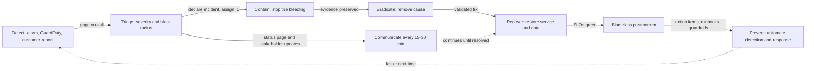

# Incident Response Scenarios: Pressure-Test Interview Questions

Interviewers for Solutions Architect, DevOps, and SRE roles love the "it's 2 AM and X just happened, what do you do?" question. They are grading **prioritization under pressure**: contain first, communicate early, preserve evidence, fix root cause later. This cheat sheet answers 10 classic scenarios as time-boxed runbooks: **First 5 minutes / First hour / Follow-up / Postmortem**.

For the underlying services, see [Security & Compliance](../concepts/security-and-compliance.md), [High Availability & DR](../concepts/high-availability-and-dr.md), and [Observability & Monitoring](../concepts/observability-and-monitoring.md).

---

## 🔁 The General Incident Lifecycle

Every answer should follow the same skeleton. Say it out loud before diving into specifics; it shows the interviewer you have a process, not just trivia.



| Role | Responsibility |
|------|----------------|
| **Incident Commander (IC)** | Owns decisions and priorities; does not type commands |
| **Ops / Tech Lead** | Executes mitigation, drives the investigation |
| **Comms Lead** | Status page, exec and customer updates on a fixed cadence |
| **Scribe** | Timestamped timeline in the incident channel (feeds the postmortem) |

**Golden rules**: mitigate before you diagnose, change one thing at a time, write everything down, and never destroy evidence in a security incident.

---

## 🔑 1. AWS Access Key Leaked to a Public GitHub Repo

> "A developer pushed `.env` with an IAM access key to a public repo 40 minutes ago. What do you do?"

Assume the key was harvested within minutes; bots scan GitHub continuously. AWS may already have attached the `AWSCompromisedKeyQuarantineV3` policy and opened a support case.

**First 5 minutes (contain)**
*   **Deactivate** (not delete) the key: `aws iam update-access-key --access-key-id AKIA... --status Inactive --user-name <user>`. Deactivation keeps it available for forensics.
*   **Revoke temporary credentials** already minted with the key: attach a deny-all policy with condition `aws:TokenIssueTime` earlier than now (the console's "Revoke active sessions" does this for roles). STS tokens otherwise survive key deactivation.
*   Declare a security incident, page security, open a war-room channel.

**First hour (investigate and eradicate)**
*   **CloudTrail**: filter by `AccessKeyId` across **all regions** (attackers love unused regions). Look for `CreateUser`, `CreateAccessKey`, `AttachUserPolicy`, `CreateLoginProfile`, `RunInstances`, `PutBucketPolicy`, `GetSecretValue`.
*   **GuardDuty** findings: `UnauthorizedAccess:IAMUser/*`, `CryptoCurrency:EC2/BitcoinTool`, `Recon:IAMUser/*`.
*   Hunt for **persistence**: new IAM users/roles/keys, modified trust policies, new Lambda functions, EventBridge rules, SSH key pairs.
*   Hunt for **crypto-mining**: large GPU instances (`p*`, `g*`) in every region, sudden Spot requests, raised service quotas. Snapshot, then stop and terminate them.
*   **Rotate**: issue new credentials (preferably replace keys with an IAM role), update consumers, then delete the old key.
*   Purge the secret from git history (`git filter-repo`), but treat it as burned regardless.

**Follow-up**
*   Replace long-lived keys with **IAM Identity Center** for humans and **OIDC federated roles** for CI.
*   Enable **GitHub secret scanning + push protection**, pre-commit hooks (gitleaks), and SCPs that deny unused regions.
*   Open a billing case with AWS Support for fraudulent charges.

**Postmortem focus**: Why did a long-lived key exist? Why was it in a file that could be committed? How long until detection?

---

## 🌍 2. A Region Is Degraded and the App Is Down

> "us-east-1 is having an event. Your app is down and the AWS Health Dashboard is yellow. What do you do?"

**First 5 minutes**
*   Confirm scope: is it **AWS or us**? Check AWS Health Dashboard, your own synthetic canaries, and whether the last deploy correlates.
*   Declare the incident, assign IC and comms lead. Post an initial status page update ("investigating").

**First hour (the failover decision)**
*   Decide against pre-agreed criteria: expected duration, RTO/RPO, data-loss tolerance. Failing over has its own risk (replication lag, split brain, cold caches).
*   If failing over, use a **data-plane** mechanism: **Route 53 Application Recovery Controller (ARC)** routing controls or health-check-based failover records. Avoid depending on control-plane APIs (console, record edits) during a regional event.
*   Promote the data tier: Aurora Global Database **switchover/failover** (or detach-and-promote in a hard outage); DynamoDB global tables are already active-active.
*   Scale the standby (warm standby) before shifting 100% of traffic; shift gradually if possible.
*   Comms every 15-30 minutes: impact, what we're doing, next update time.

**Follow-up**
*   Fail back deliberately during a low-traffic window after re-establishing replication.
*   Reconcile any writes lost within the RPO window.

**Postmortem focus**: Was the failover runbook tested (game days, [chaos engineering](../concepts/chaos-engineering-and-resilience-testing.md))? Did anything hidden depend on the primary region (IAM Identity Center, S3 buckets, CI/CD, secrets)? See [High Availability & DR](../concepts/high-availability-and-dr.md).

---

## 💸 3. The AWS Bill Jumped 5x Overnight

> "Finance pings you: yesterday's spend was 5x normal. Go."

**First 5 minutes**
*   **Cost Explorer**: group by **Service**, then **Region**, then **Usage Type**, daily (or hourly) granularity. Identify the top mover.
*   Check **Cost Anomaly Detection** alerts for root-cause hints (service, account, usage type).
*   First question: **is this a security incident?** Unexpected EC2/GPU in odd regions = treat as compromise (Scenario 1).

**First hour**
*   Common culprits: runaway Auto Scaling, a Lambda recursive loop (S3 trigger writing back to the same bucket), NAT Gateway data processing, cross-AZ or Internet egress, CloudWatch Logs ingestion from debug logging, forgotten large instances or SageMaker endpoints, S3 request storms.
*   Stop the bleed: scale down, set Lambda reserved concurrency to 0 to break a loop, disable the misbehaving trigger.
*   Use **CloudTrail** to find who or what created the resources.

**Follow-up**
*   **AWS Budgets** with **Budget Actions** (apply a deny IAM policy/SCP or stop EC2/RDS when a threshold is crossed).
*   Cost Anomaly Detection monitors per account and per service, routed to Slack via SNS/Chatbot.
*   Mandatory cost allocation tags; SCPs to deny expensive instance families in non-prod.

**Postmortem focus**: Time to detect (a monthly invoice is far too slow); missing guardrails. See [Cost Optimization](../concepts/cost-optimization.md).

---

## 🌊 4. Layer 7 DDoS in Progress

> "Your login endpoint is getting 200k requests/second from thousands of IPs. Latency is spiking."

**First 5 minutes**
*   Confirm it is an attack, not a viral launch: look at WAF sampled requests, ALB/CloudFront logs for user-agent, path, geo, and IP distribution.
*   If on **Shield Advanced**, engage the **Shield Response Team (SRT)** via a critical support case (proactive engagement pages them automatically when Route 53 health checks go unhealthy).

**First hour**
*   **AWS WAF**: add **rate-based rules** scoped to the targeted path (e.g., `/login` at 100 req per 5 min per IP), use **CAPTCHA/Challenge** actions, geo-match blocks if traffic comes from regions you don't serve, and enable the **Bot Control** and **IP reputation** managed rule groups.
*   Ensure traffic flows through **CloudFront** so it is absorbed at the edge; lock origins (CloudFront managed prefix list on the ALB SG, secret custom header, or VPC origins) so attackers can't bypass it.
*   Protect the origin: cache aggressively, serve static error pages, scale out, and shed load on non-critical endpoints.

**Follow-up**
*   Shield Advanced **automatic application-layer mitigation**, health-check-based detection, and **cost protection** (credits for scaling charges during the attack).
*   Pre-staged WAF rules in COUNT mode that can be flipped to BLOCK.

**Postmortem focus**: Was the origin directly reachable? Were rate limits pre-configured? See [Security & Compliance](../concepts/security-and-compliance.md).

---

## 🦠 5. Ransomware or Mass S3 Deletion

> "Millions of S3 objects were deleted or overwritten with encrypted blobs in the last hour."

**First 5 minutes**
*   **Contain the identity**: find the principal in CloudTrail data events (`DeleteObject`, `PutObject`, `PutBucketLifecycleConfiguration`, `PutBucketVersioning`) and disable it (deactivate key, deny-all policy, revoke sessions).
*   Apply a temporary **bucket policy deny** on writes/deletes for everyone except the break-glass role.
*   Check for attacker use of **SSE-C** or a foreign KMS key to re-encrypt objects.

**First hour**
*   If **Versioning** is on: deletes only added delete markers and overwrites created new versions. Restore by removing delete markers or copying prior versions back (S3 Batch Operations at scale).
*   If **Object Lock (compliance mode)** was on: locked versions cannot be deleted even by root; recovery is straightforward.
*   Otherwise restore from **AWS Backup**. A vault with **Backup Vault Lock** (compliance mode), a **logically air-gapped vault**, or a cross-account copy cannot be purged by the attacker.
*   Look for lateral movement: other buckets, deleted RDS snapshots, a KMS key scheduled for deletion (cancel it; the 7-30 day waiting period exists for exactly this).

**Follow-up**
*   Versioning + MFA Delete on critical buckets, Object Lock for immutable data, cross-account backups in a separate security OU.
*   SCP denying `s3:PutBucketVersioning`, `kms:ScheduleKeyDeletion`, and `backup:DeleteRecoveryPoint` outside break-glass roles.
*   GuardDuty **S3 Protection** and **Malware Protection for S3**.

**Postmortem focus**: How did the principal get delete rights on production data? See [Storage on AWS](../concepts/storage-on-aws.md).

---

## 🚀 6. Bad Deploy Causing 50% Errors

> "Ten minutes after a deploy, the 5xx rate is 50%."

**First 5 minutes**
*   **Roll back first, debug later.** Correlation with the deploy is enough evidence. Trigger the rollback (CodeDeploy auto-rollback, `kubectl rollout undo`, `argocd app rollback`, Lambda alias shifted back to the previous version).
*   If only part of the fleet is affected (canary), halt the rollout and shift traffic away.

**First hour**
*   Confirm recovery on SLO dashboards: error rate, latency, saturation.
*   If rollback is not possible (irreversible DB migration), roll forward with a feature-flag kill switch or a hotfix through the normal pipeline.
*   Collect logs, traces, and the diff for the investigation.

**Follow-up**
*   Canary or blue/green with **automated rollback on CloudWatch alarms**; expand-and-contract DB migrations so code rollbacks are always safe.

**Postmortem focus**: Why did tests and the canary not catch it? See [CI/CD & GitOps](../concepts/cicd-and-gitops.md).

---

## 🗄️ 7. Production Database Accidentally Dropped

> "An engineer ran `DROP TABLE orders` against prod instead of staging."

**First 5 minutes**
*   Stop writes that would compound the damage: maintenance mode or read-only.
*   Record the **exact timestamp** of the drop (database logs, audit logs, Performance Insights).

**First hour**
*   **RDS/Aurora PITR**: restore to a **new** instance/cluster at a time just before the drop (restorable up to roughly the last 5 minutes). PITR never overwrites the original.
*   **Aurora Backtrack** (MySQL-compatible only): rewind in place in minutes, if it was enabled.
*   Extract the dropped table from the restored instance and load it back, or cut over to the restored instance and reconcile writes made after the restore point.
*   DynamoDB: PITR restores to a new table (up to 35 days).

**Follow-up**
*   No standing human write access to prod; break-glass with approval and session logging. Separate credentials per environment.
*   Deletion protection, automated backups plus cross-region/cross-account AWS Backup copies, and regular **restore drills**.

**Postmortem focus**: The system allowed the mistake, not the person. See [Databases on AWS](../concepts/databases-on-aws.md).

---

## 🔐 8. Expired TLS Certificate

> "Users see 'Your connection is not private.' The cert expired at midnight."

**First 5 minutes**
*   Identify where TLS terminates (CloudFront, ALB, API Gateway, NGINX on EC2, an EKS Ingress) and which cert expired.

**First hour**
*   If ACM-issued: find why auto-renewal failed (DNS validation CNAME removed, CAA record not allowing Amazon, cert not in use). Fix validation or request a new cert and attach it. CloudFront certs must be in **us-east-1**.
*   If imported (third-party): obtain the renewed cert and **re-import to the same ARN** so every attachment updates in place.
*   Check internal mTLS, cert-manager in Kubernetes, and mobile apps that pin certificates.

**Follow-up**
*   Prefer ACM-managed certs with DNS validation; alarm on the ACM `DaysToExpiry` metric, AWS Config rule `acm-certificate-expiration-check`, and EventBridge "ACM Certificate Approaching Expiration" events.

**Postmortem focus**: Why no expiry alerts? Build a complete certificate inventory.

---

## 🕵️ 9. Compromised EC2 Instance

> "GuardDuty reports an EC2 instance communicating with a known command-and-control IP."

**First 5 minutes (isolate, don't terminate)**
*   **Do not terminate**: you would destroy memory and disk evidence.
*   Swap its security groups for an **isolation SG** with no rules. Tracked connections can persist, so switch via an intermediate SG allowing all from `0.0.0.0/0` to make connections untracked first, or add a deny NACL.
*   **Detach from the ASG** (or enable scale-in protection) and deregister from target groups so it isn't replaced or killed.
*   Revoke the **instance profile's** sessions (deny policy on `aws:TokenIssueTime`); credentials may have been exfiltrated via IMDS.

**First hour**
*   Capture evidence: **EBS snapshots** of all volumes, memory capture (via SSM if available), tag the instance `Quarantine=true`, enable termination protection.
*   Investigate in an isolated forensics account: mount snapshot copies, review VPC Flow Logs, CloudTrail for the role's API calls, GuardDuty Malware Protection scan.
*   Replace the workload from a clean, patched AMI.

**Follow-up**
*   Enforce **IMDSv2**, least-privilege instance roles, SSM Session Manager instead of SSH, Inspector vulnerability scanning, and automated isolation via EventBridge + SSM Automation on high-severity findings.

**Postmortem focus**: Initial access vector (unpatched CVE, open port, leaked key). See [Linux & Virtualization on EC2](../concepts/linux-and-virtualization-on-ec2.md).

---

## 📉 10. Silent Degradation: Latency Doubled, No Alarms Fired

> "Customers complain the app is slow, but every dashboard is green."

**First 5 minutes**
*   Trust the customer. Check **p99** (not average) latency per endpoint and per AZ.
*   Recent changes: deploys, config or feature flags, dependency upgrades, traffic mix.

**First hour**
*   Use **X-Ray / distributed traces** to find the slow span: a downstream dependency, DB lock contention (Performance Insights), connection-pool exhaustion, GC pauses, a single bad AZ or host.
*   Mitigate: shift away from a bad AZ (ARC **zonal shift**), roll back the change, scale the bottleneck.

**Follow-up**
*   SLO burn-rate alerting on p99 latency and synthetic canaries, not just CPU.

**Postmortem focus**: Monitoring gap. See [Observability & Monitoring](../concepts/observability-and-monitoring.md).

---

## ⏱️ Quick Reference: The First Move

| Scenario | First move (within 5 min) | Never do |
|----------|---------------------------|----------|
| Leaked access key | Deactivate key, revoke sessions | Just delete the commit and move on |
| Region degraded | Confirm scope, decide failover by criteria | Rely on control-plane APIs during the event |
| 5x bill | Cost Explorer by service/region, rule out compromise | Wait for the monthly invoice |
| L7 DDoS | WAF rate rules, engage SRT | Leave the origin directly reachable |
| Mass S3 deletion | Disable principal, deny writes | Delete the bucket to "start clean" |
| Bad deploy | Roll back | Debug in prod while users fail |
| Dropped DB | Stop writes, PITR to a new instance | Restore over the original |
| Expired cert | Re-issue or re-import and attach | Tell users to click through the warning |
| Compromised EC2 | Isolation SG, snapshot | Terminate the instance |
| Silent latency | Check p99 and traces | Close the ticket because dashboards are green |

---

## 📝 Blameless Postmortem Template

Blameless means we assume people acted reasonably given the information and tooling they had. We ask **"how did the system allow this?"**, not "who did this?".

```markdown
# Postmortem: <title>  |  Severity: SEV-<n>  |  Status: Draft/Final

## Summary
Two or three sentences: what happened, impact, how it was resolved.

## Impact
- Duration: <start> to <end> (UTC), time to detect, time to mitigate
- Customers / requests affected, SLO error budget consumed, revenue or data impact

## Timeline (UTC)
- 02:04 Alarm fired: ...
- 02:09 IC declared SEV-2 ...
- 02:21 Rolled back to v1.42 ...

## Root Cause and Contributing Factors
Use "5 whys". List technical and process factors; no individual blame.

## What Went Well / What Went Poorly / Where We Got Lucky

## Action Items
| Action | Type (prevent/detect/mitigate) | Owner | Due | Ticket |
```

**Good action items** are specific, owned, dated, and ideally **automated guardrails** (SCPs, alarms, pipeline checks) rather than "be more careful".

---

## SA Interview Tips for Incident Questions

*   **Narrate the lifecycle**: detect, triage, contain, eradicate, recover, learn. Interviewers reward structure.
*   **Security incidents: preserve evidence.** Deactivate, isolate, snapshot; do not delete or terminate.
*   **Availability incidents: mitigate first.** Roll back, fail over, shed load; root cause comes later.
*   **Always mention communication**: status page, stakeholders, cadence.
*   **Close the loop**: end every answer with an automated guardrail that prevents recurrence.
