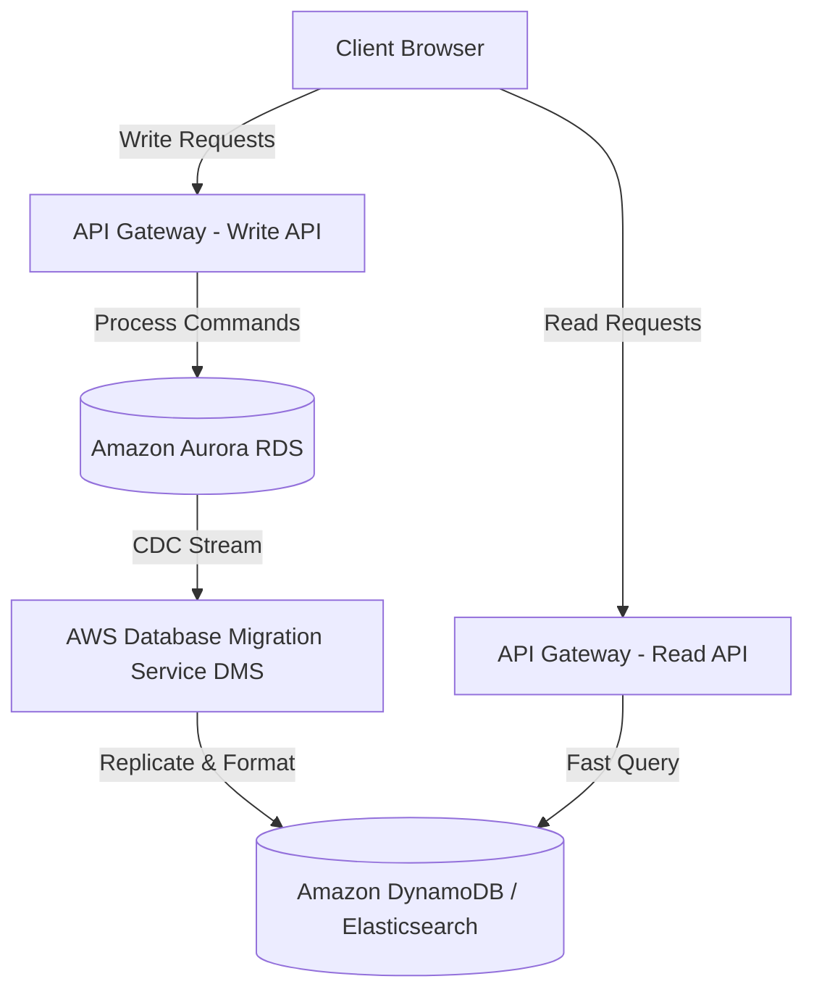
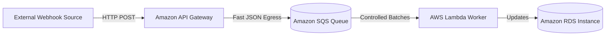
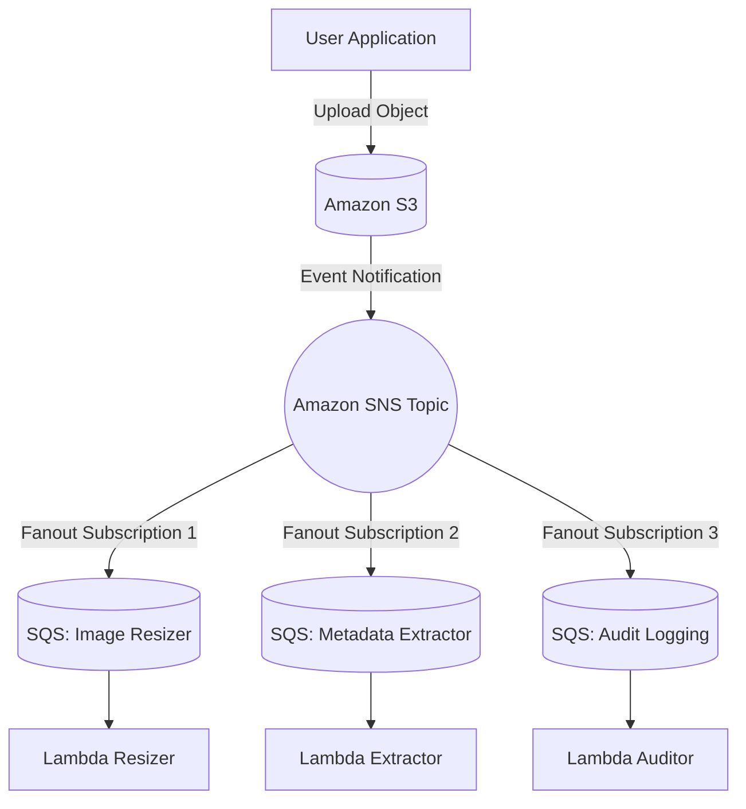
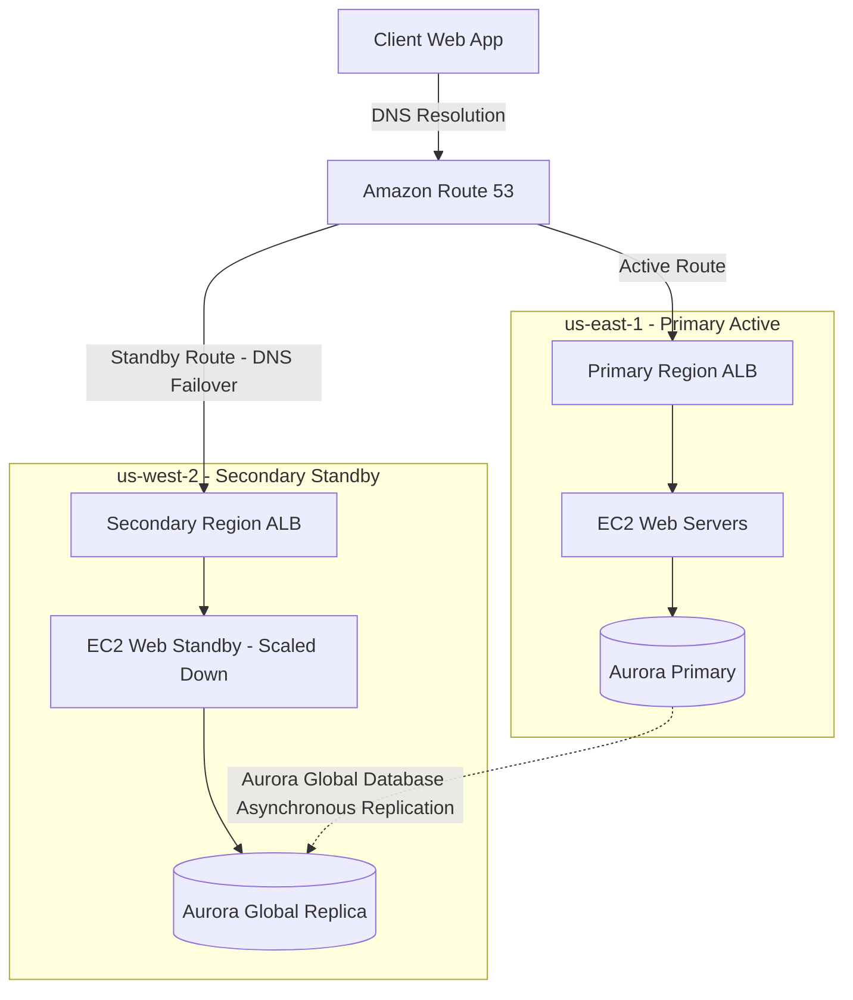
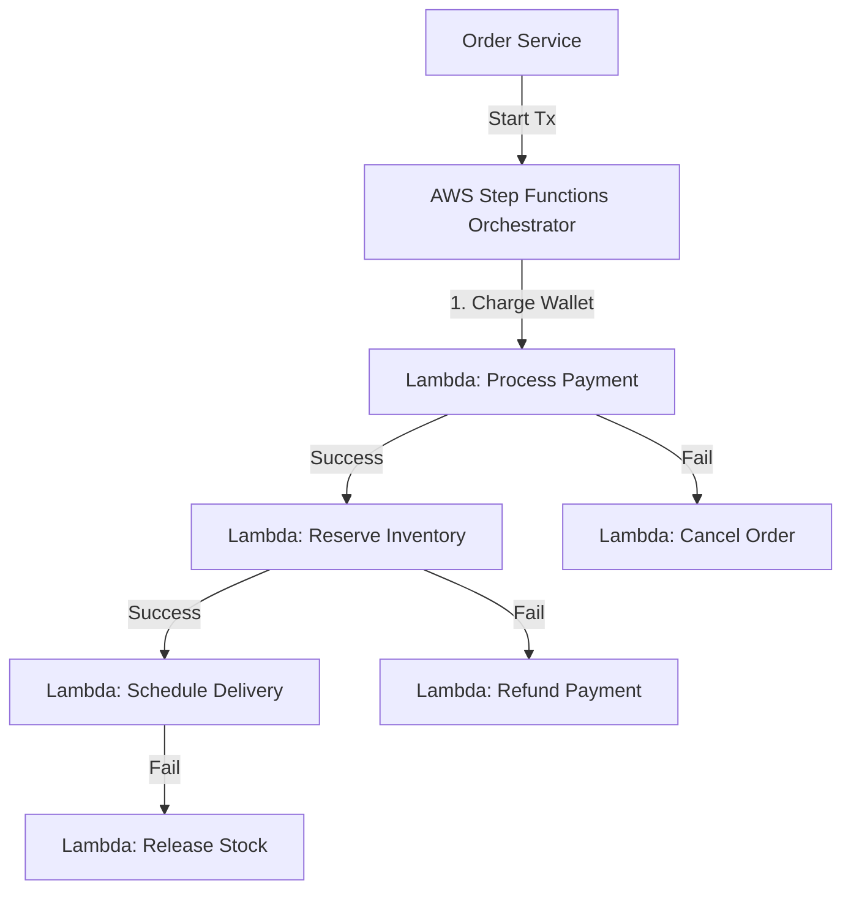
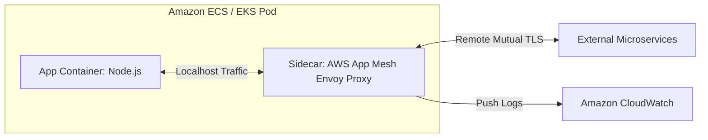
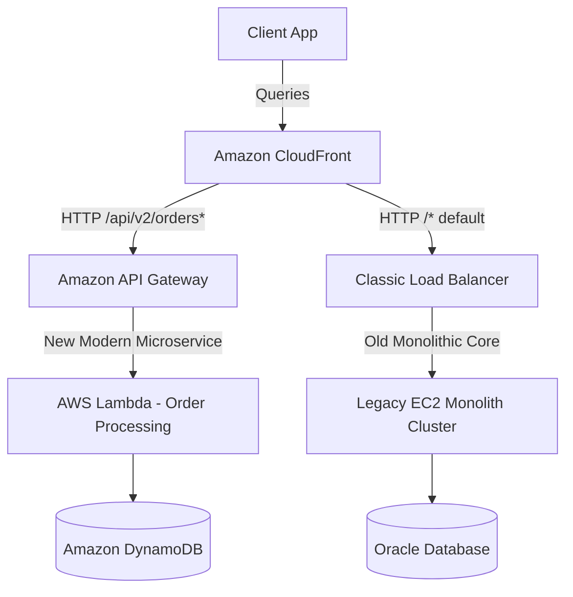
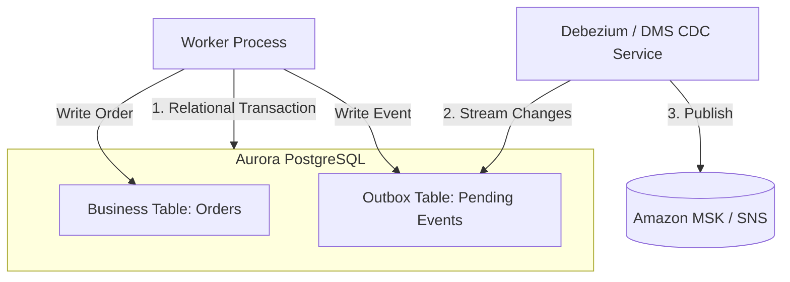
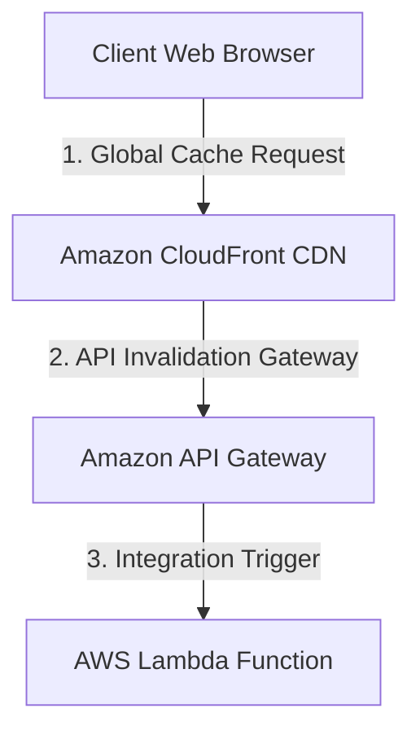
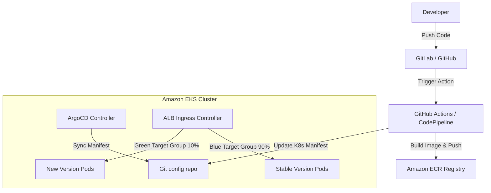

# AWS Solution Architect Interview Patterns

A cheat sheet describing 10 core architectural patterns commonly encountered in AWS Solution Architect interviews. Each pattern includes a Mermaid diagram, architectural components, and critical interview talking points.

---

## 1. The CQRS (Command Query Responsibility Segregation) Pattern
Separates read and write operations into different data stores to optimize performance, scalability, and security.

### Mermaid Diagram

### Key Interview Points
- **Why AWS?**: Aurora handles transaction compliance (ACID) for writes, while DMS captures modifications and syncs them to DynamoDB (optimized for fast lookups) or OpenSearch (optimized for complex searches).
- **Cons**: Eventual consistency between stores, operational overhead of maintaining replication streams.

---

## 2. Serverless Webhooks & Asynchronous Rate Smoothing
Buffers incoming bursty payloads (like Slack/Stripe webhooks) to prevent downstream transactional databases or external systems from crashing.

### Mermaid Diagram

### Key Interview Points
- **Why AWS?**: SQS holds up to 14 days of backlogged messages. API Gateway directly integrates with SQS (no Lambda needed for ingestion stage) which saves money and limits cold-start timeouts.
- **Scale Buffer**: Lambda can be throttle-limited (Reserved Concurrency) to ensure it only queries the target RDS within its maximum pool limit.

---

## 3. Storage Fan-Out (Pub-Sub to SQS Sinks)
Distributes a single event notification to multiple independent processing queues without the publisher knowing who receives them.

### Mermaid Diagram

### Key Interview Points
- **Coupling Mitigation**: Publishers and consumers are fully decoupled. Adding a fourth consumer requires zero changes to the publisher code.
- **Failures**: Message filtering can be set up at the SNS layer to send specific events to specific queues, and individual Dead Letter Queues (DLQs) isolate isolated queue crashes.

---

## 4. Multi-Region Active-Passive (Warm Standby) Disaster Recovery
Maintains a scaled-down duplicate of the system running in a secondary AWS region, ready to scale up rapidly if the primary region goes dark.

### Mermaid Diagram

### Key Interview Points
- **RTO/RPO Metrics**: 
  - **RTO (Recovery Time)**: Under 15 mins (mostly DNS propagation + scaling EC2 via Auto Scaling).
  - **RPO (Recovery Point)**: Under 1 second (Aurora Global Database lag).
- **Route 53 Routing**: Failover Routing policy combined with active endpoint health checks.

---

## 5. Saga Pattern (Distributed Transactions orchestration)
Manages distributed consistency across separate microservices using a sequence of local transactions coordinated by a state machine.

### Mermaid Diagram

### Key Interview Points
- **Why AWS?**: Step Functions keeps track of state, allows retry mechanisms, and automatically initiates compensatory Lambdas (rollback triggers) when a step fails.
- **Alternatives**: Choreo-based Saga (using EventBridge/SNS event chaining). Choreography is simpler to set up initially, but orchestration is far easier to audit and trace.

---

## 6. Microservices Sidecar Pattern
Decouples infrastructural concerns (like service mesh proxying, logging, or metric aggregation) from the core application containers.

### Mermaid Diagram

### Key Interview Points
- **Benefits**: Zero impact on core language code to rotate certificates, manage traffic routes, or inject faults.
- **AWS Services**: ECS Task Definitions allow specifying multiple container definitions within a single task, sharing storage volumes and local network interfaces.

---

## 7. Strangler Fig Pattern (Monolith Migration)
Gradually replaces specific pieces of system functionality in a monolithic backend with modern serverless microservices until the monolith is retired.

### Mermaid Diagram

### Key Interview Points
- **Why AWS?**: CloudFront behaviors route traffic to different target origins based on path mappings. Enables zero-downtime, granular release of individual endpoints.
- **Safety**: Rollback requires changing a single CloudFront route configuration or modifying Route 53 weights.

---

## 8. Outbox Pattern for Reliable Distributed Messaging
Guarantees that a database transaction and its corresponding event publication to a message queue both happen atomically.

### Mermaid Diagram

### Key Interview Points
- **Double-Write Problem**: Avoids failures where a record is saved to the database, but network timeout causes the messaging queue to miss the event.
- **AWS Realization**: Database Migration Service (DMS) can read transaction logs directly from RDS databases and forward updates securely to EventBridge or Amazon MSK.

---

## 9. API Gateway Cache vs CloudFront Edge Cache
Optimizes latency by determining where to store content closest to user entry.

### Mermaid Diagram

### Key Interview Points
- **CloudFront CDN**: Best for static resources (CSS, JS, media files) and publicly accessible read endpoints. Geographically distributed at edge locations worldwide.
- **API Gateway Caching**: Best for caching backend dynamic payloads (like user profiles or catalog searches). Cache is bound to the region where the API Gateway is deployed.
- **Key Limit**: API Gateway cache is billed per hour depending on selected cache size, while CloudFront caching is based on egress traffic volume.

---

## 10. Blue-Green Deployments on EKS (GitOps)
Minimizes software update downtime and limits deployment risks by running two identical production environments concurrently.

### Mermaid Diagram

### Key Interview Points
- **Why ArgoCD / GitOps?**: The infrastructure and deployment versions are declaratively defined in Git. Reversing a bad deployment requires single-click Git reverts.
- **Blue-Green switch**: EKS Ingress routing can dynamically shift percentage-based traffic using AWS Load Balancer Controller attributes.
