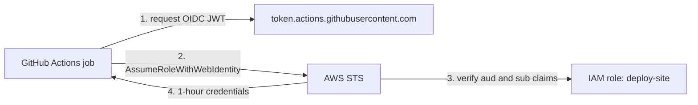

# Spot the Bug: Config Review Exercises

A favorite live-interview format: the interviewer pastes a short config and asks **"What's wrong with this?"** They want to see you spot security holes, reliability gaps, and operational foot-guns. This cheat sheet has 12 exercises. Each one has a broken snippet, the question, a **Problems** list, and a corrected snippet that follows **least privilege**.

**How to answer**: scan in the same order every time: **identity and permissions, network exposure, secrets, encryption, reliability (limits, probes, retries), state and blast radius**. Name the most severe issue first.

For the concepts behind each fix, see [Security & Compliance](../concepts/security-and-compliance.md), [Terraform](../concepts/terraform.md), [Kubernetes on EKS](../concepts/kubernetes-on-eks.md), and [Containers, Docker & ECR](../concepts/containers-docker-ecr.md).

---

## 🔑 1. IAM Policy: `s3:*` on `*`

```json
{
  "Version": "2012-10-17",
  "Statement": [
    { "Effect": "Allow", "Action": "s3:*", "Resource": "*" }
  ]
}
```

**Question**: This is attached to an app that uploads reports to one bucket. What's wrong?

**Problems**
*   `s3:*` grants `DeleteBucket`, `PutBucketPolicy`, `PutBucketAcl`, and more; the app can make any bucket public or delete it.
*   `Resource: "*"` covers **every bucket in the account**, including logs and backups.
*   No conditions (e.g., VPC endpoint), so a stolen credential works from anywhere.

**Fix**
```json
{
  "Version": "2012-10-17",
  "Statement": [
    {
      "Sid": "WriteReportsPrefixOnly",
      "Effect": "Allow",
      "Action": ["s3:PutObject", "s3:GetObject"],
      "Resource": "arn:aws:s3:::acme-reports-prod/reports/*",
      "Condition": { "StringEquals": { "aws:SourceVpce": "vpce-0abc1234def567890" } }
    },
    {
      "Sid": "ListReportsPrefixOnly",
      "Effect": "Allow",
      "Action": "s3:ListBucket",
      "Resource": "arn:aws:s3:::acme-reports-prod",
      "Condition": { "StringLike": { "s3:prefix": "reports/*" } }
    }
  ]
}
```

---

## 🤝 2. IAM Trust Policy: Any Principal, No ExternalId

```json
{
  "Version": "2012-10-17",
  "Statement": [
    { "Effect": "Allow", "Principal": { "AWS": "*" }, "Action": "sts:AssumeRole" }
  ]
}
```

**Question**: This role is for a third-party monitoring vendor. What's wrong?

**Problems**
*   `"AWS": "*"` lets **any AWS account in the world** assume the role (IAM Access Analyzer flags it immediately).
*   No `sts:ExternalId`: the **confused deputy** problem, where another vendor customer tricks the vendor into assuming your role.

**Fix**
```json
{
  "Version": "2012-10-17",
  "Statement": [
    {
      "Effect": "Allow",
      "Principal": { "AWS": "arn:aws:iam::111122223333:root" },
      "Action": "sts:AssumeRole",
      "Condition": { "StringEquals": { "sts:ExternalId": "acme-7f3c9e2a-unique-per-customer" } }
    }
  ]
}
```
Attach only a read-only permissions policy (e.g., CloudWatch read) and set a short `MaxSessionDuration`.

---

## 🪣 3. S3 Bucket Policy: Public Read, No TLS Enforcement

```json
{
  "Version": "2012-10-17",
  "Statement": [
    {
      "Effect": "Allow",
      "Principal": "*",
      "Action": "s3:GetObject",
      "Resource": "arn:aws:s3:::acme-assets/*"
    }
  ]
}
```

**Question**: The bucket serves website images. What's wrong?

**Problems**
*   `Principal: "*"` makes every object **publicly readable**, and requires Block Public Access to be disabled.
*   No `aws:SecureTransport` deny, so plain HTTP requests are accepted.
*   No CDN in front: no caching, WAF, or DDoS absorption.

**Fix**: keep Block Public Access on, serve through CloudFront with **Origin Access Control**, and deny non-TLS.
```json
{
  "Version": "2012-10-17",
  "Statement": [
    {
      "Sid": "AllowCloudFrontOACOnly",
      "Effect": "Allow",
      "Principal": { "Service": "cloudfront.amazonaws.com" },
      "Action": "s3:GetObject",
      "Resource": "arn:aws:s3:::acme-assets/*",
      "Condition": { "StringEquals": { "AWS:SourceArn": "arn:aws:cloudfront::444455556666:distribution/E1ABCDEF2GHIJK" } }
    },
    {
      "Sid": "DenyInsecureTransport",
      "Effect": "Deny",
      "Principal": "*",
      "Action": "s3:*",
      "Resource": ["arn:aws:s3:::acme-assets", "arn:aws:s3:::acme-assets/*"],
      "Condition": { "Bool": { "aws:SecureTransport": "false" } }
    }
  ]
}
```
See [Storage on AWS](../concepts/storage-on-aws.md).

---

## 🐳 4. Dockerfile: Root, `latest`, Secrets in ENV, Single Stage

```dockerfile
FROM node:latest
ENV DB_PASSWORD=SuperSecret123
COPY . .
RUN npm install
EXPOSE 3000
CMD npm start
```

**Question**: What's wrong with this production image?

**Problems**
*   `node:latest` is non-reproducible and can silently jump major versions; it is also a large, full-OS image.
*   `ENV DB_PASSWORD` bakes the secret into image metadata; anyone with pull access can read it with `docker inspect` or `docker history`.
*   Runs as **root** by default; an RCE or container escape starts with root.
*   Single stage ships dev dependencies, build tools, and source: bigger attack surface, slower pulls.
*   `COPY . .` before install busts the layer cache and may copy `.env` or `.git`; shell-form `CMD` may swallow SIGTERM.

**Fix**
```dockerfile
# syntax=docker/dockerfile:1
FROM node:22.9-alpine AS build
WORKDIR /app
COPY package.json package-lock.json ./
RUN npm ci
COPY . .
RUN npm run build && npm prune --omit=dev

FROM node:22.9-alpine
WORKDIR /app
ENV NODE_ENV=production
COPY --from=build --chown=node:node /app/node_modules ./node_modules
COPY --from=build --chown=node:node /app/dist ./dist
USER node
EXPOSE 3000
CMD ["node", "dist/server.js"]
```
Inject `DB_PASSWORD` at runtime from **Secrets Manager** (ECS task `secrets`, or the Secrets Store CSI driver on EKS). Pin by digest in prod and enable ECR scanning. See [Containers, Docker & ECR](../concepts/containers-docker-ecr.md).

---

## ☸️ 5. Kubernetes Deployment: No Limits, No Probes, Privileged, hostPath

```yaml
apiVersion: apps/v1
kind: Deployment
metadata: { name: api }
spec:
  replicas: 1
  selector: { matchLabels: { app: api } }
  template:
    metadata: { labels: { app: api } }
    spec:
      containers:
        - name: api
          image: acme/api:latest
          securityContext: { privileged: true }
          volumeMounts: [{ name: host, mountPath: /host }]
      volumes:
        - name: host
          hostPath: { path: / }
```

**Question**: What's wrong?

**Problems**
*   `privileged: true` + `hostPath: /` = effectively **root on the node**; a compromise owns the node and can steal other pods' credentials.
*   No `resources.requests/limits`: the scheduler can't bin-pack, and a leak can starve neighbors (node OOM, noisy neighbor).
*   No readiness/liveness probes: traffic reaches pods before they're ready, and hung pods are never restarted.
*   `replicas: 1` and `:latest`: no HA during drains; non-deterministic rollouts.

**Fix**
```yaml
apiVersion: apps/v1
kind: Deployment
metadata: { name: api }
spec:
  replicas: 3
  selector: { matchLabels: { app: api } }
  template:
    metadata: { labels: { app: api } }
    spec:
      serviceAccountName: api
      automountServiceAccountToken: false
      securityContext: { runAsNonRoot: true, seccompProfile: { type: RuntimeDefault } }
      containers:
        - name: api
          image: 123456789012.dkr.ecr.us-east-1.amazonaws.com/api:1.8.2
          ports: [{ containerPort: 8080 }]
          resources:
            requests: { cpu: 250m, memory: 256Mi }
            limits: { memory: 512Mi }
          readinessProbe: { httpGet: { path: /ready, port: 8080 }, periodSeconds: 5 }
          livenessProbe: { httpGet: { path: /healthz, port: 8080 }, initialDelaySeconds: 15 }
          securityContext:
            allowPrivilegeEscalation: false
            readOnlyRootFilesystem: true
            capabilities: { drop: ["ALL"] }
          volumeMounts: [{ name: tmp, mountPath: /tmp }]
      volumes:
        - name: tmp
          emptyDir: {}
```
Enforce with Pod Security Admission `restricted`; add a PodDisruptionBudget and topology spread constraints. See [Kubernetes on EKS](../concepts/kubernetes-on-eks.md).

---

## 🏗️ 6. Terraform: Hard-Coded Password, Local State, Open SSH

```hcl
terraform {}   # no backend: local terraform.tfstate

resource "aws_db_instance" "main" {
  engine   = "postgres"
  username = "admin"
  password = "P@ssw0rd123"
  # ...
}

resource "aws_security_group_rule" "ssh" {
  type              = "ingress"
  from_port         = 22
  to_port           = 22
  protocol          = "tcp"
  cidr_blocks       = ["0.0.0.0/0"]
  security_group_id = aws_security_group.app.id
}
```

**Question**: What's wrong?

**Problems**
*   Password in source control **and** in plaintext state.
*   **Local state**: not shared, not backed up, not encrypted, lost with the laptop.
*   **No state locking**: two concurrent `apply` runs can corrupt state.
*   SSH open to the internet: a brute-force and exploit target.

**Fix**
```hcl
terraform {
  backend "s3" {
    bucket       = "acme-tfstate-prod"
    key          = "network/app.tfstate"
    region       = "us-east-1"
    encrypt      = true
    use_lockfile = true   # S3 native locking (TF 1.10+); older versions: dynamodb_table
  }
}

resource "aws_db_instance" "main" {
  engine                      = "postgres"
  username                    = "app_admin"
  manage_master_user_password = true   # generated, stored, and rotated in Secrets Manager
  # ...
}

# No SSH rule at all: use SSM Session Manager (no inbound port required).
```
Enable versioning on the state bucket and restrict access to the CI role. See [Terraform](../concepts/terraform.md).

---

## 🔢 7. Terraform: `count` Index Causing Resource Churn

```hcl
variable "buckets" { default = ["logs", "assets", "backups"] }

resource "aws_s3_bucket" "this" {
  count  = length(var.buckets)
  bucket = "acme-${var.buckets[count.index]}"
}
```

**Question**: Someone removes `"logs"` from the list. What happens?

**Problems**
*   Resources are addressed by **position** (`this[0]`, `this[1]`). Removing the first item shifts every index, so Terraform plans to **destroy and recreate** `assets` and `backups`: data loss hiding in a plan.

**Fix**
```hcl
variable "buckets" {
  type    = set(string)
  default = ["logs", "assets", "backups"]
}

resource "aws_s3_bucket" "this" {
  for_each = var.buckets
  bucket   = "acme-${each.key}"
}
```
Addresses become `this["assets"]`, stable regardless of order. Migrate existing resources with `moved` blocks (or `terraform state mv`), and add `lifecycle { prevent_destroy = true }` on data stores.

---

## 🔐 8. CI/CD: Long-Lived AWS Keys in GitHub Actions

```yaml
jobs:
  deploy:
    runs-on: ubuntu-latest
    env:
      AWS_ACCESS_KEY_ID: ${{ secrets.AWS_ACCESS_KEY_ID }}
      AWS_SECRET_ACCESS_KEY: ${{ secrets.AWS_SECRET_ACCESS_KEY }}
    steps:
      - uses: actions/checkout@v4
      - run: aws s3 sync ./dist s3://acme-site --delete
```

**Question**: What's wrong?

**Problems**
*   **Long-lived IAM user keys** that never expire; if leaked via logs, forks, or a compromised action, they work until someone notices (see [Incident Response Scenarios](incident-response-scenarios.md)).
*   Keys are exposed to **every step**, including third-party actions, and aren't bound to this repo or branch.

**Fix**: GitHub OIDC federation to a scoped role (short-lived STS credentials).



```yaml
permissions:
  id-token: write
  contents: read
jobs:
  deploy:
    runs-on: ubuntu-latest
    environment: production
    steps:
      - uses: actions/checkout@v4
      - uses: aws-actions/configure-aws-credentials@v4
        with:
          role-to-assume: arn:aws:iam::123456789012:role/deploy-site
          aws-region: us-east-1
      - run: aws s3 sync ./dist s3://acme-site --delete
```
Role trust policy conditions: `token.actions.githubusercontent.com:aud` = `sts.amazonaws.com` and `token.actions.githubusercontent.com:sub` = `repo:acme/site:environment:production`. Permissions: only `s3:ListBucket`, `s3:PutObject`, `s3:DeleteObject` on `acme-site`. In CodeBuild `buildspec.yml`, use the project's scoped service role, never keys in `env`.

---

## 🐚 9. Bash: No Strict Mode, Unquoted Variables, `rm -rf`

```bash
#!/bin/bash
BUILD_DIR=$1
cd $BUILD_DIR
rm -rf $BUILD_DIR/*
aws s3 cp s3://acme-artifacts/latest.tar.gz . | tar xz
```

**Question**: What happens if the script is called with no argument?

**Problems**
*   No `set -u`: an empty `BUILD_DIR` turns `rm -rf $BUILD_DIR/*` into **`rm -rf /*`** (and `cd` with no argument goes to `$HOME`).
*   No `set -e`: if `cd` fails, the script keeps going and deletes from the wrong directory.
*   Unquoted variables: paths with spaces split into multiple arguments; globs expand unexpectedly.
*   No `pipefail`: a failed download is masked by the pipeline. Also `aws s3 cp ... .` writes a file rather than streaming to stdout (needs `-`).

**Fix**
```bash
#!/usr/bin/env bash
set -euo pipefail

BUILD_DIR="${1:?usage: $0 <build-dir>}"
[[ -d "$BUILD_DIR" && "$BUILD_DIR" != "/" ]] || { echo "invalid dir: $BUILD_DIR" >&2; exit 1; }

cd -- "$BUILD_DIR"
find . -mindepth 1 -delete
aws s3 cp "s3://acme-artifacts/latest.tar.gz" - | tar xz
```
Run `shellcheck` in CI. See [DevOps Automation & Scripting](../concepts/devops-automation-scripting.md).

---

## 🗄️ 10. RDS: Public, Unencrypted, Deletable

```hcl
resource "aws_db_instance" "orders" {
  identifier              = "orders-prod"
  engine                  = "postgres"
  instance_class          = "db.r6g.large"
  publicly_accessible     = true
  storage_encrypted       = false
  skip_final_snapshot     = true
  backup_retention_period = 0
  # credentials omitted
}
```

**Question**: What's wrong for a production database?

**Problems**
*   `publicly_accessible = true`: gets a public IP; one loose SG rule away from internet exposure.
*   `storage_encrypted = false`: fails compliance, and **encryption can't be enabled in place** (requires encrypted snapshot copy and restore).
*   No `deletion_protection`, `skip_final_snapshot = true`, and `backup_retention_period = 0` (which also disables PITR): one `terraform destroy` loses everything.
*   Single-AZ (no `multi_az`).

**Fix**
```hcl
resource "aws_db_instance" "orders" {
  identifier                          = "orders-prod"
  engine                              = "postgres"
  instance_class                      = "db.r6g.large"
  db_subnet_group_name                = aws_db_subnet_group.data_private.name
  vpc_security_group_ids              = [aws_security_group.orders_db.id]  # ingress only from app SG
  publicly_accessible                 = false
  multi_az                            = true
  storage_encrypted                   = true
  kms_key_id                          = aws_kms_key.rds.arn
  manage_master_user_password         = true
  iam_database_authentication_enabled = true
  backup_retention_period             = 14
  deletion_protection                 = true
  skip_final_snapshot                 = false
  final_snapshot_identifier           = "orders-prod-final"
  lifecycle { prevent_destroy = true }
}
```
See [Databases on AWS](../concepts/databases-on-aws.md) and [High Availability & DR](../concepts/high-availability-and-dr.md).

---

## ⚡ 11. Lambda: 15-Minute Timeout, No DLQ, Unbounded Concurrency

```hcl
resource "aws_lambda_function" "process_order" {
  function_name = "process-order"
  runtime       = "python3.12"
  handler       = "app.handler"
  role          = aws_iam_role.lambda_admin.arn   # AdministratorAccess
  timeout       = 900
  memory_size   = 128
}
```

**Question**: It's invoked asynchronously from EventBridge and writes to RDS. What's wrong?

**Problems**
*   `timeout = 900` for a sub-second task: a hung call burns 15 billed minutes and delays failure detection.
*   **No DLQ / on-failure destination**: after the async retries, failed events are silently dropped.
*   **No reserved concurrency**: a burst scales up to the account limit, exhausts RDS connections, and throttles every other function in the account.
*   Admin execution role: a code injection becomes account takeover.

**Fix**
```hcl
resource "aws_lambda_function" "process_order" {
  function_name                  = "process-order"
  runtime                        = "python3.12"
  handler                        = "app.handler"
  role                           = aws_iam_role.process_order.arn  # its DB secret, DLQ send, logs only
  timeout                        = 30
  memory_size                    = 512
  reserved_concurrent_executions = 50   # sized to the RDS Proxy connection budget
  tracing_config { mode = "Active" }
}

resource "aws_lambda_function_event_invoke_config" "process_order" {
  function_name                = aws_lambda_function.process_order.function_name
  maximum_retry_attempts       = 2
  maximum_event_age_in_seconds = 3600
  destination_config {
    on_failure { destination = aws_sqs_queue.process_order_dlq.arn }
  }
}
```
Alarm on DLQ depth and `Throttles`; put **RDS Proxy** in front of the database. See [Serverless Architecture](../concepts/serverless-architecture.md) and [Observability & Monitoring](../concepts/observability-and-monitoring.md).

---

## 🛡️ 12. Kubernetes RBAC: Wildcard ClusterRole

```yaml
apiVersion: rbac.authorization.k8s.io/v1
kind: ClusterRole
metadata: { name: ci-deployer }
rules:
  - apiGroups: ["*"]
    resources: ["*"]
    verbs: ["*"]
---
apiVersion: rbac.authorization.k8s.io/v1
kind: ClusterRoleBinding
metadata: { name: ci-deployer }
roleRef: { apiGroup: rbac.authorization.k8s.io, kind: ClusterRole, name: ci-deployer }
subjects: [{ kind: ServiceAccount, name: ci, namespace: ci }]
```

**Question**: The CI pipeline only deploys the `shop` app. What's wrong?

**Problems**
*   `"*"` on everything is **cluster-admin**: read every Secret in every namespace, create privileged pods, and modify RBAC itself (`escalate`, `bind`, `impersonate`).
*   Cluster-scoped binding when the job touches a single namespace.
*   A compromised CI runner or token now owns the cluster.

**Fix**: namespaced `Role` + `RoleBinding` with explicit resources and verbs.
```yaml
apiVersion: rbac.authorization.k8s.io/v1
kind: Role
metadata: { name: shop-deployer, namespace: shop }
rules:
  - apiGroups: ["apps"]
    resources: ["deployments"]
    verbs: ["get", "list", "watch", "create", "update", "patch"]
  - apiGroups: [""]
    resources: ["services", "configmaps"]
    verbs: ["get", "list", "create", "update", "patch"]
---
apiVersion: rbac.authorization.k8s.io/v1
kind: RoleBinding
metadata: { name: shop-deployer, namespace: shop }
roleRef: { apiGroup: rbac.authorization.k8s.io, kind: Role, name: shop-deployer }
subjects: [{ kind: ServiceAccount, name: ci, namespace: ci }]
```
Better: GitOps (Argo CD / Flux pull from inside the cluster), so CI needs no cluster credentials. Audit with `kubectl auth can-i --list --as=system:serviceaccount:ci:ci -n shop`.

---

## 📋 Quick Reference: Red Flags to Scan For

| Red flag | Where it shows up | Fix in one line |
|----------|-------------------|-----------------|
| `"*"` in Action/Resource/verbs | IAM, RBAC | Enumerate actions; scope to ARNs and namespaces |
| `Principal: "*"` | Trust and bucket policies | Specific account/service + conditions |
| `0.0.0.0/0` on 22/3389/DB ports | Security groups | SSM Session Manager; SG-to-SG rules |
| Secrets in code, ENV, or state | Terraform, Dockerfile, CI | Secrets Manager, managed passwords, OIDC |
| Root, privileged, `latest` | Dockerfile, K8s | Non-root user, drop capabilities, pin digest |
| No limits, probes, DLQ | K8s, Lambda | Requests/limits, probes, on-failure destination |
| No encryption / deletion protection | RDS, S3, EBS | KMS, `deletion_protection`, versioning |

---

## SA Interview Tips for Config Reviews

*   **Lead with the worst issue** (public exposure or privilege escalation).
*   **Explain impact**: "an empty variable makes this `rm -rf /*`" beats "missing set -u".
*   **Offer the guardrail**: Access Analyzer, Config rules, `checkov`, `hadolint`, Pod Security Admission, `shellcheck` in CI.
