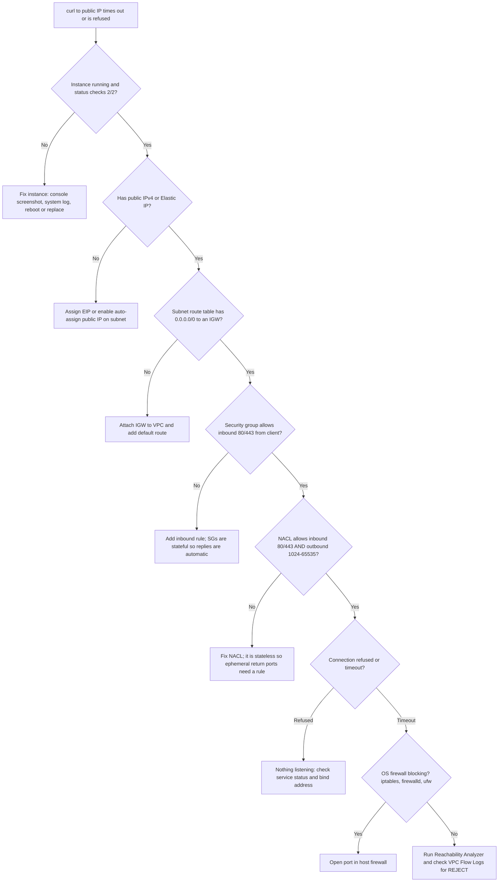

# AWS Troubleshooting Scenarios: "Walk Me Through It"

Interviewers for Solutions Architect, DevOps, and SRE roles often skip trivia and ask: *"X is broken. Walk me through how you'd debug it."* They are grading **method**, not memorized answers. The answer that wins always has the same shape: **work layer by layer, cheapest check first, say what evidence each check gives you, and name the root causes you'd expect.**

This cheat sheet covers 13 of the most common scenarios. Each answer has an ordered checklist, the commands / console places to look, and the usual root causes. Background concepts live in the linked `concepts/` guides and are not repeated here.

---

## 🧭 The Universal Debugging Framework

Say this out loud before diving into any scenario. It shows you have a system, not a bag of tricks.

| Step | What you do | Why it matters |
| :--- | :--- | :--- |
| **1. Scope** | What changed? When did it start? All users or some? One AZ/Region or all? | Most incidents are caused by a change (deploy, config, cert, quota). |
| **2. Reproduce** | `curl -v`, `dig`, `aws ... --debug`, test from inside and outside the VPC | Splits "network path" from "application" problems immediately. |
| **3. Walk the path** | Client → DNS → edge → LB → compute → dependency, one hop at a time | Keeps you from guessing; each hop has a definitive check. |
| **4. Read the evidence** | CloudWatch metrics/logs, VPC Flow Logs, CloudTrail, LB access logs, X-Ray | Evidence beats intuition. CloudTrail answers "who changed what". |
| **5. Mitigate, then fix** | Roll back / fail over first, root-cause second | Restore service before finishing the investigation. |
| **6. Prevent** | Alarm, guardrail (SCP/Config rule), runbook, post-incident review | Shows senior-level ownership. |

> [!TIP]
> Useful universal tools: **VPC Reachability Analyzer** (path analysis without sending packets), **IAM Policy Simulator**, **CloudTrail Event history**, **CloudWatch Logs Insights**, and **AWS Health Dashboard**. See [Observability & Monitoring](../concepts/observability-and-monitoring.md).

---

## 🌐 1. "I can't reach my EC2 web server from the internet"

The classic. Walk **outside-in**, one layer at a time.



**Ordered checklist**

1. **Instance health**: EC2 console → Status checks (system vs. instance). `aws ec2 describe-instance-status --instance-ids i-...`
2. **Public addressing**: Does it have a public IP / EIP? Is the DNS record pointing at the *current* IP (public IPs change on stop/start without an EIP)?
3. **Internet Gateway + route table**: IGW attached to the VPC; the *subnet's* route table (not just the main table) has `0.0.0.0/0 → igw-...`.
4. **Security group**: Inbound TCP 80/443 from `0.0.0.0/0` (or the client CIDR). SGs are **stateful**, so no outbound rule is needed for replies.
5. **NACL**: Stateless. Needs inbound 80/443 **and** outbound ephemeral ports `1024-65535` for the response. A missing ephemeral rule gives you a timeout with no error.
6. **Host level**: `ss -tlnp | grep :80` (is anything listening, and on `0.0.0.0` not `127.0.0.1`?), `systemctl status nginx`, `sudo iptables -L -n`, `firewall-cmd --list-all`.
7. **Evidence**: VPC Flow Logs show `REJECT` (SG/NACL) vs. `ACCEPT` with no reply (host problem). Reachability Analyzer names the blocking component.

**Tell-tale signals**: *Connection refused* = packet arrived, nothing listening. *Timeout* = packet dropped (SG, NACL, route, host firewall). Deep dives: [Networking Fundamentals](../concepts/networking-and-api-fundamentals.md), [Linux on EC2](../concepts/linux-and-virtualization-on-ec2.md).

---

## ⚖️ 2. "The ALB is returning 502 / 503 / 504"

Know the difference cold. The status code tells you **which hop** failed.

| Code | Meaning at the ALB | Common root causes | Where to look |
| :--- | :--- | :--- | :--- |
| **502 Bad Gateway** | Target responded with something the ALB couldn't use (reset, malformed, closed early) | App crashed mid-request; target **keep-alive timeout shorter than ALB idle timeout** (60s default); TLS mismatch to target; Lambda target returned malformed JSON | ALB access logs (`target_status_code` = `-`), `HTTPCode_ELB_502_Count`, app logs |
| **503 Service Unavailable** | ALB has **no healthy/registered targets** for the rule | All targets failing health checks; empty target group; wrong health check path/port; SG blocks ALB → target | Target group → Targets tab (health reason codes), `HealthyHostCount` |
| **504 Gateway Timeout** | Target accepted but didn't answer before the **idle timeout** | Slow DB query, downstream dependency hang, thread pool exhaustion, target SG allows handshake but app blocked | `TargetResponseTime`, access logs `target_processing_time = -1`, X-Ray traces |

**Checklist**: compare `HTTPCode_ELB_5XX_Count` (ALB-generated) vs `HTTPCode_Target_5XX_Count` (app-generated) first. That single split tells you whether to look at the LB/network or the application.

> [!TIP]
> The fix for intermittent 502s is usually: set the app server keep-alive timeout **greater than** the ALB idle timeout (e.g., Node.js `server.keepAliveTimeout = 65000`).

---

## 🔐 3. "Cross-account AssumeRole returns AccessDenied"

`sts:AssumeRole` needs **both sides** to say yes, and several guardrails can still veto it. Walk the policy evaluation chain.

1. **Trust policy (target account role)**: Does `Principal` name the exact caller ARN or account root? Typos, a deleted-and-recreated role (principal ID changes), or wrong account ID are common.
2. **Caller identity permissions (source account)**: Does the caller's identity policy allow `sts:AssumeRole` on the target role ARN? `aws sts get-caller-identity` to confirm who you really are.
3. **Conditions in the trust policy**: `sts:ExternalId` mismatch (third-party pattern), `aws:MultiFactorAuthPresent`, `aws:SourceIp`, `aws:PrincipalOrgID`.
4. **SCPs**: An Organizations SCP in either account can deny `sts:AssumeRole` or deny everything outside allowed Regions. SCPs never grant, they only cap.
5. **Permission boundary** on the caller (source) or the role: effective permissions are the **intersection**.
6. **Session policy**: If passed via `--policy`, the session gets the intersection of role policy and session policy. Assume succeeds, but later calls fail.
7. **Role chaining**: Max session duration drops to 1 hour; `--duration-seconds` larger than the role's max fails.
8. **Evidence**: CloudTrail `AssumeRole` event in **both** accounts, `errorCode` / `errorMessage`. Use IAM Policy Simulator and IAM Access Analyzer.

Deep dive: [Security & Compliance](../concepts/security-and-compliance.md).

---

## ⚡ 4. "My Lambda times out, but only when attached to a VPC"

Root cause is almost always **no path to the service it calls**. A VPC-attached Lambda gets ENIs with **private IPs only**, never a public IP, even in a public subnet.

1. **Which call hangs?** Add logging/X-Ray around each outbound call. Usually an AWS API (S3, DynamoDB, Secrets Manager, STS) or an internet API.
2. **Subnet routing**: Lambda must be in **private subnets** whose route table sends `0.0.0.0/0` to a **NAT Gateway** (which sits in a public subnet with an IGW route). Putting Lambda in a public subnet does *not* work.
3. **Or skip NAT with VPC endpoints**: Gateway endpoints for S3/DynamoDB (free), Interface endpoints for Secrets Manager, SSM, STS, SQS, KMS. Check endpoint policies and "Private DNS enabled".
4. **Security group egress**: Lambda SG must allow outbound 443; endpoint SG must allow inbound 443 from the Lambda SG.
5. **NACLs** on the subnets (ephemeral return ports again).
6. **Also consider**: DB connection opened outside the handler never closed; cold start + init doing network calls; timeout set too low vs. downstream p99.

Deep dive: [Serverless Architecture](../concepts/serverless-architecture.md).

---

## 🧱 5. "Terraform says the state is locked"

```
Error: Error acquiring the state lock ... ConditionalCheckFailedException
Lock Info: ID: 3f2a...  Who: runner@ci-42  Operation: OperationTypeApply
```

1. **Read the lock info**: who, when, what operation. Is that process genuinely still running (a CI job, a colleague)? **Never** force-unlock a live apply.
2. **Confirm it is dead**: check the CI pipeline, the runner, the user's terminal. Killed jobs (Ctrl-C twice, runner OOM, timed-out pipeline) leave orphaned locks.
3. **Inspect the lock**: S3 backend with DynamoDB lock table: look for the `LockID` item. With S3 native locking (`use_lockfile = true`), look for the `.tflock` object.
4. **Release it**: `terraform force-unlock <LOCK_ID>`.
5. **Check state integrity** after an interrupted apply: `terraform plan` to see drift; S3 versioning lets you restore a prior state file if it was partially written.
6. **Prevent**: serialize applies per workspace in CI (concurrency groups), set sensible pipeline timeouts, and keep the lock table/bucket in a protected account.

Deep dive: [Terraform](../concepts/terraform.md).

---

## 🪣 6. "S3 returns 403 even though the bucket policy allows access"

S3 authorization combines **several** policies, and any explicit deny or missing KMS permission wins.

1. **Identity**: who is calling? `aws sts get-caller-identity`. Is it the role you think?
2. **Explicit denies**: bucket policy conditions (`aws:SecureTransport`, `aws:SourceVpce`, `aws:PrincipalOrgID`), SCPs, permission boundaries, VPC endpoint policy.
3. **SSE-KMS objects**: the caller needs `kms:Decrypt` (GET) or `kms:GenerateDataKey` (PUT) and the **KMS key policy** must allow it. Cross-account access to KMS-encrypted objects fails here most often. AWS-managed `aws/s3` keys cannot be shared cross-account.
4. **Block Public Access**: account- or bucket-level BPA overrides public bucket policies and ACLs.
5. **Object Ownership**: with legacy ACLs, objects uploaded by another account are owned by the uploader, so the bucket owner gets 403. Fix with **Bucket owner enforced** (ACLs disabled).
6. **Object does not exist**: without `s3:ListBucket`, a missing key returns **403 instead of 404**.
7. **Evidence**: CloudTrail data events, S3 server access logs, IAM Access Analyzer for S3.

Deep dive: [Storage on AWS](../concepts/storage-on-aws.md).

---

## 🗄️ 7. "RDS: too many connections / connection exhaustion"

1. **Confirm**: CloudWatch `DatabaseConnections` vs. `max_connections` (a function of instance memory in the default parameter group). Error: `FATAL: too many connections` / `Too many connections`.
2. **Who holds them?** PostgreSQL: `SELECT usename, application_name, state, count(*) FROM pg_stat_activity GROUP BY 1,2,3;` MySQL: `SHOW PROCESSLIST;`. Look for many `idle` / `idle in transaction`.
3. **Common root causes**:
   - Lambda scaling out: each concurrent execution opens its own connection.
   - App pool size × number of tasks/pods exceeds the DB limit after an autoscale event.
   - Connection leaks (not returned to pool), long-running transactions.
4. **Fixes**: **RDS Proxy** (pooling and multiplexing, great for Lambda), right-size pools per instance, idle timeouts, cap Lambda reserved concurrency, read replicas for read traffic, larger instance class only as a last resort.
5. **Watch** Performance Insights for top waits and SQL.

Deep dive: [Databases on AWS](../concepts/databases-on-aws.md).

---

## 🐳 8. "ECS tasks are stuck in PENDING or keep restarting"

| Symptom | Likely causes | Where to look |
| :--- | :--- | :--- |
| **PENDING forever** | No capacity (EC2 launch type: not enough CPU/memory/ports on container instances); Fargate ENI/IP exhaustion in subnet; capacity provider not scaling | Service **Events** tab, `aws ecs describe-services`, subnet free IPs |
| **STOPPED: CannotPullContainerError** | No route to ECR (private subnet without NAT or ECR/S3 endpoints), missing `ecr:GetAuthorizationToken` on the **task execution role**, wrong image tag | Stopped task `stoppedReason` |
| **ResourceInitializationError** | Can't fetch Secrets Manager/SSM secrets or reach CloudWatch Logs | Execution role permissions, endpoints/NAT |
| **Restart loop (exit code 1/137)** | App crash, bad env/config, OOM kill (137), failing container `healthCheck` | CloudWatch Logs for the container, `exitCode` |
| **Replaced by service** | ALB health check failing (wrong path/port, grace period too short) | Target group health reasons, `healthCheckGracePeriodSeconds` |

Remember the two roles: **task execution role** (pull image, fetch secrets, write logs) vs. **task role** (what your app code calls). Deep dive: [Containers, Docker & ECR](../concepts/containers-docker-ecr.md).

---

## ☸️ 9. "EKS pods are Pending / ImagePullBackOff"

Always start with `kubectl describe pod <pod>` and read the **Events** section.

**Pending** (scheduler can't place it):
1. `0/5 nodes are available: insufficient cpu/memory` → requests too big or no room; check Cluster Autoscaler / Karpenter logs.
2. Taints without tolerations, `nodeSelector` / affinity that no node matches.
3. PVC unbound: EBS volume in a different AZ than available nodes, missing EBS CSI driver or StorageClass.
4. **VPC CNI IP exhaustion**: pods get VPC IPs, so subnets or ENI/IP-per-instance limits run out. Enable prefix delegation or add secondary CIDRs.

**ImagePullBackOff / ErrImagePull**:
1. Wrong image name/tag (`kubectl get pod -o yaml | grep image`).
2. Node role missing `AmazonEC2ContainerRegistryReadOnly`, or private registry needs an `imagePullSecret`.
3. No egress path to ECR: private nodes need NAT or ECR API + ECR DKR + S3 gateway endpoints.
4. Docker Hub rate limits: mirror images into ECR (pull-through cache).

**CrashLoopBackOff** (bonus): `kubectl logs <pod> --previous`, check probes and OOMKilled in `describe`.

Deep dive: [Kubernetes on EKS](../concepts/kubernetes-on-eks.md).

---

## 🗺️ 10. "I changed a Route 53 record but users still see the old value"

1. **Verify authoritative truth**: `dig +short example.com @ns-123.awsdns-45.com`. If the authoritative answer is correct, Route 53 is done (changes reach all Route 53 NS in ~60 seconds; `aws route53 get-change` shows `INSYNC`).
2. **TTL**: resolvers cache the **old** record for up to its old TTL. Lower TTL (e.g., 60s) **a TTL period before** planned changes.
3. **Negative caching**: if clients queried the name before it existed, resolvers cache NXDOMAIN for the SOA **minimum/negative TTL**.
4. **Wrong zone**: edited a hosted zone the domain isn't delegated to (duplicate zones, private vs. public zone, registrar NS mismatch). `dig NS example.com` and compare to the zone's NS set.
5. **Client-side caches**: OS resolver, browser, JVM `networkaddress.cache.ttl`, corporate resolvers ignoring TTL.
6. **Alias/health checks**: failover or weighted records with failing health checks return a different answer than expected.

Deep dive: [Networking Fundamentals](../concepts/networking-and-api-fundamentals.md).

---

## 🐢 11. "Latency spiked right after a deploy"

1. **Correlate**: overlay the deploy marker on p50/p95/p99 latency dashboards. Is it all endpoints or one? All instances or only new ones?
2. **Mitigate first**: roll back (CodeDeploy automatic rollback, ECS circuit breaker, Argo Rollouts abort) if error budget is burning.
3. **Then diagnose**:
   - **Cold paths**: new instances with empty caches, JIT warm-up, lazy-loaded config, connection pools rebuilding.
   - **Code**: N+1 queries, new synchronous downstream call, missing index hit by a new query, bigger payloads.
   - **Config**: smaller instance/task size, changed pool size, disabled keep-alive, debug logging left on.
   - **Dependencies**: DB CPU / `ReadLatency`, cache hit ratio drop, throttling (`ThrottledRequests`, 429s).
4. **Evidence**: X-Ray / OpenTelemetry trace comparison old vs. new version, CloudWatch Logs Insights on request duration, Performance Insights.
5. **Prevent**: canary or linear deployments with latency alarms as rollback triggers.

Deep dive: [Observability & Monitoring](../concepts/observability-and-monitoring.md).

---

## 🌍 12. "CloudFront keeps serving stale content"

1. **Confirm it is the cache**: `curl -I https://site/path` and read `X-Cache: Hit from cloudfront`, `Age`, `Cache-Control`.
2. **TTL chain**: effective TTL = origin `Cache-Control`/`Expires` clamped by the cache policy's min/default/max TTL. A high **minimum TTL** overrides `no-cache` from origin.
3. **Invalidate**: `aws cloudfront create-invalidation --distribution-id E123 --paths "/index.html"`. Paths are case-sensitive and must match the cache key path.
4. **Cache key**: if query strings/headers aren't in the cache key, `?v=2` doesn't bust the cache. Prefer **versioned file names** (`app.3f9c.js`) and short TTL on `index.html`.
5. **Other layers**: browser cache, a CDN in front of CloudFront, S3 still has the old object (sync failed), or the deployment wrote to a different origin path.
6. **Error caching**: CloudFront caches 4xx/5xx for the error caching minimum TTL (default 10s), so a temporary origin error can stick.

---

## 📦 13. Bonus: "EC2 in a private subnet can't reach the internet / AWS APIs"

1. Route table: `0.0.0.0/0 → nat-...` (not IGW).
2. NAT Gateway is in a **public** subnet whose route table points to the IGW, and it is in `available` state.
3. SG egress allows 443; NACL allows outbound 443 and inbound ephemeral ports.
4. For AWS APIs only, prefer VPC endpoints (cheaper than NAT data processing).
5. DNS: VPC `enableDnsSupport` and `enableDnsHostnames` on (required for interface endpoint private DNS).

---

## 📋 Quick Reference: Symptom → First Check

| Symptom | First command / place |
| :--- | :--- |
| Timeout to EC2 | Reachability Analyzer, VPC Flow Logs `REJECT` |
| ALB 5xx | `HTTPCode_ELB_5XX` vs `HTTPCode_Target_5XX`, access logs |
| AccessDenied | CloudTrail `errorMessage`, `aws sts get-caller-identity` |
| Lambda timeout in VPC | Route table of Lambda subnets, VPC endpoints |
| Terraform lock | Lock `Who`/`Created`, then `terraform force-unlock` |
| S3 403 | KMS key policy, BPA, Object Ownership |
| DB connections | `pg_stat_activity` / `SHOW PROCESSLIST`, RDS Proxy |
| ECS PENDING | Service Events, stopped task `stoppedReason` |
| Pod Pending | `kubectl describe pod` Events |
| DNS stale | `dig @authoritative-ns`, TTL |
| Post-deploy latency | Deploy markers, traces old vs new |
| CloudFront stale | `X-Cache`, `Age`, invalidation, cache key |

> [!IMPORTANT]
> Close every answer with **prevention**: the alarm that would have caught it earlier, the guardrail that would have stopped it, and the runbook entry you'd write. That is what separates a senior answer from a mid-level one.
