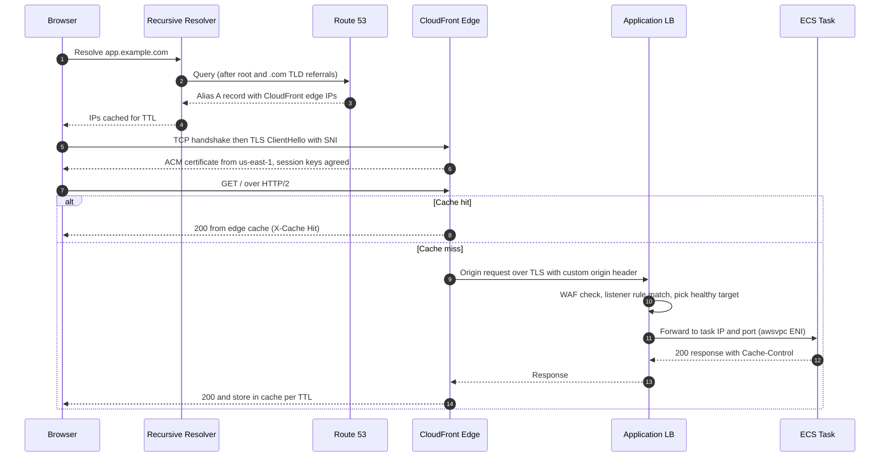
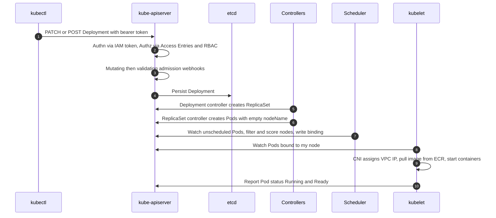
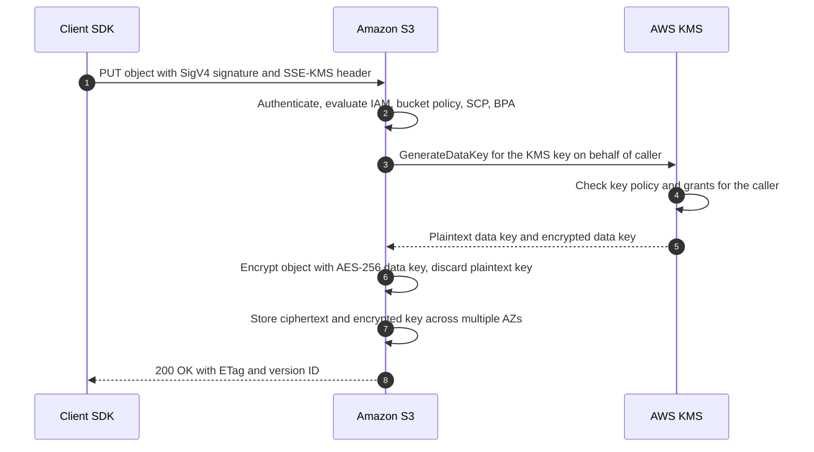

# "What Happens When…" Deep-Trace Questions

"What happens when you type a URL into a browser?" is the most famous systems interview question. Senior AWS interviews ask the **cloud-native versions**: trace a request, a deployment, or an API call through every component it touches. The interviewer wants to see that you understand the **mechanism**, not just the service names, and that you can say where each step can fail.

This cheat sheet traces 7 common flows step by step. For each, it notes **where it breaks** so you can pivot straight into a troubleshooting discussion (see [Troubleshooting Scenarios](troubleshooting-scenarios.md)).

---

## 🧭 How to Answer a Trace Question

| Technique | Example |
| :--- | :--- |
| **Name the actors first** | "Six players: the browser, a recursive resolver, Route 53, CloudFront, the ALB, and the ECS task." |
| **Number the steps** | Keeps you and the interviewer oriented; lets them say "go deeper on step 4". |
| **Say what state changes** | "etcd now holds a Deployment object", "the DynamoDB lock item exists". |
| **Mark trust boundaries** | Where authentication, authorization, and encryption happen. |
| **End with failure points** | Proves you've operated this in production. |

---

## 🌐 1. Typing `https://app.example.com` (Route 53 → CloudFront → ALB → ECS)

**Step by step**

1. **Browser cache checks**: HSTS list, browser DNS cache, OS resolver cache.
2. **DNS resolution**: the recursive resolver walks root → `.com` TLD → the Route 53 **authoritative** name servers for `example.com`. Route 53 returns an **Alias** record pointing at the CloudFront distribution, which resolves to IPs at an edge location near the resolver. The answer is cached for the record TTL.
3. **TCP + TLS handshake with the edge**: the browser opens TCP 443 (or QUIC for HTTP/3) to the edge. The TLS ClientHello carries **SNI** so CloudFront picks the right certificate (an **ACM cert in us-east-1**). TLS 1.3 needs one round trip; keys are agreed via ECDHE.
4. **Edge processing**: CloudFront Functions / Lambda@Edge (viewer request) may rewrite headers or check auth. AWS WAF and Shield Standard inspect the request.
5. **Cache lookup**: the **cache key** (path + selected headers/cookies/query strings from the cache policy) is looked up at the edge, then at the **Regional Edge Cache** (and Origin Shield if enabled).
6. **Origin fetch on miss**: CloudFront opens (or reuses) a TLS connection to the ALB. A secret custom header, or the CloudFront **managed prefix list** on the ALB security group, ensures the ALB only accepts traffic from CloudFront.
7. **ALB**: terminates TLS, evaluates **listener rules** (host/path), selects a **target group**, and picks a healthy target (round robin or least outstanding requests). Health checks have already removed unhealthy tasks.
8. **ECS task**: with `awsvpc` networking each task has its own ENI and private IP, which is what's registered in the target group. The container handles the request, possibly calling RDS/DynamoDB/cache.
9. **Response path**: back through ALB → CloudFront, which stores it per TTL (origin `Cache-Control` clamped by cache policy) → browser, which renders and fires more requests (usually cache hits for hashed static assets).

**Where it breaks**: stale DNS (TTL), cert not in us-east-1 or SAN mismatch, 403 from WAF/OAC, ALB 502/503/504, CloudFront serving stale content. Deep dive: [Networking Fundamentals](../concepts/networking-and-api-fundamentals.md), [Containers, Docker & ECR](../concepts/containers-docker-ecr.md).

---

## ☸️ 2. Running `kubectl apply -f deploy.yaml` on EKS

1. **Client side**: kubectl reads `~/.kube/config`, which runs `aws eks get-token` to mint a **pre-signed STS `GetCallerIdentity` URL** used as a bearer token. It sends a server-side-apply PATCH (or a create if the object is new).
2. **Authentication**: the EKS-managed API server validates the token with STS, mapping the IAM principal to a Kubernetes user/group via **EKS Access Entries** (or the legacy `aws-auth` ConfigMap).
3. **Authorization**: **RBAC** checks whether that user can `patch deployments` in the namespace.
4. **Admission**: **mutating** webhooks (inject sidecars, default resources, Pod Identity env vars), schema validation, then **validating** webhooks / policies (Kyverno, OPA Gatekeeper, Pod Security Admission). Any of them can reject.
5. **Persistence**: the object is written to **etcd** (managed by AWS, with KMS envelope encryption of Secrets if configured). The API returns `deployment.apps/web configured`. *Nothing is running yet.*
6. **Controllers** (control loops watching the API): the Deployment controller sees a new pod template hash, creates a new **ReplicaSet**, and scales old/new according to the `RollingUpdate` strategy (`maxSurge`/`maxUnavailable`). The ReplicaSet controller creates **Pod** objects.
7. **Scheduler**: watches Pods with no `nodeName`, **filters** nodes (resources, taints, affinity, topology spread, volume AZ) and **scores** them, then writes a Binding. No feasible node → Pod stays `Pending`, and Karpenter/Cluster Autoscaler may launch a node.
8. **kubelet** on the chosen node sees the bound Pod, then:
   - Calls the **VPC CNI** to attach a secondary IP from the node's ENIs (the pod gets a real VPC IP).
   - Asks containerd to **pull the image** from ECR using the node role credentials.
   - Creates the pause (sandbox) container, init containers, then app containers; mounts volumes and secrets.
   - Runs **startup/readiness/liveness probes**.
9. **Service wiring**: once Ready, EndpointSlices update; kube-proxy programs iptables/IPVS rules, and the AWS Load Balancer Controller registers the pod IP in the ALB target group (IP mode).
10. **Rollout completes** when the new ReplicaSet reaches the desired ready replicas and the old one scales to 0.

**Where it breaks**: `Unauthorized` (access entry), `Forbidden` (RBAC), webhook denial, Pending (capacity/IPs), ImagePullBackOff, CrashLoopBackOff, failing readiness. Deep dive: [Kubernetes on EKS](../concepts/kubernetes-on-eks.md).

---

## ⚡ 3. A Lambda Function Cold Invocation

1. **Invoke arrives** (API Gateway, SDK `Invoke`, event source mapping). The Lambda **frontend** authenticates the SigV4 request, checks IAM / resource policy, and checks **concurrency** (account limit, reserved concurrency). Over the limit → `429 TooManyRequestsException` (sync) or retries (async).
2. **Placement**: no free warm execution environment exists for this function version, so Lambda provisions a new **Firecracker microVM** on a worker host.
3. **Download code**: the deployment package from S3 (zip) or container image layers from ECR (lazily loaded and cached), plus **layers**.
4. **Init phase** (up to 10s):
   - Extensions init (e.g., observability agents).
   - **Runtime init** (Node, Python, JVM start).
   - **Function init**: code outside the handler runs (SDK clients, DB connections, config fetch). This is where most cold start time goes.
5. **VPC**: if VPC-attached, the function uses a shared **Hyperplane ENI** created when the function was configured, not per invocation, so modern VPC cold starts add little.
6. **Invoke phase**: the runtime calls the Runtime API `/next`, receives the event, runs the handler, posts the response. Logs stream to CloudWatch Logs.
7. **Freeze**: the environment is frozen and kept warm for reuse; the next invoke skips steps 2-5.

**Mitigations**: Provisioned Concurrency, **SnapStart** (Java, Python, .NET), smaller packages, lazy init, lighter frameworks. **Where it breaks**: init timeout, throttling, VPC egress path, missing execution role permissions. Deep dive: [Serverless Architecture](../concepts/serverless-architecture.md).

---

## 🧱 4. Running `terraform apply`

1. **Load configuration**: parse `.tf` files, resolve modules and providers (installed into `.terraform/` by `init`), evaluate variables and locals.
2. **Backend + lock**: connect to the backend (e.g., S3) and **acquire the state lock** (DynamoDB item or S3 native `.tflock`). If already held, apply fails fast.
3. **Read state**: download the latest state file (JSON mapping resource addresses to real IDs and attributes).
4. **Refresh**: for each resource, the provider calls read APIs (`DescribeInstances`, `GetBucketPolicy`...) to detect **drift** between state and reality.
5. **Plan**: build a **dependency graph** (DAG) from references and `depends_on`, diff desired config vs. refreshed state, and produce create / update-in-place / replace / destroy actions. Show the plan and wait for `yes` (unless applying a saved plan file).
6. **Walk the graph**: independent nodes run in parallel (`-parallelism=10` default); dependents wait. Each provider turns actions into AWS API calls signed with SigV4, using the credential chain (env vars, profile, assumed role, OIDC in CI).
7. **Persist state incrementally**: state is written as resources complete, so a partial failure still records what was created.
8. **Finish**: outputs are computed and the **lock is released**.

**Where it breaks**: stuck lock, drift causing unexpected replacements, `create_before_destroy` name collisions, API throttling, eventual consistency (a new IAM role not yet usable). Deep dive: [Terraform](../concepts/terraform.md).

---

## 🪣 5. An S3 `PUT` with SSE-KMS

1. **Request signing**: the SDK signs with **SigV4** (access keys or temporary credentials); large objects use multipart upload.
2. **Authorization**: IAM identity policy, bucket policy, SCPs, permission boundaries, VPC endpoint policy, Block Public Access, Object Ownership. An explicit deny anywhere wins.
3. **Envelope encryption**: S3 calls KMS `GenerateDataKey` **on behalf of the caller**, so the caller must be allowed by the **key policy**. With **S3 Bucket Keys**, S3 uses a bucket-level key to derive per-object data keys, cutting KMS calls (and cost/throttling) dramatically.
4. **Encrypt and store**: the object is encrypted with the data key; the encrypted data key is stored with the object metadata. The plaintext key is discarded.
5. **Durability**: stored redundantly across at least 3 AZs (Standard class) before `200 OK`. S3 is **strongly consistent** for read-after-write.
6. **Side effects**: versioning assigns a version ID; event notifications (SQS/SNS/Lambda/EventBridge), replication (CRR/SRR), CloudTrail data events.
7. **On GET**: S3 sends the encrypted data key to KMS `Decrypt` (caller needs `kms:Decrypt`), decrypts, and streams the object.

**Where it breaks**: KMS key policy missing the principal (the #1 cause of cross-account 403s), KMS request throttling without Bucket Keys. Deep dive: [Storage on AWS](../concepts/storage-on-aws.md), [Security & Compliance](../concepts/security-and-compliance.md).

---

## 🖥️ 6. Launching an EC2 Instance

1. **API call**: `RunInstances` (console, CLI, ASG, Terraform). IAM authorizes `ec2:RunInstances` plus related permissions (`iam:PassRole` for the instance profile, KMS for encrypted volumes). Service quotas (vCPU limits) are checked.
2. **Placement**: EC2 picks a physical host in the chosen AZ with capacity for the instance type (respecting placement groups, tenancy, capacity reservations). `InsufficientInstanceCapacity` happens here.
3. **Networking**: the primary **ENI** is created in the subnet, a private IP is allocated, security groups are attached, and a public IP is assigned if the subnet auto-assigns one.
4. **Storage**: the root **EBS volume** is created from the AMI's snapshot (blocks lazy-loaded from S3, so first reads are slower unless Fast Snapshot Restore is on); encrypted if the AMI or account default says so.
5. **Hypervisor**: the **Nitro** system (Nitro cards for VPC networking, EBS, and security; lightweight Nitro hypervisor) boots the instance. State goes `pending` → `running`.
6. **Guest boot**: firmware → bootloader → kernel → systemd. **cloud-init** reads **instance metadata** from IMDS (`169.254.169.254`, IMDSv2 token-based), sets hostname and SSH keys, and runs **user data**.
7. **Agents**: SSM Agent registers with Systems Manager, CloudWatch agent starts; instance profile credentials become available via IMDS.
8. **Health**: system and instance **status checks** begin; ASG / ELB health checks decide when it receives traffic.

**Where it breaks**: quota or capacity errors, `iam:PassRole` denied, no access to the KMS key for an encrypted AMI, user data failures (`/var/log/cloud-init-output.log`), network unreachable (see troubleshooting). Deep dive: [Linux & Virtualization on EC2](../concepts/linux-and-virtualization-on-ec2.md).

---

## 🚀 7. `git push` Triggers CodePipeline

1. **Push**: the git client authenticates to the repo host (GitHub/GitLab/Bitbucket via **AWS CodeConnections**, formerly CodeStar Connections, or CodeCommit). The remote updates the branch ref.
2. **Trigger**: the source provider emits a webhook/event; CodePipeline (V2) evaluates **trigger filters** (branch, file path, tags) and starts an **execution** (queued, superseded, or parallel mode per pipeline setting).
3. **Source stage**: the commit is zipped as a **source artifact** into the pipeline's S3 artifact bucket (KMS-encrypted).
4. **Build stage**: CodeBuild starts a fresh container, assumes the **CodeBuild service role**, downloads the artifact, and runs the `buildspec.yml` phases (install → pre_build → build → post_build): unit tests, `docker build`, push the image to **ECR**, and write `imagedefinitions.json` / `appspec.yaml` as the output artifact.
5. **Test / security stages**: integration tests, SAST, image scanning, `terraform plan`.
6. **Approval** (optional): a manual approval action with SNS notification.
7. **Deploy stage**: CodeDeploy / ECS / CloudFormation action using a **cross-account role** in the target account. ECS blue/green via CodeDeploy shifts ALB traffic (canary / linear / all-at-once) with CloudWatch alarms as automatic rollback triggers.
8. **Observability**: stage state changes go to **EventBridge** (Slack notifications via Chatbot); every API call is in CloudTrail.

**Where it breaks**: connection not authorized, CodeBuild role missing ECR/KMS permissions, artifact bucket KMS key not shared cross-account, deployment health checks failing and triggering rollback. Deep dive: [CI/CD & GitOps](../concepts/cicd-and-gitops.md), [Containers, Docker & ECR](../concepts/containers-docker-ecr.md).

---

## 📋 Recap: Where Each Flow Keeps Its State

| Flow | Source of truth | Key control points | Classic failure |
| :--- | :--- | :--- | :--- |
| URL → ECS | DNS records, CF cache, target group | TLS/SNI, cache key, listener rules, health checks | Stale cache, 5xx |
| `kubectl apply` | etcd | Authn, RBAC, admission, scheduler | Pending, ImagePullBackOff |
| Lambda cold start | Execution environment pool | Concurrency, init phase | Throttling, init timeout |
| `terraform apply` | State file + lock | Refresh, DAG, provider APIs | Stuck lock, drift |
| S3 PUT SSE-KMS | S3 + KMS key policy | IAM + bucket + key policy | 403 from KMS |
| EC2 launch | EC2 control plane, IMDS | Quotas, PassRole, cloud-init | Capacity, user data errors |
| `git push` → deploy | Pipeline execution + S3 artifacts | Roles, approvals, alarms | Cross-account KMS, rollback |

> [!TIP]
> After any trace, offer the interviewer a pivot: *"Want me to go deeper on any step, or talk about how it fails?"* It hands them control and usually leads straight into a troubleshooting question you're ready for.
