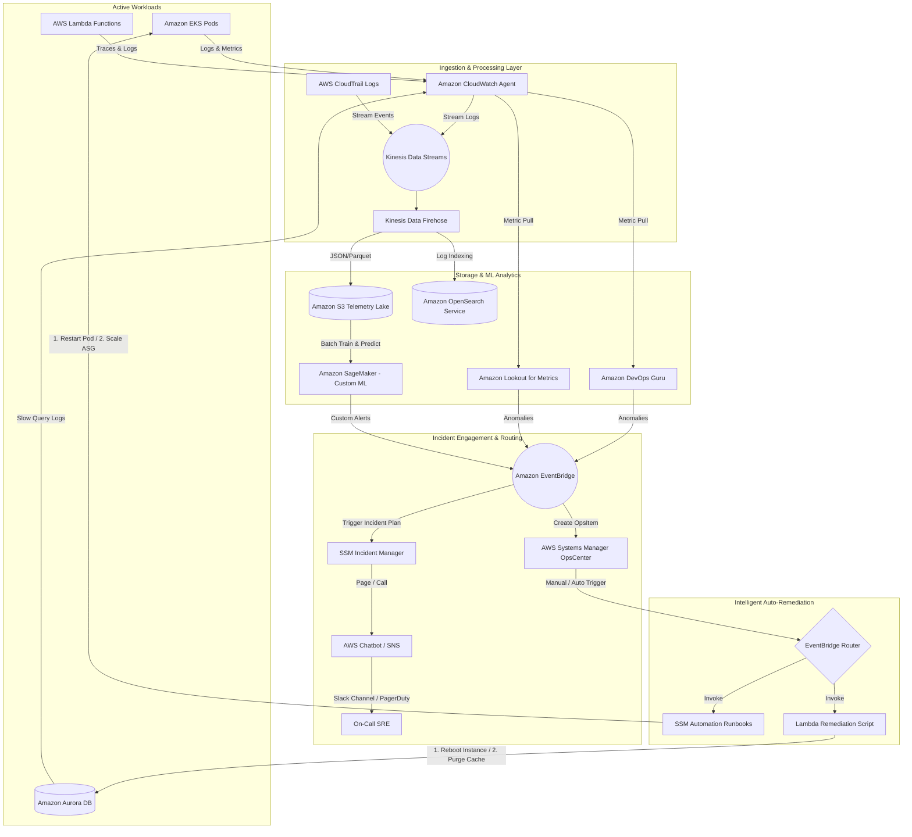
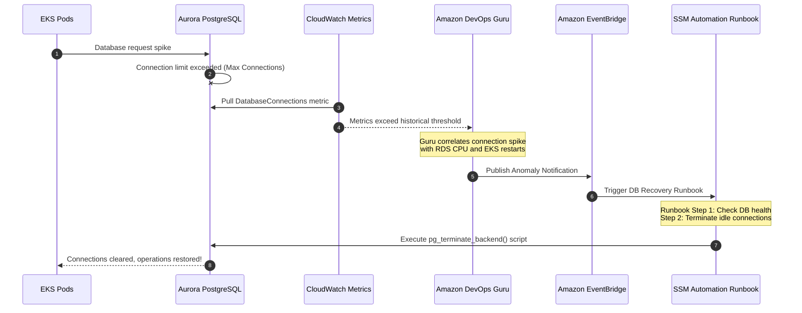

# AIOps (Artificial Intelligence for IT Operations) on AWS

## 🌐 Introduction to AIOps
Traditional monitoring relies on static thresholds (e.g., "Alert if CPU > 85%"). In complex, multi-tenant distributed systems, this leads to two major issues:
1.  **Alert Fatigue**: Constant pages for transient spikes that self-heal.
2.  **Blind Spots**: Missing silent failures (e.g., a slow degradation in database query efficiency that doesn't breach any single static limit).

**AIOps** replaces static monitoring with machine learning (ML) to analyze telemetry streams (metrics, logs, traces), detect anomalies, correlate related events, isolate root causes, and execute self-healing runbooks.

---

## 🏛️ The Five Layers of AWS AIOps Architecture

An enterprise AIOps pipeline on AWS is organized into five functional layers:

```
[ Ingest & Collect ] ──► [ Process & Store ] ──► [ ML Analytics ] ──► [ Incident Mgmt ] ──► [ Self-Healing ]
  - CloudWatch             - S3 Data Lake          - DevOps Guru        - SSM Incident       - SSM Automation
  - VPC Flow Logs          - OpenSearch            - SageMaker RCF       Manager             - AWS Lambda
  - X-Ray Traces           - Kinesis Streams       - Lookout for Metrics - AWS Chatbot        - Step Functions
```

1.  **Ingest & Collect (Telemetry)**: Gathers logs, metrics, and traces across compute (EKS, Lambda, EC2), storage, and networking (VPC Flow Logs, CloudTrail).
2.  **Process & Store (Data Lake)**: Buffers raw telemetry in **Kinesis Data Streams** and aggregates it in **Amazon S3** (telemetry data lake) and **Amazon OpenSearch Service** (real-time log search).
3.  **Machine Learning & Analytics Layer**: Analyzes telemetry to identify anomalies. Uses **Amazon DevOps Guru** for managed operations, **Amazon Lookout for Metrics** for multi-dimensional metric anomalies, and **Amazon SageMaker** for custom log clustering and predictive metrics.
4.  **Incident Management & Engagement**: Translates detected anomalies into actionable tickets in **AWS Systems Manager OpsCenter** or **SSM Incident Manager**, alerting engineers via **Slack** (using **AWS Chatbot**) or **PagerDuty**.
5.  **Intelligent Automation (Self-Healing)**: Uses **Amazon EventBridge** to detect OpsCenter events and trigger **AWS Lambda** or **Systems Manager Automation** runbooks to resolve issues automatically.

---

## 📊 Detailed AWS AIOps Architecture Diagram

The diagram below details a complete, production-grade AIOps pipeline on AWS, featuring both managed AIOps services (DevOps Guru) and custom ML analytics (SageMaker).



---

## ⚙️ Managed AWS AIOps vs. Custom SageMaker Pipelines

AWS offers a path between fully managed AIOps operations and fully customizable machine learning frameworks:

| Dimension | Amazon DevOps Guru (Managed) | Custom SageMaker Pipeline (Custom) |
| :--- | :--- | :--- |
| **Setup Overhead** | Near-zero (one-click activation via console/Terraform). | High (requires data engineering, model training, and custom code). |
| **Algorithms** | Pre-trained proprietary AWS anomaly detection models. | Custom models (e.g., Random Cut Forest, Autoencoders, XGBoost). |
| **Log Analysis** | Limited (focuses on CloudWatch metrics and CloudTrail configuration drifts). | High (Log pattern clustering via TF-IDF, sequence anomaly detection). |
| **Data Sources** | Core AWS CloudWatch metrics, CloudFormation stacks. | Any structured/unstructured dataset stored in S3. |
| **Cost Model** | Billed per resource analyzed per hour. | Billed based on SageMaker instance usage (training/inference compute). |

---

## 🛠️ Auto-Remediation Runbook Design

Auto-remediation is the final stage of maturity in an AIOps pipeline. The goal is to programmatically fix common, well-understood issues without SRE intervention.

### Example: Automated DB Connection Recovery Runbook


---

## ⚠️ Risks, Trade-offs, and Best Practices

AIOps introduces distinct failure modes that architects must plan for:

### 1. The Threat of Cascading Self-Healing Loops (Loop of Death)
*   **The Risk**: An auto-remediation runbook attempts to fix a system by restarting containers. If the root cause is a bad database schema update, restarting the container will crash it again, causing a continuous loop of restarts that overwhelms compute capacity.
*   **Mitigation**: Implement **Execution Rate Limits** (e.g., runbook can run at most once per 30 minutes) and **Circuit Breakers** on runbook executions (stop runbook if it runs 3 times consecutively without resolving the anomaly).

### 2. Cold Starts & Model Drift
*   **The Risk**: Anomaly detection models require baseline training periods (usually 14 days). During this period, they are blind or generate false alerts. Over time, normal system changes (e.g., releasing a new product feature that increases baseline CPU usage) trigger false anomalies (**Model Drift**).
*   **Mitigation**: Configure automated retraining schedules in SageMaker and leverage DevOps Guru's continuous feedback loops to mark anomalies as false positives.

### 3. Human-in-the-Loop (HITL) Gateways
*   **The Risk**: Complete automated execution of high-risk actions (e.g., database failovers, instance terminations) can accidentally worsen an outage if the ML model isolates the wrong root cause.
*   **Mitigation**: Use **SSM Incident Manager Approval Gates**. The SRE must click a button in Slack (via AWS Chatbot) to approve the remediation script before it executes in production.

---

## 📋 AIOps SRE Interview Q&A

### Question 1: How does Amazon DevOps Guru differentiate between a benign traffic spike (e.g., Black Friday launch) and a genuine system outage anomaly?
**Answer**:
DevOps Guru does not look at metrics in isolation. It uses **correlated anomaly detection**. 
*   **Traffic Spike**: During a marketing launch, requests (traffic rate) and CPU usage spike concurrently. However, error rates, database connection wait times, and queue latency remain stable. DevOps Guru recognizes this as normal scaling behavior.
*   **System Outage**: If traffic spikes but is accompanied by a concurrent increase in HTTP 5xx errors (API Gateway), a spike in database lock durations (Aurora), and container restarts (EKS), DevOps Guru groups these anomalous metrics into a single **Insight**. It identifies the database lock as the likely root cause, rather than the traffic volume.

### Question 2: How would you design a custom log anomaly detection pipeline on AWS using Amazon SageMaker?
**Answer**:
To detect custom log anomalies (e.g., identifying novel error patterns in application logs):
1.  **Ingestion**: Application containers stream logs to CloudWatch Logs, which are forwarded to Amazon S3 via Amazon Kinesis Data Firehose in Parquet format.
2.  **Preprocessing**: Use an AWS Glue job or SageMaker processing container to tokenize log entries and convert text messages into vector embeddings using natural language processing (NLP) models (e.g., Word2Vec or BERT).
3.  **Model Training**: Train a **SageMaker Random Cut Forest (RCF)** or K-Means clustering model. The model groups normal log structures together.
4.  **Inference**: A streaming Lambda function reads new logs, converts them to vectors, and queries the SageMaker endpoint. If the distance to the nearest cluster exceeds a threshold (an unknown log pattern or sudden burst of error syntax), the Lambda sends an alert notification to EventBridge.

### Question 3: Why should rate limits and cooldown periods be built into auto-remediation scripts?
**Answer**:
In distributed environments, there is a delay (propagation delay) between executing a remediation script (e.g., scaling out an Auto Scaling group or rebooting a DB replica) and seeing the metrics return to normal. 
If an auto-remediation script triggers instantly on every anomaly breach without a cooldown period:
*   The script will fire repeatedly, launching redundant resources or performing multiple reboots during the metric sync lag.
*   By enforcing a **cooldown period** (e.g., wait 15 minutes after execution before evaluating the metrics again) and **concurrency rate limits** (e.g., maximum of 1 active remediation runbook execution at a time), we prevent the system from over-correcting and entering a destructive cascading feedback loop.
