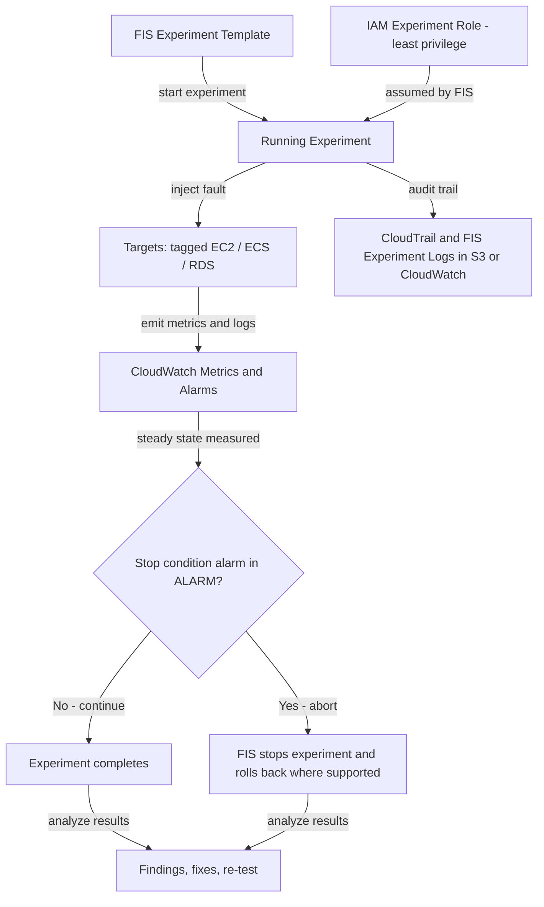

# Chaos Engineering & Resilience Testing on AWS

## 🌐 Why Break Things on Purpose?
Redundancy on a diagram is a *hypothesis*, not a guarantee. Multi-AZ databases, Auto Scaling groups, and retries all look correct until the day they are exercised. **Chaos engineering** is the discipline of experimenting on a system to build confidence in its ability to withstand turbulent conditions in production-like environments. It turns "we think failover works" into "we watched failover work, and it took 47 seconds."

> [!TIP]
> This guide is the *verification* companion to [High Availability & DR](./high-availability-and-dr.md) (which defines what to build) and [Observability & Monitoring](./observability-and-monitoring.md) (which tells you what happened during an experiment).

---

## 🧪 Core Principles of Chaos Engineering

1.  **Define steady state**: pick measurable business/technical outputs (orders/min, p99 latency, error rate), not internal metrics like CPU.
2.  **Form a hypothesis**: "If one AZ loses 100% of its instances, steady state holds (error rate < 0.1%, p99 < 400 ms)."
3.  **Inject realistic faults**: instance termination, AZ impairment, network latency, API throttling, dependency failure, disk full.
4.  **Minimize blast radius**: scope by tags and percentages, never "all"; start small (one instance, one tenant, one non-prod stack) and expand.
5.  **Automate stop conditions**: abort automatically if the customer impact exceeds a guardrail.
6.  **Run continuously**: resilience regresses with every deploy, so schedule experiments and gate releases.
7.  **Learn and fix**: every experiment ends with findings, owners, and a re-test.

### Steady-State Hypothesis Template

| Element | Example |
| :--- | :--- |
| **Steady state** | Checkout success rate >= 99.9%, p99 latency <= 400 ms |
| **Hypothesis** | Terminating 33% of web tier instances does not breach steady state |
| **Fault** | `aws:ec2:terminate-instances` on 33% of instances tagged `Tier=web` |
| **Blast radius** | One environment, one AZ, one tier |
| **Stop condition** | CloudWatch alarm: checkout success < 99% for 2 minutes |
| **Success criteria** | ASG replaces capacity within 5 minutes with no alarm |

---

## 🎮 Game Days

A **game day** is a scheduled, cross-functional exercise where a team injects failures and practices detection and response.

| Phase | Activities |
| :--- | :--- |
| **Plan** | Choose scenario (AZ loss, DB failover, expired certificate, dependency outage), define hypothesis, roles (facilitator, injector, observers, incident commander), and comms plan. |
| **Execute** | Inject faults; responders act as in a real incident, ideally without foreknowledge of the exact fault ("unannounced" for mature teams). |


---

## ⚡ AWS Fault Injection Service (FIS)

**AWS FIS** is the managed fault-injection service. It integrates with IAM, CloudWatch, and CloudTrail, so experiments are governed, audited, and can be stopped automatically.

### Core Concepts

| Concept | Description |
| :--- | :--- |
| **Experiment template** | The reusable definition: actions, targets, stop conditions, IAM role, logging. Versionable and deployable through IaC. |
| **Experiment** | A running instance of a template, with a state (`pending`, `running`, `stopping`, `completed`, `stopped`, `failed`). |
| **Action** | A fault to inject, e.g. `aws:ec2:stop-instances`, `aws:ec2:terminate-instances`, `aws:ecs:stop-task`, `aws:eks:pod-delete`, `aws:rds:failover-db-cluster`, `aws:rds:reboot-db-instances`, `aws:network:disrupt-connectivity`, `aws:ssm:send-command` (CPU stress, latency via `tc`), `aws:fis:inject-api-internal-error`, `aws:fis:inject-api-throttle-error`, `aws:ebs:pause-volume-io`. |
| **Target** | The resources acted upon, selected by ARN, **tags**, filters, and a **selection mode** (`ALL`, `COUNT(n)`, `PERCENT(n)`). |
| **Stop condition** | One or more CloudWatch alarms; if any enters `ALARM`, FIS halts the experiment and stops further actions. |
| **Safety Lever** | Account/Region-level switch that blocks all running and new experiments in an emergency. |

### Experiment Flow



### Example Experiment Template (Terminate 33% of a Tier)

```json
{
  "description": "Terminate 33% of web-tier instances in one AZ",
  "targets": {
    "WebInstances": {
      "resourceType": "aws:ec2:instance",
      "resourceTags": { "Tier": "web", "Env": "staging" },
      "filters": [
        { "path": "Placement.AvailabilityZone", "values": ["us-east-1a"] },
        { "path": "State.Name", "values": ["running"] }
      ],
      "selectionMode": "PERCENT(33)"
    }
  },
  "actions": {
    "TerminateWeb": {
      "actionId": "aws:ec2:terminate-instances",
      "targets": { "Instances": "WebInstances" }
    }
  },
  "stopConditions": [
    {
      "source": "aws:cloudwatch:alarm",
      "value": "arn:aws:cloudwatch:us-east-1:111122223333:alarm:checkout-success-rate-low"
    }
  ],
  "roleArn": "arn:aws:iam::111122223333:role/fis-web-tier-experiment",
  "tags": { "Owner": "platform-sre" }
}
```

### IAM: Two Distinct Roles (Least Privilege)

1.  **Experiment role** (assumed by FIS): only the actions in the template, scoped to tagged resources.
2.  **Operator permissions**: who may create templates vs. only start them (separation of duties); optionally `iam:PassRole` restricted to the experiment role.

```json
{
  "Version": "2012-10-17",
  "Statement": [
    {
      "Sid": "TerminateOnlyTaggedStagingWeb",
      "Effect": "Allow",
      "Action": "ec2:TerminateInstances",
      "Resource": "arn:aws:ec2:us-east-1:111122223333:instance/*",
      "Condition": {
        "StringEquals": { "aws:ResourceTag/Tier": "web", "aws:ResourceTag/Env": "staging" }
      }
    }
  ]
}
```
The role's **trust policy** must allow only `fis.amazonaws.com` (optionally conditioned on `aws:SourceAccount` and `aws:SourceArn` for the confused-deputy problem). Never attach `AdministratorAccess`.

---

## 🧩 Resilience Testing Scenarios (Multi-AZ, Failover)

| Scenario | FIS Action / Method | What to Verify |
| :--- | :--- | :--- |
| **EC2 instance loss** | `aws:ec2:terminate-instances` (PERCENT) | ASG replaces instances; ALB health checks drain; no 5xx spike. |
| **AZ impairment** | *AZ Availability: Power Interruption* scenario; `aws:network:disrupt-connectivity` (scope: `availability-zone`) | Traffic shifts to healthy AZs; capacity headroom covers N-1 AZ; cross-AZ dependencies still work. |
| **RDS/Aurora failover** | `aws:rds:failover-db-cluster` / `reboot-db-instances` with failover | Failover time (typically 30-120 s), connection retries, DNS TTL handling, RDS Proxy behavior. |
| **ECS/EKS task or pod failure** | `aws:ecs:stop-task`, `aws:eks:pod-delete`, pod CPU/network faults | Scheduler replaces tasks; PodDisruptionBudgets and readiness probes hold. |
| **Region failover (DR)** | Route 53 ARC routing controls; cross-Region connectivity disruption | RTO/RPO achieved vs. target; runbook and failback rehearsed. |

Common findings: DNS caching beyond TTL, connection pools that never reconnect, retry storms without jitter, and insufficient N-1 AZ capacity.

---

## 🛡️ AWS Resilience Hub

**AWS Resilience Hub** assesses an application against **target RTO/RPO** and recommends improvements.

*   **Describe** the application (from CloudFormation stacks, Terraform state, EKS namespaces, AppRegistry, or resource tags).
*   Attach a **resilience policy** (RTO/RPO per disruption type: application, infrastructure, AZ, Region).
*   **Assess**: it computes an estimated RTO/RPO, flags gaps, and produces a **resilience score** with recommendations (e.g., enable Multi-AZ, add backups, add alarms/SOPs).
*   Recommends **alarms, standard operating procedures (SOPs), and FIS experiments** to validate each recommendation.
*   Integrates with FIS for experiments and can run assessments on a schedule or in pipelines.

Resilience Hub answers "does my *design* meet RTO/RPO?"; FIS answers "does the *running system* behave as designed?"

---

## 🔁 Integrating Chaos into CI/CD

```
Commit ─► Build ─► Unit/Integration Tests ─► Deploy to Staging ─► FIS Experiment ─► Verify SLO ─► Promote to Prod
                                                                    (gate)           (alarms)
```

*   Store FIS templates in Git (CloudFormation `AWS::FIS::ExperimentTemplate` or Terraform `aws_fis_experiment_template`) and deploy with the application.
*   In **CodePipeline / GitHub Actions**, add a stage that calls `aws fis start-experiment`, polls state, and **fails the pipeline** if the experiment is `stopped` by a stop condition or if steady-state alarms fired.
*   Give the pipeline role only `fis:StartExperiment` on specific template ARNs and `fis:GetExperiment`.
*   Run a nightly/weekly **scheduled experiment** (EventBridge Scheduler) in staging, and a limited-scope one in production.


---

## 📋 Chaos Engineering Interview Q&A

### Question 1: What is chaos engineering and how is it different from ordinary failure testing?
**Answer**:
It is hypothesis-driven experimentation on a system's steady-state behavior under realistic faults, run with controlled blast radius and guardrails. Traditional failure testing checks that a known failure path works once; chaos engineering explores unknown weaknesses continuously, ideally in production-like conditions, and measures business-level outcomes.

### Question 2: Walk through designing a chaos experiment for a Multi-AZ web application.
**Answer**:
Define steady state (success rate, p99), hypothesize that losing one AZ's web instances keeps it intact, select targets by tag with `PERCENT(33)` in a single AZ, add a CloudWatch stop-condition alarm on the success rate, run in staging first, observe ASG replacement and ALB draining, then analyze findings (e.g., insufficient N-1 capacity), fix, and re-run.

### Question 3: How does AWS FIS keep experiments safe?
**Answer**:
Through scoped targets (tags, filters, count/percent), a least-privilege experiment IAM role, CloudWatch **stop conditions** that automatically halt the experiment, the account-level **Safety Lever**, and CloudTrail plus experiment logs for audit. Separate permissions for authoring versus starting templates add separation of duties.

### Question 4: What is the difference between Resilience Hub and FIS?
**Answer**:
Resilience Hub is a design-time and continuous *assessment* that estimates RTO/RPO against a policy and recommends fixes, alarms, SOPs, and tests. FIS is the runtime *fault injection* engine that proves the system behaves as designed. Use Resilience Hub to find gaps and FIS to validate the fixes.

### Question 5: How do you integrate chaos experiments into CI/CD without risking production?
**Answer**:
Version experiment templates as IaC, run them in a staging stage after deployment, and fail the pipeline if stop-condition alarms fire or the SLO is breached. Grant the pipeline only `fis:StartExperiment` on specific templates. Run scheduled, narrowly scoped experiments in production only after staging confidence, with on-call notified and alarms as automatic stop conditions.

### Question 6: What is a game day and what does it validate beyond technology?
**Answer**:
A planned exercise where teams inject failures and respond as in a real incident. It tests detection speed, alert quality, runbooks, escalation, and communication, and ends with a blameless review and re-test.
