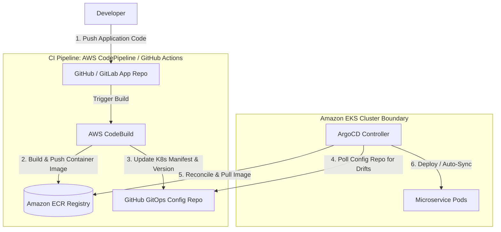

# CI/CD & GitOps Patterns on AWS

Modern application deployment relies on highly automated pipelines to build, test, and release code. AWS provides native CI/CD developer tools, while supporting GitOps patterns like ArgoCD on Kubernetes (EKS).

---

## 🆚 Traditional CI/CD vs. GitOps

Understanding the paradigm shift between push-based pipelines and pull-based GitOps is a core requirement for modern cloud architects.

| Feature | Push-based CI/CD (AWS CodePipeline) | Pull-based GitOps (ArgoCD on EKS) |
| :--- | :--- | :--- |
| **Model** | Push. Pipeline triggers script pushing to environment. | Pull. Controller monitors Git and pulls config. |
| **Access Rights**| Requires cluster access credentials stored in CI tools. | No cluster credentials exposed outside the EKS cluster. |
| **Drift Detection**| Poor. If resources change in console, pipeline is unaware. | Excellent. Controller automatically reverts manual drifts. |
| **Configuration**| Pipeline scripts (YAML/Bash). | Declarative K8s manifests stored in Git. |

---

## 🏗️ GitOps (ArgoCD) on EKS Reference Architecture

The diagram below outlines a classic enterprise GitOps pipeline. Developers push code, triggering an automated CI process that pushes container images to ECR. ArgoCD, running inside EKS, continuously polls Git and synchronizes target environments.

---

## Core CI/CD & Infrastructure Services

### 1. AWS Developer Tools Suite
*   **AWS CodeCommit**: Managed, secure git hosting service (Note: AWS now recommends using GitHub/GitLab integration).
*   **AWS CodeBuild**: Serverless build service compiling code, running tests, and generating container images.
*   **AWS CodeDeploy**: Automates application deployments to EC2, Fargate, ECS, or Lambda, supporting Blue/Green rollouts.
*   **AWS CodePipeline**: Fully managed continuous delivery pipeline service, orchestrating build, test, and deploy stages.

### 2. AWS CDK (Cloud Development Kit) & CDK Pipelines
*   Allows defining cloud infrastructure using standard programming languages (TypeScript, Python, Java).
*   **CDK Pipelines**: A CDK construct that automates building, self-updating, and deploying CDK applications across multiple accounts and stages.

---

## Common Pitfalls in CI/CD Architectures
*   **Hardcoding Secrets in Pipelines**: Storing cleartext database passwords or AWS keys inside repository config files or build scripts. (Mitigation: Reference variables from **AWS Secrets Manager** at build time).
*   **Storing EKS/ECS Credentials Globally**: Storing admin EKS access keys inside a third-party CI tool. (Mitigation: Use IAM Identity Providers and OpenID Connect to securely exchange temporary credentials without storing secrets).
*   **Skipping Automated Rollbacks**: Configuring pipelines that deploy code and require manual intervention when errors spike. Configure CloudWatch Alarms to trigger automatic rollbacks.

---

## SA Interview Questions on CI/CD & GitOps

### Question 1: How does a GitOps pull-based model improve EKS cluster security?
**Answer**: 
*   In a **traditional push model**, your CI tool (e.g., Jenkins, GitLab CI) requires administrative credentials to connect to your EKS cluster to run deployment commands. If your CI tool is compromised, attackers gain complete control of your production EKS cluster.
*   In a **GitOps pull model (like ArgoCD)**, deployment credentials never leave the cluster. The ArgoCD agent runs entirely inside EKS, fetching target states from Git privately and applying changes locally. Your external CI tool only needs basic permissions to push container images to Amazon ECR.

### Question 2: What is a Self-Mutating Pipeline in AWS CDK?
**Answer**: 
In AWS CDK, a **CDK Pipeline** is "self-mutating". This means that if you modify your infrastructure code (e.g., add a new S3 bucket or define a new Lambda endpoint in TypeScript), you do not need to run a manual build script to rebuild your pipeline. 
When you commit the code changes to Git, the pipeline executes a build stage that updates its own CloudFormation template automatically in response to the newly defined constructs.

### Question 3: How do you design a CI/CD pipeline that safely deploys microservices across multiple AWS accounts (Dev, Staging, Prod)?
**Answer**: 
1.  Establish a central **Shared Services Account** containing the core CI/CD pipeline (AWS CodePipeline).
2.  Configure **cross-account IAM Roles**. The central pipeline assumes a specific target deployer role inside the Dev, Staging, or Prod accounts.
3.  Store build artifacts in a central S3 bucket configured with a Customer Managed Key (CMK) in KMS. The target deployment accounts must receive decrypt permissions on that KMS key.
4.  Configure the pipeline with a manual approval stage between the Staging and Production deployment actions.
5.  Use **AWS CDK Pipelines** to define this multi-stage deployment structure as code.

### Question 4: What is the core difference between a traditional CI/CD pipeline and a GitOps model when deploying containerized applications to EKS?
**Answer**: 
GitOps does not fully replace CI/CD; rather, it modernizes the **CD (Continuous Delivery/Deployment)** phase, while the **CI (Continuous Integration)** phase remains unchanged. 

The differences lie in the architecture and security model:
*   **Traditional Push-Based CI/CD**:
    *   *How it works*: Developers push code/manifests to Git, triggering the CI/CD pipeline (e.g., Jenkins or GitLab CI). The pipeline builds the container image and runs tests (CI). It then directly executes command-line scripts (e.g., `kubectl apply`) to **push** the updated Kubernetes manifests to the EKS cluster API.
    *   *Security Risks*: The external CI tool requires administrative credentials to access the Kubernetes cluster. If the CI tool is compromised, the cluster is exposed.
*   **GitOps Pull-Based Model (e.g., ArgoCD)**:
    *   *How it works*: The CI pipeline still runs to build and push container images to Amazon ECR (CI). However, instead of pushing manifests to the cluster, the pipeline updates EKS deployment manifests in a Git configuration repository. A GitOps controller (like **ArgoCD**) running *inside* the EKS cluster continuously **pulls** (polls) the Git configuration repository. When it detects a change, it reconciles the cluster to synchronize the running state with the desired state defined in Git.
    *   *Security Benefits*: Cluster credentials never leave EKS. No external system is granted network or admin access to the cluster, significantly reducing the blast radius of CI tooling compromises.

