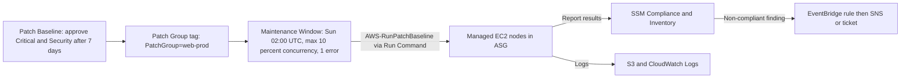
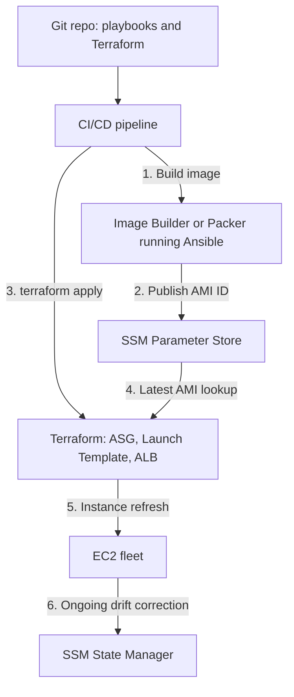

# Configuration Management with Ansible & AWS Systems Manager

Provisioning creates infrastructure; **configuration management** makes what runs on it correct and keeps it that way: packages, users, config files, services, patches, and compliance. This guide covers core concepts, Ansible, a Puppet/Chef comparison, AWS Systems Manager (SSM), and how to divide work between Ansible and Terraform. For provisioning and state, see [terraform.md](./terraform.md); for the Linux and EC2 background, see [linux-and-virtualization-on-ec2.md](./linux-and-virtualization-on-ec2.md).

---

## 🧭 Core Concepts

*   **Idempotency**: Running the same operation repeatedly yields the same end state with no extra side effects. `state: present` for a package is idempotent; `echo "line" >> file` is not. Idempotency is what makes re-runs and drift correction safe.
*   **Declarative vs Imperative**: *Declarative* describes the desired end state (Ansible modules, Puppet, Terraform); the tool figures out the steps. *Imperative* lists the steps (shell scripts, `command:` tasks). Prefer modules over raw shell so the tool can detect "already done".
*   **Push vs Pull**: *Push* (Ansible, SSM Run Command) has a controller connect out to nodes on demand. *Pull* (Puppet agent, Chef client, SSM State Manager association) has nodes periodically fetch and apply desired state, which scales well and corrects drift automatically.
*   **Mutable vs Immutable Infrastructure**: *Mutable* servers are patched and reconfigured in place, which is flexible but accumulates snapshot drift ("pets"). *Immutable* infrastructure bakes a new AMI/container image and replaces instances ("cattle"), giving reproducibility and easy rollback. In practice: use config management to **build** golden images (immutable) and to manage the residual long-lived hosts (mutable).

| Dimension | Mutable (in-place) | Immutable (replace) |
|-----------|-------------------|---------------------|
| Change method | Ansible/SSM patch running hosts | New AMI via Image Builder/Packer, ASG refresh |
| Drift risk | High | Very low |
| Rollback | Reverse the change (hard) | Redeploy prior AMI (easy) |
| Speed of a small change | Fast | Slower (rebuild) |
| Best for | Stateful legacy hosts, urgent patches | Stateless web/app tiers |

---

## 🅰️ Ansible

Ansible is **agentless**: a control node connects over SSH (or SSM) and runs idempotent modules written in YAML.

### Building Blocks
*   **Inventory**: hosts and groups (static INI/YAML or dynamic).
*   **Playbook**: ordered plays mapping host groups to tasks.
*   **Role**: reusable unit (`tasks/`, `handlers/`, `templates/`, `defaults/`, `vars/`) shared via Git or Ansible Galaxy.
*   **Handlers**: run only when notified by a changed task.
*   **Vault**: encrypts secrets in the repo (`ansible-vault encrypt_string`).

### Dynamic AWS Inventory
Static host lists rot in autoscaled environments. The `amazon.aws.aws_ec2` inventory plugin queries EC2 and groups hosts by tags:

```yaml
# inventory/aws_ec2.yml
plugin: amazon.aws.aws_ec2
regions:
  - us-east-1
filters:
  tag:Env: prod
  instance-state-name: running
keyed_groups:
  - key: tags.Role
    prefix: role
hostnames:
  - instance-id          # pair with the SSM connection plugin, no public IPs needed
compose:
  ansible_connection: '"community.aws.aws_ssm"'
```

Verify with `ansible-inventory -i inventory/aws_ec2.yml --graph`. Using the `aws_ssm` connection plugin means **no SSH keys and no port 22**; it requires an S3 bucket for file transfer and the instance role to reach it.

### Example Playbook and Role
```yaml
# site.yml
- name: Configure web tier
  hosts: role_web
  become: true
  roles: [hardening, nginx]

# roles/nginx/tasks/main.yml
- name: Install nginx
  ansible.builtin.dnf: { name: nginx, state: present }
- name: Render site config
  ansible.builtin.template:
    src: site.conf.j2
    dest: /etc/nginx/conf.d/site.conf
    mode: "0644"
    validate: nginx -t -c /etc/nginx/nginx.conf
  notify: Reload nginx          # handler runs only if the file changed
- name: Ensure nginx runs at boot
  ansible.builtin.systemd: { name: nginx, state: started, enabled: true }
```

### Secrets: Vault and AWS Lookups
`ansible-vault encrypt_string 's3cr3t' --name db_password` encrypts values for `group_vars`. Better on AWS: keep secrets out of Ansible and look them up at run time so the controller's IAM role is the only credential:

```yaml
db_password: "{{ lookup('amazon.aws.ssm_parameter', '/app/prod/db_password', decrypt=true) }}"
```

---

## 🔁 Puppet & Chef vs Ansible

| Aspect | Ansible | Puppet | Chef |
|--------|---------|--------|------|
| Model | Push (agentless, SSH/SSM) | Pull (agent + server) | Pull (client + server), also `chef-solo` |
| Language | YAML + Jinja2 | Puppet DSL (declarative) | Ruby DSL (recipes/cookbooks) |
| Agent required | No | Yes | Yes |
| Learning curve | Low | Medium | Higher (Ruby) |
| AWS angle | Dynamic inventory, SSM connection | Legacy fleets, on-prem mixes | AWS OpsWorks (retired May 2024) |

Interview note: AWS OpsWorks was retired, and AWS steers customers toward **Systems Manager** and **immutable AMI pipelines**.

---

## ☁️ AWS Systems Manager (SSM)

SSM is the AWS-native operations plane for EC2 and hybrid servers. Managed nodes need the SSM Agent, an instance profile with `AmazonSSMManagedInstanceCore`, and a path to SSM endpoints (internet/NAT or VPC endpoints).

| Capability | What it does | Model |
|-----------|--------------|-------|
| **Run Command** | Execute scripts/documents across targets by tag, with rate control and output to S3/CloudWatch | Push, ad hoc |
| **State Manager** | **Associations** continually enforce a document (e.g., install agent, apply Ansible playbook) on a schedule | Pull, drift correction |
| **Patch Manager** | Patch baselines, patch groups, maintenance windows, compliance reporting | Scheduled push/scan |
| **Parameter Store** | Hierarchical config and SecureString secrets (KMS), versioned, IAM path-scoped | Config source |
| **Session Manager** | Keyless shell access, audited | Access |

### Fleet Patching Flow



### State Manager Association with Terraform
Use State Manager to enforce Ansible on a schedule using the AWS-managed `AWS-ApplyAnsiblePlaybooks` document:

```hcl
resource "aws_ssm_association" "baseline" {
  name                = "AWS-ApplyAnsiblePlaybooks"
  schedule_expression = "rate(30 minutes)"

  targets {
    key    = "tag:Role"
    values = ["web"]
  }

  parameters = {
    SourceType   = "S3"
    SourceInfo   = jsonencode({ path = "https://s3.amazonaws.com/acme-playbooks/site.zip" })
    PlaybookFile = "site.yml"
    Check        = "False"
  }
}
```

### Parameter Store vs Secrets Manager
Parameter Store (free standard tier) suits configuration and low-churn secrets; **Secrets Manager** adds built-in rotation (e.g., RDS) at a per-secret cost.

### Least-Privilege IAM for a Config-Management Controller
A controller using dynamic inventory and Run Command needs read-only discovery and scoped execution, not admin:

```json
{
  "Version": "2012-10-17",
  "Statement": [
    {
      "Effect": "Allow",
      "Action": ["ec2:DescribeInstances", "ec2:DescribeTags"],
      "Resource": "*"
    },
    {
      "Effect": "Allow",
      "Action": "ssm:SendCommand",
      "Resource": "arn:aws:ssm:us-east-1::document/AWS-RunPatchBaseline"
    },
    {
      "Effect": "Allow",
      "Action": "ssm:SendCommand",
      "Resource": "arn:aws:ec2:us-east-1:111122223333:instance/*",
      "Condition": { "StringEquals": { "ssm:resourceTag/Env": "prod" } }
    },
    {
      "Effect": "Allow",
      "Action": "ssm:GetParameter",
      "Resource": "arn:aws:ssm:us-east-1:111122223333:parameter/app/prod/*"
    },
    {
      "Effect": "Allow",
      "Action": "kms:Decrypt",
      "Resource": "arn:aws:kms:us-east-1:111122223333:key/11111111-2222-3333-4444-555555555555"
    }
  ]
}
```

---

## ⚖️ Ansible vs Terraform: Division of Labor

| Concern | Terraform | Ansible |
|---------|-----------|---------|
| Primary job | Provision cloud resources (VPC, ASG, RDS, IAM) | Configure what runs inside hosts (packages, files, services) |
| State | Yes, explicit state file with locking | Stateless; checks live host each run |
| Strength | Dependency graph, plan/apply, drift detection on resources | Ordered procedural tasks, orchestration, rolling updates |
| Weakness | Poor at in-guest configuration | Weak resource lifecycle/dependency tracking |

**Recommended pattern**: Terraform creates the network, launch template, ASG, and IAM. **Packer or EC2 Image Builder** (running Ansible as the provisioner) produces the golden AMI, and Terraform references the AMI ID from Parameter Store. Ansible/SSM State Manager handles residual runtime configuration and one-off orchestration. Avoid Terraform `remote-exec` provisioners for real configuration; they are not idempotent.



---

## ⚠️ Common Pitfalls

*   **Shell/command tasks without `creates:`/`changed_when`**: they always report changed and are not idempotent. Prefer real modules.
*   **Plaintext secrets in `group_vars`**: use Vault at minimum; prefer Parameter Store lookups.
*   **Patching all nodes at once**: use Maintenance Window concurrency and error thresholds.
*   **Overly broad `ssm:SendCommand`**: it is effectively root; scope by document and tag.

---

## SA Interview Questions on Configuration Management

### Question 1: What is idempotency and why does it matter for configuration management?
**Answer**: An idempotent operation yields the same end state however many times it runs, so retries and scheduled re-runs for drift correction are safe. Ansible modules (`dnf`, `template`, `systemd`) check current state and report `changed` only when they act; raw shell commands are not idempotent unless guarded.

### Question 2: When would you choose immutable infrastructure over patching in place?
**Answer**: For stateless tiers behind an ALB/ASG: build a patched AMI through Image Builder, then roll it with an ASG instance refresh. Benefits are no snapshot drift, tested artifacts, simple rollback (previous AMI), and consistent scale-out. Keep mutable patching (Patch Manager) for stateful or hard-to-replace hosts and for emergency out-of-band fixes, followed by baking the fix into the next image.

### Question 3: Compare Ansible's push model to SSM State Manager's pull model.
**Answer**: Ansible push runs when a controller triggers it, so drift persists until the next run. State Manager associations reapply on a schedule from the node side and report compliance, with no always-on controller. Combine them: an association running `AWS-ApplyAnsiblePlaybooks` gives Ansible's expressiveness with SSM scheduling, targeting, and reporting.

### Question 4: How do you run Ansible against EC2 instances in private subnets with no SSH?
**Answer**: Use the `aws_ec2` dynamic inventory with the `community.aws.aws_ssm` connection plugin. Instances need the SSM Agent and `AmazonSSMManagedInstanceCore`; private subnets need interface endpoints for `ssm`, `ssmmessages`, and `ec2messages` (plus an S3 gateway endpoint for file transfer). There are no keys or open ports, IAM controls who can run playbooks, and CloudTrail records the activity.

### Question 5: Where do you draw the line between Terraform and Ansible?
**Answer**: Terraform owns cloud resource lifecycle and dependencies with state and plans; Ansible owns in-guest configuration and procedural orchestration. Ansible runs inside Image Builder/Packer to produce the AMI, Terraform deploys it, and neither manages the other's domain.

### Question 6: How would you patch 500 production instances safely with minimal downtime?
**Answer**: Tag instances into patch groups by tier/AZ, define a baseline (auto-approve security patches after N days), and run `AWS-RunPatchBaseline` in a **Maintenance Window** with low concurrency (e.g., 10%) and an error threshold that halts on failure. Patch a canary group first behind ALB health checks and alert on SSM Compliance via EventBridge. For ASG tiers, bake patched AMIs and run an instance refresh instead.
