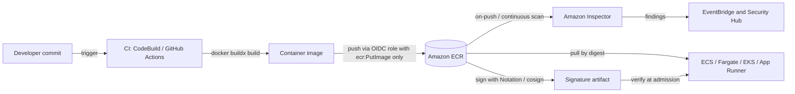

# Containers, Docker & Amazon ECR

Containers package an application and its dependencies into a portable, isolated unit that shares the host kernel. This guide covers Docker and OCI fundamentals and maps them to AWS: Amazon ECR for registries, and ECS, Fargate, and App Runner for running containers. For orchestrator selection (ECS vs. EKS) and deployment strategies, see [Microservices on ECS vs. EKS](microservices-on-eks-ecs.md); for Kubernetes internals, see [Kubernetes on EKS](kubernetes-on-eks.md); for pipelines, see [CI/CD & GitOps](cicd-and-gitops.md).

---

## 🧬 How Containers Work

A container is a normal Linux process with restricted visibility and resources. It is not a lightweight VM: there is no guest kernel.

| Kernel Feature | Role | Example |
| :--- | :--- | :--- |
| **Namespaces** | Isolate what a process can *see*. | `pid` (own process tree), `net` (own interfaces), `mnt` (own filesystem view), `uts`, `ipc`, `user`. |
| **cgroups** | Limit what a process can *use*. | CPU shares/quota, memory limit (exceeding it triggers the OOM killer), I/O, PIDs. |
| **Union filesystem (overlayfs)** | Stack read-only image layers with one writable layer. | Copy-on-write for changed files. |
| **Capabilities / seccomp / LSMs** | Restrict privileged syscalls. | Drop `ALL` capabilities, add back only what is needed. |

| Aspect | Virtual Machine | Container |
| :--- | :--- | :--- |
| **Isolation** | Hardware-level (hypervisor, own kernel). | Process-level (shared kernel). |
| **Startup** | Minutes. | Seconds or less. |
| **Security boundary** | Stronger. | Weaker. Fargate and Firecracker add a per-task microVM boundary. |

The **OCI** (Open Container Initiative) standards define the image and runtime formats, so images built with Docker run on containerd or CRI-O (used by EKS nodes and ECS agents).

---

## 🧱 Image Layers and Multi-Stage Builds

Each Dockerfile instruction that changes the filesystem (`RUN`, `COPY`, `ADD`) creates an immutable, content-addressed layer. Layers are cached and shared between images, and only missing layers are pulled or pushed.

*   **Cache ordering**: put rarely changing steps (dependencies) before frequently changing ones (source).
*   **Deletions do not shrink images**: clean up in the same `RUN` that created the files.
*   **Tags are mutable, digests are not**: reference `image@sha256:...` in production for reproducibility.

### Multi-Stage Build Example

```dockerfile
# Stage 1: build with full toolchain
FROM public.ecr.aws/docker/library/golang:1.23 AS build
WORKDIR /src
COPY go.mod go.sum ./
RUN go mod download
COPY . .
RUN CGO_ENABLED=0 go build -trimpath -o /out/app ./cmd/app

# Stage 2: minimal runtime, no shell, no package manager
FROM gcr.io/distroless/static-debian12:nonroot
COPY --from=build /out/app /app
USER nonroot:nonroot
EXPOSE 8080
ENTRYPOINT ["/app"]
```

The final image contains only the binary, often shrinking from about 1 GB to under 20 MB. Smaller images pull faster, cost less, and expose less attack surface.

---

## ✅ Dockerfile Best Practices

*   **Pin base images** by version or digest; never use `latest`. Pull base images from `public.ecr.aws` or an ECR pull-through cache to avoid Docker Hub rate limits.
*   **Use minimal bases**: distroless, Alpine, or AL2023 minimal.
*   **Run as a non-root user** (`USER 10001`) and make the root filesystem read-only at runtime.
*   **Never bake secrets into layers** (`ENV`, `COPY .env`, build args). They persist in image history. Inject at runtime from Secrets Manager or SSM Parameter Store, or use BuildKit `--mount=type=secret` at build time.
*   **One process per container** with `ENTRYPOINT` in exec form so the app receives SIGTERM for graceful shutdown.
*   **Build multi-arch** (`docker buildx build --platform linux/arm64,linux/amd64`) to run on cheaper Graviton.

---

## 🔒 Supply Chain Security: Scanning and Signing



*   **Amazon ECR scanning**: *Basic* scans on push using the open-source Clair-based scanner. *Enhanced* uses **Amazon Inspector** for continuous OS and language-package scanning, re-scanning when new CVEs are published. Route findings via EventBridge to Security Hub or block promotion in the pipeline.
*   **Signing**: **AWS Signer** with the **Notation** CLI (Notary v2), or **Sigstore cosign**, attaches signatures to the image in ECR. On EKS, enforce with an admission controller (Kyverno, OPA Gatekeeper, or Ratify) so only signed images from trusted registries run.

---

## 📦 Amazon ECR (Registry)

| Feature | Details |
| :--- | :--- |
| **Private repositories** | IAM and repository-policy controlled. Encrypted at rest (AES-256 or KMS). |
| **Lifecycle policies** | Expire untagged or old images by age or count to control storage cost. |
| **Replication** | Cross-Region and cross-account, for DR and lower pull latency. |
| **Pull-through cache** | Caches upstream registries (Docker Hub, Quay, GitHub, ECR Public) into your private ECR. |
| **Immutable tags** | Rejects pushes that reuse an existing tag. |
| **Networking** | Use VPC endpoints: `ecr.api`, `ecr.dkr` (interface) plus the S3 gateway endpoint, because image layers are stored in S3. Required for private subnets without NAT. |

### Least-Privilege Access

CI push role scoped to a single repository:

```json
{
  "Version": "2012-10-17",
  "Statement": [
    { "Effect": "Allow", "Action": "ecr:GetAuthorizationToken", "Resource": "*" },
    { "Effect": "Allow",
      "Action": ["ecr:BatchCheckLayerAvailability", "ecr:InitiateLayerUpload",
                 "ecr:UploadLayerPart", "ecr:CompleteLayerUpload", "ecr:PutImage"],
      "Resource": "arn:aws:ecr:us-east-1:111122223333:repository/orders" }
  ]
}
```

Runtime pull roles only need `ecr:GetAuthorizationToken` plus `ecr:BatchGetImage`, `ecr:GetDownloadUrlForLayer` on the specific repository. Cross-account pulls use a repository policy naming the consuming account's role.

---

## 🚢 Running Containers on AWS

| Service | Model | Best For | Trade-offs |
| :--- | :--- | :--- | :--- |
| **ECS on Fargate** | Serverless tasks, no nodes to manage. | Most web services and batch jobs. | Less hardware control; per-vCPU/GB pricing; no privileged containers or GPUs. |
| **ECS on EC2** | You manage the container instances. | GPUs, custom AMIs, high steady utilization, Spot and Savings Plans. | Patching and capacity management. |
| **EKS** | Managed Kubernetes. | Portability, K8s ecosystem, complex platforms. | Highest complexity. See [Kubernetes on EKS](kubernetes-on-eks.md). |
| **App Runner** | Fully managed from an ECR image or source repo. Built-in HTTPS, autoscaling, and load balancing. | Simple web apps and APIs; small teams. | Limited networking and tuning; VPC connector needed for private resources. |

### ECS Building Blocks
*   **Task definition**: the blueprint (images, CPU/memory, ports, logging, roles). A **task** is a running instance; a **service** keeps N tasks running behind an ALB and handles deployments.
*   **Two IAM roles**: the **task execution role** is used by the ECS agent to pull from ECR, fetch secrets, and write logs; the **task role** is what your application code assumes. Keep them separate and scope each narrowly.
*   **Networking**: use `awsvpc` mode so each task gets its own ENI and security group. Run tasks in private subnets behind an ALB.
*   **Scaling**: Application Auto Scaling target tracking on CPU, memory, or ALB request count per target.

### Fargate Notes
Fargate runs each task in its own Firecracker microVM, with 20 GiB ephemeral storage by default and optional EFS mounts. **Fargate Spot** discounts interruptible tasks; ARM64 lowers cost.

---

## Common Pitfalls
*   **Using `latest` tags** so deployments are not reproducible and rollbacks are ambiguous.
*   **Secrets in image layers or plain environment variables** in task definitions. Use `secrets` references to Secrets Manager or SSM.
*   **Missing ECR VPC endpoints** in private subnets, causing tasks to hang in `PROVISIONING` or fail with image pull errors.
*   **Confusing the execution role with the task role**, causing pull failures or over-privileged app code.

---

## SA Interview Questions on Containers & ECR

### Question 1: How do containers differ from virtual machines, and what makes isolation work?
**Answer**: Containers share the host kernel and are isolated using **namespaces** (what a process sees: PIDs, network, mounts) and **cgroups** (how much CPU, memory, and I/O it can use). VMs virtualize hardware and run their own kernel, giving stronger isolation at the cost of size and startup time. For untrusted multi-tenant workloads, AWS uses Firecracker microVMs (Fargate, Lambda) to combine container ergonomics with VM-level isolation.

### Question 2: How would you reduce a 1 GB image and speed up deployments?
**Answer**: Use a multi-stage build so compilers and build tools stay out of the runtime image, switch to a distroless or slim base, order Dockerfile steps for layer caching, clean package caches in the same `RUN`, and add a `.dockerignore`. Smaller images pull faster on scale-out and reduce the attack surface and ECR storage cost.

### Question 3: How do you secure the container image supply chain on AWS?
**Answer**: Build from pinned, minimal base images pulled through an ECR pull-through cache. Enable ECR enhanced scanning with Amazon Inspector for continuous CVE detection, and gate promotion on findings. Enable immutable tags, sign images with AWS Signer/Notation or cosign, and enforce signature verification at deploy time (an admission controller on EKS). Push from CI using a short-lived OIDC role limited to one repository.

### Question 4: Tasks in private subnets cannot pull images from ECR. What is wrong?
**Answer**: Without a NAT gateway, the subnets need VPC endpoints for `ecr.api` and `ecr.dkr`, an S3 **gateway** endpoint (layers are stored in S3), and a CloudWatch Logs endpoint if using `awslogs`. Also verify the security group allows HTTPS to the endpoints, the endpoint policy permits the repository, and the task execution role has ECR pull permissions.

### Question 5: Explain the ECS task role versus the task execution role.
**Answer**: The **execution role** is assumed by the ECS agent or Fargate to set up the task: pull the image from ECR, retrieve secrets referenced in the task definition, and send logs. The **task role** is assumed by your application code to call AWS APIs (for example S3 or DynamoDB). Splitting them enforces least privilege because the application never receives image-pull or secret-injection permissions.

### Question 6: When would you choose App Runner, Fargate, or EKS?
**Answer**: **App Runner** for a simple HTTP service where the team wants zero infrastructure decisions. **ECS on Fargate** for most containerized microservices needing VPC integration, sidecars, and flexible scaling with low operational overhead. **EKS** when you need Kubernetes APIs, portability, or its ecosystem (operators, service mesh, GitOps), accepting higher complexity. Choose EC2-backed capacity when you need GPUs, custom kernels, or the lowest cost at steady high utilization.

### Question 7: How do you deploy a new image version with zero downtime on ECS?
**Answer**: Update the service to a new task definition revision that references an immutable tag or digest. ECS performs a rolling update (`minimumHealthyPercent`, `maximumPercent`) behind the ALB, only routing traffic to tasks that pass health checks, and the deployment circuit breaker rolls back automatically on failure. For blue/green or canary traffic shifting, use CodeDeploy as described in [Microservices on ECS vs. EKS](microservices-on-eks-ecs.md).
