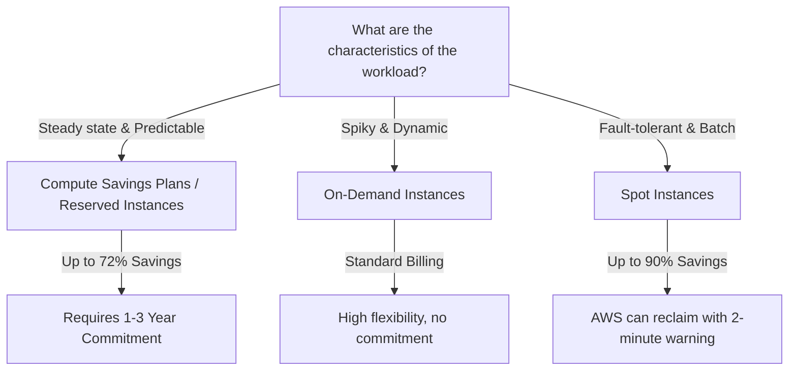

# Cost Optimization Patterns on AWS

Cost Optimization is the financial management pillar of the AWS Well-Architected Framework. It encourages architects to build systems that deliver maximum performance at the lowest possible cost, avoiding idle resources and optimizing billing.

---

## 🏛️ Cost Optimization Pillars

1.  **Right-Sizing**: Ensure instance types and storage volumes match active utilization metrics. Avoid over-provisioning.
2.  **Increase Elasticity**: Leverage auto-scaling to match resource counts directly to actual load variations. Turn resources off when not in use.
3.  **Pricing Models**: Combine On-Demand, Spot, and Savings Plans/Reserved Instances appropriately depending on task characteristics.
4.  **Storage Tiering**: Align storage costs to access frequency (moving static raw files to cold archiving classes over time).

---

## 📊 EC2 Purchase Models Decided by Workload Characteristics

---

## 📦 S3 Storage Class Tiering Matrix

Amazon S3 offers multiple storage classes designed for different access frequencies. Using **S3 Lifecycle Policies** to transition objects down these classes automatically can result in significant cost savings.

| S3 Storage Class | Minimum Storage Duration | Retrieval Fee | Best Use Case |
| :--- | :--- | :--- | :--- |
| **S3 Standard** | None | Free | Active, frequently accessed files. |
| **S3 Standard-IA** | 30 Days | Per GB | Infrequently accessed files that must be available instantly. |
| **S3 One Zone-IA**| 30 Days | Per GB | Non-critical, easily replaceable backup datasets. |
| **S3 Glacier Instant**| 90 Days | Per GB | Archived files requiring millisecond access speeds. |
| **S3 Glacier Flexible**| 90 Days | Per GB | Archival backups with retrieval times ranging from minutes to hours. |
| **S3 Glacier Deep Archive**| 180 Days | Per GB | Long-term compliance backups (retrieval within 12 hours). |

---

## Key AWS Cost Management Services

### 1. AWS Cost Explorer
Allows visualizing, understanding, and managing your AWS cost and usage over time. You can group costs by service, member account, tag, and region.

### 2. AWS Compute Optimizer
Uses machine learning to analyze historical utilization metrics. Recommends optimal AWS resources (EC2, ECS, EBS, Lambda) to improve performance and lower costs.

### 3. AWS Trusted Advisor
Automatically inspects your AWS environment and recommends cost-reduction adjustments (e.g., identifies idle EC2 instances, underutilized EBS volumes, and unassociated Elastic IP addresses).

---

## Common Pitfalls in Cost Management
*   **Leaving Orphaned EBS Volumes**: When an EC2 instance is terminated, associated EBS volumes can remain active, accruing storage fees silently. (Mitigation: Check the "Delete on Termination" checkbox or write clean-up automation).
*   **Overusing NAT Gateways**: NAT Gateways are billed hourly plus a per-GB data processing fee. Accessing massive datasets on S3 privately via NAT Gateways can result in high bills. (Mitigation: Deploy **S3 Gateway VPC Endpoints**, which are free).
*   **Neglecting DynamoDB TTL policies**: Storing historical logs or transient session states permanently in DynamoDB tables, increasing storage costs unnecessarily.

---

## SA Interview Questions on Cost Optimization

### Question 1: How do you design a cost-effective multi-AZ architecture for EC2 instances?
**Answer**: 
1.  Utilize **AWS Compute Optimizer** to right-size EC2 instance sizes before setting up target clusters.
2.  Configure **Auto Scaling Groups** to scale up and down dynamically based on custom CPU/Memory utilization thresholds.
3.  Deploy a combination of **Savings Plans** for the baseline compute layer, and **Spot Instances** within the Auto Scaling group to handle dynamic, fault-tolerant scaling.
4.  Replace NAT Gateways with free **VPC Endpoints** to bypass data processing charges for AWS native services.

### Question 2: What is the difference between Amazon S3 Intelligent-Tiering and standard S3 Lifecycle Policies?
**Answer**: 
*   **S3 Lifecycle Policies** are static, rule-based transitions based on object age (e.g., transition objects to Glacier 30 days after creation). This works well when data access patterns are predictable over time.
*   **S3 Intelligent-Tiering** is dynamic and uses machine learning to monitor access patterns. It automatically moves objects between access tiers based on actual utilization without operational overhead or retrieval fees. Choose Intelligent-Tiering when data access patterns are unpredictable or highly variable.

### Question 3: How do Spot Instances work, and how do you handle their sudden interruption in production?
**Answer**: 
Spot Instances are spare EC2 capacity offered at up to a 90% discount. However, if AWS requires that capacity back for On-Demand users, they will reclaim the instance after issuing a **2-minute warning notification**.
To mitigate interruptions in production:
1.  Use Spot Instances strictly for fault-tolerant, stateless, or batch processing workloads (e.g., containerized ECS tasks, EMR worker nodes).
2.  Create **Spot Instance Pools** across multiple instance families (e.g., combining m5.large, c5.large, and r5.large) to increase capacity availability.
3.  Intercept the **Spot Instance Interruption Notice** via Amazon EventBridge to initiate graceful application shutdowns and checkpoint active state progress before termination.

### Question 4: How do you optimize costs when designing a conversational RAG application with high user traffic?
**Answer**: 
1.  **Semantic Caching Layer**: Deploy a semantic caching layer (e.g., **Redis** using LangChain or GPTCache) in front of your LLM agents. By evaluating the underlying intent of incoming queries, semantically equivalent requests (e.g., "How do I reset my password?" vs. "I forgot my password, what do I do?") are served directly from the cache, bypassing agent execution and reducing LLM tokens.
2.  **Prompt Caching**: Enable model-native prompt caching (supported by Amazon Bedrock for Claude models). This caches long-term system prompts, tool schemas, and document contexts, reducing input token costs by up to 90% for subsequent turns within a session.
3.  **Bedrock Guardrails at Ingestion**: Position guardrails at the entry API layer to filter out malicious, toxic, or irrelevant queries before they reach the model. This avoids wasting computation resources and incurring unnecessary token fees on invalid inputs.
4.  **Active RAG Document Cleanup**: Periodically prune duplicate, obsolete, or outdated files from the retrieval pipeline. This minimizes vector database storage fees and prevents the retrieval of bloated, stale context blocks that inflate LLM prompt tokens and increase query latency.

### Question 5: What is Model Distillation, and how does it reduce Generative AI costs in production?
**Answer**: 
Model Distillation is an optimization technique where a larger, high-performing "teacher" model (e.g., Claude 3.5 Sonnet or Llama 3.3 70B) is used to generate high-quality outputs or labels for a domain-specific dataset. A much smaller, cheaper "student" model (e.g., Llama 3.2 1B or a local Small Language Model like Gemma) is then fine-tuned on this dataset.

Benefits include:
*   **Drastic Cost Reductions**: In production, the student model processes requests at **10x to 50x lower cost** than the teacher model.
*   **Performance and Speed**: Distilled student models run significantly faster, often running locally on edge devices or smartphones, while retaining **90%+ of the accuracy** of the larger model for that specific, distilled task.
*   **Amazon Bedrock Model Distillation**: AWS provides a fully managed distillation pipeline that automates training data synthesis and fine-tunes task-specific student models without managing complex custom training infrastructure.

### Question 6: How do you optimize database and model hosting infrastructure costs for enterprise search and agent pipelines?
**Answer**: 
1.  **Tiered Vector Database Selection**:
    *   *High-Performance*: Use **Amazon OpenSearch Serverless (AOSS)** with vector engine enabled, but monitor capacity closely since it incurs baseline compute fees even when idle.
    *   *Standard Workloads*: Reuse existing relational databases via extensions like **pgvector on Amazon Aurora PostgreSQL** to avoid managing a separate database engine.
    *   *Low-Cost/Batch*: Leverage **Amazon S3-based vector databases** (e.g., LanceDB storing index files on S3) to achieve maximum cost savings at the expense of slightly higher retrieval latency.
2.  **Scale Inference Endpoints to Zero**: For self-hosted open-source models deployed via SageMaker or EC2, configure auto-scaling policies to scale instances down to zero when idle, and utilize Spot Instances (such as G5/G6 families) in non-production environments to save up to 90%.
3.  **Task-Model Alignment**: Route low-complexity tasks (e.g., classification, basic summarization) to cheap models (e.g., Claude 3.5 Haiku) and reserve expensive models (e.g., Claude 3.5 Opus) exclusively for complex multi-step reasoning.
4.  **Batch Inference**: Use Bedrock Batch Inference for non-real-time tasks (like offline document summarization or daily reports) to receive a 50% discount compared to real-time API pricing.

