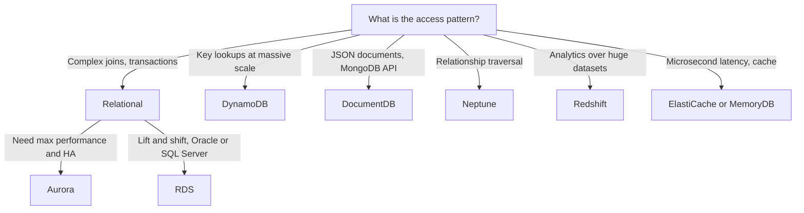

# Databases on AWS

Choosing the right database is one of the highest-leverage decisions in an AWS architecture. AWS follows a **purpose-built database** philosophy: pick the engine whose data model and access pattern match the workload rather than forcing everything into one relational store. This guide covers database fundamentals, the AWS managed offerings, and how to choose between them. For caching and DynamoDB usage in serverless stacks, see [Serverless Architecture](serverless-architecture.md); for DB failover and cross-region DR, see [High Availability and DR](high-availability-and-dr.md).

---

## 🧠 Database Fundamentals

### Relational vs. NoSQL vs. Document

| Model | Schema | Scaling | Strengths | AWS Services |
| :--- | :--- | :--- | :--- | :--- |
| **Relational (SQL)** | Fixed, enforced | Vertical + read replicas | Joins, transactions, ad-hoc queries | RDS, Aurora, Redshift |
| **Key-Value** | Flexible | Horizontal (partitioned) | Single-digit ms at any scale | DynamoDB, ElastiCache, MemoryDB |
| **Document** | Flexible JSON | Horizontal (sharded) | Nested data, evolving schemas | DocumentDB, DynamoDB |
| **Graph** | Nodes + edges | Vertical + read replicas | Multi-hop relationship queries | Neptune |
| **Columnar / OLAP** | Fixed | MPP cluster | Aggregations over billions of rows | Redshift |

### SQL Basics Worth Knowing Cold

*   **ACID**: **A**tomicity (all-or-nothing transaction), **C**onsistency (constraints always hold), **I**solation (concurrent transactions do not see each other's partial work), **D**urability (committed data survives a crash, via the write-ahead log).
*   **Indexes**: A B-tree index turns a full table scan (O(n)) into a lookup (O(log n)) at the cost of slower writes and more storage. Composite indexes follow leftmost-prefix order.
*   **Joins**: `INNER` (matching rows), `LEFT` (all left rows, NULLs when unmatched), `CROSS` (Cartesian product). Joins are cheap on indexed keys but expensive across shards, which is why NoSQL denormalizes.
*   **Normalization**: 1NF (atomic columns), 2NF (no partial key dependency), 3NF (no transitive dependency). Normalize OLTP schemas; denormalize deliberately for analytics or NoSQL.

### Transaction Isolation Levels

| Level | Dirty Read | Non-Repeatable Read | Phantom Read |
| :--- | :--- | :--- | :--- |
| **Read Committed** (PostgreSQL default) | Prevented | Possible | Possible |
| **Repeatable Read** (MySQL InnoDB default) | Prevented | Prevented | Possible (largely prevented in InnoDB via gap locks) |
| **Serializable** | Prevented | Prevented | Prevented |

Higher isolation means more locking and lower throughput.

### MongoDB Concepts (for DocumentDB context)

*   **Document**: A BSON/JSON record; **collection**: a group of documents (a table analog); documents in one collection need not share a schema.

---

## 🗺️ Engine Selection Flow



---

## 🗄️ RDS vs. Aurora

**Amazon RDS** is managed MySQL, PostgreSQL, MariaDB, Oracle, and SQL Server on EBS-backed instances. **Amazon Aurora** is a cloud-native MySQL/PostgreSQL-compatible engine that separates compute from a shared, distributed storage layer.

| Feature | RDS | Aurora |
| :--- | :--- | :--- |
| **Storage** | EBS volume per instance (up to 64 TiB) | Shared cluster volume, 6 copies across 3 AZs, auto-grows to 128 TiB (256 TiB on Aurora PostgreSQL 15.13 / 16.9 / 17.5+) |
| **Replicas** | Up to 15 read replicas on MySQL, MariaDB and PostgreSQL (async), separate storage | Up to 15 replicas sharing storage, typically under 100 ms lag |
| **Failover** | Multi-AZ standby, typically 60-120 s | Promote a replica, typically under 30 s |
| **Multi-AZ** | Synchronous standby (not readable); Multi-AZ DB cluster has 2 readable standbys | Built into storage layer |
| **Engines** | 6 engines | MySQL and PostgreSQL only |
| **Cost** | Lower baseline | About 20% higher per instance, often cheaper at scale |

### Key Aurora Features

*   **Aurora Global Database**: One primary region plus up to 10 read-only secondary regions, with storage-level replication (typically under 1 second lag). Gives cross-region reads and a **RPO of about 1 second and RTO under 1 minute** on regional failover.
*   **Aurora Serverless v2**: Scales in fine-grained **ACUs** (Aurora Capacity Units) in place, without dropping connections; can scale down to 0 ACU with auto-pause. Ideal for variable, unpredictable, or dev/test workloads.

### RDS Proxy

A managed connection pooler that sits between the app and RDS/Aurora. It multiplexes thousands of short-lived connections (a classic Lambda problem) onto a small pool, cuts failover time by up to 66%, and supports IAM authentication with credentials held in Secrets Manager.

```json
{
  "Effect": "Allow",
  "Action": "rds-db:connect",
  "Resource": "arn:aws:rds-db:us-east-1:111122223333:dbuser:prx-0123456789abcdef0/app_readonly"
}
```

Scope `rds-db:connect` to one proxy and DB user, never `*`.

---

## ⚡ Amazon DynamoDB

A fully managed, serverless key-value and document database with single-digit millisecond latency at any scale.

### Keys and Partitioning

*   **Partition key (PK)**: Hashed to choose the physical partition. High cardinality and even access are essential to avoid **hot partitions**.
*   **Sort key (SK)**: Optional; orders items within a partition and enables range queries (`begins_with`, `between`).
*   Each partition supports up to 3,000 RCU and 1,000 WCU; adaptive capacity helps hot keys but does not replace good key design.

### Secondary Indexes

| Feature | GSI (Global) | LSI (Local) |
| :--- | :--- | :--- |
| **Keys** | Different PK and SK | Same PK, different SK |
| **Created** | Any time | Only at table creation |
| **Consistency** | Eventually consistent only | Strong or eventual |
| **Capacity** | Own RCU/WCU | Shares table capacity |
| **Limit** | 20 per table (default) | 5 per table, 10 GB per partition key |

### Capacity Modes

| Mode | Billing | Best For |
| :--- | :--- | :--- |
| **On-Demand** | Per request | Unpredictable or spiky traffic, new tables |
| **Provisioned** (with auto scaling) | Per RCU/WCU-hour; Reserved Capacity discounts | Steady, predictable traffic (cheaper at high utilization) |

One RCU = one strongly consistent read of up to 4 KB per second (two eventually consistent); one WCU = one write of up to 1 KB per second.

### Single-Table Design

Store multiple entity types in **one table** using generic `PK`/`SK` attributes (for example `PK=CUSTOMER#42`, `SK=ORDER#2026-01-05#981`) so a single `Query` fetches a customer and their orders without joins. Design starts from the **access patterns**, not the entities.

### Acceleration and Change Capture

*   **DAX (DynamoDB Accelerator)**: In-memory write-through cache giving microsecond reads with an API-compatible client. It only helps eventually consistent reads and read-heavy, repetitive workloads.
*   **DynamoDB Streams**: Ordered, 24-hour log of item changes; drives Lambda triggers, materialized views, and cross-service sync. **Kinesis Data Streams for DynamoDB** offers longer retention and more consumers.
*   **Global Tables**: Multi-region, multi-active replication. The default is multi-Region *eventual* consistency (last-writer-wins). **Multi-Region strong consistency** (MRSC) gives strongly consistent reads in every Region, with an RPO of zero, at the cost of higher write latency; it needs three Regions (or two plus a witness).

---

## 🧰 Other Purpose-Built Databases

| Service | Model | Use When |
| :--- | :--- | :--- |
| **DocumentDB** | MongoDB-compatible document store on Aurora-style storage (6 copies, 3 AZs, up to 15 replicas) | Migrating MongoDB apps, JSON catalogs, content management |
| **ElastiCache (Redis OSS / Valkey / Memcached)** | In-memory cache | Session stores, leaderboards, query result caching, rate limiting |
| **MemoryDB** | Durable in-memory primary database with multi-AZ transaction log | Redis as the system of record with microsecond reads and single-digit ms writes |
| **Redshift** | Columnar MPP data warehouse; Spectrum queries S3 directly; Serverless option | BI, analytics, ETL targets |
| **Neptune** | Graph database (Gremlin, openCypher, SPARQL) | Fraud rings, recommendations, knowledge graphs |

---

## 📋 Engine Selection Decision Table

| Requirement | Recommended Service |
| :--- | :--- |
| Oracle or SQL Server OLTP | RDS |
| High-performance MySQL/PostgreSQL, fast failover, many replicas | Aurora |
| Unpredictable relational load, dev/test | Aurora Serverless v2 |
| Cross-region relational DR with RPO of about 1 s | Aurora Global Database |
| Serverless key-value at any scale, millisecond latency | DynamoDB |
| Microsecond reads on top of DynamoDB | DAX |
| MongoDB workloads | DocumentDB |
| Session cache, leaderboard | ElastiCache |
| Redis as durable primary store | MemoryDB |
| Petabyte-scale analytics and BI | Redshift |
| Highly connected data, multi-hop queries | Neptune |

---

## 💾 Backups and Point-in-Time Recovery

*   **Automated backups (RDS/Aurora)**: Daily snapshot plus transaction logs, retention 1-35 days. **PITR** restores to any second within the window, always into a **new** instance or cluster.
*   **Manual snapshots**: Persist until deleted; copy cross-region or share cross-account via a shared KMS key.
*   **DynamoDB**: PITR (continuous, 35 days) and on-demand backups; restores create a new table. **AWS Backup** centralizes policies across RDS, DynamoDB, EFS, and more (see [Storage on AWS](storage-on-aws.md)).

---

## 🚚 Migration with AWS DMS

**AWS Database Migration Service** replicates data from a source to a target with minimal downtime.

1.  **Schema Conversion**: Use the **AWS Schema Conversion Tool (SCT)** or DMS Schema Conversion for heterogeneous migrations (Oracle to PostgreSQL). Homogeneous moves (MySQL to Aurora MySQL) need no conversion.
2.  **Full load**: Bulk copy of existing data.
3.  **CDC (Change Data Capture)**: Ongoing replication of transaction-log changes keeps the target in sync until cutover.
4.  **Cutover**: Stop writes, let CDC drain, repoint the application.

Run DMS over a private path (VPN or Direct Connect) with least-privilege database users. See [Hybrid Cloud and Migration](hybrid-cloud-and-migration.md) for the broader migration strategy.

---

## SA Interview Questions on Databases

### Question 1: When would you choose Aurora over standard RDS?
**Answer**: Choose Aurora when you need higher throughput, up to 15 low-lag replicas, sub-30-second failover, or Global Database. Choose RDS for Oracle, SQL Server, or MariaDB, or the lowest baseline cost for small workloads.

### Question 2: How does a Lambda-heavy application avoid exhausting database connections?
**Answer**: Put **RDS Proxy** in front of the database to pool and multiplex connections, use IAM authentication, and initialize the connection outside the handler for reuse. DynamoDB is connectionless and avoids the problem entirely.

### Question 3: How do you design a DynamoDB table for a many-to-many access pattern?
**Answer**: Model from access patterns. Use an adjacency list in a single table (`PK=USER#1, SK=GROUP#7` and the inverse), and add a GSI that swaps PK and SK to query in the opposite direction. Use high-cardinality keys and write sharding (random suffix) for hot keys.

### Question 4: What is the difference between a GSI and an LSI, and when does it matter?
**Answer**: A GSI has its own partition and sort key, can be added at any time, and is eventually consistent with separate capacity. An LSI shares the partition key, must be defined at table creation, supports strong consistency, and caps a partition key's item collection at 10 GB. Prefer GSIs unless you need strongly consistent alternate sort orders.

### Question 5: Design cross-region DR for a relational workload with RPO of seconds.
**Answer**: Use **Aurora Global Database** with a secondary region: storage-level replication gives RPO of about 1 second, and promoting the secondary takes under a minute. Pair it with Route 53 failover records and pre-provisioned compute.

### Question 6: When do you use ElastiCache versus DAX versus MemoryDB?
**Answer**: **DAX** is a transparent read cache only for DynamoDB. **ElastiCache** is a general-purpose cache for any database. **MemoryDB** is a durable Redis-compatible primary database, so use it when the in-memory store is the system of record and data loss is unacceptable.

### Question 7: How do you migrate a 5 TB on-premises Oracle database to AWS with near-zero downtime?
**Answer**: Convert the schema with SCT (target Aurora PostgreSQL, or RDS Oracle if keeping the engine), do a DMS full load over Direct Connect, then run CDC to stay in sync. Cut over during a short write freeze once CDC lag reaches zero.
