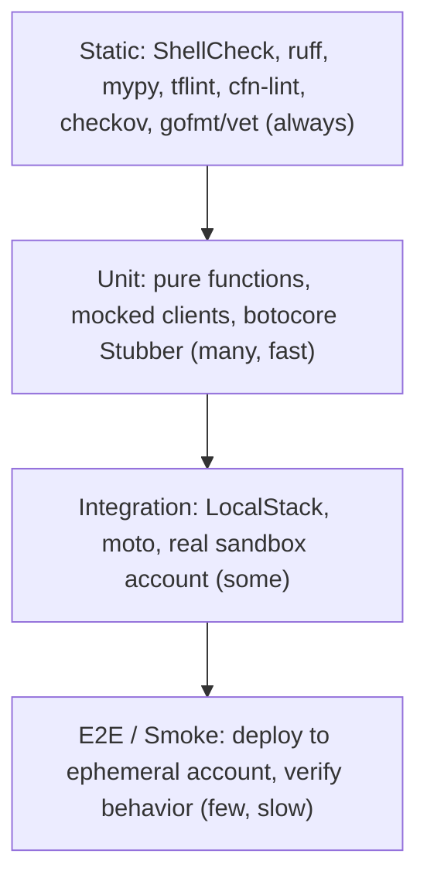

# DevOps Automation & Scripting on AWS (Bash, Python, Go, Git)

Automation turns repeatable operations into safe, testable code. This guide covers the scripting toolchain a Solutions Architect or DevOps engineer is expected to know: **Bash**, **Python with boto3**, **Go with AWS SDK v2**, regular expressions, Git workflows, and how to test infrastructure scripts. For pipelines see [CI/CD & GitOps](cicd-and-gitops.md); for declarative infrastructure see [Terraform](terraform.md); for IAM design see [Security & Compliance](security-and-compliance.md).

---

---

## 🐚 Bash: Safe Scripting

Start every script with strict mode and a cleanup trap.

```bash
#!/usr/bin/env bash
set -euo pipefail          # exit on error, unset var, or failed pipe stage
IFS=$'\n\t'                # safer word splitting

TMP_DIR="$(mktemp -d)"
cleanup() { rm -rf "$TMP_DIR"; }
trap cleanup EXIT                                  # always runs
trap 'echo "Failed at line $LINENO" >&2' ERR       # diagnostics

REGION="${AWS_REGION:?AWS_REGION must be set}"

# Find unattached EBS volumes (state=available) and print cost hints
aws ec2 describe-volumes --region "$REGION" \
  --filters Name=status,Values=available \
  --query 'Volumes[].[VolumeId,Size,VolumeType,CreateTime]' \
  --output text | while IFS=$'\t' read -r id size type created; do
    echo "Unattached: $id ${size}GiB $type created=$created"
done
```

| Flag / Feature | Purpose |
| :--- | :--- |
| `set -e` | Abort on non-zero exit (beware inside `if`/`||` contexts) |
| `set -u` | Error on undefined variables |
| `set -o pipefail` | Pipeline fails if any stage fails |
| `trap ... EXIT` | Guaranteed cleanup of temp files/locks |


---

## 🐍 Python + boto3

### Core Patterns
*   **Sessions**: Create `boto3.Session(profile_name=..., region_name=...)` explicitly instead of relying on implicit defaults.
*   **Paginators**: List APIs return partial pages. Always paginate.
*   **Waiters**: Block until a resource reaches a state (`instance_running`, `snapshot_completed`) instead of `sleep`.
*   **Retries**: Configure adaptive retry via `botocore.config.Config(retries={"mode": "adaptive", "max_attempts": 10})`.
*   **Assume role**: Use STS for cross-account access (see [Multi-Account Strategy](multi-account-strategy.md)).

### Example: Assume Role + Unattached EBS Volumes Report

```python
import boto3
from botocore.config import Config

RETRY = Config(retries={"mode": "adaptive", "max_attempts": 10})

def session_for_role(role_arn: str, region: str) -> boto3.Session:
    creds = boto3.client("sts").assume_role(
        RoleArn=role_arn, RoleSessionName="ebs-audit", DurationSeconds=900
    )["Credentials"]
    return boto3.Session(
        aws_access_key_id=creds["AccessKeyId"],
        aws_secret_access_key=creds["SecretAccessKey"],
        aws_session_token=creds["SessionToken"],
        region_name=region,
    )

def unattached_volumes(session: boto3.Session) -> list[dict]:
    ec2 = session.client("ec2", config=RETRY)
    pages = ec2.get_paginator("describe_volumes").paginate(
        Filters=[{"Name": "status", "Values": ["available"]}]
    )
    return [v for page in pages for v in page["Volumes"]]

if __name__ == "__main__":
    s = session_for_role("arn:aws:iam::111122223333:role/AuditReadOnly", "us-east-1")
    for v in unattached_volumes(s):
        print(v["VolumeId"], v["Size"], v["CreateTime"].date())
```

### Example: Rotate Old Snapshots (Dry-Run by Default)

```python
from datetime import datetime, timedelta, timezone
import boto3

def delete_old_snapshots(days: int = 90, dry_run: bool = True) -> None:
    ec2 = boto3.client("ec2")
    cutoff = datetime.now(timezone.utc) - timedelta(days=days)
    pages = ec2.get_paginator("describe_snapshots").paginate(OwnerIds=["self"])
    for page in pages:
        for snap in page["Snapshots"]:
            if snap["StartTime"] < cutoff and not _is_protected(snap):
                print(f"{'WOULD DELETE' if dry_run else 'DELETING'} {snap['SnapshotId']}")
                if not dry_run:
                    ec2.delete_snapshot(SnapshotId=snap["SnapshotId"])

def _is_protected(snap: dict) -> bool:
    tags = {t["Key"]: t["Value"] for t in snap.get("Tags", [])}
    return tags.get("Retain") == "true"   # opt-out tag; AMI-backed snapshots also fail safely
```

### Example: Tag Compliance Audit

```python
import boto3

REQUIRED = {"Owner", "CostCenter", "Environment"}

def untagged_resources() -> list[tuple[str, set[str]]]:
    tagging = boto3.client("resourcegroupstaggingapi")
    findings = []
    for page in tagging.get_paginator("get_resources").paginate():
        for res in page["ResourceTagMappingList"]:
            keys = {t["Key"] for t in res.get("Tags", [])}
            missing = REQUIRED - keys
            if missing:
                findings.append((res["ResourceARN"], missing))
    return findings
```

### Least-Privilege IAM for the Scripts Above
Grant only the required actions (read-only audit; delete limited to the snapshot script role):

```json
{
  "Version": "2012-10-17",
  "Statement": [
    {
      "Sid": "AuditReadOnly",
      "Effect": "Allow",
      "Action": ["ec2:DescribeVolumes", "ec2:DescribeSnapshots", "tag:GetResources"],
      "Resource": "*"
    },
    {
      "Sid": "DeleteOnlyOldSnapshotsInThisAccount",
      "Effect": "Allow",
      "Action": "ec2:DeleteSnapshot",
      "Resource": "arn:aws:ec2:us-east-1:111122223333:snapshot/*",
      "Condition": { "StringNotEquals": { "aws:ResourceTag/Retain": "true" } }
    }
  ]
}
```

---

## 🐹 Go with AWS SDK v2 (Fan-Out with Goroutines)

Go shines when you must query many regions or accounts in parallel and ship one static binary.

```go
package main

import (
	"context"
	"fmt"
	"sync"

	"github.com/aws/aws-sdk-go-v2/config"
	"github.com/aws/aws-sdk-go-v2/service/ec2"
	"github.com/aws/aws-sdk-go-v2/service/ec2/types"
)

func availableVolumes(ctx context.Context, region string) ([]string, error) {
	cfg, err := config.LoadDefaultConfig(ctx, config.WithRegion(region))
	if err != nil {
		return nil, err
	}
	client := ec2.NewFromConfig(cfg)
	p := ec2.NewDescribeVolumesPaginator(client, &ec2.DescribeVolumesInput{
		Filters: []types.Filter{{Name: strPtr("status"), Values: []string{"available"}}},
	})
	var ids []string
	for p.HasMorePages() {
		page, err := p.NextPage(ctx)
		if err != nil {
			return nil, err
		}
		for _, v := range page.Volumes {
			ids = append(ids, *v.VolumeId)
		}
	}
	return ids, nil
}

func strPtr(s string) *string { return &s }

func main() {
	ctx := context.Background()
	regions := []string{"us-east-1", "eu-west-1", "ap-southeast-2"}
	var wg sync.WaitGroup
	results := make(chan string, len(regions))
	for _, r := range regions {
		wg.Add(1)
		go func(region string) {
			defer wg.Done()
			ids, err := availableVolumes(ctx, region)
			if err != nil {
				results <- fmt.Sprintf("%s: error %v", region, err)
				return
			}
			results <- fmt.Sprintf("%s: %d unattached volumes", region, len(ids))
		}(r)
	}
	wg.Wait()
	close(results)
	for line := range results {
		fmt.Println(line)
	}
}
```


---

## 🔤 Regex Essentials

| Pattern | Meaning | Example Use |
| :--- | :--- | :--- |
| `^` / `$` | Start / end of line | Anchor whole-line matches |
| `[a-f0-9]{8}` | Character class with quantifier | Match hex IDs |
| `(...)` / `(?:...)` | Capture group / non-capturing | Extract fields |
| `a\|b` | Alternation | Match `error\|warn` |
| `(?<name>...)` | Named group (PCRE/Python `(?P<name>...)`) | Readable extraction |

```bash
# Match EC2 instance IDs and AWS account IDs
grep -Eo 'i-[0-9a-f]{8,17}'  app.log
grep -Eo '\b[0-9]{12}\b'    arn-list.txt
# Extract region from an ARN
sed -E 's/^arn:aws:[a-z0-9-]+:([a-z0-9-]+):.*/\1/' arns.txt
```

Regex is for text; parse JSON with `jq` or `json`, never with regex. Beware catastrophic backtracking on untrusted input.

---

## 🌿 Git Workflows

| Aspect | **Trunk-Based Development** | **GitFlow** |
| :--- | :--- | :--- |
| Branching | Short-lived branches (< 1-2 days) merged into `main` | Long-lived `develop`, `release/*`, `hotfix/*` |
| Release | Continuous, feature flags hide unfinished work | Scheduled release branches |
| Fits | CI/CD, SaaS, high deploy frequency | Versioned products, slow release trains |
| Risk | Needs strong tests and flags | Merge pain, drift between branches |

### Merge vs Rebase
*   **Merge** preserves true history with a merge commit; safe on shared branches.
*   **Rebase** rewrites your local commits on top of the target for linear history; **never rebase a branch others have pulled**.
*   Common combo: rebase your feature branch locally, then **squash-merge** via pull request.

### Recovering from Mistakes

| Situation | Command |
| :--- | :--- |
| Undo last commit, keep changes | `git reset --soft HEAD~1` |
| Undo a pushed commit safely | `git revert <sha>` |
| Recover "lost" commits after bad reset | `git reflog` then `git checkout -b rescue <sha>` |
| Find the commit that introduced a bug | `git bisect start; git bisect bad; git bisect good <sha>` |
| Committed a secret | Rotate the secret first, then purge history (`git filter-repo`); deletion alone is not enough |

Use `git push --force-with-lease` instead of `--force`. Protect `main` with required reviews and status checks.

---

## 🧪 Testing Pyramid for Infra and Scripts



*   **Unit tests**: use `moto` or `botocore.stub.Stubber` to mock AWS; keep logic in pure functions separate from API calls.
*   **Integration**: LocalStack or a dedicated sandbox account; use Terratest for Terraform modules.
*   **Safety features**: default to `--dry-run`, log every action, add an explicit `--apply` flag, and use IAM permissions boundaries for automation roles.

---

---

## SA Interview Questions on DevOps Automation

### Question 1: What does `set -euo pipefail` do, and where can it mislead you?
**Answer**:
`-e` exits on any command failure, `-u` errors on unset variables, and `pipefail` makes a pipeline fail if any stage fails. It misleads because `-e` is ignored in conditions (`if cmd`, `cmd || true`, `&&` lists), so failures can be masked. Pair it with `trap ... ERR/EXIT` for diagnostics and cleanup, and check critical commands explicitly.

### Question 2: How do you handle pagination, throttling, and long-running operations in boto3?
**Answer**:
Use **paginators** for list/describe calls, **waiters** for state transitions, and a botocore `Config` with `retries={"mode": "adaptive"}` for exponential backoff with jitter. For very large fan-out, limit concurrency and batch calls. Prefer service-side filters (`Filters`, tag APIs) to reduce data transferred.

### Question 3: How do you run a script across many AWS accounts securely?
**Answer**:
Create a least-privilege role in each account with a trust policy for the automation account, then call `sts:AssumeRole` per account (often listing accounts via AWS Organizations). Use short-lived credentials (900 seconds), an `ExternalId` or `aws:PrincipalOrgID` condition, and permission boundaries. Never distribute IAM user keys.

### Question 4: Trunk-based development or GitFlow, and why?
**Answer**:
Choose **trunk-based** for continuous delivery: small PRs merged daily into `main`, feature flags for incomplete work, and automated tests gating deploys. It minimizes merge conflicts and lead time. Choose **GitFlow** only for versioned, scheduled releases needing parallel maintenance branches (e.g., shipped on-premises software). Most cloud teams benefit from trunk-based.

### Question 5: You pushed a bad commit to `main` and someone already pulled it. What do you do?
**Answer**:
Use `git revert <sha>` to create a new commit that undoes the change; this is safe for shared history. Do not rewrite history with reset/force-push on a shared branch. If a secret leaked, rotate it immediately, then purge history with `git filter-repo` in coordination with the team. Use `git reflog` to recover anything lost locally.

### Question 6: How would you test an automation script that deletes AWS resources?
**Answer**:
Separate decision logic (pure, unit-tested with fixtures) from API calls (mocked with moto/Stubber). Run integration tests against LocalStack or a sandbox account with seeded resources. Ship with `--dry-run` as the default, tag-based exclusions, structured logging of every action, and a narrowly scoped IAM role. Run static checks (ruff, ShellCheck, cfn-lint) in CI.
