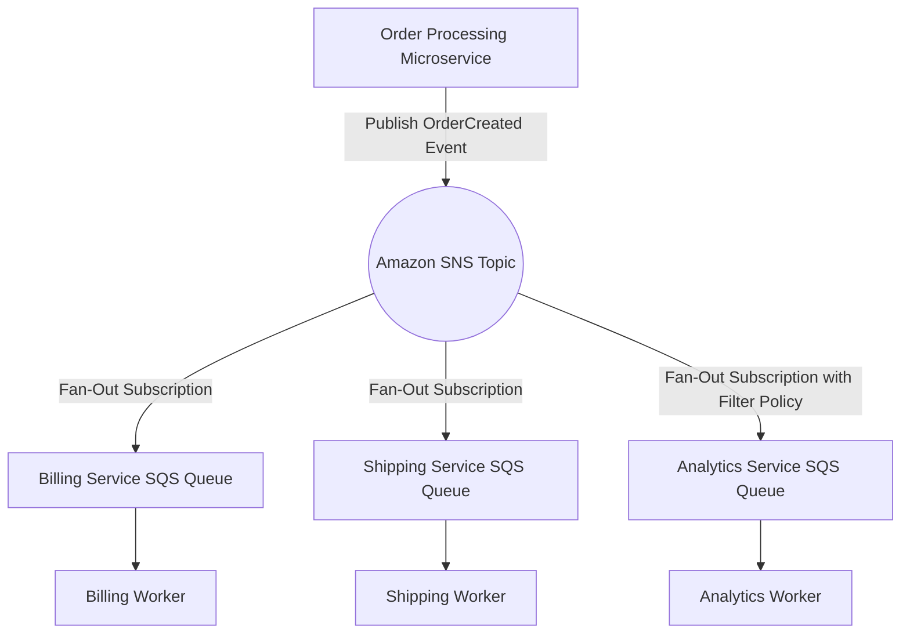

# Event-Driven Architecture (EDA) on AWS

Event-Driven Architecture is a design pattern where decoupled software components communicate by publishing and consuming events asynchronously. AWS offers a rich suite of messaging and integration services to realize this pattern.

---

## 🆚 AWS Messaging Comparison

Understanding when to choose SQS, SNS, Kinesis, or EventBridge is a core skill for AWS Solution Architects.

| Service | Architecture Pattern | Delivery Type | Ordering | Scaling Model |
| :--- | :--- | :--- | :--- | :--- |
| **Amazon SQS** | Point-to-Point (Queue) | Pull (Polling) | FIFO option only | Elastic (practically infinite standard) |
| **Amazon SNS** | Pub-Sub (Broadcasting) | Push | FIFO option only | High throughput scaling |
| **Amazon Kinesis** | Streaming Data | Pull (Streaming shards) | Ordered per Shard | Scaled by shard count adjustments |
| **Amazon EventBridge**| Enterprise Event Bus | Push | None guaranteed | Auto-scaling based on ingestion |

---

## 🏗️ Storage Fan-Out (Pub-Sub) Architecture Diagram

A common architectural pattern: A publisher broadcasts an event to an SNS topic. The topic pushes the message to multiple SQS queues concurrently, allowing independent microservices to process the event at their own pace.

---

## Core Design Considerations

### 1. Delivery Guarantees
*   **At-Least-Once Delivery**: Standard for SQS, SNS, and EventBridge. A message is guaranteed to be delivered, but network hiccups or processing failures can cause duplicates. Applications must be designed with **Idempotency** in mind.
*   **Exactly-Once Processing**: SQS FIFO queues support exactly-once processing by leveraging Message Deduplication IDs.

### 2. Message Ordering Guarantees
*   If processing transactions chronologically is critical, use **SQS FIFO** queues. SQS FIFO guarantees order based on the `MessageGroupId` parameter.
*   For high-volume streaming telemetry, use **Kinesis Data Streams**. Kinesis maintains strict message ordering within a single shard.

### 3. Backpressure & Dead Letter Queues (DLQs)
*   **Backpressure Handling**: SQS queues act as natural shock absorbers, buffering incoming spikes to shield slower relational databases or third-party APIs from crashing.
*   **DLQ Pattern**: If a consumer fails to process a message repeatedly (based on the `maxReceiveCount` policy), SQS isolates the message by redirecting it to a Dead Letter Queue (DLQ) for retrospective manual debugging or replay scripts.

---

## Common Pitfalls in Event-Driven Designs
*   **Infinite Lambda Loops**: A Lambda function reads a file from S3, processes it, and writes the output back to the same S3 bucket under the same prefix. This triggers a recursive chain of events that can exhaust resources and incur high costs.
*   **Monolithic Event Payloads**: Packing large database records or files into a message payload. (Mitigation: Use the **Claim Check Pattern**. Save the large payload to S3, publish only the S3 object URL in the message queue, and download the full file at the processing step).
*   **Exceeding EventBridge Ingestion Limits**: Deploying EventBridge as a high-frequency telemetry pipeline. Use Kinesis Data Streams instead for raw telemetry logs to prevent performance bottlenecks.

---

## SA Interview Questions on Event-Driven Architectures

### Question 1: How do you design an application to be "Idempotent"?
**Answer**: 
Idempotency means that executing an operation multiple times yields the exact same state outcome as a single execution.
In an event-driven system:
1.  Generate a unique **Idempotency Key** or Transaction ID at the producer level (e.g., UUID-v4).
2.  In the consuming service, check if the key exists in a fast transactional cache (like **Amazon ElastiCache Redis** or **DynamoDB** with a TTL policy).
3.  If the key exists, return the cached result immediately and skip reprocessing. If not, write the key to the cache, process the transaction, and update the cache status.

### Question 2: What is the SQS Visibility Timeout, and how does it prevent duplicate processing?
**Answer**: 
When a worker retrieves a message from an SQS queue, the message remains in the queue but is hidden from other workers for a configurable period called the **Visibility Timeout** (default: 30 seconds).
*   If the worker processes the message successfully before the timeout expires, it deletes the message from the queue.
*   If the worker crashes or takes longer than the Visibility Timeout, the message becomes visible again in the queue for another worker to process. If processing requires a long time, the worker must call the `ChangeMessageVisibility` API to extend the lease.

### Question 3: When should you choose Amazon Kinesis Data Streams over Amazon SQS FIFO?
**Answer**: 
*   Choose **Amazon SQS FIFO** when you have a transactional workflow where message order is critical and you want elastic, serverless queues without managing infrastructure capacity. SQS FIFO is limited to 300 messages/sec (or 3,000/sec with batching).
*   Choose **Amazon Kinesis Data Streams** when you have massive streaming data inputs (like real-time clickstreams, IoT logs, or transaction logs) that exceed SQS FIFO limits. Kinesis handles gigabytes of data per second and supports multiple consumers reading the same stream concurrently (independent checkpointing).
