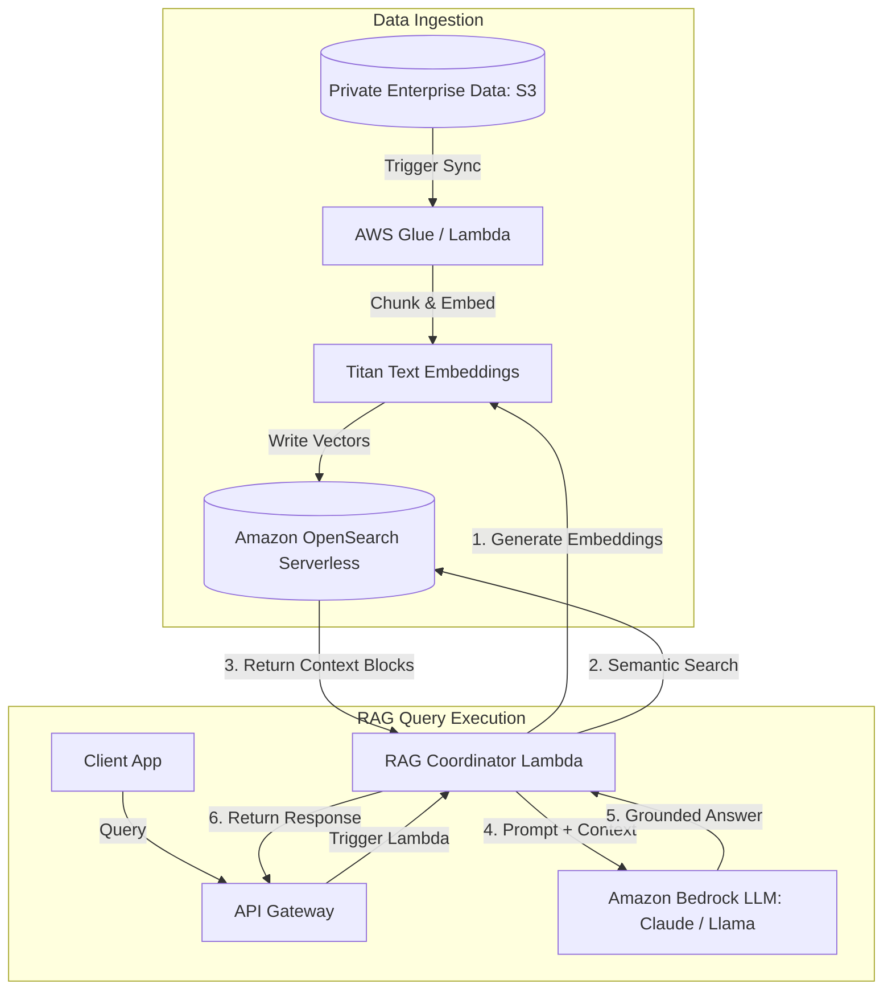

# Generative AI on AWS: Bedrock vs. SageMaker

AWS offers a comprehensive Generative AI portfolio, ranging from fully managed serverless foundation models to customizable deep learning infrastructure. The two primary services are Amazon Bedrock and Amazon SageMaker.

---

## 🆚 Bedrock vs. SageMaker

| Feature | Amazon Bedrock | Amazon SageMaker |
| :--- | :--- | :--- |
| **Service Model** | Serverless API. | Fully managed machine learning platform. |
| **Approach** | Consume pre-trained Foundation Models (FMs). | Train, fine-tune, and deploy custom models. |
| **Operational Burden**| Minimal. Zero server infrastructure to manage. | High. Requires managing compute instances. |
| **Customization** | Basic (Fine-tuning, RAG via KB). | Full control over model weights, training scripts. |
| **Primary Audience** | Application Developers. | Data Scientists & ML Engineers. |

---

## 🏗️ Retrieval-Augmented Generation (RAG) Architecture

The standard architectural pattern for grounding LLMs with private corporate data to eliminate hallucinations is **Retrieval-Augmented Generation (RAG)**.

---

## Core Generative AI Services on AWS

### 1. Amazon Bedrock
A fully managed serverless service that exposes leading foundation models (Claude, Llama, Jurassic, Titan) via a single unified API.
*   **Knowledge Bases for Bedrock**: Fully automates the RAG pipeline by handling document ingestion, chunking, embedding, vector store storage, and runtime retrieval.
*   **Agents for Bedrock**: Orchestrates multi-step tasks by allowing LLMs to invoke native AWS Lambda functions to fetch data or trigger external systems.

### 2. Amazon OpenSearch Serverless (AOSS)
Exposes vector search capabilities, allowing storage and semantic search of document embeddings. It is the recommended vector database for enterprise serverless RAG applications on AWS.

### 3. Amazon SageMaker
An end-to-end ML platform to build, train, and deploy machine learning models.
*   **SageMaker JumpStart**: An online hub to access and deploy pre-trained foundation models with single-click configurations.
*   **SageMaker Canvas**: A no-code visual interface to build machine learning models.

---

## Common Pitfalls in GenAI Architectures
*   **Neglecting Data Security**: Exposing sensitive corporate documents to public model training loops. (Mitigation: Amazon Bedrock isolates model requests. Your data is encrypted using customer KMS keys and **never** used to train the base public models).
*   **High Latency in Conversational UIs**: Waiting for the entire LLM answer to generate before returning it to the user. (Mitigation: Implement API Gateway WebSockets or Bedrock streaming APIs to **stream responses token-by-token**).
*   **Poor Chunking Strategies**: Splitting documents mid-sentence or mid-paragraph. This disrupts context during vector conversions. Use sensible chunking algorithms (like overlap strategies) to maintain logical semantic groupings.

---

## SA Interview Questions on Generative AI

### Question 1: How do you choose between Fine-Tuning a Foundation Model and implementing RAG?
**Answer**: 
*   Choose **RAG (Retrieval-Augmented Generation)** when your application requires access to dynamic, frequently updated data (like real-time inventory, user profiles, or corporate wikis). RAG is cheaper to implement, allows auditability (model outputs can trace back to source documents), and eliminates hallucinations.
*   Choose **Fine-Tuning** when you need to adapt an LLM to perform highly specialized tasks (like translating text into code, adopting a specific brand voice, or mastering complex medical terminology). Fine-tuning modifies the internal weights of the model and works best with static datasets.

### Question 2: How do you protect Amazon Bedrock API endpoints from payload theft or data leaks?
**Answer**: 
1.  Deploy all backend integration Lambdas inside a **private VPC subnet**.
2.  Enable **VPC Endpoints (AWS PrivateLink)** for Amazon Bedrock. This routes all API traffic between your application and Bedrock privately within the AWS network backbone, bypassing the public internet.
3.  Set up **Bedrock Guardrails** to filter out Personally Identifiable Information (PII), block sensitive keywords, and enforce safety filters at the API level.

### Question 3: How do you design a cost-effective, scalable vector database for Bedrock?
**Answer**: 
1.  Utilize **Amazon OpenSearch Serverless (AOSS)** with vector engine enabled. This eliminates the operational cost and capacity planning of running full OpenSearch clusters, scaling compute resources automatically in response to ingestion and query rates.
2.  Set up **Amazon DynamoDB** with Amazon DynamoDB Streams enabled to trigger document embedding updates in AOSS only when records change.
3.  Use **Amazon S3** to store the primary, raw document assets. AOSS should only store the mathematical vector embeddings and associated metadata pointers to optimize storage costs.

### Question 4: How is memory structured in AI Agent architectures, and how do they map to LLM inputs?
**Answer**: 
AI agent memory is typically structured using the **CoALA Framework** (Cognitive Architectures for Language Agents), which defines four core memory types:
1.  **Working Memory**: The human equivalent of active thought. In systems design, this is the current conversation context (short-term memory).
2.  **Procedural Memory**: Muscle memory or rules of operation. In systems design, this is injected into the **System Prompt** to instruct the agent how to act, utilize tools, and respond.
3.  **Semantic Memory**: Accumulated general facts and knowledge. High-importance (high-salience) facts are loaded in the **Profile Block** of the System Prompt, while lower-salience facts are fetched dynamically via tool calling/retrieval.
4.  **Episodic Memory**: Recall of specific past autobiographical experiences (e.g., how a user reacted to a previous proposal). This is loaded in the **User Prompt** area as few-shot examples or historical context.

### Question 5: Why is relying solely on large LLM context windows for conversation history problematic, and how do you design persistent memory?
**Answer**: 
Relying purely on expanding context windows has three major flaws:
1.  **Output Degradation**: Even if a model supports 100k+ tokens, retrieval quality and reasoning capabilities often degrade at 70-80% capacity (known as the "lost in the middle" problem).
2.  **Lack of Importance Weighting**: Context windows treat all tokens equally. A throwaway comment from three weeks ago is processed with the same weight as critical user preferences.
3.  **Linear Cost Scaling**: LLM billing is utility-based; overloading the context window with redundant history increases token counts and costs linearly for every turn.

**Design Pattern for Persistent Memory**:
Implement a decoupled memory pipeline:
1.  Store active session history in a fast, low-latency cache (e.g., **Amazon ElastiCache Redis**).
2.  Run a background LLM process periodically (e.g., nightly batch jobs, cron schedules, or when the agent is idle—commonly called **"Dream Mode"**) to extract user preferences, facts, and experiences from the session logs.
3.  Consolidate and write this extracted metadata to a persistent database (e.g., vector database or DynamoDB), filtering out noise.
4.  On session initialization, retrieve only the high-salience profile attributes and recent relevant episodic memories to inject into the LLM context.

### Question 6: What are the architectural drawbacks of using heterogeneous databases for AI Agent memory, and how do unified databases address them?
**Answer**: 
In typical GenAI architectures, agent memory spans across diverse storage types: relational databases (for transaction data), NoSQL/document stores (for session history), vector databases (for semantic search/RAG), and graph databases (for GraphRAG relationship mapping).

**Drawbacks of Heterogeneous Storages**:
1.  **Operational Complexity (TCO)**: Managing, provisioning, and syncing multiple database engines (e.g., RDS, DynamoDB, OpenSearch) increases infrastructure overhead.
2.  **Query Complexity & Latency**: Running multi-step queries requires the agent to call multiple tools sequentially (e.g., fetch profile from NoSQL, perform vector search in OpenSearch, join with SQL database). This introduces multiple network roundtrips, increasing overall response latency.
3.  **Data Replication Pipelines**: Requires building complex CDC (Change Data Capture) pipelines to synchronize operational data with vector databases.

**Unified Database Solution**:
Utilize a unified multi-model database engine (such as **Oracle Database 23ai**) that supports SQL, NoSQL (via JSON duality), vectors, and graph search in a single platform:
-  **Simplified Queries**: Combine relational joins and vector semantic searches within a single SQL query, reducing network roundtrips and agent tool call loops.
-  **Eliminate CDC Pipelines**: Data is embedded, indexed, and queried in-place.
-  **In-Database Embeddings**: Store the embedding model directly in the database to generate embeddings locally on write/query, simplifying deployment and ensuring consistency of the embedding model without external service calls.

### Question 7: What is an AI Agent, and how does it differ from a standalone LLM or static conditional workflow?
**Answer**: 
An **AI Agent** is a software program powered by a foundation model that autonomously and dynamically plans and executes actions (using tools and feedback loops) to achieve a specified goal.

*   **Standalone LLM**: Takes a single prompt and generates a static output based solely on its training data. There is no feedback loop or capability to interact with external environments.
*   **Static Conditional Workflow**: Executes predefined path logic (e.g., if-then-else conditions) where all possible decision nodes are hardcoded by developers.
*   **AI Agent**: Operates in a continuous reasoning loop (e.g., ReAct pattern: Reason, Act, Observe). Given a high-level goal (e.g., "Analyze these error logs and fix the resource configuration"), the agent determines which tools to call, inspects their output, corrects its course if errors occur, and repeats until the objective is accomplished.

**AWS Implementation**:
Agents can be orchestrated using framework libraries (like LangChain or LangGraph) or run natively using **Agents for Amazon Bedrock**. Tools are integrated via OpenAPI schemas that map to backend Lambda functions or API endpoints, allowing the agent to read databases, pull CloudWatch logs, or write configuration updates dynamically.

