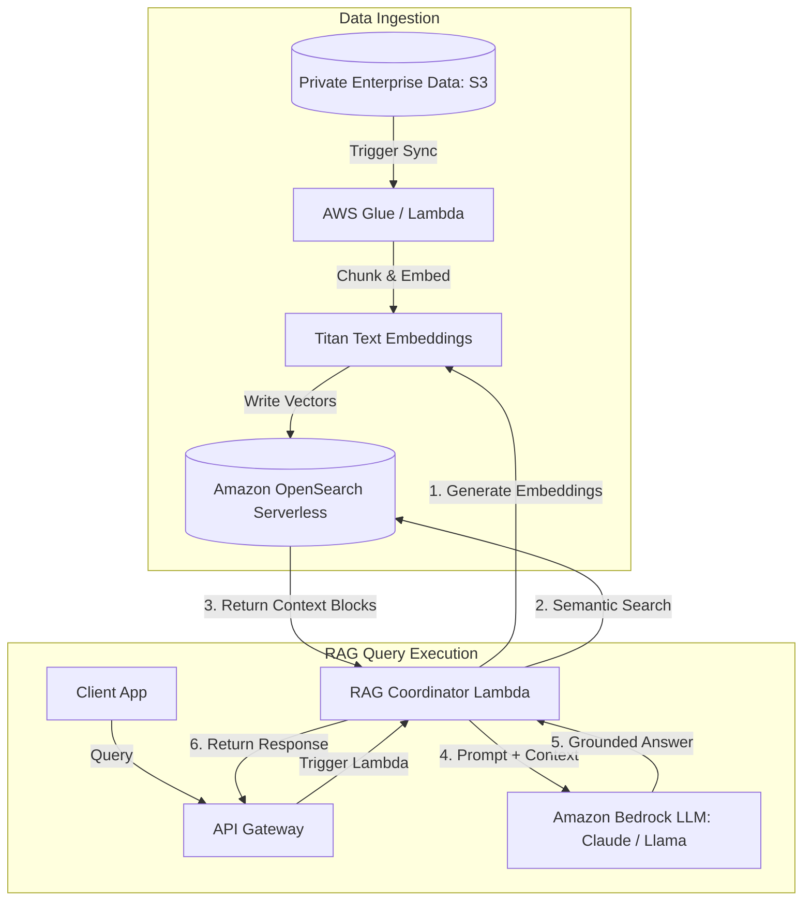

# Generative AI on AWS: Bedrock vs. SageMaker

AWS offers a comprehensive Generative AI portfolio, ranging from fully managed serverless foundation models to customizable deep learning infrastructure. The two primary services are Amazon Bedrock and Amazon SageMaker.

---

## 🆚 Bedrock vs. SageMaker

| Feature | Amazon Bedrock | Amazon SageMaker |
| :--- | :--- | :--- |
| **Service Model** | Serverless API. | Fully managed machine learning platform. |
| **Approach** | Consume pre-trained Foundation Models (FMs). | Train, fine-tune, and deploy custom models. |
| **Operational Burden**| Minimal. Zero server infrastructure to manage. | High. Requires managing compute instances. |
| **Customization** | Basic (Fine-tuning, RAG via KB). | Full control over model weights, training scripts. |
| **Primary Audience** | Application Developers. | Data Scientists & ML Engineers. |

---

## 🏗️ Retrieval-Augmented Generation (RAG) Architecture

The standard architectural pattern for grounding LLMs with private corporate data to eliminate hallucinations is **Retrieval-Augmented Generation (RAG)**.

---

## Core Generative AI Services on AWS

### 1. Amazon Bedrock
A fully managed serverless service that exposes leading foundation models (Claude, Llama, Jurassic, Titan) via a single unified API.
*   **Knowledge Bases for Bedrock**: Fully automates the RAG pipeline by handling document ingestion, chunking, embedding, vector store storage, and runtime retrieval.
*   **Agents for Bedrock**: Orchestrates multi-step tasks by allowing LLMs to invoke native AWS Lambda functions to fetch data or trigger external systems.

### 2. Amazon OpenSearch Serverless (AOSS)
Exposes vector search capabilities, allowing storage and semantic search of document embeddings. It is the recommended vector database for enterprise serverless RAG applications on AWS.

### 3. Amazon SageMaker
An end-to-end ML platform to build, train, and deploy machine learning models.
*   **SageMaker JumpStart**: An online hub to access and deploy pre-trained foundation models with single-click configurations.
*   **SageMaker Canvas**: A no-code visual interface to build machine learning models.

---

## Common Pitfalls in GenAI Architectures
*   **Neglecting Data Security**: Exposing sensitive corporate documents to public model training loops. (Mitigation: Amazon Bedrock isolates model requests. Your data is encrypted using customer KMS keys and **never** used to train the base public models).
*   **High Latency in Conversational UIs**: Waiting for the entire LLM answer to generate before returning it to the user. (Mitigation: Implement API Gateway WebSockets or Bedrock streaming APIs to **stream responses token-by-token**).
*   **Poor Chunking Strategies**: Splitting documents mid-sentence or mid-paragraph. This disrupts context during vector conversions. Use sensible chunking algorithms (like overlap strategies) to maintain logical semantic groupings.

---

## SA Interview Questions on Generative AI

### Question 1: How do you choose between Fine-Tuning a Foundation Model and implementing RAG?
**Answer**: 
*   Choose **RAG (Retrieval-Augmented Generation)** when your application requires access to dynamic, frequently updated data (like real-time inventory, user profiles, or corporate wikis). RAG is cheaper to implement, allows auditability (model outputs can trace back to source documents), and eliminates hallucinations.
*   Choose **Fine-Tuning** when you need to adapt an LLM to perform highly specialized tasks (like translating text into code, adopting a specific brand voice, or mastering complex medical terminology). Fine-tuning modifies the internal weights of the model and works best with static datasets.

### Question 2: How do you protect Amazon Bedrock API endpoints from payload theft or data leaks?
**Answer**: 
1.  Deploy all backend integration Lambdas inside a **private VPC subnet**.
2.  Enable **VPC Endpoints (AWS PrivateLink)** for Amazon Bedrock. This routes all API traffic between your application and Bedrock privately within the AWS network backbone, bypassing the public internet.
3.  Set up **Bedrock Guardrails** to filter out Personally Identifiable Information (PII), block sensitive keywords, and enforce safety filters at the API level.

### Question 3: How do you design a cost-effective, scalable vector database for Bedrock?
**Answer**: 
1.  Utilize **Amazon OpenSearch Serverless (AOSS)** with vector engine enabled. This eliminates the operational cost and capacity planning of running full OpenSearch clusters, scaling compute resources automatically in response to ingestion and query rates.
2.  Set up **Amazon DynamoDB** with Amazon DynamoDB Streams enabled to trigger document embedding updates in AOSS only when records change.
3.  Use **Amazon S3** to store the primary, raw document assets. AOSS should only store the mathematical vector embeddings and associated metadata pointers to optimize storage costs.
