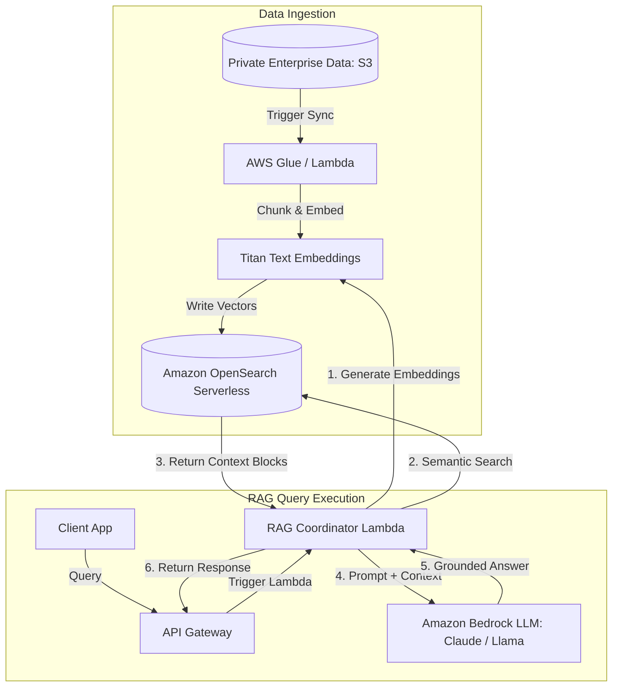

# Generative AI on AWS: Bedrock vs. SageMaker

AWS offers a comprehensive Generative AI portfolio, ranging from fully managed serverless foundation models to customizable deep learning infrastructure. The two primary services are Amazon Bedrock and Amazon SageMaker.

---

## 🆚 Bedrock vs. SageMaker

| Feature | Amazon Bedrock | Amazon SageMaker |
| :--- | :--- | :--- |
| **Service Model** | Serverless API. | Fully managed machine learning platform. |
| **Approach** | Consume pre-trained Foundation Models (FMs). | Train, fine-tune, and deploy custom models. |
| **Operational Burden**| Minimal. Zero server infrastructure to manage. | High. Requires managing compute instances. |
| **Customization** | Basic (Fine-tuning, RAG via KB). | Full control over model weights, training scripts. |
| **Primary Audience** | Application Developers. | Data Scientists & ML Engineers. |

---

## 🏗️ Retrieval-Augmented Generation (RAG) Architecture

The standard architectural pattern for grounding LLMs with private corporate data to eliminate hallucinations is **Retrieval-Augmented Generation (RAG)**.

```mermaid
graph TD
    subgraph Ingestion_Pipeline [Data Ingestion]
        Doc[(Private Enterprise Data: S3)] -->|Trigger Sync| Glue[AWS Glue / Lambda]
        Glue -->|Chunk & Embed| EmbedModel[Titan Text Embeddings]
        EmbedModel -->|Write Vectors| VectorDB[(Amazon OpenSearch Serverless)]
    end
    
    subgraph RAG_Query_Path [RAG Query Execution]
        User[Client App] -->|Query| APIGW[API Gateway]
        APIGW -->|Trigger Lambda| LambdaAgent[RAG Coordinator Lambda]
        
        LambdaAgent -->|1. Generate Embeddings| EmbedModel
        LambdaAgent -->|2. Semantic Search| VectorDB
        VectorDB -->|3. Return Context Blocks| LambdaAgent
        
        LambdaAgent -->|4. Prompt + Context| Bedrock[Amazon Bedrock LLM: Claude / Llama]
        Bedrock -->|5. Grounded Answer| LambdaAgent
        LambdaAgent -->|6. Return Response| APIGW
    end
```

---

## Core Generative AI Services on AWS

### 1. Amazon Bedrock
A fully managed serverless service that exposes leading foundation models (Claude, Llama, Jurassic, Titan) via a single unified API.
*   **Knowledge Bases for Bedrock**: Fully automates the RAG pipeline by handling document ingestion, chunking, embedding, vector store storage, and runtime retrieval.
*   **Agents for Bedrock**: Orchestrates multi-step tasks by allowing LLMs to invoke native AWS Lambda functions to fetch data or trigger external systems.

### 2. Amazon OpenSearch Serverless (AOSS)
Exposes vector search capabilities, allowing storage and semantic search of document embeddings. It is the recommended vector database for enterprise serverless RAG applications on AWS.

### 3. Amazon SageMaker
An end-to-end ML platform to build, train, and deploy machine learning models.
*   **SageMaker JumpStart**: An online hub to access and deploy pre-trained foundation models with single-click configurations.
*   **SageMaker Canvas**: A no-code visual interface to build machine learning models.

---

## Common Pitfalls in GenAI Architectures
*   **Neglecting Data Security**: Exposing sensitive corporate documents to public model training loops. (Mitigation: Amazon Bedrock isolates model requests. Your data is encrypted using customer KMS keys and **never** used to train the base public models).
*   **High Latency in Conversational UIs**: Waiting for the entire LLM answer to generate before returning it to the user. (Mitigation: Implement API Gateway WebSockets or Bedrock streaming APIs to **stream responses token-by-token**).
*   **Poor Chunking Strategies**: Splitting documents mid-sentence or mid-paragraph. This disrupts context during vector conversions. Use sensible chunking algorithms (like overlap strategies) to maintain logical semantic groupings.

---

## SA Interview Questions on Generative AI

### Question 1: How do you choose between Fine-Tuning a Foundation Model and implementing RAG?
**Answer**: 
*   Choose **RAG (Retrieval-Augmented Generation)** when your application requires access to dynamic, frequently updated data (like real-time inventory, user profiles, or corporate wikis). RAG is cheaper to implement, allows auditability (model outputs can trace back to source documents), and eliminates hallucinations.
*   Choose **Fine-Tuning** when you need to adapt an LLM to perform highly specialized tasks (like translating text into code, adopting a specific brand voice, or mastering complex medical terminology). Fine-tuning modifies the internal weights of the model and works best with static datasets.

### Question 2: How do you protect Amazon Bedrock API endpoints from payload theft or data leaks?
**Answer**: 
1.  Deploy all backend integration Lambdas inside a **private VPC subnet**.
2.  Enable **VPC Endpoints (AWS PrivateLink)** for Amazon Bedrock. This routes all API traffic between your application and Bedrock privately within the AWS network backbone, bypassing the public internet.
3.  Set up **Bedrock Guardrails** to filter out Personally Identifiable Information (PII), block sensitive keywords, and enforce safety filters at the API level.

### Question 3: How do you design a cost-effective, scalable vector database for Bedrock?
**Answer**: 
1.  Utilize **Amazon OpenSearch Serverless (AOSS)** with vector engine enabled. This eliminates the operational cost and capacity planning of running full OpenSearch clusters, scaling compute resources automatically in response to ingestion and query rates.
2.  Set up **Amazon DynamoDB** with Amazon DynamoDB Streams enabled to trigger document embedding updates in AOSS only when records change.
3.  Use **Amazon S3** to store the primary, raw document assets. AOSS should only store the mathematical vector embeddings and associated metadata pointers to optimize storage costs.

### Question 4: How is memory structured in AI Agent architectures, and how do they map to LLM inputs?
**Answer**: 
AI agent memory is typically structured using the **CoALA Framework** (Cognitive Architectures for Language Agents), which defines four core memory types:
1.  **Working Memory**: The human equivalent of active thought. In systems design, this is the current conversation context (short-term memory).
2.  **Procedural Memory**: Muscle memory or rules of operation. In systems design, this is injected into the **System Prompt** to instruct the agent how to act, utilize tools, and respond.
3.  **Semantic Memory**: Accumulated general facts and knowledge. High-importance (high-salience) facts are loaded in the **Profile Block** of the System Prompt, while lower-salience facts are fetched dynamically via tool calling/retrieval.
4.  **Episodic Memory**: Recall of specific past autobiographical experiences (e.g., how a user reacted to a previous proposal). This is loaded in the **User Prompt** area as few-shot examples or historical context.

### Question 5: Why is relying solely on large LLM context windows for conversation history problematic, and how do you design persistent memory?
**Answer**: 
Relying purely on expanding context windows has three major flaws:
1.  **Output Degradation**: Even if a model supports 100k+ tokens, retrieval quality and reasoning capabilities often degrade at 70-80% capacity (known as the "lost in the middle" problem).
2.  **Lack of Importance Weighting**: Context windows treat all tokens equally. A throwaway comment from three weeks ago is processed with the same weight as critical user preferences.
3.  **Linear Cost Scaling**: LLM billing is utility-based; overloading the context window with redundant history increases token counts and costs linearly for every turn.

**Design Pattern for Persistent Memory**:
Implement a decoupled memory pipeline:
1.  Store active session history in a fast, low-latency cache (e.g., **Amazon ElastiCache Redis**).
2.  Run a background LLM process periodically (e.g., nightly batch jobs, cron schedules, or when the agent is idle—commonly called **"Dream Mode"**) to extract user preferences, facts, and experiences from the session logs.
3.  Consolidate and write this extracted metadata to a persistent database (e.g., vector database or DynamoDB), filtering out noise.
4.  On session initialization, retrieve only the high-salience profile attributes and recent relevant episodic memories to inject into the LLM context.

### Question 6: What are the architectural drawbacks of using heterogeneous databases for AI Agent memory, and how do unified databases address them?
**Answer**: 
In typical GenAI architectures, agent memory spans across diverse storage types: relational databases (for transaction data), NoSQL/document stores (for session history), vector databases (for semantic search/RAG), and graph databases (for GraphRAG relationship mapping).

**Drawbacks of Heterogeneous Storages**:
1.  **Operational Complexity (TCO)**: Managing, provisioning, and syncing multiple database engines (e.g., RDS, DynamoDB, OpenSearch) increases infrastructure overhead.
2.  **Query Complexity & Latency**: Running multi-step queries requires the agent to call multiple tools sequentially (e.g., fetch profile from NoSQL, perform vector search in OpenSearch, join with SQL database). This introduces multiple network roundtrips, increasing overall response latency.
3.  **Data Replication Pipelines**: Requires building complex CDC (Change Data Capture) pipelines to synchronize operational data with vector databases.

**Unified Database Solution**:
Utilize a unified multi-model database engine (such as **Oracle Database 23ai**) that supports SQL, NoSQL (via JSON duality), vectors, and graph search in a single platform:
-  **Simplified Queries**: Combine relational joins and vector semantic searches within a single SQL query, reducing network roundtrips and agent tool call loops.
-  **Eliminate CDC Pipelines**: Data is embedded, indexed, and queried in-place.
-  **In-Database Embeddings**: Store the embedding model directly in the database to generate embeddings locally on write/query, simplifying deployment and ensuring consistency of the embedding model without external service calls.

### Question 7: What is an AI Agent, and how does it differ from a standalone LLM or static conditional workflow?
**Answer**: 
An **AI Agent** is a software program powered by a foundation model that autonomously and dynamically plans and executes actions (using tools and feedback loops) to achieve a specified goal.

*   **Standalone LLM**: Takes a single prompt and generates a static output based solely on its training data. There is no feedback loop or capability to interact with external environments.
*   **Static Conditional Workflow**: Executes predefined path logic (e.g., if-then-else conditions) where all possible decision nodes are hardcoded by developers.
*   **AI Agent**: Operates in a continuous reasoning loop (e.g., ReAct pattern: Reason, Act, Observe). Given a high-level goal (e.g., "Analyze these error logs and fix the resource configuration"), the agent determines which tools to call, inspects their output, corrects its course if errors occur, and repeats until the objective is accomplished.

**AWS Implementation**:
Agents can be orchestrated using framework libraries (like LangChain or LangGraph) or run natively using **Agents for Amazon Bedrock**. Tools are integrated via OpenAPI schemas that map to backend Lambda functions or API endpoints, allowing the agent to read databases, pull CloudWatch logs, or write configuration updates dynamically.

### Question 8: Explain the AI Agent architecture and how its key components interact at runtime.
**Answer**:
A production-grade AI Agent architecture consists of four primary components:
1.  **Agent Core (The Brain)**: The foundation model (LLM) that receives prompts, plans steps, and determines actions. It operates in a continuous loop (such as ReAct: *Reason, Act, Observe*).
2.  **Memory System**: Divided into working memory (short-term session context like conversation logs) and long-term memory (vector DBs for retrieval-augmented context, user profiles, or historical interactions).
3.  **Planning & Control**: Deconstructs complex goals into smaller sub-tasks, handles self-correction/retry loops, and manages the execution state.
4.  **Tools & Integration**: External APIs, databases, or local code execution environments. The agent knows how and when to invoke these tools via structured definitions (e.g., JSON/OpenAPI schemas).

**Runtime Interaction Flow**:
1.  **User Input**: The user sends a request to the Agent Core.
2.  **Retrieve Context**: The agent fetches relevant short-term history and long-term memory blocks.
3.  **Reasoning & Planning**: The LLM analyzes the prompt + context and decides if it needs external information.
4.  **Tool Calling**: The agent executes the necessary tool (e.g., calling an AWS Lambda function to query a database).
5.  **Observation**: The tool's output is returned to the agent as an observation.
6.  **Next-Step Planning**: The agent reasons over the observation, deciding whether the goal is achieved or if it needs to call another tool.
7.  **Final Response**: Once complete, the agent updates memory and sends the final response to the user.

### Question 9: How do you self-host an LLM and agent architecture, and what are the key security and infrastructure components?
**Answer**:
Self-hosting is preferred by enterprises requiring absolute data privacy, low-latency network locality, or customized model weights. A robust self-hosted architecture typically runs on **Kubernetes (Amazon EKS)**:

1.  **Compute & Acceleration**: Use GPU-optimized node groups (e.g., Amazon EC2 `g5`, `p4`, or `g6` instances) managed via the **NVIDIA Device Plugin for Kubernetes** to expose GPUs to container workloads.
2.  **Model Serving Engine**: Deploy models inside Pods using high-performance inference servers like **vLLM**, **TGI (Text Generation Inference)**, or **Ollama**. These servers optimize resource usage and throughput.
3.  **Storage**: Provision **Amazon EBS (gp3)** or **Amazon EFS** via Kubernetes Persistent Volume Claims (PVCs) to cache large model weights, avoiding download latencies during pod scaling.
4.  **Decoupled Agent Layer**: Run the "Agent Core" (orchestration code, tool definitions, and memory sync) on cost-effective, CPU-only nodes. Keep this logic separate from the GPU-heavy inference pods, querying the LLM serving endpoints via cluster-internal DNS.
5.  **Security Controls**: Enforce Private VPC routing. All tool calls and database lookups stay within private subnets. Use **IAM Roles for Service Accounts (IRSA)** or **EKS Pod Identities** to give agent pods fine-grained permissions to call other AWS APIs without hardcoded credentials.

### Question 10: How do you choose between CPU and GPU compute for different workloads in a Generative AI application?
**Answer**:
The choice between CPU and GPU is driven by latency requirements, parameter size, and cost efficiency:
*   **Use GPUs for Model Inference**: LLM inference relies on massive, parallelized matrix multiplications. GPUs (like NVIDIA L4, A10G, or H100) contain thousands of cores designed for parallel math, processing tokens orders of magnitude faster. Using a CPU for inference on a model with >7B parameters will result in unacceptable token-generation latencies.
*   **Use CPUs for Agent Logic and Small Models**: The orchestrator/agent core code (which manages the execution loops, tool schemas, and database calls) is highly sequential and runs perfectly on standard CPU-based instances (like AWS Graviton `m7g` or `c7g`). Additionally, CPUs can be used for:
    *   Extremely small, heavily quantized models (SLMs like Phi-3 or Llama-3-8B quantized to 4-bit) serving low-throughput internal tasks.
    *   Simple background batch jobs, text embeddings generation, or text classification tasks where latency is not a critical user-facing factor.

### Question 11: What is the difference between an AI Agent and Agentic AI?
**Answer**:
While related, they refer to different levels of scope and autonomy:
*   **AI Agent**: An individual, single-purpose software process designed to complete a specific task autonomously. It receives a prompt, uses a reasoning loop (like ReAct), and calls a defined set of tools to achieve its target (e.g., a "GitHub PR Review Agent" that reads code, checks lint errors, and posts feedback).
*   **Agentic AI**: A broader architectural paradigm or system that orchestrates multiple autonomous agents, workflows, and feedback loops to solve complex, multi-step business objectives with minimal human supervision. For example, a complete customer support system where a Router Agent classifies tickets, delegates tasks to a Database Agent, coordinates with a Refund Agent, and runs the output through a Quality Guardrail Agent before replying. It operates like a conductor or manager overseeing specialized individual agents.

### Question 12: What are the primary cost factors in a Generative AI architecture, and what strategies can optimize these costs?
**Answer**:
**Primary Cost Drivers**:
1.  **Inference Tokens**: Input tokens (system prompt, full conversation history, retrieved RAG context, and tool definitions) and output tokens (the generated response, which is typically priced 2-3x higher than input).
2.  **Infrastructure & Serving**: The cost of running idle or underutilized GPU nodes for self-hosted models.
3.  **Vector Database Memory**: Vector databases require keeping high-dimensional vector indexes (like HNSW) in RAM to maintain fast semantic search performance.

**Cost Optimization Strategies**:
1.  **Model Routing (Cascading)**: Route simple requests (e.g., intent detection, summarization) to small, cost-effective models (e.g., Claude 3.5 Haiku, Llama-3-8B) and escalate to expensive "frontier" models (e.g., Claude 3.5 Sonnet, Llama-3-70B) only for complex reasoning.
2.  **Advanced Batching**: For self-hosted deployments, use serving engines (like vLLM) that implement **continuous batching** and **PagedAttention** (KV-cache optimization) to maximize GPU utility and prevent memory fragmentation.
3.  **GPU Sharing**: Implement Multi-Instance GPU (MIG) or time-slicing to split a single physical GPU (e.g., NVIDIA A100) into multiple virtual instances, allowing multiple small models or agent processes to run on the same hardware.
4.  **Quantization**: Use compressed models (e.g., FP8, INT4, AWQ, GPTQ) that reduce memory footprints significantly, enabling larger models to run on cheaper GPUs with minimal loss in accuracy.
5.  **Context Caching**: Utilize LLM provider features (like Anthropic prompt caching) to cache static parts of your prompt (system prompts, tool definitions, reference docs) to avoid paying for them repeatedly on every turn.

### Question 13: What is your favorite Generative AI service, and how would you improve it?
**Answer**:
*   **Favorite Service**: **Amazon Bedrock**. It stands out because of its fully managed serverless API, which allows developers to swap different foundation models (Claude, Llama, Mistral) with zero infrastructure change. It also natively handles security (data isolation, VPC endpoints, KMS encryption) and simplifies RAG via Knowledge Bases.
*   **Proposed Improvement (Architectural Pain Point)**: In production Bedrock agent architectures, managing memory requires coordinating multiple heterogeneous databases (e.g., DynamoDB/ElastiCache for session history, OpenSearch Serverless for vector RAG, RDS for transactional data). This introduces high operational complexity, data synchronization latency (CDC pipelines), and multiple network roundtrips for the agent's tool-calling loops.
*   **The Solution**: AWS should introduce a more unified, multi-model database option or a natively integrated "Agent Memory State Store" within Bedrock. This would work similarly to modern unified databases (such as Oracle 23ai's support for JSON, relational, vectors, and graph search in a single engine), allowing agents to perform transactional updates, relational joins, and semantic searches using a single query interface. This would reduce agent reasoning latency, eliminate complex sync pipelines, and lower overall architectural complexity.

