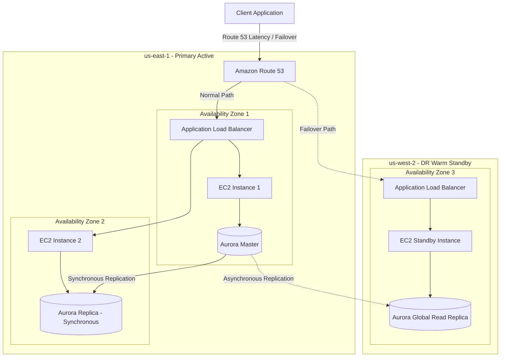

# High Availability (HA) & Disaster Recovery (DR) on AWS

High Availability (HA) ensures a system remains accessible and operational with minimal downtime, typically measured in "nines" (e.g., 99.99%). Disaster Recovery (DR) focuses on recovering a system after a catastrophic event, measured by recovery objectives (RTO and RPO).

---

## RTO and RPO Explained

*   **Recovery Time Objective (RTO)**: The maximum acceptable delay between system failure and service restoration. (How long can the system be down?)
*   **Recovery Point Objective (RPO)**: The maximum acceptable period of data loss measured in time. (How much data can we afford to lose?)

```
[Last Backup / Sync] <---------------- RPO ----------------> [Disaster Event] <---------------- RTO ----------------> [Service Restored]
```

---

## 🏛️ The 4 DR Strategies on AWS

| Strategy | RTO | RPO | Cost | Architecture Description |
| :--- | :--- | :--- | :--- | :--- |
| **Backup & Restore** | Hours | 24 Hours | **$** | Data is periodically backed up to S3. Infrastructure is recreated via CloudFormation/CDK templates after a disaster event occurs. |
| **Pilot Light** | 10s of Mins | Minutes | **$$** | Critical core data databases are replicated and kept active in the DR region (e.g., Aurora Global Replica). Application servers are turned off and only provisioned/started during failover. |
| **Warm Standby** | Minutes | Seconds | **$$$** | A scaled-down, fully functional duplicate of the environment runs continuously in the secondary region. During disaster, Auto Scaling groups expand the instances to handle full production load. |
| **Active-Active** | Real-time | Real-time | **$$$$** | Traffic is continuously routed to multiple fully active regions simultaneously. Global routing (Route 53 latency/routing) distributes loads. No failover time. |

---

## 📊 HA vs DR Architecture Diagram

The diagram below compares **Multi-AZ High Availability** (resilience to single data center failure) with **Multi-Region Disaster Recovery** (resilience to total AWS region failure).



---

## Core AWS Services for HA/DR

1.  **Amazon Route 53**: Handles DNS failover based on health checks. Supports Latency, Geolocation, and Failover routing policies.
2.  **AWS Backup**: Centralized management tool to schedule and automate volume, database, and system backups.
3.  **Amazon Aurora Global Database**: Provides low-latency global reads and fast replication recovery. Replicates data with a latency of less than 1 second.
4.  **AWS Elastic Disaster Recovery (DRS)**: Continuously replicates EC2 block storage to lightweight staging areas on AWS to minimize RTO and RPO.

---

## Common Pitfalls in HA/DR Designs
*   **Testing DR procedures manually or not at all**: DR plans must be tested via automated chaos injection (e.g., AWS Fault Injection Simulator) to ensure standard operations run without human intervention.
*   **Assuming Multi-AZ solves Multi-Region failures**: Multi-AZ protects against localized physical incidents (power outages, local fires). A region-wide outage or software failure requires Multi-Region configurations.
*   **Hardcoding Region-specific resources**: Storing static resource links, Amazon Machine Images (AMIs), or KMS keys that only exist in the primary region in deployment configurations.
*   **Asynchronous replication data loss unawareness**: Pilot Light and Warm Standby databases use asynchronous replication. Architects must understand that minor transactions written immediately before a catastrophic disaster may be lost.

---

## SA Interview Questions on HA/DR

### Question 1: How does Route 53 determine when to fail over to a standby region?
**Answer**: 
Route 53 uses **Health Checks** to monitor active endpoints (ALB, API Gateway, or custom server ping endpoints). 
If the health check fails to receive a successful response code for a configurable threshold (e.g., 3 consecutive retries), Route 53 marks the endpoint unhealthy and stops returning its IP address. Instead, Route 53 falls back to the healthy target record configured in the Failover Routing Policy.

### Question 2: In a Multi-Region Active-Active Aurora setup, how do you handle write conflicts?
**Answer**: 
True Multi-Master databases that allow concurrent, active, multi-directional writes across geographically separated regions are extremely difficult to configure and prone to conflicts. 
*   AWS **Aurora Multi-Master** only supports Multi-AZ operations, not Multi-Region.
*   To implement a Multi-Region active-active pattern, you should leverage **Amazon DynamoDB Global Tables**. DynamoDB uses a "Last-Writer-Wins" conflict resolution rule based on internal physical timestamps. 
*   If consistent transactional updates are absolutely necessary, you must use a single-region writer pattern with global read-replicas, or orchestrate application partition routing (e.g., routing European customers to EU databases, and US customers to US databases) to prevent write overlaps.

### Question 3: How do you calculate the RTO and RPO for a Backup & Restore strategy?
**Answer**: 
*   **RPO** is dictated by the frequency of your backups. If you run full daily backups at midnight, and the database crashes at 11:59 PM, you stand to lose 23 hours and 59 minutes of transactions. Therefore, the RPO is **24 Hours**.
*   **RTO** is dictated by the time it takes to launch the architecture, download the backups, import the tables, update Route 53, and boot application configurations. If the restore script takes 4 hours, your RTO is **4 Hours**.
