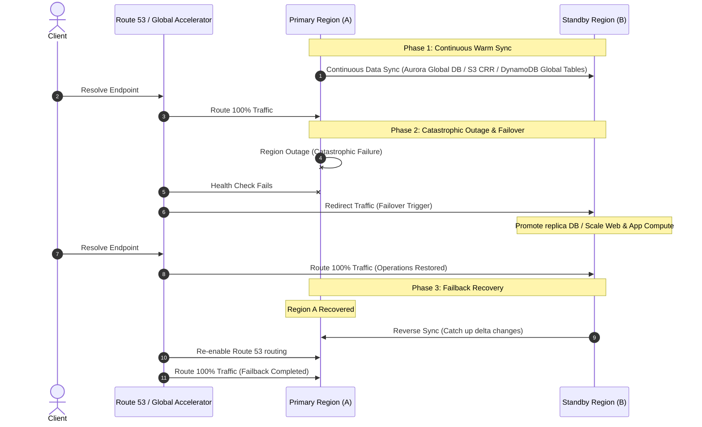
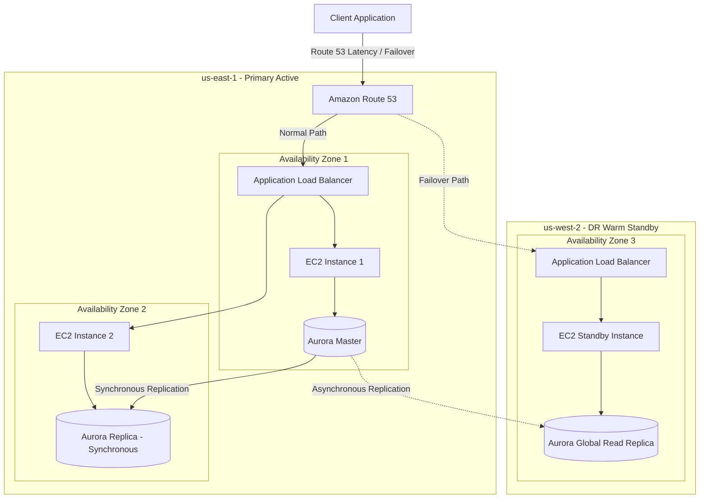

# High Availability (HA) & Disaster Recovery (DR) on AWS

## 🌐 The Resiliency Philosophy
As Werner Vogels (Amazon CTO) famously stated: **"Everything fails, all the time."** In cloud architecture, we accept failure as an inevitable eventuality rather than an anomaly. To address this, we must design systems capable of managing different scales of disruptions:

```
                  ┌──────────────────────────────────────────┐
                  │          Everything Fails                │
                  └────────────────────┬─────────────────────┘
                                       │
            ┌──────────────────────────┴──────────────────────────┐
            ▼                                                     ▼
┌───────────────────────┐                             ┌───────────────────────┐
│     Common Events     │                             │    One-Time Events    │
│  (Availability & FT)  │                             │  (Disaster Recovery)  │
└───────────┬───────────┘                             └───────────┬───────────┘
            │                                                     │
            ├─ EC2 instance crash                                 ├─ Total Region outage
            ├─ Disk / hardware failure                            ├─ Extreme natural disasters
            ├─ Transient network blips                            ├─ Major data corruption
            └─ Abrupt changes in traffic                          └─ Broad human misconfigurations
```

---

## 🏛️ Defining Resiliency, HA, FT, and DR

Understanding the differences between these core reliability concepts is critical for designing appropriate workloads:

| Concept | Primary Objective | Recovery Window | Complexity & Cost | Core AWS Mechanism |
| :--- | :--- | :--- | :--- | :--- |
| **Resiliency** | The capacity of a system to absorb difficulties and spring back into shape. | Continuous | Baseline Architecture | Auto Scaling, automated health checks, retries, and circuit breakers. |
| **Fault Tolerance (FT)** | Zero downtime and zero service degradation during common component failures. | Instant (0 seconds) | **$$$$** (High redundancy) | Highly redundant services like S3 (replicates across 3 AZs under the hood), SQS, SNS, and DynamoDB. |
| **High Availability (HA)** | Maximize uptime and access. Handles common disruptions with minimal, acceptable downtime. | Seconds to Minutes | **$$ - $$$** | Multi-AZ deployments, Elastic Load Balancer (ELB) routing, RDS Multi-AZ sync replication with auto-failover. |
| **Disaster Recovery (DR)** | Restore business continuity after a catastrophic event or regional outage. | Minutes to Hours | **$ - $$$$** (Depends on strategy) | Multi-Region replication, AWS Backup, Route 53 DNS failover, AWS Elastic Disaster Recovery (DRS). |

---

## 📊 Availability Metrics: Time-based vs. Request-based

AWS workloads measure availability using two distinct metrics, depending on traffic patterns and service-level agreements (SLAs).

### 1. Time-based Availability Metric
This metric evaluates the percentage of time that a system is fully operational and accessible.
$$\text{Availability (Time)} = \frac{\text{Total Time} - \text{Downtime}}{\text{Total Time}}$$

> [!NOTE]
> **ATM Time-Based Scenario**:
> An ATM broke down **2 times** over a period of **100 hours**. The average downtime to fix the ATM was **5 hours** per breakdown.
> *   **Total Downtime**: $2 \times 5 \text{ hours} = 10 \text{ hours}$.
> *   **Availability**: $\frac{100 - 10}{100} = 90\%$ availability.

### 2. Request-based Availability Metric
This metric measures the percentage of successful operations or requests out of the total requests processed.
$$\text{Availability (Request)} = \frac{\text{Successful Requests}}{\text{Total Requests}}$$

> [!NOTE]
> **ATM Request-Based Scenarios**:
> *   **Scenario A**: The ATM is used **10 times**, but the transaction succeeds only **8 times** due to internal faults.
>     *   **Availability**: $\frac{8}{10} = 80\%$ availability.
> *   **Scenario B (No Traffic)**: The ATM is down, but **no one is using the machine** during the outage.
>     *   **Availability**: Technically **0%** in terms of request outcomes, highlighting a limitation where request-based metrics may not accurately reflect operational readiness during zero-traffic windows.

---

## ⏱️ Recovery Objectives: RTO and RPO

Disaster recovery readiness is governed by two key metrics defined by business continuity needs:

*   **Recovery Time Objective (RTO)**: The maximum acceptable delay between system failure and service restoration. *(How quickly must we recover?)*
*   **Recovery Point Objective (RPO)**: The maximum acceptable period of data loss measured in time. *(How much data can we afford to lose/recreate?)*

```
[Last Sync/Backup] <─────── Data Loss (RPO) ───────> [Disaster Event] <─────── Downtime (RTO) ───────> [Service Restored]
```

---

## 🏛️ The 4 DR Strategies on AWS

AWS defines four primary DR strategies, presenting a clear trade-off between RTO/RPO objectives and cost:

```
Low ◄────────────────────────────────────────── RTO / RPO / Cost ──────────────────────────────────────────► High

   Backup & Restore                 Pilot Light                  Warm Standby               Multi-Site Active-Active
  (Hours RTO / RPO)            (10s of Mins RTO/RPO)           (Minutes RTO/RPO)             (Real-time RTO / RPO)
```

| Strategy | RTO Target | RPO Target | Cost | Architecture Description |
| :--- | :--- | :--- | :--- | :--- |
| **Backup & Restore** | Hours | Hours | **$** (Lowest) | Regular backups are stored and replicated. Infrastructure is provisioned from scratch via IaC only after a disaster. |
| **Pilot Light** | 10s of Mins | Minutes | **$$** | Core database replicates continuously. App/web servers are pre-configured but kept **turned OFF** in the DR region. |
| **Warm Standby** | Minutes | Seconds to Mins | **$$$** | Database replicates continuously. A **scaled-down, fully functional** app cluster runs **always ON** in the DR region. |
| **Active-Active** | Near Zero | Near Zero | **$$$$** (Highest) | Multiple regions actively serve production traffic concurrently. Multi-region database engines manage writes. |

> [!TIP]
> To see a concrete system design applying and comparing all four DR strategies for a cloud-native AWS application, see [Scenario 08: Cloud-Native Multi-Region DR Options](../scenarios/08-cloud-native-dr-options.md).

---

## 🔄 Disaster Recovery Operational Flows

To implement these strategies, architects must design distinct pipelines for continuous sync, failover routing, and failback recovery.



### 1. Backup & Restore (RTO: Hours, RPO: Hours)
*   **Sync Mechanism**: **AWS Backup** schedules snapshot copies of EBS volumes, RDS, EFS, and DynamoDB. S3 cross-region replication (CRR) copies backup files.
*   **Failover Process**:
    1.  Detect primary region failure.
    2.  Execute Terraform/CDK to spin up VPC, ALBs, and Auto Scaling Groups in the target region.
    3.  Restore RDS/EBS volumes from the latest replicated snapshots.
    4.  Update Route 53 DNS records to point to the new ALB.
*   **Failback Process**: Recreate backups in the DR region, copy back to the primary region, restore, and shift DNS back.

### 2. Pilot Light (RTO: 10s of Minutes, RPO: Minutes)
*   **Sync Mechanism**: Database replication is kept active (e.g., RDS read replica, Aurora Global Database). AMIs are copied across regions.
*   **Failover Process**:
    1.  Detect failure via Route 53 health checks.
    2.  Promote the RDS read replica to a standalone master database.
    3.  Launch EC2 instances from copied AMIs or scale the Auto Scaling Group minimum size from `0` to active targets.
    4.  Update DNS records to route traffic to the newly active servers.
*   **Failback Process**: Establish reverse replication from the promoted DR database to a new instance in the primary region, catch up, turn off the DR web instances, and shift DNS back.

### 3. Warm Standby (RTO: Minutes, RPO: Seconds)
*   **Sync Mechanism**: Continuous database replication. Web and app servers are deployed and running in a scaled-down state (e.g., ASG min: `1` or `2` instances).
*   **Failover Process**:
    1.  Route 53 health check fails. DNS automatically updates traffic routing (Failover Routing Policy).
    2.  RDS read replica is promoted to primary writer.
    3.  Auto Scaling scale-out alarms trigger, expanding the scaled-down EC2/ECS nodes to full production limits.
*   **Failback Process**: Reverse database replication, sync changes, scale down DR region compute, and switch Route 53 traffic back to the primary region.

### 4. Multi-Site Active-Active (RTO: Near Zero, RPO: Near Zero)
*   **Sync Mechanism**: Active-active multi-region replication.
    *   *NoSQL*: **Amazon DynamoDB Global Tables** replicates writes bi-directionally.
    *   *SQL*: **Amazon Aurora Global Database** uses storage-level asynchronous replication (typically < 1 second latency). Writes are sent to the primary region, while reads are local.
*   **Failover Process**:
    1.  Route 53 latency/weighted routing or AWS Global Accelerator detects regional endpoint failure.
    2.  Healthy regional endpoint immediately handles 100% of incoming requests.
    3.  (If using Aurora SQL) Trigger failover API to promote the secondary region's database to primary writer.
*   **Failback Process**: As soon as the failed region recovers, it joins the active pool automatically. (If using Aurora SQL) Coordinate writing direction swap to return to the original primary writer region.

---

---

## 📊 HA vs DR Architecture Diagram

The diagram below compares **Multi-AZ High Availability** (resilience to single data center failure) with **Multi-Region Disaster Recovery** (resilience to total AWS region failure).



---

## Core AWS Services for HA/DR

1.  **Amazon Route 53**: Handles DNS failover based on health checks. Supports Latency, Geolocation, and Failover routing policies.
2.  **AWS Backup**: Centralized management tool to schedule and automate volume, database, and system backups.
3.  **Amazon Aurora Global Database**: Provides low-latency global reads and fast replication recovery. Replicates data with a latency of less than 1 second.
4.  **AWS Elastic Disaster Recovery (DRS)**: Continuously replicates EC2 block storage to lightweight staging areas on AWS to minimize RTO and RPO.

---

## Common Pitfalls in HA/DR Designs
*   **Testing DR procedures manually or not at all**: DR plans must be tested via automated chaos injection (e.g., AWS Fault Injection Simulator) to ensure standard operations run without human intervention.
*   **Assuming Multi-AZ solves Multi-Region failures**: Multi-AZ protects against localized physical incidents (power outages, local fires). A region-wide outage or software failure requires Multi-Region configurations.
*   **Hardcoding Region-specific resources**: Storing static resource links, Amazon Machine Images (AMIs), or KMS keys that only exist in the primary region in deployment configurations.
*   **Asynchronous replication data loss unawareness**: Pilot Light and Warm Standby databases use asynchronous replication. Architects must understand that minor transactions written immediately before a catastrophic disaster may be lost.

---

## SA Interview Questions on HA/DR

### Question 1: How does Route 53 determine when to fail over to a standby region?
**Answer**: 
Route 53 uses **Health Checks** to monitor active endpoints (ALB, API Gateway, or custom server ping endpoints). 
If the health check fails to receive a successful response code for a configurable threshold (e.g., 3 consecutive retries), Route 53 marks the endpoint unhealthy and stops returning its IP address. Instead, Route 53 falls back to the healthy target record configured in the Failover Routing Policy.

### Question 2: In a Multi-Region Active-Active Aurora setup, how do you handle write conflicts?
**Answer**: 
True Multi-Master databases that allow concurrent, active, multi-directional writes across geographically separated regions are extremely difficult to configure and prone to conflicts. 
*   AWS **Aurora Multi-Master** only supports Multi-AZ operations, not Multi-Region.
*   To implement a Multi-Region active-active pattern, you should leverage **Amazon DynamoDB Global Tables**. DynamoDB uses a "Last-Writer-Wins" conflict resolution rule based on internal physical timestamps. 
*   If consistent transactional updates are absolutely necessary, you must use a single-region writer pattern with global read-replicas, or orchestrate application partition routing (e.g., routing European customers to EU databases, and US customers to US databases) to prevent write overlaps.

### Question 3: How do you calculate the RTO and RPO for a Backup & Restore strategy?
**Answer**: 
*   **RPO** is dictated by the frequency of your backups. If you run full daily backups at midnight, and the database crashes at 11:59 PM, you stand to lose 23 hours and 59 minutes of transactions. Therefore, the RPO is **24 Hours**.
*   **RTO** is dictated by the time it takes to launch the architecture, download the backups, import the tables, update Route 53, and boot application configurations. If the restore script takes 4 hours, your RTO is **4 Hours**.

### Question 4: What is the difference between active-passive and active-active disaster recovery, and how does AWS define the strategies within them?
**Answer**: 
In disaster recovery (DR) designs, the choice between active-passive and active-active depends on the acceptable trade-offs between RTO, RPO, and budget:

*   **Active-Passive DR**: The secondary region remains inactive or scaled-down, waiting to be promoted if the primary region fails. On AWS, there is no single strategy named "Active-Passive"; instead, it is an umbrella categorization covering three distinct AWS strategies (ordered from highest RTO/RPO to lowest):
    1.  **Backup and Restore (Highest RTO/RPO, Lowest Cost)**: Databases are backed up to S3 and replicated to the secondary region. If a disaster occurs, all resources must be provisioned from scratch and data restored from backups.
    2.  **Pilot Light**: The core database is kept running and replicated in the secondary region, but application servers (like EC2/ECS) are not running. They are only provisioned (usually via Terraform/CloudFormation) during failover.
    3.  **Warm Standby (Lowest RTO/RPO for Active-Passive)**: A scaled-down but fully functional duplicate of the environment runs continuously in the secondary region. During failover, the system automatically scales up to handle production traffic.
*   **Active-Active DR (Multi-Site)**: All regions actively serve production traffic concurrently. Route 53 routes requests globally based on policies (e.g., latency or geolocation). RTO and RPO are near real-time, but this strategy is highly complex and costly since it requires active multi-directional database replication and application deployment across both regions.

