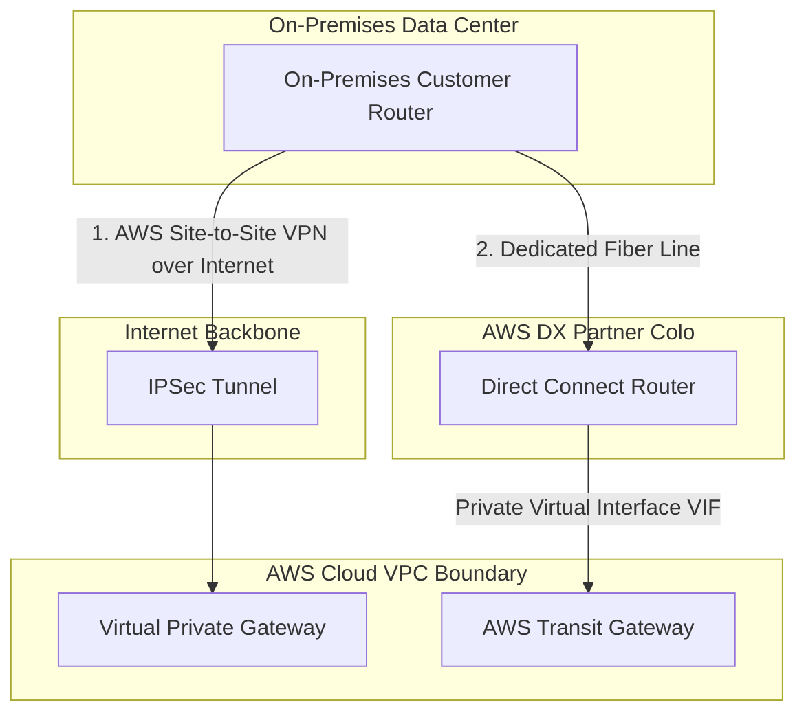

# Hybrid Cloud & Migration Patterns on AWS

Transitioning legacy architectures to the cloud requires robust migration strategies and seamless hybrid connectivity. AWS offers tools to securely bridge on-premises data centers with AWS environments and automate migration workloads.

---

## 🏛️ The 7 Rs of Migration Strategies

When evaluating corporate portfolios for cloud migrations, Solution Architects categorize applications into one of these seven migration paths:

```
[ Assess Corporate Application Portfolio ]
   │
   ├─► [ Retire ] ──────────► Decommission obsolete applications.
   ├─► [ Retain ] ──────────► Keep on-premises (due to legacy OS or high risk).
   ├─► [ Relocate ] ────────► Lift-and-shift VMware containers to AWS (VMware Cloud on AWS).
   ├─► [ Rehost ] ──────────► Direct "Lift & Shift" to EC2 with minimal modifications.
   ├─► [ Replatform ] ──────► "Lift, Tinker & Shift" (e.g., move database to RDS without code changes).
   ├─► [ Refactor ] ────────► Redesign using cloud-native services (e.g., rewrite monolith as Serverless).
   └─► [ Repurchase ] ──────► Replace with SaaS offerings (e.g., migrate on-prem mail to Office 365).
```

---

## 🌐 Hybrid Cloud Connectivity Architecture

The diagram below compares **AWS Site-to-Site VPN** (encrypted, fast deployment, routes over public internet) with **AWS Direct Connect** (physical dedicated line, consistent throughput, private routing).



---

## Core Hybrid & Migration Services

### 1. Hybrid Storage: AWS Storage Gateway
Bridges on-premises environments with AWS cloud storage.
*   **File Gateway**: Exposes S3 buckets as standard NFS/SMB file shares on-premises.
*   **Volume Gateway**: Exposes block storage volumes (iSCSI targets) to local servers, backing them up as EBS snapshots in AWS.
*   **Tape Gateway**: Replaces legacy physical tape backup infrastructure with virtual tapes in Amazon S3 Glacier.

### 2. Physical Data Transfer: AWS Snow Family
Physical storage appliances shipped by AWS to handle offline, large-scale migrations.
*   **Snowcone**: Compact, rugged 8 TB storage appliance.
*   **Snowball Edge**: Rugged data transfer appliance offering up to 80 TB usable capacity, supporting EC2 compute instances on-board.
*   **Snowmobile**: A heavy-duty semi-trailer capable of transferring up to 100 petabytes of data offline.

### 3. AWS Application Migration Service (MGN)
The recommended service for lift-and-shift migration of physical, virtual, or cloud servers to AWS. It uses continuous block-level replication to synchronize disk contents from source servers directly to staging areas on AWS, allowing zero-downtime cutovers.

---

## Common Pitfalls in Hybrid Design & Migration
*   **Ignoring Direct Connect Lead Times**: Designing architectures that rely on Direct Connect links for a migration starting in 2 weeks. Physical Direct Connect fibers can take several weeks or months to provision. (Mitigation: Deploy Site-to-Site VPN as an interim bridge).
*   **VPC IP Address Overlaps**: Creating VPC CIDR ranges that overlap with existing on-premises subnet blocks. Overlapping ranges prevent you from establishing VPN or Direct Connect routes.
*   **Migrating Bad Workloads**: Lifting and shifting legacy, broken monoliths directly to EC2 without evaluating if a platform upgrade or refactoring is required.

---

## SA Interview Questions on Hybrid Cloud

### Question 1: When should you choose AWS Site-to-Site VPN over AWS Direct Connect?
**Answer**: 
*   Choose **AWS Site-to-Site VPN** when you need a fast, low-cost connection that can be deployed in minutes. It encrypts traffic using IPsec and routes over the public internet, making it excellent for testing, dev environments, or as a secondary backup link.
*   Choose **AWS Direct Connect** when you require consistent network throughput, private network paths bypassing the public internet, and high-bandwidth capacities (1 Gbps to 100 Gbps). Direct Connect is optimal for production environments, heavy data migrations, and strict compliance environments.

### Question 2: How do you design a hybrid storage solution that caches active files locally while storing older files in S3?
**Answer**: 
Deploy **AWS Storage Gateway - Amazon S3 File Gateway** on-premises as a virtual machine.
1.  Configure the File Gateway to expose an NFS/SMB file share to your local servers.
2.  Map the Gateway to an **Amazon S3 bucket** configured with Lifecycle Policies.
3.  The File Gateway caches frequently accessed files in its local disk storage to support low-latency reads.
4.  As local files age or access frequency drops, the local cache evicts them. However, they remain accessible, as the gateway fetches them from S3 automatically when requested.

### Question 3: How does AWS Application Migration Service (MGN) perform migrations without downtime?
**Answer**: 
AWS MGN automates migrations through a highly secure, non-disruptive process:
1.  Install the **AWS MGN Replication Agent** on the target source servers.
2.  The Agent initiates continuous, block-level data replication over TLS to a lightweight staging area inside your target AWS account.
3.  Replication runs continuously in the background without affecting source application performance or requiring restarts.
4.  When you are ready to migrate, launch **Test Instances** to verify the environment.
5.  Perform a final cutover to transition users to the newly launched production instances on AWS, and terminate the source on-premises replication servers.
