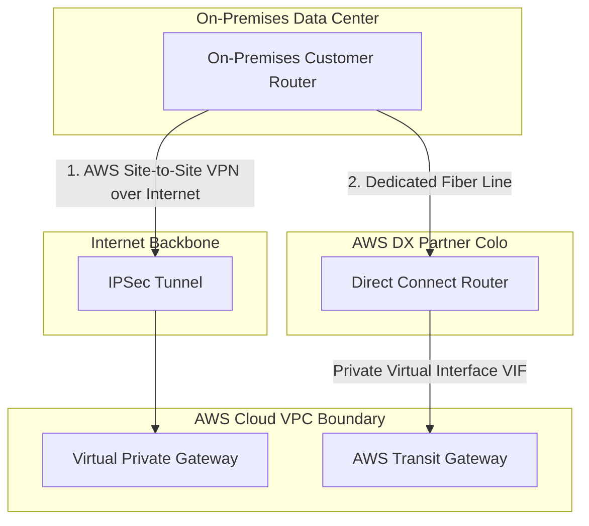

# Hybrid Cloud & Migration Patterns on AWS

Transitioning legacy architectures to the cloud requires robust migration strategies and seamless hybrid connectivity. AWS offers tools to securely bridge on-premises data centers with AWS environments and automate migration workloads.

---

## 🏛️ The 7 Rs of Migration Strategies

When evaluating corporate portfolios for cloud migrations, Solution Architects categorize applications into one of these seven migration paths:

```
[ Assess Corporate Application Portfolio ]
   │
   ├─► [ Retire ] ──────────► Decommission obsolete applications.
   ├─► [ Retain ] ──────────► Keep on-premises (due to legacy OS or high risk).
   ├─► [ Relocate ] ────────► Lift-and-shift VMware containers to AWS (VMware Cloud on AWS).
   ├─► [ Rehost ] ──────────► Direct "Lift & Shift" to EC2 with minimal modifications.
   ├─► [ Replatform ] ──────► "Lift, Tinker & Shift" (e.g., move database to RDS without code changes).
   ├─► [ Refactor ] ────────► Redesign using cloud-native services (e.g., rewrite monolith as Serverless).
   └─► [ Repurchase ] ──────► Replace with SaaS offerings (e.g., migrate on-prem mail to Office 365).
```

---

## 🌐 Hybrid Cloud Connectivity Architecture

The diagram below compares **AWS Site-to-Site VPN** (encrypted, fast deployment, routes over public internet) with **AWS Direct Connect** (physical dedicated line, consistent throughput, private routing).


```mermaid
graph TD
    subgraph AWS_Cloud [AWS Cloud VPC Boundary]
        VGW[Virtual Private Gateway]
        TGW[AWS Transit Gateway]
    end
    
    subgraph Public_Internet [Internet Backbone]
        IPSec[IPSec Tunnel]
    end
    
    subgraph Corporate_Data_Center [On-Premises Data Center]
        OnPremRouter[On-Premises Customer Router]
    end
    
    subgraph Direct_Connect_Location [AWS DX Partner Colo]
        DX_Router[Direct Connect Router]
    end
    
    OnPremRouter -->|1. AWS Site-to-Site VPN over Internet| IPSec
    IPSec --> VGW
    
    OnPremRouter -->|2. Dedicated Fiber Line| DX_Router
    DX_Router -->|Private Virtual Interface VIF| TGW
```

---

## Core Hybrid & Migration Services

### 1. Hybrid Storage: AWS Storage Gateway
Bridges on-premises environments with AWS cloud storage.
*   **File Gateway**: Exposes S3 buckets as standard NFS/SMB file shares on-premises.
*   **Volume Gateway**: Exposes block storage volumes (iSCSI targets) to local servers, backing them up as EBS snapshots in AWS.
*   **Tape Gateway**: Replaces legacy physical tape backup infrastructure with virtual tapes in Amazon S3 Glacier.

### 2. Physical Data Transfer: AWS Snow Family
Physical storage appliances shipped by AWS to handle offline, large-scale migrations.
*   **Snowcone**: Compact, rugged 8 TB storage appliance.
*   **Snowball Edge**: Rugged data transfer appliance offering up to 80 TB usable capacity, supporting EC2 compute instances on-board.
*   **Snowmobile**: A heavy-duty semi-trailer capable of transferring up to 100 petabytes of data offline.

### 3. AWS Application Migration Service (MGN)
The recommended service for lift-and-shift migration of physical, virtual, or cloud servers to AWS. It uses continuous block-level replication to synchronize disk contents from source servers directly to staging areas on AWS, allowing zero-downtime cutovers.

---

## Common Pitfalls in Hybrid Design & Migration
*   **Ignoring Direct Connect Lead Times**: Designing architectures that rely on Direct Connect links for a migration starting in 2 weeks. Physical Direct Connect fibers can take several weeks or months to provision. (Mitigation: Deploy Site-to-Site VPN as an interim bridge).
*   **VPC IP Address Overlaps**: Creating VPC CIDR ranges that overlap with existing on-premises subnet blocks. Overlapping ranges prevent you from establishing VPN or Direct Connect routes.
*   **Migrating Bad Workloads**: Lifting and shifting legacy, broken monoliths directly to EC2 without evaluating if a platform upgrade or refactoring is required.

---

## SA Interview Questions on Hybrid Cloud

### Question 1: When should you choose AWS Site-to-Site VPN over AWS Direct Connect?
**Answer**: 
*   Choose **AWS Site-to-Site VPN** when you need a fast, low-cost connection that can be deployed in minutes. It encrypts traffic using IPsec and routes over the public internet, making it excellent for testing, dev environments, or as a secondary backup link.
*   Choose **AWS Direct Connect** when you require consistent network throughput, private network paths bypassing the public internet, and high-bandwidth capacities (1 Gbps to 100 Gbps). Direct Connect is optimal for production environments, heavy data migrations, and strict compliance environments.

### Question 2: How do you design a hybrid storage solution that caches active files locally while storing older files in S3?
**Answer**: 
Deploy **AWS Storage Gateway - Amazon S3 File Gateway** on-premises as a virtual machine.
1.  Configure the File Gateway to expose an NFS/SMB file share to your local servers.
2.  Map the Gateway to an **Amazon S3 bucket** configured with Lifecycle Policies.
3.  The File Gateway caches frequently accessed files in its local disk storage to support low-latency reads.
4.  As local files age or access frequency drops, the local cache evicts them. However, they remain accessible, as the gateway fetches them from S3 automatically when requested.

### Question 3: How does AWS Application Migration Service (MGN) perform migrations without downtime?
**Answer**: 
AWS MGN automates migrations through a highly secure, non-disruptive process:
1.  Install the **AWS MGN Replication Agent** on the target source servers.
2.  The Agent initiates continuous, block-level data replication over TLS to a lightweight staging area inside your target AWS account.
3.  Replication runs continuously in the background without affecting source application performance or requiring restarts.
4.  When you are ready to migrate, launch **Test Instances** to verify the environment.
5.  Perform a final cutover to transition users to the newly launched production instances on AWS, and terminate the source on-premises replication servers.

### Question 4: How do you plan migration waves for 600 servers across 80 applications?
**Answer**:
1.  **Discover**: Run **AWS Application Discovery Service** (agent-based for network dependencies) and **Migration Evaluator** for right-sizing and the business case. Track everything in **AWS Migration Hub**.
2.  **Group by dependency, not by server**: Apps that share a database or talk constantly move together in one *move group*. Splitting them across a Direct Connect link adds latency to every call.
3.  **Assign a 7R** to each app (rehost with **MGN**, replatform databases with **DMS**, retire or retain the rest).
4.  **Wave 0 is a pilot**: Pick low-risk, low-dependency apps and prove the landing zone, networking, runbooks and rollback. Later waves (typically 2–4 weeks each) ramp in size and criticality.
5.  Each wave gets a cutover runbook, go/no-go criteria, a rollback plan and a hypercare window. Automate repeatable steps with **Migration Hub Orchestrator** templates.

### Question 5: After a DNS cutover to AWS, some users are still hitting the old on-prem servers. Walk me through it.
**Answer**:
*   **TTL not lowered early enough**: Drop the record TTL to 60s at least one *old* TTL period before cutover. Otherwise resolvers keep the cached answer for up to the old TTL (often 24h).
*   **Client-side caches**: JVM DNS caching (`networkaddress.cache.ttl`), OS resolvers, and hard-coded IPs or `/etc/hosts` entries in batch jobs and partner firewalls.
*   **Split-horizon DNS**: The public zone was updated but the on-prem internal zone, or a conditional forwarder, still returns the old address. Check Route 53 Resolver rules and the Private Hosted Zone.
*   **Verify** with `dig` against each resolver path, and watch source-side connection logs to find who is still connecting.
*   **Safe pattern**: Use Route 53 **weighted records** to shift traffic gradually. Keep the source in sync (MGN not yet finalized, DMS reverse replication) so rollback is simply flipping the record back.

### Question 6: You need to move 500 TB to S3 and have a 1 Gbps link. DataSync or Snowball?
**Answer**:
*   **Do the math first**: 500 TB over 1 Gbps at ~80% utilization is roughly **58 days**, and it saturates the link for production traffic.
*   **AWS DataSync**: Online, incremental, with built-in integrity checks, scheduling and bandwidth throttling. It targets S3/EFS/FSx. It is best when the link can carry the volume in your window, or for ongoing sync.
*   **Snowball Edge**: Offline bulk transfer, typically about a week per device round trip regardless of volume. It is best when bandwidth × time < data size, or the site has poor connectivity. Confirm current Snow device availability, since AWS has been narrowing the Snow Family.
*   **Common hybrid**: Seed the bulk data with Snowball, then run **DataSync** for the delta that changed while devices were in transit, and cut over.

### Question 7: Design a highly resilient Direct Connect architecture for a critical production workload.
**Answer**:
*   Follow the **AWS Direct Connect Resiliency Toolkit** models:
    *   **Maximum resiliency**: Separate connections on separate devices in **at least two DX locations**.
    *   **High resiliency**: One connection in each of two DX locations.
    *   **Development/test**: Two connections in a single location, which does not protect against a location outage.
*   Terminate on a **Direct Connect Gateway → Transit Gateway** so one set of connections serves many VPCs and regions.
*   Use **BGP** for active/active or active/passive (local preference communities, AS_PATH prepending), and enable **BFD** for sub-second failover.
*   Add a **Site-to-Site VPN** as a last-resort backup, and use **MACsec** or IPsec-over-DX if encryption is required.
*   Regularly test failover with the DX **failover testing** feature, which brings BGP sessions down on purpose.
