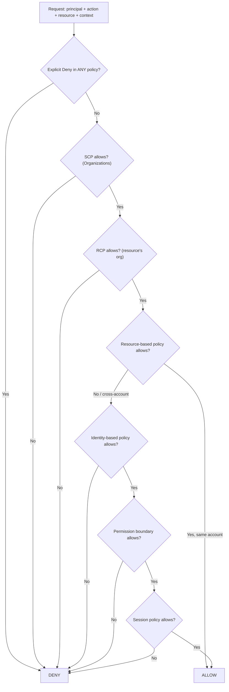

# IAM Deep-Dive on AWS

## 🔐 Introduction
IAM is the control plane for every other security control on AWS: a perfectly isolated VPC is irrelevant if a CI role has `*:*`. Senior interviews go well past "use least privilege". They test whether you can trace how a request is evaluated across SCPs, resource policies, and boundaries, design cross-account access safely, and scale permissions across hundreds of accounts.

> Related guides: SCP basics and landing zones live in [Multi-Account Strategy](multi-account-strategy.md); KMS, WAF, and S3 bucket hardening in [Security & Compliance](security-and-compliance.md); Kubernetes RBAC in [Kubernetes on EKS](kubernetes-on-eks.md); VPC endpoint policies in [VPC Network Design](vpc-network-design.md).

---

## ⚖️ Policy Evaluation Logic

Every request starts as an **implicit deny**. AWS gathers all applicable policies, and:
1.  An **explicit `Deny`** in *any* policy wins, always.
2.  Every **guardrail** that applies (SCP, RCP, permission boundary, session policy) must contain an `Allow`. Guardrails never grant; they only cap.
3.  At least one **grant** (identity-based or resource-based policy) must `Allow`.



**Nuances interviewers probe**:
*   **Same account**: a resource policy `Allow` naming the user or role *session* ARN can grant access on its own. If it names the *role* ARN, boundaries and session policies still apply.
*   **Cross-account**: **both** sides must allow – the caller's identity policy *and* the resource policy (or trust policy for `sts:AssumeRole`).
*   **KMS key policies and role trust policies** are mandatory resource policies: an IAM policy alone never grants access to a KMS key unless the key policy delegates to the account.
*   SCPs and RCPs **do not affect the management account**, and SCPs don't restrict service-linked roles.

---

## 🧾 Policy Types at a Glance

| Policy Type | Attached To | Grants? | Typical Use |
| :--- | :--- | :--- | :--- |
| **Identity-based** | User, group, role | Yes | What this principal can do |
| **Resource-based** | S3 bucket, KMS key, SQS, Lambda, role trust | Yes | Who can access this resource (incl. other accounts) |
| **SCP** | Org root / OU / account | No (cap on principals) | Org-wide guardrails, region lock |
| **RCP** | Org root / OU / account | No (cap on resources) | Data perimeter: "no one outside the org touches our S3/KMS/STS/SQS/Secrets" |
| **Permission boundary** | User or role | No (cap) | Safe delegation of IAM admin |
| **Session policy** | Passed on `AssumeRole` / federation | No (cap) | Scope down a session further |
| **VPC endpoint policy** | Interface / gateway endpoint | No (cap) | Restrict what flows through the endpoint |

---

## 🤝 Cross-Account Access

| Approach | How | Pros | Cons |
| :--- | :--- | :--- | :--- |
| **Role assumption** | Caller does `sts:AssumeRole` into a role in the target account | Works for any service; CloudTrail shows the session; caller **gives up** its own permissions | Can't combine source and target permissions (e.g., copy S3 → S3 across accounts needs both) |
| **Resource policy** | Target resource grants the external principal directly | Caller keeps its own identity; good for S3, SQS, SNS, KMS, Lambda | Only services that support resource policies |

### The Confused Deputy Problem
A third-party SaaS (the "deputy") holds a role that can assume roles in many customer accounts. An attacker who is also a customer gives the vendor **your** role ARN, tricking it into acting in your account. **Mitigation**: the vendor generates a unique **`sts:ExternalId`** per customer and your trust policy requires it.

```json
{
  "Version": "2012-10-17",
  "Statement": [{
    "Effect": "Allow",
    "Principal": { "AWS": "arn:aws:iam::111122223333:role/VendorScanner" },
    "Action": "sts:AssumeRole",
    "Condition": { "StringEquals": { "sts:ExternalId": "c7f1e2a9-customer-4471" } }
  }]
}
```

For **AWS service principals** (e.g., SNS publishing to your SQS queue, CloudTrail writing to S3), the equivalent is `aws:SourceArn` / `aws:SourceAccount`, which ensures the service is acting on behalf of *your* resource:

```json
{
  "Effect": "Allow",
  "Principal": { "Service": "sns.amazonaws.com" },
  "Action": "sqs:SendMessage",
  "Resource": "arn:aws:sqs:us-east-1:444455556666:orders-queue",
  "Condition": { "ArnEquals": { "aws:SourceArn": "arn:aws:sns:us-east-1:444455556666:orders-topic" } }
}
```

---

## 🧱 Permission Boundaries for Delegated Admin

Goal: let application teams create roles for their Lambdas **without** being able to escalate to admin. The platform team grants `iam:CreateRole` only if the new role carries a specific boundary, and denies tampering with that boundary.

```json
{
  "Version": "2012-10-17",
  "Statement": [
    {
      "Sid": "CreateRolesOnlyWithBoundary",
      "Effect": "Allow",
      "Action": ["iam:CreateRole", "iam:PutRolePolicy", "iam:AttachRolePolicy"],
      "Resource": "arn:aws:iam::444455556666:role/app-team/*",
      "Condition": {
        "StringEquals": { "iam:PermissionsBoundary": "arn:aws:iam::444455556666:policy/AppTeamBoundary" }
      }
    },
    {
      "Sid": "NoBoundaryTampering",
      "Effect": "Deny",
      "Action": ["iam:DeleteRolePermissionsBoundary", "iam:CreatePolicyVersion", "iam:DeletePolicy"],
      "Resource": [
        "arn:aws:iam::444455556666:role/*",
        "arn:aws:iam::444455556666:policy/AppTeamBoundary"
      ]
    },
    {
      "Sid": "PassOnlyTeamRoles",
      "Effect": "Allow",
      "Action": "iam:PassRole",
      "Resource": "arn:aws:iam::444455556666:role/app-team/*",
      "Condition": { "StringEquals": { "iam:PassedToService": "lambda.amazonaws.com" } }
    }
  ]
}
```

Effective permissions of any role the team creates = **identity policy ∩ AppTeamBoundary**.

---

## 🏷️ ABAC vs RBAC

| Aspect | RBAC (role-based) | ABAC (attribute/tag-based) |
| :--- | :--- | :--- |
| Model | One policy per job function / resource set | One policy matching principal tags to resource tags |
| Scaling | Policies grow with every new project | Same policy covers new projects automatically |
| Risk | Policy sprawl, ARN lists | Tag governance: who can set/modify tags must be locked down |
| Best for | Small, stable teams | Many teams/projects, Identity Center session tags |

```json
{
  "Effect": "Allow",
  "Action": ["ec2:StartInstances", "ec2:StopInstances"],
  "Resource": "arn:aws:ec2:*:444455556666:instance/*",
  "Condition": { "StringEquals": { "aws:ResourceTag/project": "${aws:PrincipalTag/project}" } }
}
```

Pair ABAC with an SCP that denies `ec2:CreateTags`/`DeleteTags` on the `project` key unless `aws:PrincipalTag/project` matches, otherwise users can re-tag resources to gain access.

---

## 🏢 IAM Identity Center & Permission Sets

**IAM Identity Center** (successor to AWS SSO) is the recommended way for humans to access a multi-account organization:
*   Connect an IdP (Entra ID, Okta, Google) via SAML 2.0 and sync users/groups via **SCIM**.
*   Define **permission sets** (managed + inline policies + optional boundary) once; assign `group × permission set × account`. Identity Center provisions an `AWSReservedSSO_*` role in each target account.
*   Pass IdP attributes (department, cost center) as **session tags** for ABAC.
*   Users get short-lived credentials via the portal or `aws sso login`. **No IAM users, no long-lived access keys.**

---

## ⚙️ Roles for Workloads

| Workload | Mechanism | Key Detail |
| :--- | :--- | :--- |
| **EC2** | Instance profile | Credentials from IMDS; **enforce IMDSv2** (`HttpTokens=required`) to block SSRF credential theft |
| **Lambda / ECS tasks** | Execution role / task role | Separate the ECS *task execution role* (pull image, logs) from the *task role* (app permissions) |
| **EKS (IRSA)** | OIDC provider + `sts:AssumeRoleWithWebIdentity` | Trust policy pins `sub` to `system:serviceaccount:<ns>:<sa>` |
| **EKS Pod Identity** | EKS Pod Identity Agent + association | No per-cluster OIDC provider; trust `pods.eks.amazonaws.com`; reusable across clusters |
| **CI/CD (GitHub, GitLab)** | OIDC federation | No stored access keys; trust pinned to repo and branch |

GitHub Actions OIDC trust policy, restricted to the `main` branch of one repository:

```json
{
  "Version": "2012-10-17",
  "Statement": [{
    "Effect": "Allow",
    "Principal": { "Federated": "arn:aws:iam::444455556666:oidc-provider/token.actions.githubusercontent.com" },
    "Action": "sts:AssumeRoleWithWebIdentity",
    "Condition": {
      "StringEquals": {
        "token.actions.githubusercontent.com:aud": "sts.amazonaws.com",
        "token.actions.githubusercontent.com:sub": "repo:acme/payments-api:ref:refs/heads/main"
      }
    }
  }]
}
```

> [!WARNING]
> A `sub` condition of `repo:acme/*` or a missing `sub` check lets **any** repository (or fork workflow) assume the deploy role. Always pin the repo and ideally the branch or environment.

---

## 🔎 Access Analyzer & the Least-Privilege Workflow

**IAM Access Analyzer** capabilities:
*   **External access findings**: resources (S3, KMS, roles, SQS, Secrets...) shared outside your account/org zone of trust.
*   **Unused access findings**: unused roles, access keys, passwords, and unused permissions within policies.
*   **Policy validation**: 100+ checks (errors, security warnings, e.g., `iam:PassRole` with `*`).
*   **Custom policy checks**: CI gate such as `CheckNoNewAccess` or `CheckAccessNotGranted` (e.g., block any policy granting `s3:DeleteBucket`).
*   **Policy generation**: builds a least-privilege policy from the role's actual **CloudTrail** activity.

**Workflow**:
1.  Start with a scoped AWS managed policy in dev (or a broader draft) and run the workload through realistic tests.
2.  **Generate a policy** from 30–90 days of CloudTrail history.
3.  Tighten resources (replace `*` with ARNs) and add conditions; run **policy validation** + custom checks in the pipeline.
4.  Deploy; monitor **unused access** findings and last-accessed data to keep trimming over time.

---

## 🗝️ Common Condition Keys

| Key | Use |
| :--- | :--- |
| `aws:PrincipalOrgID` / `aws:ResourceOrgID` | Data perimeter: only principals/resources in my organization |
| `aws:SourceIp` / `aws:SourceVpc` / `aws:SourceVpce` | Network perimeter (note: `SourceIp` doesn't apply to traffic via VPC endpoints) |
| `aws:SecureTransport` | Deny non-TLS requests |
| `aws:MultiFactorAuthPresent` | Require MFA for sensitive actions |
| `aws:RequestedRegion` | Region restriction (usually in SCPs) |
| `aws:PrincipalTag` / `aws:ResourceTag` / `aws:RequestTag` / `aws:TagKeys` | ABAC and tag enforcement on create |
| `aws:SourceArn` / `aws:SourceAccount` | Confused-deputy protection for service principals |
| `aws:CalledVia` / `aws:ViaAWSService` | Allow only when called through a service (e.g., CloudFormation) |
| `iam:PassedToService` / `iam:PermissionsBoundary` | Constrain `PassRole` and delegated role creation |

---

## Common Pitfalls in IAM Design
*   **`iam:PassRole` on `*`**: lets a user launch EC2/Lambda with any role, including admin roles – a classic privilege escalation path.
*   **Long-lived access keys** in CI systems and laptops instead of OIDC and Identity Center.
*   **Trust policies with `"Principal": {"AWS": "*"}`** or an account root without conditions.
*   **Using `NotAction` with `Allow`**, which silently grants every current and future action not listed.

---

## 📋 SA Interview Questions on IAM

### Question 1: A developer's identity policy allows `s3:GetObject` on a bucket, but they still get `AccessDenied`. How do you debug it?
**Answer**:
Walk the evaluation chain: (1) an **explicit deny** in the bucket policy (e.g., `aws:SourceVpce` or `aws:PrincipalOrgID` condition); (2) an **SCP or RCP** denying S3 or the region; (3) a **permission boundary** or **session policy** that doesn't include `s3:GetObject`; (4) for SSE-KMS objects, missing **`kms:Decrypt`** in the key policy/identity policy; (5) cross-account bucket without a matching bucket policy; (6) VPC endpoint policy. The CloudTrail event and the enriched `AccessDenied` message usually name the policy type responsible; the **IAM policy simulator** confirms it.

### Question 2: Role assumption vs resource-based policy for cross-account access – when do you use each?
**Answer**:
Use **resource policies** when the caller must keep its own permissions, e.g., a Lambda in account A reads a bucket in account B and writes to its own DynamoDB table. Use **role assumption** for services without resource policies, for broad admin access, or when the target account should own the permission set. Either way, the caller's identity policy must also allow the action.

### Question 3: Explain the confused deputy problem and how AWS mitigates it.
**Answer**:
A trusted intermediary is tricked into using its privileges on behalf of the wrong party. For third parties, require a per-customer **`sts:ExternalId`** in the trust policy. For AWS services acting on your resources, use **`aws:SourceArn`** and **`aws:SourceAccount`** conditions so the service can only act for your specific resource.

### Question 4: How do you let teams create their own IAM roles without risking privilege escalation?
**Answer**:
**Permission boundaries**. Grant `iam:CreateRole` conditioned on `iam:PermissionsBoundary` equal to an approved boundary, restrict role paths (`role/app-team/*`), constrain `iam:PassRole` with `iam:PassedToService`, and deny modifying or deleting the boundary policy. Any role they create is capped by the boundary regardless of what they attach.

### Question 5: SCPs vs permission boundaries vs RCPs – what's the difference?
**Answer**:
All three cap permissions and none grant. **SCPs** cap what *principals in member accounts* can do (org-wide). **Permission boundaries** cap a *single user or role* within an account (delegation). **RCPs** cap what *anyone, including external principals*, can do to *resources* in your org, making them ideal for data perimeters like "no access to our S3 from outside the organization".

### Question 6: How would you remove all long-lived credentials from a GitHub Actions → AWS deployment pipeline?
**Answer**:
Register GitHub's OIDC provider in each target account, create a deploy role whose trust policy pins `aud` to `sts.amazonaws.com` and `sub` to the exact repo/branch or environment, and use `aws-actions/configure-aws-credentials` with `role-to-assume`. Scope the role to the deployment's needs, add an SCP denying `iam:CreateAccessKey`, and use Access Analyzer unused-access findings to confirm no keys remain.

### Question 7: IRSA vs EKS Pod Identity – which would you pick for a new platform?
**Answer**:
**Pod Identity** for new clusters: no per-cluster OIDC provider to manage, one trust policy (`pods.eks.amazonaws.com`) reusable across clusters, associations managed via the EKS API, and session tags (cluster, namespace, service account) for ABAC. **IRSA** remains necessary for self-managed Kubernetes, Fargate pods, or where Pod Identity isn't supported. Both beat node instance roles, which grant every pod on the node the same permissions.

### Question 8: How do you get to least privilege for an existing role that currently has `AdministratorAccess`?
**Answer**:
Check **last-accessed information** for the services actually used, then run **Access Analyzer policy generation** over 60–90 days of CloudTrail. Refine the draft with resource ARNs and conditions, validate it, and roll it out in a lower environment first. Watch CloudTrail for `AccessDenied` spikes, remove `AdministratorAccess`, and keep tracking **unused access** findings.
