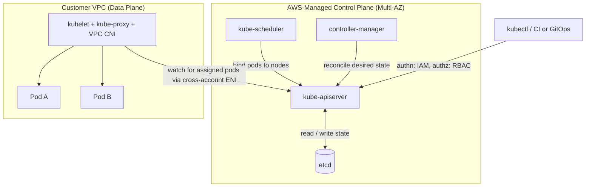

# Kubernetes Core Concepts on Amazon EKS

Kubernetes is the open-source standard for container orchestration. Amazon EKS runs the Kubernetes control plane for you and integrates it with AWS networking, IAM, storage, and load balancing. This guide maps each core Kubernetes concept to its EKS implementation. For the ECS vs. EKS decision and sidecar/deployment strategies, see [Microservices on ECS vs. EKS](microservices-on-eks-ecs.md); for GitOps delivery, see [CI/CD & GitOps](cicd-and-gitops.md).

---

## 🏗️ Control Plane vs. Data Plane on EKS

EKS manages the control plane (API server, etcd, scheduler, controller manager) across multiple AZs. You own the data plane (worker nodes) and the workloads on it.



*   **etcd** stores all cluster state and is fully managed on EKS. Enable **envelope encryption of Secrets** with a KMS key.
*   **Compute options**: Managed Node Groups, Fargate profiles, EKS Auto Mode, or Karpenter-provisioned nodes.

---

## 🧱 Workload Objects

| Object | Purpose | Key Facts |
| :--- | :--- | :--- |
| **Pod** | Smallest deployable unit; 1+ containers sharing network and volumes. | Ephemeral. Gets one VPC IP on EKS. |
| **Deployment** | Declarative stateless rollouts on top of ReplicaSets. | Rolling update, rollback via `kubectl rollout undo`. |
| **StatefulSet** | Stable identity and storage per pod. | Ordered startup; use with EBS PVCs. |
| **DaemonSet** | One pod per node. | Log agents, CNI, node exporters. |
| **Job / CronJob** | Run-to-completion and scheduled tasks. | Batch, migrations. |

### Least-Privilege Deployment Example

```yaml
apiVersion: apps/v1
kind: Deployment
metadata: { name: orders, namespace: shop }
spec:
  replicas: 3
  selector: { matchLabels: { app: orders } }
  template:
    metadata: { labels: { app: orders } }
    spec:
      serviceAccountName: orders-sa
      securityContext: { runAsNonRoot: true, seccompProfile: { type: RuntimeDefault } }
      containers:
        - name: orders
          image: 111122223333.dkr.ecr.us-east-1.amazonaws.com/orders:1.4.2
          resources: { requests: { cpu: 250m, memory: 256Mi }, limits: { memory: 512Mi } }
          securityContext: { allowPrivilegeEscalation: false, readOnlyRootFilesystem: true, capabilities: { drop: ["ALL"] } }
          readinessProbe: { httpGet: { path: /ready, port: 8080 } }
          livenessProbe: { httpGet: { path: /healthz, port: 8080 }, initialDelaySeconds: 15 }
```

---

## 🌐 Services, Ingress, and Networking

### Service Types

| Type | Behavior on EKS |
| :--- | :--- |
| **ClusterIP** | Internal virtual IP. Default. |
| **LoadBalancer** | With the **AWS Load Balancer Controller** (or EKS Auto Mode), provisions an **NLB**. Without it, the legacy in-tree provider creates a Classic Load Balancer. |
| **Headless** (`clusterIP: None`) | DNS returns pod IPs. Used by StatefulSets. |

### Ingress
An **Ingress** routes HTTP(S) by host/path. On EKS, the **AWS Load Balancer Controller** turns an Ingress into an **ALB**. Use `alb.ingress.kubernetes.io/target-type: ip` to send traffic straight to pod IPs (skips a node hop).

### Amazon VPC CNI
*   Every pod receives a **real VPC IP** from the node's ENIs, so pods are directly routable and security-group aware.
*   **Limit**: pods per node is bounded by ENI count times IPs per ENI. Mitigate with **prefix delegation** or a secondary CIDR (100.64.0.0/10).
*   **NetworkPolicy**: default is allow-all. Enforce default-deny per namespace, then allow specific flows (VPC CNI supports NetworkPolicy natively, or use Calico/Cilium).

---

## 📈 Scaling: Pods and Nodes

| Layer | Tool | Trigger / Notes |
| :--- | :--- | :--- |
| **Pods (horizontal)** | **HPA** | CPU, memory, or custom metrics (needs metrics-server). |
| **Pods (vertical)** | **VPA** | Recommends or sets requests. Do not combine with HPA on the same CPU/memory metric. |
| **Nodes** | **Cluster Autoscaler** | Scales Auto Scaling Groups when pods are Pending. Slower, ASG-bound. |
| **Nodes** | **Karpenter** | Watches unschedulable pods, launches right-sized EC2 (including Spot) directly, and consolidates underused nodes. |

*   **Karpenter** uses a `NodePool` (constraints: instance families, Spot/On-Demand, limits) and an `EC2NodeClass` (AMI, subnets, security groups by tag). It is typically faster and cheaper than Cluster Autoscaler.
*   Pod scaling only works if **resource requests are set**. HPA computes utilization as a percentage of the request.

---

## 🔐 Identity and Access: RBAC, IRSA, and Pod Identity

Two separate layers exist. Do not confuse them.

| Layer | Question Answered | Mechanism |
| :--- | :--- | :--- |
| **Cluster access (human/CI to K8s API)** | Who are you and what can you do in Kubernetes? | **EKS access entries** (IAM principal to Kubernetes group) plus **RBAC** Roles/RoleBindings. Replaces the legacy `aws-auth` ConfigMap. |
| **Pod to AWS APIs** | What can this pod do in AWS? | **IRSA** or **EKS Pod Identity**. |

### RBAC Least Privilege

Grant namespaced `Role` and `RoleBinding` objects with explicit verbs (for example `get`, `list`, `watch` on `pods` and `pods/log`) bound to an IAM-mapped group. Avoid wildcards and never bind `cluster-admin` to workloads.

### IRSA vs. EKS Pod Identity

| Feature | IRSA | EKS Pod Identity |
| :--- | :--- | :--- |
| **Setup** | OIDC provider per cluster; trust policy names the OIDC issuer and service account. | Install the Pod Identity Agent add-on; create an association (cluster, namespace, service account, role). |
| **Trust policy** | Cluster-specific (breaks on cluster rebuild). | Generic `pods.eks.amazonaws.com` principal. Reusable across clusters. |
| **Scale** | Trust policy size limits; OIDC per cluster. | Simpler at scale; supports role session tags. |
| **Fargate / cross-account** | Works on Fargate. | Not supported on Fargate; chain roles for cross-account. |

Scope the role to the exact actions and resources the pod needs (for example `s3:GetObject` on one bucket prefix). Never attach permissions to the node instance role for application needs.

---

## 💾 Storage

*   **EBS CSI driver**: block storage, `ReadWriteOnce`, **AZ-bound**. Use `volumeBindingMode: WaitForFirstConsumer` so the volume is created in the pod's AZ. Ideal for StatefulSets and databases.
*   **EFS CSI driver**: shared NFS, `ReadWriteMany`, multi-AZ. Works with Fargate.
*   CSI drivers need IAM permissions via IRSA or Pod Identity; enable KMS encryption on the StorageClass.

---

## 🩺 Probes and Resource Management

| Probe | Failure Action | Guidance |
| :--- | :--- | :--- |
| **startupProbe** | Blocks other probes until success. | For slow-booting apps (JVM). |
| **readinessProbe** | Pod removed from Service endpoints (not restarted). | Check local readiness only. |
| **livenessProbe** | Container restarted. | Never check downstream dependencies (avoids restart storms). |

*   **Requests** drive scheduling and HPA; **limits** cap usage. Exceeding a CPU limit causes throttling; exceeding a memory limit causes an **OOMKill**.
*   Use **LimitRange**, **ResourceQuota**, and **PodDisruptionBudgets** (protect availability during drains and consolidation).

---

## 🛠️ Troubleshooting Cheat Sheet

Start with `kubectl get pods -n <ns>`, then `kubectl describe pod <pod>` (Events section), then logs.

| Symptom | Likely Causes | Diagnosis Commands |
| :--- | :--- | :--- |
| **CrashLoopBackOff** | App crash on start, bad config or secret, failing liveness probe, missing dependency. | `kubectl logs <pod> --previous`<br>`kubectl describe pod <pod>` (exit code, Last State)<br>`kubectl get events --sort-by=.lastTimestamp` |
| **Pending** | Insufficient CPU/memory, node selector/taint mismatch, unbound PVC, no IPs in subnet, AZ mismatch for EBS. | `kubectl describe pod <pod>` (look for `FailedScheduling`)<br>`kubectl get pvc`<br>`kubectl describe node <node>`<br>`kubectl logs -n karpenter deploy/karpenter` |
| **OOMKilled** (exit code 137) | Memory limit too low, memory leak, JVM heap larger than the container limit. | `kubectl describe pod <pod>` (Reason: OOMKilled)<br>`kubectl top pod --containers`<br>Raise limit or tune the runtime (for example `-XX:MaxRAMPercentage`). |
| **Service unreachable** | Label mismatch, failing readiness, security group or NetworkPolicy block. | `kubectl get endpointslices -l kubernetes.io/service-name=<svc>`<br>`kubectl port-forward svc/<svc> 8080:80` |

---

## Common Pitfalls on EKS
*   **No resource requests**: HPA cannot work and the scheduler overpacks nodes.
*   **Subnet IP exhaustion** from VPC CNI.
*   **Broad access**: RBAC wildcards or an unrestricted public API endpoint.

---

## SA Interview Questions on Kubernetes & EKS

### Question 1: What does AWS manage in EKS, and what remains your responsibility?
**Answer**: AWS manages the control plane (API server, etcd, scheduler, controllers) across multiple AZs, including patching and availability. You manage worker nodes (unless using Fargate or Auto Mode), add-on versions, workload configuration, RBAC, network policies, IAM for pods, and cluster version upgrades.

### Question 2: How does a request reach a pod on EKS?
**Answer**: Traffic hits an ALB or NLB created by the AWS Load Balancer Controller. With `target-type: ip` it targets pod VPC IPs directly, using EndpointSlices that include only pods passing readiness. Inside the cluster, kube-proxy routes ClusterIP traffic and CoreDNS resolves service names.

### Question 3: IRSA versus EKS Pod Identity. Which would you choose?
**Answer**: Pod Identity is the default for new clusters because its trust policy is generic (`pods.eks.amazonaws.com`), so roles are reusable across clusters with no OIDC provider to manage. Use IRSA when you need Fargate support or are running clusters or versions that do not support the Pod Identity Agent. Both give per-pod, temporary, least-privilege credentials, unlike node instance roles that all pods share.

### Question 4: Compare Cluster Autoscaler and Karpenter.
**Answer**: Cluster Autoscaler adjusts the desired size of pre-defined Auto Scaling Groups, so instance types are fixed per group and scale-up is slower. Karpenter reacts to unschedulable pods, picks the best-fit instance type and purchase option (Spot or On-Demand) from NodePool constraints, launches EC2 directly, and consolidates or removes underused nodes. The result is faster scaling and lower cost.

### Question 5: A pod is stuck in Pending. Walk through your diagnosis.
**Answer**: Run `kubectl describe pod` and read the Events. `Insufficient cpu/memory` means nodes are full, so check Karpenter or Cluster Autoscaler. A selector or taint mismatch means fix the pod spec or NodePool. An unbound PVC or EBS volume in another AZ points to StorageClass topology. `failed to assign an IP` means subnet IP exhaustion.

### Question 6: A container shows OOMKilled repeatedly. What do you do?
**Answer**: Confirm with `kubectl describe pod` (exit code 137, Reason OOMKilled) and measure actual usage with `kubectl top pod --containers` or Container Insights. Then raise the limit if the need is legitimate, tune the runtime heap (for example JVM `MaxRAMPercentage`), or fix the leak. Use VPA recommendations to right-size.

### Question 7: How do you secure pod-to-pod and pod-to-AWS access on EKS?
**Answer**: For pod-to-pod, apply default-deny NetworkPolicies per namespace and allow only required flows, optionally with security groups for pods or a service mesh for mTLS. For pod-to-AWS, use Pod Identity or IRSA with narrowly scoped IAM policies, block IMDS access from pods (require IMDSv2 *and* set the hop limit to 1 on nodes; IMDSv2 alone does not stop pods), and use a private cluster endpoint with KMS envelope encryption for Secrets.
