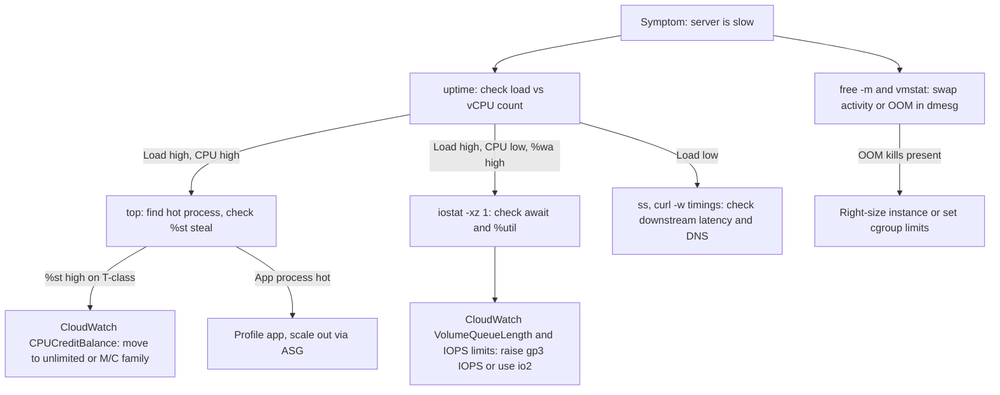

# Linux Essentials & Virtualization on Amazon EC2

Nearly every EC2 workload and ECS/EKS node runs Linux, and a Solutions Architect must be able to reason about boot, processes, storage, networking, and performance when a production box misbehaves. This guide covers those fundamentals, EC2 virtualization (Xen to Nitro), and the AWS tooling to build, launch, and access instances safely. For fleet configuration and patching, see [configuration-management-ansible-ssm.md](./configuration-management-ansible-ssm.md); for provisioning instances as code, see [terraform.md](./terraform.md).

---

## 🐧 Linux Essentials for Cloud Engineers

### Boot Process
```
 Firmware (UEFI/BIOS) -> GRUB2 -> Kernel + initramfs -> systemd (PID 1) -> cloud-init -> app ready
```
*   **initramfs** carries drivers (`nvme`, `ena`) needed to mount the root volume; a missing NVMe driver is the classic reason an old AMI will not boot on Nitro.
*   **cloud-init** applies hostname, SSH keys, and **user-data** early in boot.

### Processes & Signals
*   A **zombie** is a finished process whose parent never called `wait()`; orphans are adopted by PID 1.
*   `SIGTERM (15)` requests graceful shutdown (sent first by `systemctl stop`, ECS, and ASG termination); `SIGKILL (9)` cannot be caught and skips cleanup such as deregistering from a load balancer; `SIGHUP (1)` conventionally reloads config. Try 15 before 9.

### systemd
Services are described by unit files (`/etc/systemd/system/app.service` with `[Unit]`, `[Service]`, `[Install]`). Useful hardening keys: `Restart=on-failure`, `NoNewPrivileges=true`, `ProtectSystem=strict`.

```bash
sudo systemctl daemon-reload && sudo systemctl enable --now orders-api
journalctl -u orders-api -f --since "10 min ago"; systemctl list-units --failed
```

### Filesystems & Inodes
*   A filesystem stores file **data blocks** and **inodes** (metadata: owner, mode, timestamps, block pointers; not the file name). Directories map names to inode numbers.
*   The inode count is fixed at `mkfs` time on ext4. Millions of tiny files can exhaust inodes while `df -h` still shows free space. Check with `df -i`. XFS (Amazon Linux default) allocates inodes dynamically.
*   EBS volumes appear as `/dev/nvme*n1` on Nitro; mount by **UUID** in `/etc/fstab` with `nofail` so a missing data volume does not block boot.

### Permissions
`rwx` for user/group/other (octal `750` = `rwxr-x---`). Special bits: setuid, setgid, and the sticky bit on `/tmp`. Use scoped `sudo` rules in `/etc/sudoers.d/`; never `chmod 777` to "fix" a problem.

### Networking Tools
| Tool | Purpose | Example |
|------|---------|---------|
| `ss` | Sockets and listeners (replaces `netstat`) | `ss -tulpn` shows listening ports and owning PIDs |
| `dig` | DNS resolution debugging | `dig +short api.internal.example.com` |
| `curl` | HTTP/TLS testing | `curl -sv -o /dev/null https://host/health` |
| `tcpdump` | Packet capture | `sudo tcpdump -ni any port 443 and host 10.0.1.25` |

*   A timeout usually means a **Security Group/NACL/route** issue; "connection refused" means nothing is listening (check `ss`).

### Performance Triage
*   **Load average** (`uptime`) counts runnable tasks plus tasks in uninterruptible I/O wait, over 1/5/15 minutes. Compare to vCPU count: load 8 on 8 vCPUs is saturated. High load with low CPU usually means **I/O wait**.
*   `top`: `%wa` I/O wait, `%st` **steal** (on burstable T-instances usually exhausted CPU credits). `vmstat 1`: `r` run queue, `si/so` swap activity means memory pressure. `iostat -xz 1`: high `await`/`%util` means EBS IOPS or throughput limits (see CloudWatch `VolumeQueueLength`).
*   **OOM killer**: when memory and swap are exhausted, the kernel kills the process with the highest `oom_score`. Confirm with `dmesg -T | grep -i "killed process"` or `journalctl -k`. Fix by right-sizing, cgroup limits, `oom_score_adj`, and CloudWatch agent memory alarms (memory is **not** a default EC2 metric).

### Troubleshooting Playbook



**Playbook: "Server is slow"**: follow the diagram, then check `ss -s` for connection floods and `curl -w "dns:%{time_namelookup} ttfb:%{time_starttransfer}\n" -so /dev/null URL` for downstream latency.

**Playbook: "Disk full"**
1. `df -h` (space) vs `df -i` (inodes) to see which is exhausted.
2. `sudo du -xh --max-depth=1 / | sort -h | tail`, drilling down (`-x` stays on one filesystem).
3. Deleted-but-held files: `sudo lsof +L1`; restart the holder process.
4. Usual culprits: unrotated `/var/log`, Docker layers (`docker system df`), core dumps, `/tmp`.
5. Genuinely too small: `aws ec2 modify-volume`, then `growpart` and `xfs_growfs /` (or `resize2fs`), no downtime.

---

## 🖥️ Virtualization Fundamentals

A **hypervisor** multiplexes physical hardware among isolated virtual machines.
*   **Type 1 (bare-metal)**: runs directly on hardware (Xen, KVM, VMware ESXi, Hyper-V). Used by cloud providers.
*   **Type 2 (hosted)**: runs on a host OS (VirtualBox); laptop use.
*   **Full virtualization / HVM**: guest runs unmodified using CPU extensions (Intel VT-x, AMD-V). **Paravirtualization (PV)**: guest kernel cooperates via hypercalls; legacy on EC2.
*   **KVM** (Kernel-based Virtual Machine) turns the Linux kernel into a Type 1 hypervisor, using QEMU for device emulation and `virtio` for fast paravirtual I/O.

### Xen vs Nitro
| Aspect | Xen-based (older generations, e.g., M4, C4, T2) | Nitro System (M5+, C5+, T3+, all current) |
|--------|---------------------------------------------------|--------------------------------------------|
| Hypervisor | Full-featured Xen with Dom0 management domain | Lightweight KVM-based Nitro Hypervisor (CPU and memory only) |
| Networking/Storage | Emulated/handled by Dom0 in software, consuming host CPU | Offloaded to dedicated **Nitro Cards** (ENA, NVMe EBS, instance store) |
| Overhead | Dom0 competes with guests | Near bare-metal |
| Security | Shared management domain | Nitro Security Chip, locked-down hardware root of trust, no operator access; supports Nitro Enclaves |

---

## 🧱 EC2 Essentials

### Instance Families
| Family | Optimized for | Typical use |
|--------|---------------|-------------|
| **T** (T3, T4g) | Burstable general purpose | Dev/test, small web apps (CPU credits) |
| **M** (M7i, M7g) | Balanced general purpose | App servers, mid-size databases |
| **C** (C7g, C7i) | Compute | Batch, HPC, video encoding, game servers |
| **P / G / Inf / Trn** | Accelerated computing | ML training/inference, GPU graphics |

Naming decode: `m7g.xlarge` = family **m**, generation **7**, **g** = Graviton (ARM), size **xlarge**; suffix `a` AMD, `i` Intel, `d` local NVMe, `n` enhanced networking.

### AMIs (Amazon Machine Images)
An AMI bundles a root volume snapshot, launch permissions, and block device mappings. AMIs are **regional** (copy, optionally re-encrypting with another KMS key). Share with accounts, not publicly. **Golden AMIs** bake patches and agents in ahead of time for fast, identical launches (the immutable approach).

### User Data & cloud-init
User data runs **once at first boot** by default, as root, limited to 16 KB. Keep it thin: fetch configuration from Parameter Store or S3 (`aws ssm get-parameter --name /app/prod/config`), and never embed secrets (readable via IMDS and the console).

### Instance Metadata Service: IMDSv2
IMDS at `169.254.169.254` exposes instance identity and temporary role credentials. **IMDSv1** is a simple GET and is vulnerable to SSRF attacks (a web app tricked into fetching the URL leaks role credentials, as in the 2019 Capital One breach). **IMDSv2** is session-oriented: a `PUT` obtains a token, and later requests must include it as a header. A hop limit of 1 also keeps containers from reaching it.

Enforce it in Terraform (see [terraform.md](./terraform.md)):
```hcl
resource "aws_instance" "app" {
  ami           = var.ami_id
  instance_type = "t3.medium"

  metadata_options {
    http_tokens                 = "required" # IMDSv2 only
    http_put_response_hop_limit = 1
    http_endpoint               = "enabled"
  }
}
```
Organization-wide, use an SCP or the `ec2:MetadataHttpTokens` condition key to deny `RunInstances` unless tokens are required.

### EC2 Image Builder
A managed AMI/container pipeline: **Components** (YAML build/test steps) form an **Image Recipe** on a parent image; a **Pipeline** runs on a schedule or when the parent image updates, tests, distributes across Regions/accounts, and can publish the AMI ID to Parameter Store for launch templates.

### Systems Manager Session Manager
Session Manager gives shell access **without SSH keys, port 22, or a bastion**. The SSM Agent opens an outbound HTTPS channel; IAM controls access and sessions are logged to CloudTrail, S3, or CloudWatch Logs. In private subnets use interface VPC endpoints for `ssm`, `ssmmessages`, and `ec2messages`.

Least-privilege policy for an operator limited to instances tagged `Env=dev`:
```json
{
  "Version": "2012-10-17",
  "Statement": [
    {
      "Effect": "Allow",
      "Action": "ssm:StartSession",
      "Resource": "arn:aws:ec2:us-east-1:111122223333:instance/*",
      "Condition": { "StringEquals": { "ssm:resourceTag/Env": "dev" } }
    }
  ]
}
```
The instance profile needs only the `AmazonSSMManagedInstanceCore` managed policy.

---

## ⚠️ Common Pitfalls

*   **IMDSv1 left enabled**: enforce `http_tokens = required` in launch templates and via SCP.
*   **No memory/disk alarms**: EC2 does not publish them by default; install the CloudWatch agent.
*   **Fstab without `nofail`**: a detached data volume drops the instance into emergency mode.
*   **Secrets in user data**: pull from Secrets Manager/Parameter Store via the instance role.

---

## SA Interview Questions on Linux & EC2

### Question 1: An EC2 instance has a load average of 20 on 4 vCPUs but CPU utilization is only 10%. What is happening?
**Answer**: Load average includes tasks in uninterruptible sleep, typically blocked on disk or network filesystem I/O. Low CPU with high load and a high `%wa` in `top` points to I/O saturation. Confirm with `iostat -xz 1` (high `await`, `%util`) and CloudWatch `VolumeQueueLength`. Remediate by raising gp3 IOPS/throughput, moving to io2, using instance store for scratch data, or fixing the chatty workload.

### Question 2: `df -h` shows 40% free, yet applications get "No space left on device". Why?
**Answer**: Most likely **inode exhaustion** (`df -i` at 100%), common on ext4 with millions of small files. Another cause is a deleted file still held open (`lsof +L1`). Delete the small files, restart the holder, or use XFS.

### Question 3: What changed with the Nitro System, and why does it matter?
**Answer**: Nitro offloads networking, EBS/NVMe storage, and management to dedicated hardware cards and uses a minimal KVM-based hypervisor. The result is near bare-metal performance, higher network and EBS throughput, `.metal` instances, and stronger isolation via a hardware root of trust with no operator access. It also enables Nitro Enclaves.

### Question 4: How do you secure the instance metadata service?
**Answer**: Require **IMDSv2** (`http_tokens = required`), keep the hop limit at 1, and enforce with an SCP denying launches that permit v1. Keep instance-role permissions least-privilege to limit blast radius, and detect v1 use via the `MetadataNoToken` CloudWatch metric.

### Question 5: How would you give engineers shell access to private instances without a bastion or SSH keys?
**Answer**: Use **Session Manager**. Attach `AmazonSSMManagedInstanceCore`, allow outbound HTTPS to SSM (NAT or interface endpoints), grant `ssm:StartSession` with tag conditions, and close port 22. Sessions are logged to S3/CloudWatch Logs and CloudTrail.

### Question 6: Compare user data with a golden AMI for configuring instances.
**Answer**: A **golden AMI** (built with EC2 Image Builder) bakes in patches, agents, and the runtime, so launches are fast and deterministic. **User data** handles small per-environment bits such as fetching config from Parameter Store. Use both: heavy lifting in the AMI, thin user data at boot. Installing everything in user data slows ASG scale-out and fails if package mirrors are down.
