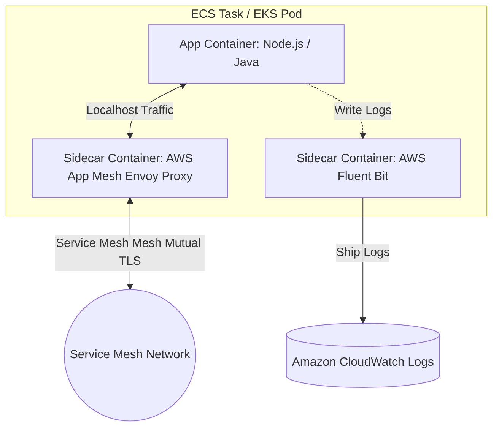

# Microservices on AWS: ECS vs. EKS

AWS offers two premier container orchestration services: Amazon Elastic Container Service (ECS) and Amazon Elastic Kubernetes Service (EKS). Choosing between them depends on team expertise, infrastructure standards, and operating preferences.

---

## 🆚 EKS vs. ECS Comparison

| Feature | Amazon ECS | Amazon EKS |
| :--- | :--- | :--- |
| **Orchestrator** | Proprietary AWS technology. | Native standard Kubernetes. |
| **Complexity** | Low. Clean, opinionated integration. | High. Steep learning curve. |
| **Control Plane Fee** | Free (only pay for underlying compute). | $0.10/hour per cluster management fee. |
| **IAM Integration** | Highly integrated with IAM natively. | Requires OIDC providers (IRSA/EKS Pod Identity). |
| **Multi-Cloud** | Tied strictly to AWS (ECS Anywhere exists). | Highly portable across clouds (GKE, AKS, On-prem). |

---

## 🏗️ ECS Task & EKS Pod Sidecar Architecture

Both platforms support deploying multiple, collaborative containers together. A core pattern is the **Sidecar Pattern**, separating utility logic (mesh proxying, log forwarding, metrics) from the main application container.

---

## 🚀 Deployment Strategies

### 1. Blue/Green Deployments
Two identical physical environments are maintained. The **Blue** environment is live (production) and the **Green** environment runs the new release.
*   **AWS Orchestration**: Handled via **AWS CodeDeploy** for ECS, shifting ALB traffic weights dynamically. On EKS, this can be automated via **ArgoCD Rollouts** or custom Load Balancer target weights.
*   **Pro**: Fast, risk-free rollbacks (simply shift the ALB weight back to Blue).
*   **Con**: Requires significant resources to host duplicate running tasks/pods during transition.

### 2. Canary Deployments
A small percentage of production traffic (e.g., 5%) is routed to the new version. The version is monitored for errors. If clean, the rollout continues until 100% is reached.
*   **AWS Orchestration**: Managed via **AWS App Mesh** traffic routes, **Route 53 Weighted Routing**, or **Kubernetes Ingress Controllers** (Nginx/ALB Controller annotations).

---

## EKS & ECS Pod/Task Security Best Practices

*   **Least Privilege IAM Roles**: Never assign IAM roles directly to EKS nodes or ECS host EC2 instances. Utilize **IAM Roles for Service Accounts (IRSA)** for EKS and **Task Execution Roles** for ECS to assign scoped access keys to specific microservice applications.
*   **VPC Security Isolation**: Run containers inside private subnets without public IP addresses. Configure security groups to block all ingress traffic except connections stemming from the Application Load Balancer.
*   **Secrets Security**: Inject database credentials or third-party API keys securely from AWS Secrets Manager or Systems Manager Parameter Store directly into task definitions as environment variables at runtime instead of hardcoding them in container images.

---

## Common Pitfalls in Container Architecture
*   **Misconfigured CPU/Memory Limits**: Setting container CPU/Memory limits too low leads to Out-Of-Memory (OOM) pod crashes. Setting them too high results in resource underutilization and high bills. (Mitigation: Use AWS Compute Optimizer for recommendations).
*   **Exceeding Docker Hub Pull Limits**: Scaling microservices rapidly can trigger Docker Hub throttling errors. (Mitigation: Store container base images in **Amazon ECR**).
*   **Poor Health Check Logic**: Pointing container readiness probes to database queries. If a database is overloaded, health checks fail and the orchestrator repeatedly terminates and restarts healthy container instances.

---

## SA Interview Questions on Containers

### Question 1: How do you choose between AWS Fargate and EC2 launch types for Amazon ECS?
**Answer**: 
*   Choose **AWS Fargate** when you want a serverless, zero-maintenance container execution model. Fargate eliminates the need to manage, scale, or patch underlying EC2 nodes. It is optimal for standard web microservices, scaling instantly in response to demand spikes.
*   Choose **EC2 Launch Type** when you require custom hardware configurations (like high-spec GPUs for ML training), need specific OS level network modifications, or want to maximize cost savings for predictable, high-utilization workloads through Reserved EC2 Instances.

### Question 2: What is IRSA on EKS, and why is it preferred over traditional IAM configurations?
**Answer**: 
IRSA stands for **IAM Roles for Service Accounts**. 
Without IRSA, all Kubernetes pods running on an EKS node inherit the same IAM role assigned to the underlying EC2 instance (Node Instance Role). This violates the principle of least privilege, as a basic front-end pod can access sensitive S3 buckets if the backend pod on the same host node requires S3 access. 
IRSA leverages AWS IAM OpenID Connect (OIDC) identity providers to associate an IAM Role directly to a Kubernetes Service Account, ensuring that only the specific Pod requiring a resource receives the AWS credential token.

### Question 3: How do you implement a Canary deployment strategy on ECS?
**Answer**: 
You can orchestrate a Canary deployment on ECS using **AWS CodeDeploy**:
1.  Configure an Application Load Balancer with two target groups: Target Group Blue (running the current production task definition) and Target Group Green (running the new release deployment).
2.  Set up an AWS CodeDeploy deployment group with a canary routing configuration (e.g., `CodeDeployDefault.ECSLinear10PercentEvery1Minutes`).
3.  CodeDeploy deploys the new task definition, registers it to Target Group Green, and instructs the ALB to direct 10% of traffic to Green.
4.  Specify CloudWatch Alarms to monitor application error counts. If an alarm fires, CodeDeploy automatically rolls back 100% of traffic to Blue. If clear, it increments traffic over time until Green is fully verified.
