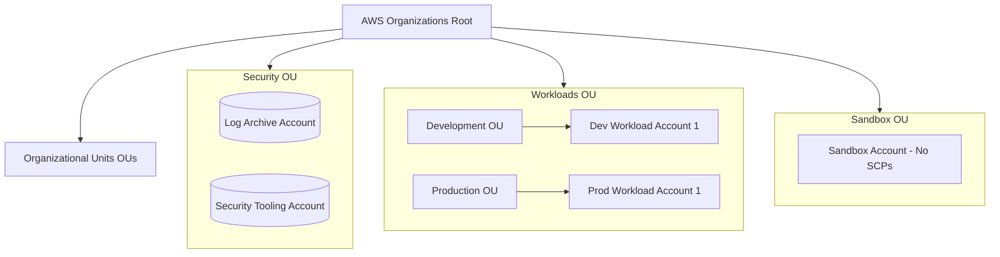

# Multi-Account Strategy on AWS

As organizations grow, managing all workloads inside a single AWS account becomes a significant security, operational, and financial risk. A multi-account strategy establishes clear security boundaries, isolates costs, and simplifies access control.

---

## 🏛️ AWS Organizations & Landing Zone Architecture

AWS recommends building a structured multi-account landing zone using **AWS Control Tower** and **AWS Organizations**. This establishes a hierarchical organization of accounts grouped under **Organizational Units (OUs)**.



---

## Core Pillars of Multi-Account Architectures

### 1. AWS Control Tower
Managed governance service that automates the setup of a secure multi-account environment ("Landing Zone"). It sets up IAM Identity Center, provisions OUs, and deploys automatic guardrails.

### 2. Service Control Policies (SCPs)
Organizations-level access control guardrails used to enforce maximum permission boundaries. SCPs are applied to OUs or individual accounts. They do not grant permissions on their own; instead, they define the absolute limit of what IAM policies can allow.

### 3. Log Archiving
A dedicated, immutable AWS account containing centrally aggregated CloudTrail and VPC Flow Logs. S3 bucket policies in this account prevent deletion (using features like **S3 Object Lock**) to secure audit trails in the event of a security breach.

---

## 🔒 Example: Service Control Policy (SCP) Guardrails

SCPs are written in standard JSON policy syntax. They allow enforcing compliance rules across your entire organization, such as blocking root-user operations, restricting resources to specific regions, or preventing IAM changes.

```json
{
  "Version": "2012-10-17",
  "Statement": [
    {
      "Sid": "RestrictRegionExecution",
      "Effect": "Deny",
      "NotAction": [
        "cloudfront:*",
        "iam:*",
        "route53:*",
        "support:*"
      ],
      "Resource": "*",
      "Condition": {
        "StringNotEquals": {
          "aws:RequestedRegion": [
            "us-east-1",
            "us-west-2"
          ]
        }
      }
    }
  ]
}
```
*   **Effect**: Denies execution of all non-global AWS services in regions other than `us-east-1` and `us-west-2`.

---

## Common Pitfalls in Multi-Account Strategy
*   **Operating without SCP Guardrails**: Relying strictly on local IAM policies to enforce compliance. (An account administrator could delete critical monitoring logs if organizations-level SCPs are missing).
*   **VPC Mesh Mess**: Directly pairing hundreds of VPCs across separate accounts using VPC Peering. This creates a complex, hard-to-manage mesh network. (Mitigation: Deploy **AWS Transit Gateway** as a central hub router).
*   **Inflexible OU structures**: Creating overly deep or complex OU nesting structures. Keep OUs flat and align them to functional areas (e.g., Security, Workloads, Core Infrastructure).

---

## SA Interview Questions on Multi-Account Strategy

### Question 1: What is the difference between IAM Policies and Service Control Policies (SCPs)?
**Answer**: 
*   **IAM Policies** are applied locally to IAM users, groups, or roles within a single AWS account. They define what actions an identity can perform.
*   **SCPs** are applied at the AWS Organizations level (Root, OU, or account). They act as a filter, defining the maximum allowable permissions for all accounts underneath. 
*   **Key Distinction**: An SCP cannot grant permissions. Even if an SCP allows `s3:CreateBucket`, an IAM administrator in a sub-account still needs an explicit IAM policy to perform the action. If an SCP denies `s3:CreateBucket`, the action is blocked regardless of what IAM policies are configured locally.

### Question 2: How does AWS Control Tower enforce guardrails?
**Answer**: 
AWS Control Tower uses two types of guardrails to enforce governance:
1.  **Preventive Guardrails**: Implemented using **Service Control Policies (SCPs)**. These block non-compliant actions entirely (e.g., preventing accounts from deleting the Log Archive bucket).
2.  **Detective Guardrails**: Implemented using **AWS Config Rules** and **AWS Systems Manager**. These continuously monitor resources and flag accounts that drift from compliance guidelines (e.g., identifying S3 buckets that are publicly accessible).

### Question 3: How do you design a centralized logging strategy for a multi-account organization?
**Answer**: 
1.  Create a dedicated, isolated **Log Archive Account** within the Security OU.
2.  Set up **AWS CloudTrail** at the Organization root level, configuring it to aggregate logs from all member accounts into a central S3 bucket inside the Log Archive Account.
3.  Deploy **AWS Config** and **VPC Flow Logs** across all accounts, configuring them to publish logs to the centralized logging account.
4.  Configure the central S3 bucket with **S3 Object Lock** in compliance mode to prevent log deletion, and restrict read access strictly to security administrators.
5.  Use **Amazon Athena** or **Amazon OpenSearch Service** inside the Security Account to query the aggregated logs.
