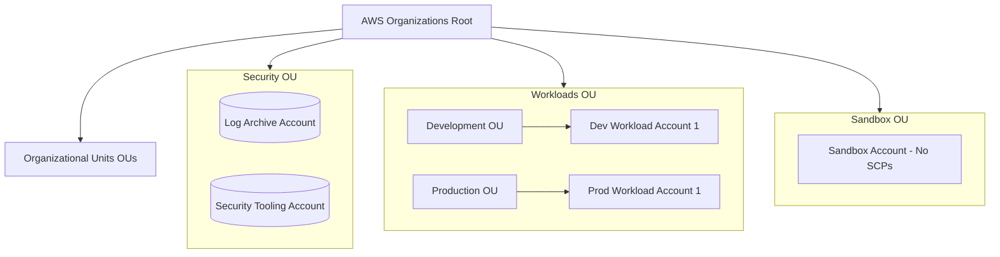

# Multi-Account Strategy on AWS

As organizations grow, managing all workloads inside a single AWS account becomes a significant security, operational, and financial risk. A multi-account strategy establishes clear security boundaries, isolates costs, and simplifies access control.

---

## 🏛️ AWS Organizations & Landing Zone Architecture

AWS recommends building a structured multi-account landing zone using **AWS Control Tower** and **AWS Organizations**. This establishes a hierarchical organization of accounts grouped under **Organizational Units (OUs)**.


```mermaid
graph TD
    Root[AWS Organizations Root] --> OrgOU[Organizational Units OUs]
    
    subgraph OU_Security [Security OU]
        Acc_Log[(Log Archive Account)]
        Acc_Sec[(Security Tooling Account)]
    end
    
    subgraph OU_Workloads [Workloads OU]
        OU_Dev[Development OU] --> Acc_Dev1[Dev Workload Account 1]
        OU_Prod[Production OU] --> Acc_Prod1[Prod Workload Account 1]
    end
    
    subgraph OU_Sandbox [Sandbox OU]
        Acc_Sand[Sandbox Account - No SCPs]
    end
    
    Root --> OU_Security
    Root --> OU_Workloads
    Root --> OU_Sandbox
```

---

## Core Pillars of Multi-Account Architectures

### 1. AWS Control Tower
Managed governance service that automates the setup of a secure multi-account environment ("Landing Zone"). It sets up IAM Identity Center, provisions OUs, and deploys automatic guardrails.

### 2. Service Control Policies (SCPs)
Organizations-level access control guardrails used to enforce maximum permission boundaries. SCPs are applied to OUs or individual accounts. They do not grant permissions on their own; instead, they define the absolute limit of what IAM policies can allow.

### 3. Log Archiving
A dedicated, immutable AWS account containing centrally aggregated CloudTrail and VPC Flow Logs. S3 bucket policies in this account prevent deletion (using features like **S3 Object Lock**) to secure audit trails in the event of a security breach.

---

## 🔒 Example: Service Control Policy (SCP) Guardrails

SCPs are written in standard JSON policy syntax. They allow enforcing compliance rules across your entire organization, such as blocking root-user operations, restricting resources to specific regions, or preventing IAM changes.

```json
{
  "Version": "2012-10-17",
  "Statement": [
    {
      "Sid": "RestrictRegionExecution",
      "Effect": "Deny",
      "NotAction": [
        "cloudfront:*",
        "iam:*",
        "route53:*",
        "support:*"
      ],
      "Resource": "*",
      "Condition": {
        "StringNotEquals": {
          "aws:RequestedRegion": [
            "us-east-1",
            "us-west-2"
          ]
        }
      }
    }
  ]
}
```
*   **Effect**: Denies execution of all non-global AWS services in regions other than `us-east-1` and `us-west-2`.

---

## Common Pitfalls in Multi-Account Strategy
*   **Operating without SCP Guardrails**: Relying strictly on local IAM policies to enforce compliance. (An account administrator could delete critical monitoring logs if organizations-level SCPs are missing).
*   **VPC Mesh Mess**: Directly pairing hundreds of VPCs across separate accounts using VPC Peering. This creates a complex, hard-to-manage mesh network. (Mitigation: Deploy **AWS Transit Gateway** as a central hub router).
*   **Inflexible OU structures**: Creating overly deep or complex OU nesting structures. Keep OUs flat and align them to functional areas (e.g., Security, Workloads, Core Infrastructure).

---

## SA Interview Questions on Multi-Account Strategy

### Question 1: What is the difference between IAM Policies and Service Control Policies (SCPs)?
**Answer**: 
*   **IAM Policies** are applied locally to IAM users, groups, or roles within a single AWS account. They define what actions an identity can perform.
*   **SCPs** are applied at the AWS Organizations level (Root, OU, or account). They act as a filter, defining the maximum allowable permissions for all accounts underneath. 
*   **Key Distinction**: An SCP cannot grant permissions. Even if an SCP allows `s3:CreateBucket`, an IAM administrator in a sub-account still needs an explicit IAM policy to perform the action. If an SCP denies `s3:CreateBucket`, the action is blocked regardless of what IAM policies are configured locally.

### Question 2: How does AWS Control Tower enforce guardrails?
**Answer**: 
AWS Control Tower uses two types of guardrails to enforce governance:
1.  **Preventive Guardrails**: Implemented using **Service Control Policies (SCPs)**. These block non-compliant actions entirely (e.g., preventing accounts from deleting the Log Archive bucket).
2.  **Detective Guardrails**: Implemented using **AWS Config Rules** and **AWS Systems Manager**. These continuously monitor resources and flag accounts that drift from compliance guidelines (e.g., identifying S3 buckets that are publicly accessible).

### Question 3: How do you design a centralized logging strategy for a multi-account organization?
**Answer**: 
1.  Create a dedicated, isolated **Log Archive Account** within the Security OU.
2.  Set up **AWS CloudTrail** at the Organization root level, configuring it to aggregate logs from all member accounts into a central S3 bucket inside the Log Archive Account.
3.  Deploy **AWS Config** and **VPC Flow Logs** across all accounts, configuring them to publish logs to the centralized logging account.
4.  Configure the central S3 bucket with **S3 Object Lock** in compliance mode to prevent log deletion, and restrict read access strictly to security administrators.
5.  Use **Amazon Athena** or **Amazon OpenSearch Service** inside the Security Account to query the aggregated logs.

### Question 4: A CI pipeline in the Tooling account gets `AccessDenied` when assuming a deploy role in a Prod account. Walk me through it.
**Answer**:
Cross-account access must pass **every** policy layer, so check them in order:
1.  **CloudTrail** (in both accounts): Find the `AssumeRole` event and its `errorCode`. Newer error messages name the policy type that denied the call (e.g., "explicit deny in a service control policy").
2.  **Trust policy** on the Prod role: Does its `Principal` name the exact pipeline role ARN? Do conditions such as `sts:ExternalId`, `aws:PrincipalOrgID` or MFA actually match?
3.  **Identity policy** on the caller: It must allow `sts:AssumeRole` on the target role ARN. Also check its **permissions boundary**.
4.  **SCPs** on *both* accounts' OUs: Look for region-restriction SCPs (like the one above) that deny STS calls to an unapproved regional endpoint.
5.  If AssumeRole succeeds but S3 reads still fail, check the **KMS key policy**. SSE-KMS objects need the key to trust the cross-account principal too.
6.  Validate the fix with **IAM Access Analyzer** policy checks and the IAM policy simulator.

### Question 5: What are the trade-offs between role assumption, resource-based policies and AWS RAM for cross-account access?
**Answer**:
*   **Role assumption (`sts:AssumeRole`)**: Works for every service and gives a clear audit trail. The caller gives up its original permissions for the session, and role-chaining caps sessions at 1 hour. It is the default for pipelines and automation.
*   **Resource-based policies** (S3, KMS, SQS, SNS, Lambda, Secrets Manager): The caller keeps its own identity, so there is no role switch. Scope them with `aws:PrincipalOrgID` or `aws:PrincipalOrgPaths` instead of listing account IDs. The catch is that only some services support them, and policies can sprawl.
*   **AWS RAM**: Shares the *resource itself* (VPC subnets, Transit Gateways, Resolver rules, IPAM pools, License Manager configs). It is ideal for platform-owned infrastructure consumed by many accounts, and you can share to an entire OU.
*   **Humans** should use none of these directly. They get access through IAM Identity Center permission sets.

### Question 6: Design human access for 300 accounts using IAM Identity Center, including break-glass.
**Answer**:
1.  Connect Identity Center to the corporate IdP (Entra ID / Okta) via **SAML + SCIM**, and manage access through **IdP groups**, never individual users.
2.  Define a small catalog of **permission sets** (`ReadOnly`, `Developer`, `PlatformAdmin`, `SecurityAudit`) built from AWS-managed and customer-managed policies with a permissions boundary. Assign group → permission set → account/OU.
3.  Use short session durations, and use **ABAC** (IdP attributes as session tags) to scope developers to their own resources.
4.  Grant standing admin to nobody. Provide **just-in-time elevation** (e.g., the AWS TEAM solution) with approval and CloudTrail auditing.
5.  **Break-glass**: Identity Center depends on the IdP and its home region, so keep 2 emergency IAM principals with hardware MFA and sealed credentials. Alert on their `ConsoleLogin` via EventBridge → SNS, and test them quarterly.
6.  Remove member-account root credentials using **centralized root access management**.

### Question 7: Design a centralized networking account for a multi-account landing zone.
**Answer**:
*   Create a **Network account** under an Infrastructure OU. It owns the **Transit Gateway**, which is shared to workload OUs via **RAM**, with separate TGW route tables for prod, non-prod and shared services.
*   **Centralized egress**: An egress VPC with NAT Gateways per AZ. Workload VPCs have no IGW, and an SCP denies `ec2:CreateInternetGateway` outside the Network account.
*   **Inspection**: An inspection VPC with **AWS Network Firewall** (or GWLB + third-party appliances). TGW appliance mode keeps flows symmetric.
*   **Hybrid**: Direct Connect Gateway and VPN attach to the TGW here, and the **Route 53 Resolver endpoints** and rules are shared from this account.
*   **IPAM** is delegated to this account so CIDRs never overlap. Alternatively, use **VPC sharing** so app teams deploy into centrally managed subnets.
*   **Trade-off**: One team controls the network blast radius and cost, but it becomes a change bottleneck. Mitigate this with IaC and self-service account vending (Control Tower Account Factory for Terraform).
