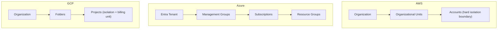

# Multi-Cloud: Azure and GCP to AWS Service Mapping

Many teams inherit Azure or GCP estates, or must interview against them. This guide maps services across the big three, explains the conceptual differences that cause real migration bugs (IAM, hierarchy, network scope), gives an OpenStack overview, and covers multi-cloud trade-offs. Anchor on AWS, then translate. Related reading: [Hybrid Cloud & Migration](hybrid-cloud-and-migration.md), [Multi-Account Strategy](multi-account-strategy.md), [Networking & API Fundamentals](networking-and-api-fundamentals.md), and [Security & Compliance](security-and-compliance.md).

---

## 🗺️ Service Mapping Tables

### Compute and Containers

| Capability | **AWS** | **Azure** | **GCP** |
| :--- | :--- | :--- | :--- |
| Virtual machines | EC2 | Virtual Machines | Compute Engine |
| Managed Kubernetes | EKS | AKS | GKE |
| Container serverless | Fargate / App Runner | Container Apps / ACI | Cloud Run |
| PaaS web apps | Elastic Beanstalk / App Runner | App Service | App Engine |

### Serverless and Integration

| Capability | **AWS** | **Azure** | **GCP** |
| :--- | :--- | :--- | :--- |
| Functions | Lambda | Functions | Cloud Functions / Cloud Run functions |
| Workflow orchestration | Step Functions | Logic Apps / Durable Functions | Workflows |
| Event bus | EventBridge | Event Grid | Eventarc |
| Queue | SQS | Storage Queues / Service Bus | Cloud Tasks |
| Pub/sub | SNS | Service Bus Topics / Event Grid | Pub/Sub |
| Streaming | Kinesis / MSK | Event Hubs (Kafka-compatible) | Pub/Sub / Dataflow |
| API gateway | API Gateway | API Management | API Gateway / Apigee |

### Storage

| Capability | **AWS** | **Azure** | **GCP** |
| :--- | :--- | :--- | :--- |
| Object storage | S3 | Blob Storage | Cloud Storage |
| Block storage | EBS | Managed Disks | Persistent Disk / Hyperdisk |
| Shared file | EFS / FSx | Azure Files / NetApp Files | Filestore |

### Databases and Analytics

| Capability | **AWS** | **Azure** | **GCP** |
| :--- | :--- | :--- | :--- |
| Managed relational | RDS / Aurora | Azure SQL / Database for PostgreSQL, MySQL | Cloud SQL / AlloyDB |
| Global relational | Aurora Global / DSQL | Cosmos DB (multi-model) / SQL Hyperscale | Spanner |
| NoSQL key-value/document | DynamoDB | Cosmos DB | Firestore / Bigtable |
| In-memory cache | ElastiCache | Azure Cache for Redis | Memorystore |
| Data warehouse | Redshift | Synapse / Fabric | BigQuery |
| Big data / Spark | EMR / Glue | HDInsight / Databricks / Synapse | Dataproc / Dataflow |

### Networking and Edge

| Capability | **AWS** | **Azure** | **GCP** |
| :--- | :--- | :--- | :--- |
| Virtual network | VPC (regional) | VNet (regional) | VPC (**global**) |
| Load balancing | ALB / NLB / GWLB | Application Gateway / Load Balancer | Cloud Load Balancing (global anycast) |
| DNS | Route 53 | Azure DNS / Traffic Manager | Cloud DNS |
| CDN | CloudFront | Front Door / CDN | Cloud CDN |
| Dedicated link | Direct Connect | ExpressRoute | Cloud Interconnect |
| VPN | Site-to-Site VPN | VPN Gateway | Cloud VPN |
| Hub-and-spoke | Transit Gateway | Virtual WAN / hub VNet | Network Connectivity Center |
| WAF / DDoS | WAF / Shield | WAF / DDoS Protection | Cloud Armor |

### Identity, Security, and Governance

| Capability | **AWS** | **Azure** | **GCP** |
| :--- | :--- | :--- | :--- |
| Workforce identity | IAM Identity Center | Microsoft Entra ID | Cloud Identity / Workforce Identity Federation |
| Authorization | IAM policies | Azure RBAC + Entra roles | IAM roles/bindings |
| Secrets | Secrets Manager / SSM Parameter Store | Key Vault | Secret Manager |
| Key management | KMS / CloudHSM | Key Vault / Managed HSM | Cloud KMS / Cloud HSM |
| Org guardrails | SCPs (AWS Organizations) | Azure Policy / Management Groups | Organization Policy |

---

## 🧠 Conceptual Differences That Bite

### Resource Hierarchy and Isolation

| Aspect | **AWS** | **Azure** | **GCP** |
| :--- | :--- | :--- | :--- |
| Isolation unit | Account | Subscription | Project |
| Grouping inside unit | Tags, stacks | **Resource Group** (mandatory lifecycle container) | Labels |
| Guardrails | SCPs deny/limit maximum permissions | Azure Policy, RBAC deny assignments | Org Policy constraints |
| Identity home | IAM users/roles per account or Identity Center | Central Entra ID tenant | Google identities, groups, service accounts |

### IAM Models
*   **AWS**: Identity-based policies (JSON) attached to principals plus resource policies; **explicit deny wins**, default deny; roles are assumed via STS; SCPs and permission boundaries cap permissions.
*   **Azure**: **RBAC role assignments** = principal + role + scope (management group, subscription, resource group, resource); permissions inherit down the scope tree. Identity lives in Entra ID; Managed Identities replace credentials.
*   **GCP**: **Allow policies** bind principals to roles at org/folder/project/resource; **additive inheritance** downward; service accounts are both identities and resources. IAM Deny policies exist but are newer.

### Network Scope
*   **AWS VPC** and **Azure VNet** are **regional**; subnets are AZ-scoped in AWS but span all zones in a region in Azure.
*   **GCP VPC is global**; subnets are regional. Global VPC simplifies multi-region connectivity but changes segmentation and firewall thinking (firewall rules are VPC-wide with tags/service accounts).
*   Security groups (AWS, stateful, allow-only) map to NSGs (Azure, allow/deny with priorities) and VPC firewall rules (GCP, allow/deny with priorities).

---

## 🏢 OpenStack Overview

**OpenStack** is an open-source IaaS platform for building private clouds on your own hardware.

| OpenStack Project | Function | AWS Analogue |
| :--- | :--- | :--- |
| **Nova** | Compute (VMs) | EC2 |
| **Neutron** | Networking (networks, routers, security groups) | VPC |
| **Cinder** | Block storage | EBS |
| **Swift** | Object storage | S3 |
| **Glance** | VM images | AMIs |
| **Keystone** | Identity and service catalog | IAM |
| **Horizon** | Web dashboard | Management Console |
| **Heat** | Orchestration templates | CloudFormation |
| **Magnum** | Container orchestration | EKS |

*   **When it fits**: data sovereignty, telecom/NFV, cost predictability at very large scale, or existing on-premises investment.
*   **Trade-offs**: You operate the control plane (upgrades, HA, capacity), and the service breadth is far smaller than hyperscalers.
*   **AWS bridging options**: **AWS Outposts** (AWS infrastructure on-premises), EKS Anywhere, and Terraform providers for OpenStack to reuse IaC skills.

---

## ⚖️ Multi-Cloud: Pros, Cons, and Lock-In Strategy

| Pros | Cons |
| :--- | :--- |
| Best-of-breed services (e.g., BigQuery, Entra ID integration) | Lowest-common-denominator architecture |
| Regulatory or customer-mandated diversity | Higher operational and skills overhead |
| Negotiation leverage on pricing | Cross-cloud egress fees and latency |
| Resilience to provider-wide outages (rarely realized) | Fragmented security, IAM, and observability |
| M&A inheritance is unavoidable | Duplicated tooling and compliance evidence |

### Lock-In Mitigation (Pragmatic)
1.  **Accept lock-in deliberately**: Managed services (DynamoDB, Lambda) buy speed. Quantify switching cost versus benefit instead of avoiding lock-in by default.
2.  **Portable layers where cheap**: Containers and Kubernetes, PostgreSQL/MySQL engines, Kafka API, OpenTelemetry, Terraform.
3.  **Isolate proprietary services** behind interfaces (ports and adapters) so a swap changes one adapter.
4.  **Keep data portable**: Open formats (Parquet, Avro), regular exports, and plan egress costs.
5.  **Prefer multi-region in one cloud** over multi-cloud for resilience; see [High Availability & DR](high-availability-and-dr.md).

---

## 🚚 Migration Considerations (Azure/GCP to AWS)

*   **Discovery first**: Inventory dependencies, data volumes, and compliance constraints; apply the 7 Rs from [Hybrid Cloud & Migration](hybrid-cloud-and-migration.md).
*   **Identity**: Keep the existing IdP (Entra ID) as source of truth; federate into **IAM Identity Center** via SAML/SCIM and map groups to permission sets.
*   **Networking**: Avoid CIDR overlaps, connect clouds via Site-to-Site VPN or Direct Connect with partner interconnects, and centralize routing with Transit Gateway. Rework GCP global-VPC assumptions into per-region VPCs.
*   **Data transfer**: Use **AWS DataSync** or Storage Transfer patterns for bulk object data; **AWS DMS + SCT** for databases; budget for source-cloud egress fees.
*   **Database re-platforming**: Cosmos DB to DynamoDB, BigQuery to Redshift/Athena, and Spanner to Aurora require data model and query rewrites, not lift and shift.
*   **Kubernetes**: GKE/AKS to EKS is mostly manifest-portable; replace cloud-specific ingress, storage classes, IAM bindings (Workload Identity to IRSA/Pod Identity).
*   **Cutover**: Dual-run with replication, weighted DNS (Route 53) for gradual traffic shift, and a rollback plan.

---

---

## SA Interview Questions on Multi-Cloud

### Question 1: How do AWS accounts, Azure subscriptions, and GCP projects compare?
**Answer**:
Each is the primary isolation, billing, and quota boundary. AWS uses Accounts grouped in Organizations/OUs with SCPs; Azure uses Subscriptions under Management Groups plus mandatory Resource Groups; GCP uses Projects under Folders and an Organization with Org Policies. In all three, guardrails are applied at the hierarchy level and workloads are separated by environment or team.

### Question 2: Explain how IAM authorization differs between AWS and GCP or Azure.
**Answer**:
AWS attaches JSON policies to identities or resources, defaults to deny, and explicit deny always wins; roles are assumed via STS and SCPs cap permissions. Azure assigns RBAC roles at a scope and inherits downward; GCP binds roles to principals at hierarchy nodes with additive inheritance. Migration means redesigning, not translating: group-based role bindings become permission sets and role trust policies with least-privilege scoping.

### Question 3: What is different about GCP's VPC compared with an AWS VPC?
**Answer**:
GCP VPCs are global with regional subnets, so VMs in different regions share one private network and firewall rule set. AWS VPCs are regional, with subnets tied to a single AZ, and cross-region connectivity requires peering or Transit Gateway. Migrating to AWS means creating a VPC per region, planning non-overlapping CIDRs, and re-expressing firewall rules as security groups and NACLs.

### Question 4: Map a typical Azure serverless app (Functions, Event Grid, Cosmos DB, Key Vault) to AWS.
**Answer**:
Functions to **Lambda**, Event Grid to **EventBridge**, Cosmos DB to **DynamoDB** (with model redesign, as it lacks tunable consistency levels and multi-model APIs), and Key Vault to **Secrets Manager/KMS**. Managed Identity becomes an **IAM execution role** with least-privilege permissions. Add API Gateway for HTTP triggers and CloudWatch/X-Ray for observability.

### Question 5: When is a multi-cloud strategy justified, and how do you limit lock-in without paying for it everywhere?
**Answer**:
Justified by regulation, customer mandates, M&A, or a clearly superior service (e.g., BigQuery analytics). Otherwise the cost in skills, egress, and lowest-common-denominator design outweighs benefits. Limit lock-in selectively: containers/Kubernetes, open-source databases, OpenTelemetry, open data formats, Terraform, and adapter interfaces around proprietary services. Prefer multi-region within one cloud for resilience.

### Question 6: How would you migrate a workload from GKE and BigQuery to AWS?
**Answer**:
Move GKE workloads to **EKS**: reuse manifests/Helm, swap Workload Identity for IRSA or EKS Pod Identity, replace GCP load balancer and storage classes with ALB Controller and EBS/EFS CSI. For BigQuery, export to Parquet in Cloud Storage, transfer to S3 with **DataSync**, catalog with Glue, and query using **Athena** or load into **Redshift**; rewrite SQL dialect differences and streaming ingestion (Pub/Sub to Kinesis/MSK). Connect clouds with VPN during dual-run, cut over via Route 53 weighted routing, and watch egress costs.
