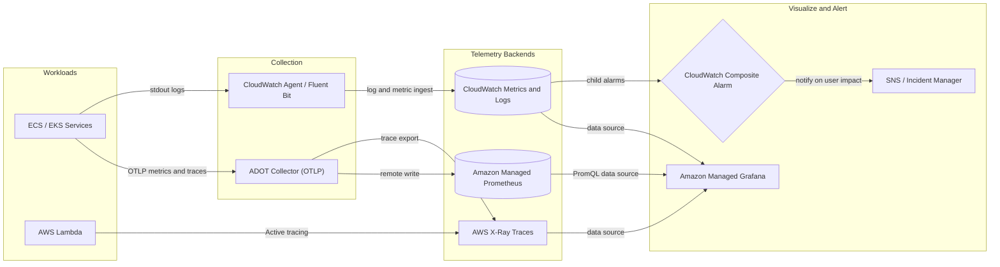

# Observability & Monitoring on AWS

## 🌐 Monitoring vs. Observability
**Monitoring** answers known questions ("Is CPU above 80%?"). **Observability** lets you ask *new* questions about a system from the outside, using the telemetry it emits ("Why are only checkout requests from `eu-west-1` slow for premium users?"). In distributed systems (microservices, serverless, containers) failures are emergent, so we need rich, correlated telemetry rather than a wall of static thresholds.

> [!TIP]
> Observability is the *input* to automation. For ML-driven anomaly detection and self-healing built on top of this telemetry, see [AIOps on AWS](./aiops-on-aws.md). For the availability targets that SLOs protect, see [High Availability & DR](./high-availability-and-dr.md).

---

## 🏛️ The Three Pillars of Observability

| Pillar | What It Is | Best For | Cardinality / Cost | Core AWS Service |
| :--- | :--- | :--- | :--- | :--- |
| **Metrics** | Numeric time series, aggregated (count, sum, p99). | Dashboards, alarms, trend and capacity analysis. | Cheap, but **high-cardinality dimensions** explode cost. | Amazon CloudWatch Metrics, Amazon Managed Service for Prometheus. |
| **Logs** | Timestamped, discrete event records (ideally structured JSON). | Debugging, audit, forensics of a specific event. | **Most expensive** (ingestion + storage volume). | CloudWatch Logs, S3 + Athena, OpenSearch. |
| **Traces** | The end-to-end path of one request across services as spans. | Latency breakdown, dependency maps, finding the failing hop. | Medium; controlled by **sampling**. | AWS X-Ray, OpenTelemetry (ADOT). |

The pillars are only powerful when **correlated**: put a `trace_id` in every log line, and attach exemplars to metrics, so you can pivot metric spike -> trace -> logs in seconds.

---

## 🥇 Golden Signals, SLIs, SLOs

### The Four Golden Signals (Google SRE)
1.  **Latency**: Time to serve a request (track successful and failed separately, use percentiles p50/p95/p99, never averages).
2.  **Traffic**: Demand on the system (requests/sec, messages/sec).
3.  **Errors**: Rate of failed requests (explicit 5xx, implicit wrong content, slow-as-failure).
4.  **Saturation**: How "full" the service is (CPU, memory, connection pool, queue depth, IOPS burst balance).

### SLI -> SLO -> SLA

| Term | Definition | Example |
| :--- | :--- | :--- |
| **SLI** (Indicator) | A measured ratio of good events to valid events. | `successful requests with latency < 300ms / total requests` |
| **SLO** (Objective) | Internal target for the SLI over a window. | 99.9% over 30 days |
| **SLA** (Agreement) | Contractual promise with financial penalty; looser than the SLO. | 99.5% or service credits |
| **Error Budget** | `100% - SLO`; the permitted unreliability. | 0.1% of 30 days = ~43 minutes |

**Burn-rate alerting**: alert on how fast the error budget is being consumed rather than on raw error counts. A common multi-window policy: page when the 1-hour burn rate exceeds 14.4x AND the 5-minute burn rate confirms it (2% of a 30-day budget burned in 1 hour); ticket on a 6x rate over 6 hours.

---

## ☁️ Amazon CloudWatch Deep Dive

### Metrics
*   **Namespaces and dimensions** identify a series. Default resolution is 1-minute (5-minute for basic EC2 monitoring); **high-resolution custom metrics** go down to 1 second.
*   **Embedded Metric Format (EMF)**: emit a structured JSON log line and CloudWatch extracts custom metrics automatically, avoiding costly `PutMetricData` calls (ideal for Lambda).
*   **Metric Math** derives series; **Metric Streams** push metrics to Firehose for third parties.

### Logs and Logs Insights
*   **Logs Insights** is a purpose-built query language, billed per GB scanned:

```
fields @timestamp, @message, requestId
| filter level = "ERROR"
| stats count(*) as errors by bin(5m), service
```
*   **Metric filters** convert log patterns to metrics; **subscription filters** stream logs to Lambda, Firehose, or Kinesis in near real time; **Live Tail** follows logs interactively.

### Alarms
*   **Static threshold**, **anomaly detection** (ML band learned from history), and **metric math** alarms.
*   Evaluate with `M out of N datapoints` to avoid flapping, and set `TreatMissingData` explicitly (`notBreaching` for sparse metrics, `breaching` for heartbeat metrics).

### Composite Alarms
A **composite alarm** combines child alarms with `AND` / `OR` / `NOT`, so you page a human only when the combination signals user impact.

```
ALARM("checkout-5xx-high") AND ALARM("checkout-latency-p99-high")
  AND NOT ALARM("planned-maintenance-window")
```

*   **Container Insights** collects cluster, node, pod, and container metrics for ECS/EKS (EKS: CloudWatch Observability add-on).

---

## 🔍 AWS X-Ray and OpenTelemetry

*   **X-Ray** records **traces** made of **segments/subsegments**, builds a **service map**, and supports **annotations** (indexed, filterable key-values) and **metadata** (not indexed). Sampling defaults to 1 request/sec plus 5% of additional requests; tune rules to control cost.
*   **OpenTelemetry (OTel)** is the vendor-neutral CNCF standard for instrumentation (SDKs, OTLP protocol, Collector). **AWS Distro for OpenTelemetry (ADOT)** is the AWS-supported OTel distribution that exports to X-Ray, CloudWatch, Managed Prometheus, or any OTLP backend. **Instrument once with OTel, choose the backend later** to avoid lock-in.



---

## 📈 Amazon Managed Prometheus & Managed Grafana

| Service | What It Provides | Key Points |
| :--- | :--- | :--- |
| **Amazon Managed Service for Prometheus (AMP)** | Serverless, Prometheus-compatible metric store (PromQL, remote write). | Scales automatically, multi-AZ, 150-day default retention; billed by samples ingested/stored/queried. Scrape with ADOT or a Prometheus server in agent mode. |
| **Amazon Managed Grafana (AMG)** | Managed Grafana. | SSO via IAM Identity Center/SAML; built-in data sources for CloudWatch, X-Ray, AMP, OpenSearch, Athena; you pay per active editor/viewer. |

**When to choose**: Kubernetes-heavy teams wanting PromQL/Grafana portability; CloudWatch stays the default for AWS-native metrics. Many use both, unified in Grafana.

---

## ⚖️ CloudWatch vs. Open Source vs. Datadog / Third-Party

| Dimension | CloudWatch + X-Ray | AMP + AMG (OSS managed) | Datadog / New Relic / Dynatrace |
| :--- | :--- | :--- | :--- |
| **Setup** | Zero for AWS services. | Moderate (collectors, dashboards). | Agent + integrations, quick UX. |
| **AWS integration** | Native, instant, no data egress. | Good via data sources. | Good via API/Metric Streams, adds polling delay/cost. |
| **Portability / multi-cloud** | Low, AWS only. | High (PromQL, OTel). | Excellent multi-cloud, best unified UI. |
| **Cost model** | Per metric / GB / alarm. | Per sample and user. | Per host, GB, custom metric (often the top bill). |


---

## 🔔 Alerting Design and Alert Fatigue

Ignored or muted pages cause real outages. Principles:

1.  **Alert on symptoms, not causes.** Page on user-facing SLO burn (errors, latency), not on "CPU > 80%". Use cause metrics for dashboards and diagnosis.
2.  **Every page must be actionable and urgent.** If no human action is needed, it is a ticket or a dashboard, not a page.
3.  **Tier severity**: Sev1 (page immediately, customer impact), Sev2 (page in business hours), Sev3 (ticket/Slack).
4.  **Reduce noise**: use `M of N` evaluation, composite alarms, anomaly detection bands, and maintenance-window suppressors.
5.  **Attach runbooks** to each alarm (link in the description) and automate safe remediation via SSM Automation.
6.  **Route intelligently**: SNS -> Chatbot/PagerDuty with ownership tags.

### Least-Privilege IAM for Observability
Grant workloads only what they emit. Example for an ECS task role publishing traces and custom metrics:

```json
{
  "Version": "2012-10-17",
  "Statement": [
    {
      "Sid": "XRayWrite",
      "Effect": "Allow",
      "Action": ["xray:PutTraceSegments", "xray:PutTelemetryRecords", "xray:GetSamplingRules", "xray:GetSamplingTargets"],
      "Resource": "*"
    },
    {
      "Sid": "PutMetricsInOwnNamespace",
      "Effect": "Allow",
      "Action": "cloudwatch:PutMetricData",
      "Resource": "*",
      "Condition": { "StringEquals": { "cloudwatch:namespace": "Shop/Checkout" } }
    },
    {
      "Sid": "WriteOwnLogGroup",
      "Effect": "Allow",
      "Action": ["logs:CreateLogStream", "logs:PutLogEvents"],
      "Resource": "arn:aws:logs:us-east-1:111122223333:log-group:/shop/checkout:*"
    }
  ]
}
```
(X-Ray write actions do not support resource-level scoping, hence `*`.)

---

## 💰 Controlling Observability Cost

Log **ingestion** (about $0.50/GB) usually dominates the CloudWatch bill. Levers: default to INFO (DEBUG switchable), set retention on every log group (default never expires), use Infrequent Access class for chatty logs, drop noisy lines at the agent, send vended logs (VPC Flow, ALB) to S3, avoid unbounded metric dimensions, use EMF, and tune trace sampling.

---

## 📋 Observability Interview Q&A

### Question 1: What are the three pillars of observability and how do you correlate them?
**Answer**:
Metrics (aggregated numbers), logs (discrete events), and traces (request paths). Correlate by propagating a trace ID through every service, injecting it into structured JSON logs, and linking metrics to traces via exemplars or Application Signals. Debugging flow: alarm on a metric -> open the X-Ray trace to find the slow hop -> query Logs Insights by trace ID for the exact error.

### Question 2: Explain SLI, SLO, SLA, and error budget. Why alert on burn rate?
**Answer**:
An SLI measures good/valid events, an SLO is the internal target (e.g., 99.9% over 30 days), and an SLA is the external contract with penalties, set looser than the SLO. The error budget is `1 - SLO`. Burn-rate alerts fire when the budget is being consumed faster than sustainable, so they detect real impact quickly (fast window) while ignoring brief blips (paired long/short windows), unlike raw threshold alerts.

### Question 3: How do CloudWatch composite alarms reduce alert fatigue?
**Answer**:
They combine multiple child alarms with boolean logic so a page fires only when a *pattern* indicates impact (e.g., high 5xx AND high p99 latency, NOT during a maintenance window). Child alarms still record state for diagnosis but their own actions can be suppressed with an `ActionsSuppressor`, cutting duplicate and cascading notifications.

### Question 4: Your CloudWatch bill tripled. How do you investigate and reduce it?
**Answer**:
Use Cost Explorer (usage type `DataProcessing-Bytes` for log ingestion, `MetricMonitorUsage` for custom metrics) and the `IncomingBytes` metric per log group to find the top offenders. Then: lower log verbosity, drop noisy lines at the agent, set retention, move chatty groups to Infrequent Access, ship vended logs to S3, remove high-cardinality metric dimensions, and lower trace sampling rates.

### Question 5: An alarm flaps on a sparse metric. What do you check?
**Answer**:
Set `TreatMissingData` correctly (`notBreaching` for event-driven metrics), use `M out of N` datapoints, match the period to metric resolution, and consider anomaly detection or a composite alarm for corroboration.

### Question 6: What is ADOT and why use OpenTelemetry?
**Answer**:
ADOT is the AWS-supported OpenTelemetry distribution. OTel (OTLP) is vendor-neutral, so the same telemetry can go to X-Ray, CloudWatch, AMP, or Datadog without re-instrumenting.
