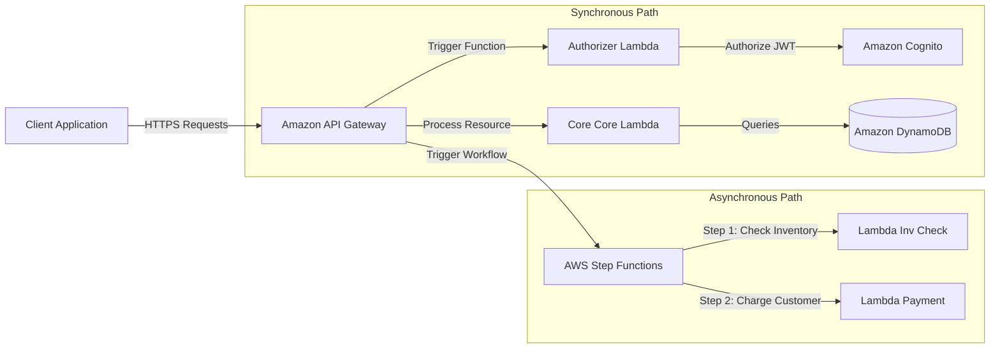

# Serverless Architecture on AWS

Serverless is a cloud execution model where developers write code and the cloud provider fully manages container execution, machine provisioning, OS maintenance, security patching, and elastic scaling.

---

## ⚡ Core Pillars of AWS Serverless

1.  **No Server Management**: No operating system, middleware, or runtime patches to apply.
2.  **Flexible Scaling**: Functions and databases scale automatically in response to ingestion volume.
3.  **Pay-for-Value**: You pay strictly for execution time, memory, or read/write capacities consumed. No idle fees.
4.  **Built-in High Availability**: Serverless systems scale automatically across multiple Availability Zones natively.

---

## 🏗️ Serverless Microservices Reference Architecture

The diagram below illustrates a classic synchronous serverless microservice using API Gateway, Lambda, DynamoDB, and Step Functions.

---

## Key Serverless Components on AWS

### 1. AWS Lambda
FaaS (Function-as-a-Service) processing events.
*   **Provisioned Concurrency**: Keeps a pre-warmed set of functions ready to respond instantly to eliminate cold starts.
*   **Ephemeral Storage**: Up to 10 GB storage available in `/tmp`.

### 2. Amazon API Gateway
Fully managed service to create, publish, maintain, monitor, and secure APIs.
*   **REST API**: Feature-rich, supports API keys, caching, and rate limiting.
*   **HTTP API**: Up to 70% cheaper and faster than REST APIs, optimized for low-latency Lambda integrations.
*   **WebSocket API**: Allows full-duplex bi-directional communication.

### 3. Amazon DynamoDB
Fully managed NoSQL database with single-digit millisecond latency at any scale.
*   **On-Demand Mode**: Pay-per-request scaling model, excellent for unpredictable workloads.
*   **Provisioned Capacity Mode**: Pre-defined WCU (Write Capacity Units) and RCU (Read Capacity Units) with auto-scaling configured, best for steady-state workloads.

### 4. AWS Step Functions
Low-code visual workflow orchestrator used to build distributed state machines.
*   **Standard Workflows**: Long-running (up to 1 year), visual auditing, exact-once execution.
*   **Express Workflows**: Short-lived (< 5 mins), high-throughput (up to 100k events/sec), at-least-once execution.

---

## 🥶 Cold Starts: Mitigations and Best Practices

A **Cold Start** occurs when Lambda must initialize a new container instance to handle an incoming request. This latency can range from 100ms to several seconds.

### Best Practices to Minimize Cold Starts
*   **Right-size your Memory**: Allocating more memory allocates proportionally more CPU, accelerating boot times.
*   **Optimize Code Packages**: Minify code, exclude unused dependencies, and leverage lightweight frameworks.
*   **Use Provisioned Concurrency**: Pre-allocates execution environments for instant execution.
*   **Natively compile**: Compile code into optimized binaries (e.g., using Rust, Go, or Java with GraalVM).

---

## Common Pitfalls in Serverless Design
*   **Lambda Pinning (Databases)**: Initiating direct connections to a traditional relational database (RDS) inside Lambda. Rapid scaling can exhaust database connection pools. (Mitigation: Use **RDS Proxy**).
*   **Over-permissioning Functions**: Assigning a wildcard `*` IAM policy to Lambda. Each function must utilize a scoped IAM role adhering to least privilege.
*   **Mono-Lambda Anti-Pattern**: Packing an entire backend application (e.g., Express.js monolith) into a single Lambda function. This increases cold starts and degrades performance.

---

## SA Interview Questions on Serverless

### Question 1: How do you prevent a serverless application from exhausting database connections?
**Answer**: 
Unlike containerized microservices that hold connection pools active, Lambda instances spin up and tear down constantly, creating and abandoning database connections rapidly. 
To resolve this:
1.  Use **RDS Proxy**. RDS Proxy pools and shares database connections, reducing database memory usage and connection exhaustion hazards.
2.  Use **DynamoDB** which is designed for serverless architectures and interacts via HTTP requests instead of persistent TCP connections.

### Question 2: When should you choose AWS Step Functions over simple Lambda-to-Lambda chaining?
**Answer**: 
Lambda-to-Lambda chaining is an anti-pattern for complex workflows because:
*   **Error Handling**: Managing failures, timeouts, and retries in custom code is difficult and expensive.
*   **Idle Fees**: Function A must run and wait for Function B to complete, incurring double execution costs.
*   **State Tracking**: State must be passed manually between steps.
Use **AWS Step Functions** to orchestrate workflows, handle errors automatically, manage retries, support human-in-the-loop approvals, and eliminate pay-for-idle during wait states.

### Question 3: What is the difference between API Gateway REST APIs and HTTP APIs?
**Answer**: 
*   **HTTP APIs** are lightweight, designed for low-latency proxy integrations (Lambda, ALB, HTTP backends). They are up to 70% cheaper than REST APIs and lack complex features like API keys, client certificates, or request transformations.
*   **REST APIs** are older and fully featured, offering built-in request/response validation, API keys, cache settings, edge-optimized deployments, and WAF integration. Use HTTP APIs for basic microservice routes and REST APIs for enterprise-controlled entry points.
