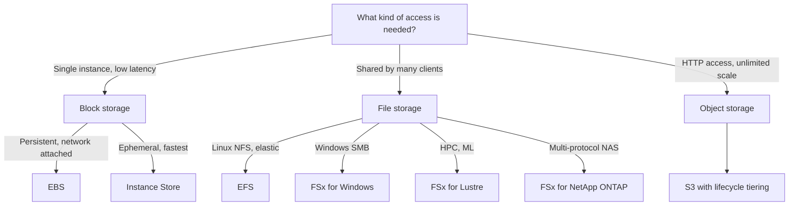

# Storage on AWS

AWS offers block, file, and object storage, each with distinct access semantics, performance profiles, and pricing. Selecting the right one, and tiering data over its lifecycle, drives both performance and cost. This guide covers storage fundamentals, then S3, EBS, EFS, FSx, hybrid and edge options, and AWS Backup. For S3 class pricing strategy see [Cost Optimization](cost-optimization.md); for database durability see [Databases on AWS](databases-on-aws.md); for cross-region resilience see [High Availability and DR](high-availability-and-dr.md).

---

## 🧠 Storage Fundamentals

### Block vs. File vs. Object

| Type | Access | Structure | Latency | AWS Services | Typical Use |
| :--- | :--- | :--- | :--- | :--- | :--- |
| **Block** | Raw device attached to one host | Fixed-size blocks, OS formats a file system | Lowest (sub-ms) | EBS, Instance Store | Boot volumes, databases |
| **File** | Shared network file system (NFS, SMB) | Directory hierarchy | Low (ms) | EFS, FSx | Shared content, lift-and-shift apps |
| **Object** | HTTP API (`GET`/`PUT`) | Flat namespace of key + data + metadata | Higher (tens of ms) | S3 | Data lakes, backups, media |

### RAID, IOPS, and Throughput

*   **RAID 0** stripes data across volumes for more IOPS and throughput with no redundancy; **RAID 1** mirrors for redundancy. EBS volumes are already replicated within an AZ, so RAID 0 is used mainly to exceed a single volume's limits.
*   **IOPS** matters for small random I/O (databases); **throughput** (MB/s) matters for large sequential I/O (analytics, backups). `Throughput = IOPS x I/O size`.
*   **Durability** is the chance data is not lost (S3: 11 nines); **availability** is the chance you can reach it now (S3 Standard: 99.99%).

---

## 🗺️ Storage Decision Flow



---

## 🪣 Amazon S3

Regional object storage with 11 nines of durability, unlimited capacity, and objects up to 50 TB, raised from 5 TB in Dec 2025 (multipart upload recommended above 100 MB, required above 5 GB).

### Storage Classes

| Class | Min Duration | Availability | Retrieval | Use Case |
| :--- | :--- | :--- | :--- | :--- |
| **Standard** | None | 99.99% | Instant | Hot data |
| **Intelligent-Tiering** | None | 99.9% | Instant (auto tiers) | Unknown or changing access |
| **Standard-IA** | 30 days | 99.9% | Instant, per-GB fee | Infrequent but resilient |
| **One Zone-IA** | 30 days | 99.5% (1 AZ) | Instant, per-GB fee | Re-creatable data |
| **Glacier Instant** | 90 days | 99.9% | Milliseconds | Quarterly-access archives |
| **Glacier Flexible** | 90 days | 99.99% | Minutes to 12 hours | Backups, DR archives |
| **Glacier Deep Archive** | 180 days | 99.99% | 12 to 48 hours | Compliance, 7-10 year retention |
| **Express One Zone** | None | Single AZ | Single-digit ms | Latency-sensitive ML, analytics |

### Data Management Features

*   **Lifecycle rules**: Transition objects between classes and expire objects or old versions by age; also abort incomplete multipart uploads (a common hidden cost).
*   **Versioning**: Keeps every version; a delete adds a **delete marker**. Once enabled it can only be suspended, not removed.
*   **Replication**: **CRR** (cross-region, for compliance and latency) and **SRR** (same-region, for log aggregation). Needs versioning on both buckets and replicates only new objects (use **S3 Batch Replication** for existing ones).
*   **Object Lock**: WORM protection, requires versioning. **Governance** mode can be bypassed by privileged users; **Compliance** mode cannot be altered by anyone, including root, until retention expires. **Legal hold** lasts until removed.
*   **Encryption**: SSE-S3 is the default; SSE-KMS adds key policy control and CloudTrail auditing.
*   **Consistency**: Strong read-after-write consistency for all PUTs, DELETEs, and LISTs, with no configuration.

### Performance

S3 scales to at least **3,500 write and 5,500 read requests per second per prefix**, with no limit on prefixes. Spread heavy workloads across prefixes, use **multipart upload** and **byte-range fetches** for parallelism, **Transfer Acceleration** for long-distance uploads, and **CloudFront** for repeated global reads.

### Presigned URLs

A presigned URL grants time-limited access to one object using the signer's permissions, without making the bucket public.

```bash
aws s3 presign s3://example-reports-bucket/reports/q1.pdf --expires-in 900
```

The URL is only as powerful as the signing identity, so sign with a role limited to `s3:GetObject` on the needed prefix, and keep the expiry short.

### Least-Privilege Bucket Policy Example

Denies non-TLS access, and grants one application role read-only access to one prefix.

```json
{
  "Version": "2012-10-17",
  "Statement": [
    {
      "Sid": "DenyInsecureTransport",
      "Effect": "Deny",
      "Principal": "*",
      "Action": "s3:*",
      "Resource": [
        "arn:aws:s3:::example-reports-bucket",
        "arn:aws:s3:::example-reports-bucket/*"
      ],
      "Condition": { "Bool": { "aws:SecureTransport": "false" } }
    },
    {
      "Sid": "AllowAppReadReportsPrefix",
      "Effect": "Allow",
      "Principal": { "AWS": "arn:aws:iam::111122223333:role/reports-reader" },
      "Action": "s3:GetObject",
      "Resource": "arn:aws:s3:::example-reports-bucket/reports/*"
    }
  ]
}
```

Keep **S3 Block Public Access** on and prefer **VPC Gateway Endpoints** (free) for private access. See [Security and Compliance](security-and-compliance.md).

---

## 💽 Amazon EBS (Block Storage)

Network-attached, AZ-scoped volumes replicated within the AZ. Move across AZs or regions via snapshots (incremental, stored in S3, automated with Data Lifecycle Manager). Multi-Attach is available for io1/io2 only.

| Volume Type | Media | Max IOPS | Max Throughput | Use Case |
| :--- | :--- | :--- | :--- | :--- |
| **gp3** | SSD | 16,000 (3,000 baseline, provisioned independently) | 1,000 MB/s | Default, boot volumes |
| **gp2** | SSD | 16,000 (3 IOPS/GB, burst credits) | 250 MB/s | Legacy; migrate to gp3 |
| **io2 Block Express** | SSD | 256,000 | 4,000 MB/s | Critical databases, sub-ms, 99.999% durability |
| **io1** | SSD | 64,000 | 1,000 MB/s | Legacy provisioned IOPS |
| **st1** | HDD | 500 | 500 MB/s | Big data, logs, streaming |
| **sc1** | HDD | 250 | 250 MB/s | Lowest-cost cold data |

*   HDD volumes (st1, sc1) cannot be boot volumes.
*   **Instance Store** is physically attached, fast, and ephemeral (lost on stop or terminate).

---

## 📁 Amazon EFS and the FSx Family

### Amazon EFS

A serverless, elastic NFSv4 file system for Linux, mountable by thousands of EC2, ECS, EKS, and Lambda clients across AZs.

*   **Throughput modes**: Elastic (recommended), Provisioned, or Bursting.
*   **Storage classes**: Standard, Infrequent Access, and Archive with lifecycle management; One Zone variants cost less at reduced resilience.
*   Access via POSIX permissions, **EFS Access Points**, IAM authorization, and security groups on mount targets.

### Amazon FSx

| Service | Protocol / Engine | Best For |
| :--- | :--- | :--- |
| **FSx for Windows File Server** | SMB, Active Directory, NTFS | Windows apps, user shares |
| **FSx for Lustre** | Parallel file system, S3 integration | HPC, ML training |
| **FSx for NetApp ONTAP** | NFS, SMB, iSCSI, dedup | Enterprise NAS migration |
| **FSx for OpenZFS** | NFS, ZFS snapshots and clones | Linux workloads moving from ZFS |

---

## 🌉 Hybrid, Edge, and Transfer

### AWS Storage Gateway

| Gateway Type | Presents | Backed By |
| :--- | :--- | :--- |
| **S3 File Gateway** | NFS/SMB | S3, with local cache |
| **FSx File Gateway** | SMB | FSx for Windows |
| **Volume Gateway** | iSCSI | Cached (S3 primary) or Stored (local primary, async snapshots) |
| **Tape Gateway** | Virtual tape library | S3 and Glacier |

### Snow Family and Transfer Services

*   **Snowcone** (8-14 TB) and **Snowball Edge** (about 80 TB Storage Optimized, or Compute Optimized for edge processing) move data physically. Rule of thumb: if the transfer would take over a week on available bandwidth, use Snow.
*   **DataSync**: Agent-based online transfer (NFS, SMB, HDFS, S3) with scheduling and verification.

---

## 🛟 AWS Backup

Centralized, policy-based backup for EBS, EFS, FSx, RDS, Aurora, DynamoDB, S3, and EC2.

*   **Backup plans** define schedule, retention, cold-storage lifecycle, and cross-region and cross-account copies.
*   **Vault Lock** enforces WORM on recovery points so ransomware or a compromised admin cannot delete them.

---

## 📋 Storage Decision Table

| Requirement | Recommended Service |
| :--- | :--- |
| Boot volume or general database disk | EBS gp3 |
| Highest IOPS, sub-ms, critical database | EBS io2 Block Express |
| Cheap sequential big-data throughput | EBS st1 |
| Ephemeral, ultra-fast scratch | Instance Store |
| Shared POSIX file system across AZs | EFS |
| Windows SMB shares with Active Directory | FSx for Windows |
| HPC or ML training with S3 data | FSx for Lustre |
| Multi-protocol enterprise NAS | FSx for NetApp ONTAP |
| Data lake, static assets, backups | S3 |
| Unknown access pattern | S3 Intelligent-Tiering |
| Large offline migration, poor bandwidth | Snowball Edge |
| On-premises apps using S3 as backend | S3 File Gateway |
| Immutable long-term compliance archive | Glacier Deep Archive + Object Lock |

---

## SA Interview Questions on Storage

### Question 1: How do you choose between EBS, EFS, and S3?
**Answer**: Use **EBS** for low-latency block storage attached to one instance (databases, boot disks), **EFS** when many Linux instances across AZs need a shared POSIX file system, and **S3** for unlimited-scale object storage over HTTP (data lakes, backups, media). Per-GB cost generally ranks S3 lowest, then EFS, then EBS.

### Question 2: An EBS gp2 volume's performance is inconsistent. What is happening?
**Answer**: gp2 IOPS is tied to size (3 IOPS per GB) with a burst-credit bucket; small volumes exhaust credits and fall to baseline. Migrate online to **gp3**, which gives 3,000 IOPS baseline with IOPS and throughput provisioned independently at lower cost. For sustained high IOPS with sub-ms latency, use io2 Block Express.

### Question 3: How do you protect S3 data from accidental deletion and ransomware?
**Answer**: Enable **versioning**, restrict deletes with bucket policy and MFA Delete, and use **Object Lock** in Compliance mode. Replicate to a bucket in a separate, tightly controlled account, back up with AWS Backup plus Vault Lock, and log data events with CloudTrail.

### Question 4: What consistency model does S3 provide, and does it affect design?
**Answer**: Strong read-after-write consistency for new objects, overwrites, deletes, and LISTs, so designs no longer need delays or external metadata stores to track listings.

### Question 5: How do you grant a mobile client temporary upload access to one S3 object?
**Answer**: A backend (Lambda behind API Gateway) generates a **presigned PUT URL** using a role limited to `s3:PutObject` on a specific key prefix with a short expiry. The client uploads directly to S3, so large files never pass through the API. Enforce size limits with presigned POST policies and validate content through an S3 event trigger.

### Question 6: You must move 200 TB from on premises over a 500 Mbps link. What do you do?
**Answer**: At 500 Mbps that is roughly 40 days of transfer, so order several **Snowball Edge Storage Optimized** devices for the bulk load and use **DataSync** over the network for deltas until cutover. Encrypt with KMS and land data in S3 with a lifecycle policy.

### Question 7: How do you cut S3 costs for data with an unpredictable access pattern?
**Answer**: Use **S3 Intelligent-Tiering**, which moves objects between access tiers automatically with no retrieval fees (a small per-object monitoring fee applies; objects under 128 KB are not tiered). For known patterns use lifecycle rules to Standard-IA and Glacier tiers.

### Question 8: A Windows application needs shared storage with Active Directory authentication. Which service?
**Answer**: **FSx for Windows File Server**: native SMB, NTFS ACLs, AD integration, DFS namespaces, and Multi-AZ deployment. EFS does not support SMB or Windows clients. For on-premises access with local caching, add an FSx File Gateway.
