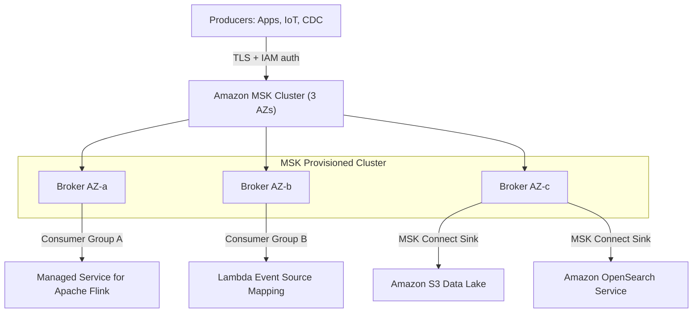
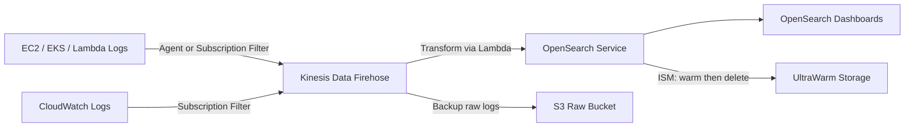

# Streaming, Search & Big Data on AWS (Kafka, OpenSearch, EMR)

Apache Kafka and Elasticsearch are the two most common open-source building blocks for real-time data platforms. AWS offers managed equivalents: **Amazon MSK** for Kafka and **Amazon OpenSearch Service** for Elasticsearch. This guide covers the fundamentals you need to reason about them, and how they map to AWS. For managed messaging alternatives, see [Event-Driven Architecture](event-driven-architecture.md); for consistency and ordering theory, see [Distributed Systems Fundamentals](distributed-systems-fundamentals.md).

---

## 🧱 Kafka Fundamentals

| Concept | Meaning | Why It Matters |
| :--- | :--- | :--- |
| **Topic** | Named, append-only log of records | Logical channel for a data stream |
| **Partition** | Ordered, immutable slice of a topic | Unit of parallelism and ordering |
| **Offset** | Sequential position of a record in a partition | Consumers track progress with it |
| **Consumer Group** | Set of consumers sharing a topic's partitions | Each partition is read by exactly one member per group |
| **Broker** | Kafka server storing partitions | Scale storage and throughput by adding brokers |
| **Replication Factor** | Copies of each partition across brokers | Durability and failover |
| **ISR (In-Sync Replicas)** | Replicas caught up with the leader | Only ISR members can be elected leader |

### Key Behaviors
*   **Ordering**: Guaranteed **only within a partition**. Records with the same key hash to the same partition, so per-key ordering holds (e.g., all events for `order-42`).
*   **Parallelism ceiling**: A consumer group can have at most as many active consumers as partitions. Extra consumers sit idle.
*   **Retention**: Records are kept by time or size (not deleted on consumption), so multiple groups can replay independently by resetting offsets.
*   **Log Compaction**: Instead of time-based deletion, keeps the **latest record per key**. Ideal for changelogs and "current state" topics (e.g., customer profile).

### Replication and Durability
*   Producer setting `acks=all` waits for all ISR replicas to acknowledge.
*   Broker/topic setting `min.insync.replicas=2` with `replication.factor=3` means a write survives one broker failure and is rejected if fewer than 2 replicas are in sync (favoring consistency over availability).
*   `unclean.leader.election.enable=false` prevents an out-of-sync replica becoming leader (avoids data loss).

### Delivery Semantics

| Semantics | How Achieved | Trade-off |
| :--- | :--- | :--- |
| **At-most-once** | Commit offset before processing | Possible data loss |
| **At-least-once** | Commit offset after processing (default pattern) | Possible duplicates; make consumers idempotent |
| **Exactly-once** | Idempotent producer (`enable.idempotence=true`) + transactions + `read_committed` consumers | Higher latency; scoped to Kafka-to-Kafka flows |

---

## ☁️ Amazon MSK Architecture

### MSK Deployment Options

| Option | Model | Best For |
| :--- | :--- | :--- |
| **MSK Provisioned (Standard)** | You pick broker type/count, storage; EBS-backed | Predictable, high-throughput workloads needing tuning |
| **MSK Provisioned (Express brokers)** | Faster scaling and recovery, managed storage | Reduced operational effort at scale |
| **MSK Serverless** | Capacity auto-managed, pay per throughput/partition | Spiky or unknown workloads, minimal ops |
| **MSK Connect** | Managed Kafka Connect workers running connectors | Source/sink integration (Debezium, S3, OpenSearch) without managing workers |

### MSK Operational Notes
*   Brokers are spread across **2 or 3 AZs**; use 3 AZs with replication factor 3 for production.
*   **Authentication**: IAM access control (recommended), SASL/SCRAM via Secrets Manager, or mutual TLS. Encryption in transit (TLS) and at rest (KMS) are supported.
*   **Storage**: Enable tiered storage to offload older data to low-cost storage while keeping long retention.
*   **Monitoring**: CloudWatch metrics such as `MaxOffsetLag`, `UnderReplicatedPartitions`, and broker CPU; consumer lag is the key health indicator.

---

## 🆚 Kafka (MSK) vs Kinesis vs SQS

| Criteria | **Amazon MSK** | **Kinesis Data Streams** | **Amazon SQS** |
| :--- | :--- | :--- | :--- |
| **Model** | Distributed log | Distributed log (managed) | Queue |
| **Ordering** | Per partition | Per shard | FIFO per message group |
| **Replay / retention** | Configurable, unbounded with tiered storage | 24h default, up to 365 days | None (deleted after processing) |
| **Multiple independent consumers** | Yes (consumer groups) | Yes (shared or enhanced fan-out) | No (use SNS fan-out) |
| **Throughput scaling** | Add partitions/brokers | Add shards or on-demand mode | Practically unlimited (standard) |
| **Ops burden** | Medium (partitions, sizing, upgrades) | Low | Lowest |
| **Ecosystem** | Kafka clients, Connect, Streams, Flink | AWS-native integrations | AWS-native, simple API |
| **Choose when** | Kafka compatibility, migration from on-prem Kafka, rich ecosystem | AWS-native streaming with low ops | Decoupling and work queues, no replay needed |

**Rule of thumb**: SQS for task queues, Kinesis for AWS-native streaming, MSK when you need the Kafka API/ecosystem or are migrating existing Kafka workloads.

---

## 🔎 Elasticsearch / Elastic Stack Fundamentals

| Concept | Meaning |
| :--- | :--- |
| **Inverted Index** | Maps each term to the documents containing it; enables fast full-text search |
| **Index** | Collection of documents (roughly a table) |
| **Shard** | A Lucene index; primary shards split data horizontally |
| **Replica** | Copy of a primary shard for HA and read throughput |
| **Mapping** | Schema defining field types (`keyword` for exact match, `text` for analyzed full-text) |
| **Analyzer** | Tokenizer plus filters that process text at index and query time |
| **ELK/Elastic Stack** | Elasticsearch (store/search), Logstash or Beats (ingest), Kibana (visualize) |

### Sizing Guidance
*   Target **10-50 GB per shard**; too many small shards waste heap and slow the cluster.
*   Primary shard count is **fixed at index creation** (changing it requires reindex or split), so plan up front or use time-based indices with rollover.
*   Use at least **1 replica** across AZs. Use dedicated **master nodes** (3) for cluster stability.
*   Time-series data: use **Index State Management (ISM)** policies for hot, warm, UltraWarm/cold, then delete.

---

## 🔍 Amazon OpenSearch Service & Serverless

| Feature | **OpenSearch Service (Managed Domains)** | **OpenSearch Serverless** |
| :--- | :--- | :--- |
| **Capacity** | You choose instance types, nodes, storage | Auto-scaled OpenSearch Compute Units (OCUs) |
| **Collection types** | N/A (indices in a domain) | Search, Time series, Vector search |
| **Tiering** | Hot, UltraWarm, Cold storage | Managed internally |
| **Access control** | IAM, fine-grained access control, VPC | Data access policies, network and encryption policies |
| **Best for** | Steady, tunable workloads; full control | Variable workloads, minimal ops |

Use cases: log analytics, application search, security analytics (SIEM), and vector search for RAG (see [GenAI on AWS](genai-on-aws.md)).

### Log Analytics Pipeline

Alternatives: **OpenSearch Ingestion** (managed Data Prepper) for direct ingestion pipelines, or **CloudWatch Logs Insights** for ad-hoc queries without running a cluster.

---

## 📊 Big Data Processing Overview

| Service | Role | Typical Use |
| :--- | :--- | :--- |
| **Amazon EMR** | Managed Hadoop/Spark/Flink/Hive/Presto clusters (EC2, EKS, or Serverless) | Large-scale ETL, ML data prep, custom frameworks; Spot for task nodes |
| **AWS Glue** | Serverless Spark ETL, Data Catalog, crawlers, schema registry | Catalog data lakes and run managed ETL jobs |
| **Amazon Athena** | Serverless SQL over S3 (Trino-based), pay per data scanned | Ad-hoc queries; use Parquet/ORC plus partitioning to cut cost |
| **Amazon Redshift** | Columnar data warehouse | BI, complex joins, structured analytics |
| **Managed Service for Apache Flink** | Stateful stream processing | Windowed aggregations on MSK/Kinesis streams |
| **Lake Formation** | Central governance for the data lake | Fine-grained column/row-level permissions |

**Typical lake flow**: sources to MSK/Kinesis, then S3 (raw), Glue ETL to Parquet (curated), catalog in Glue Data Catalog, query with Athena/Redshift Spectrum, govern with Lake Formation.

---

---

## SA Interview Questions on Streaming, Search & Big Data

### Question 1: How does Kafka guarantee ordering, and how do you scale consumers without losing it?
**Answer**:
Kafka guarantees order only **within a partition**. Producers set a record key; the key hash picks the partition, so all events for one entity stay ordered. To scale consumers, add members to the consumer group up to the partition count. Design keys for even distribution and pick the partition count up front, because increasing it later remaps keys and breaks per-key ordering for in-flight data.

### Question 2: Explain replication factor, ISR, and `min.insync.replicas`. What settings give durable writes?
**Answer**:
Each partition has a leader and followers; followers caught up with the leader form the ISR. For durability use `replication.factor=3`, `min.insync.replicas=2`, and producer `acks=all`. A write is acknowledged only after at least two replicas have it, so one broker or AZ failure loses no data. If ISR drops below 2, writes are rejected, trading availability for consistency.

### Question 3: How would you achieve exactly-once processing with Kafka?
**Answer**:
Enable the **idempotent producer** (`enable.idempotence=true`) to dedupe retries, use **transactions** to write outputs and commit consumer offsets atomically, and set consumers to `isolation.level=read_committed`. This is exactly-once within Kafka (e.g., Kafka Streams/Flink). For external sinks (databases, S3), fall back to at-least-once plus idempotent writes using a unique key or upsert.

### Question 4: When would you pick MSK over Kinesis Data Streams, and Serverless over Provisioned?
**Answer**:
Pick **MSK** when you need the Kafka API and ecosystem (Connect, Streams, existing clients), are migrating on-prem Kafka, or need long or tiered retention. Pick **Kinesis** for AWS-native streaming with minimal operations. Within MSK, choose **Serverless** for spiky or unpredictable traffic and low ops, and **Provisioned** when you need fine-grained tuning, predictable high throughput, or configuration not exposed by Serverless.

### Question 5: How do you design a scalable, cost-effective log analytics platform on AWS?
**Answer**:
Ship logs via CloudWatch subscription filters or agents to **Kinesis Data Firehose** (or MSK for high volume), with a Lambda transform, delivering to **OpenSearch Service** and backing up raw data to **S3**. Use time-based indices with ISM: hot for recent data, **UltraWarm** for older, then delete or archive to S3. Keep shards at 10-50 GB, run 3 dedicated masters across 3 AZs, and secure with VPC plus fine-grained access control. Query cold history with Athena instead of keeping it in the cluster.

### Question 7: EMR, Glue, or Athena for a new data lake transformation and query workload?
**Answer**:
Use **Glue** for serverless ETL and the Data Catalog when jobs are standard Spark and you want no cluster management. Use **EMR** when you need custom frameworks, fine control of Spark/Hive/Flink, long-running clusters, or Spot-optimized cost at large scale. Use **Athena** for ad-hoc SQL on S3 with no infrastructure; store data as partitioned Parquet to reduce scanned bytes and cost. They often combine: Glue ETL then Athena queries, governed by Lake Formation.
