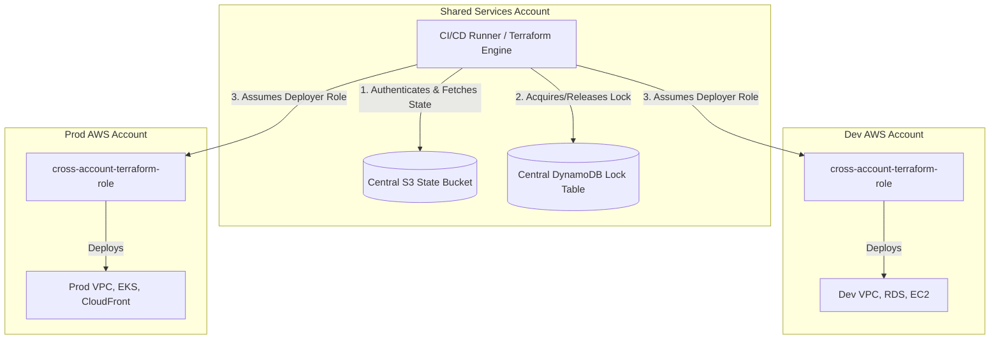
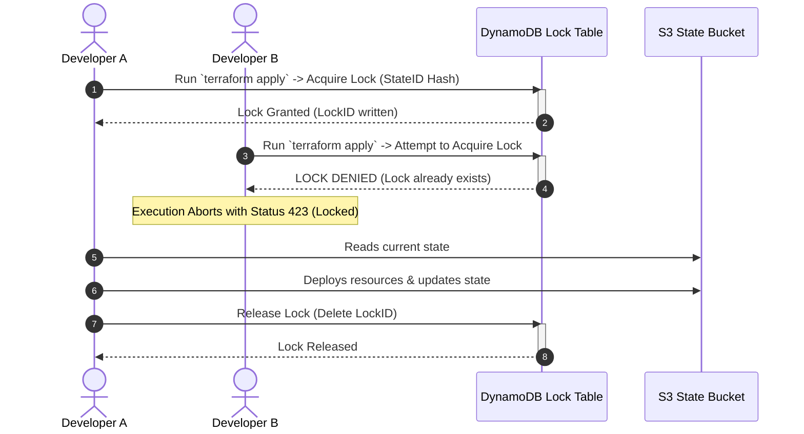
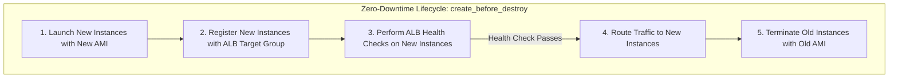
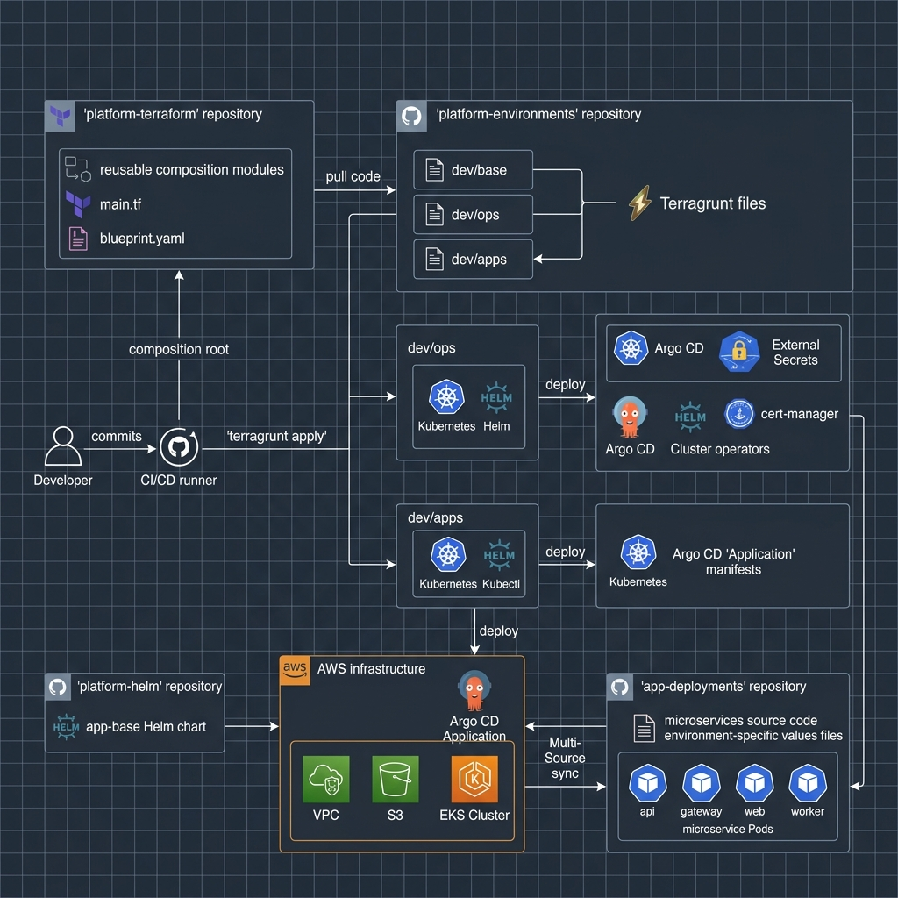

# Infrastructure as Code (IaC) with Terraform

Infrastructure as Code (IaC) is the practice of managing and provisioning computing infrastructure through machine-readable definition files, rather than manual interactive configuration tools. **Terraform by HashiCorp** is the industry-standard declarative IaC tool, enabling cloud architects to define multi-cloud resources in human-readable HashiCorp Configuration Language (HCL).

---

## 🏛️ Terraform Core Architecture

Terraform uses a declarative approach. You define the *target* state of your infrastructure, and Terraform's core engine compares it to the *current* state to compute a execution plan to bridge the gap.

```
       ┌────────────────────────┐
       │   HCL Configurations   │
       │   (.tf files)          │
       └───────────┬────────────┘
                   │
                   ▼
┌───────────────────────────────────────┐
│           Terraform Core              │◄───────────┐
│  - Parses configuration               │            │
│  - Builds Dependency Graph            │            │
│  - Compares State vs Reality          │            │
└──────────────────┬────────────────────┘            │ Read/Write State
                   │                                 │
                   ▼                                 ▼
┌───────────────────────────────────────┐   ┌─────────────────┐
│               Providers               │   │   State File    │
│  - AWS, Azure, GCP, Kubernetes, etc.  │   │  (local/remote) │
│  - Translates HCL to API calls        │   └─────────────────┘
└──────────────────┬────────────────────┘
                   │
                   ▼
┌───────────────────────────────────────┐
│        Target Cloud Providers         │
│          (AWS Cloud APIs)             │
└───────────────────────────────────────┘
```

### The Declarative Lifecycle
1. **`terraform init`**: Initializes the working directory, downloads required providers, and configures the remote backend.
2. **`terraform plan`**: Compares HCL files against the state file and the active cloud environment. Generates a list of actions (create, update, delete) without making changes.
3. **`terraform apply`**: Executes the action plan, making API calls to provision the infrastructure, and saves the updated state.
4. **`terraform destroy`**: Identifies all managed resources in the state file and tears them down in the correct dependency order.

---

## 📊 Scenario-Based Architecture Designs

### Scenario 1: Secure Multi-Account Deployments with Terraform
For enterprise security, organizations separate workloads into distinct accounts (Dev, Staging, Prod). A centralized execution runner (like GitHub Actions, GitLab CI, or Jenkins) in a **Shared Services/CI-CD Account** manages deployments by assuming cross-account IAM roles, storing all state files in a centralized S3 Bucket and DynamoDB Lock Table.



#### Code Implementation Pattern
To implement this, you configure the primary Terraform backend in your config, and dynamically configure providers to assume target roles using variables:

```hcl
# backend.tf (Shared Services Account)
terraform {
  backend "s3" {
    bucket         = "enterprise-terraform-state-bucket"
    key            = "environments/prod/terraform.tfstate"
    region         = "us-east-1"
    dynamodb_table = "enterprise-terraform-locks"
    encrypt        = true
  }
}

# providers.tf
provider "aws" {
  region = var.aws_region

  assume_role {
    role_arn     = "arn:aws:iam::${var.target_account_id}:role/cross-account-terraform-role"
    session_name = "TerraformDeploymentSession"
  }
}
```

---

### Scenario 2: State Locking & Concurrent Team Execution
When multiple developers or CI/CD pipelines attempt to run `terraform apply` concurrently, state file corruption can occur. Terraform uses AWS **DynamoDB** as a locking mechanism. The first process acquires a lock in DynamoDB, and any subsequent process is blocked until the lock is released.



---

### Scenario 3: Zero-Downtime Infrastructure Updates using Lifecycle Rules
By default, when a resource update requires destruction and recreation (such as changing an EC2 Launch Template's AMI or changing an RDS DB Engine version), Terraform destroys the existing resource *before* creating the new one. This causes downtime. 
To achieve zero-downtime deployments, you configure the `create_before_destroy` lifecycle block.



#### Code Implementation Pattern
```hcl
resource "aws_launch_template" "app" {
  name_prefix   = "app-launch-template-"
  image_id      = var.new_ami_id
  instance_type = "t3.medium"

  lifecycle {
    create_before_destroy = true
  }
}

resource "aws_autoscaling_group" "app_asg" {
  launch_template {
    id      = aws_launch_template.app.id
    version = "$Latest"
  }
  
  min_size          = 2
  max_size          = 4
  desired_capacity  = 2
  target_group_arns = [aws_lb_target_group.app_tg.arn]

  # Enforce instance refresh or create before destroy on updates
  lifecycle {
    create_before_destroy = true
  }
}
```

---

### Scenario 4: Enterprise-Scale GitOps, Terragrunt & Multi-Source Argo CD Architecture
In a production cloud environment, maintaining a clean separation between infrastructure code, environment configurations, and application configurations is crucial. This scenario describes a real-world enterprise deployment model using four distinct repositories to enforce separation of concerns and enable GitOps practices.

#### Repository Architecture & Separation of Concerns
1. **`platform-terraform` (IaC Modules & Composition Root)**: Contains pure, reusable Terraform modules. It includes a composition root (e.g., `aws/`) that orchestrates individual modules (VPC, EKS, RDS, S3). Configuration structures, default tags, and sizes are defined in a local `blueprint.yaml` and read by Terraform using `yamldecode()`. This repository exposes a clean input interface (e.g. `env`, `stack_name`, `cidr_block`).
2. **`platform-environments` (Live Stack Configurations & Terragrunt)**: A GitOps-live repository containing Terragrunt configurations (`terragrunt.hcl`). It defines the environment environments (e.g., `/dev/base/`, `/dev/ops/`, `/dev/apps/`) and binds them to specific git versions of the composition modules.
3. **`platform-helm` (Generic Microservice Chart)**: Hosts `app-base`, a generic, highly parameterized Helm chart that provides standard Deployment, Service, ingress-routing, and security configurations.
4. **`app-deployments` (App Code & Environment Values)**: Hosts the application configurations, values files, and source code. No Kubernetes templates are stored here; it only contains environment-specific values (e.g., `values/api/values.yaml`, `values/api/values-dev.yaml`).

#### GitOps Deployment Flow
Below is the visual deployment sequence representing this pipeline.



1. **VPC & Cluster Creation (`dev/base`)**: Terragrunt pulls the `aws/` composition root from `platform-terraform` and runs `terraform apply`, creating the fundamental VPC, networking, database resources, and the EKS cluster.
2. **Operator Bootstrap (`dev/ops`)**: A second Terragrunt unit applies `aws/compute/eks-ops` to configure Helm-installed cluster operators (Argo CD, AWS Load Balancer Controller, Karpenter, External Secrets, cert-manager) on the new cluster.
3. **Argo CD Application Setup (`dev/apps`)**: A third Terragrunt unit deploys Terraform resources that define Argo CD `Application` CRDs for individual microservices (`api`, `gateway`, `web`, `worker`).
4. **Argo CD Multi-Source Reconciliation**: The Argo CD controller uses the **Multi-Source Pattern** to pull:
   - Source A: The generic template chart from `platform-helm`.
   - Source B: The specific values files from `app-deployments`.
   Argo CD then reconciles and deploys the running microservice Pods into their respective namespaces.

#### Code Implementation Patterns

##### Terragrunt Environment Configuration (`platform-environments/dev/base/terragrunt.hcl`)
```hcl
include "root" {
  path = find_in_parent_folders("root.hcl")
}

terraform {
  source = "git::ssh://git@github.com/enterprise-org/platform-terraform.git//aws?ref=v2026.04.12"
}

inputs = {
  env          = "dev"
  stack_name   = "stack-a"
  cidr_block   = "10.0.0.0/16"
  application  = "core-platform"
  cost_center  = "platform-eng"
  region       = "us-east-1"
  team         = "devops"
}
```

##### Argo CD Application Definition via Terraform (`platform-environments/dev/apps/terragrunt.hcl` snippet)
```hcl
inputs = {
  applications = {
    api = {
      chart_repo_url  = "https://github.com/enterprise-org/platform-helm.git"
      chart_path      = "charts/app-base"
      chart_revision  = "v2026.04.01"
      values_repo_url = "https://github.com/enterprise-org/app-deployments.git"
      values_revision = "main"
      value_files = [
        "values/api/values.yaml",
        "values/api/values-dev.yaml",
      ]
      destination_namespace = "platform-api"
      auto_sync             = true
    }
  }
}
```

---

## ⚠️ Common Pitfalls in Terraform Architectures

*   **Committing Secrets to State Files**: Terraform state stores *everything* in plaintext, including database passwords and API keys passed as variables. 
    *   *Mitigation*: Never pass secrets as default variables. Instead, use dynamic lookups like `data "aws_secretsmanager_secret_version"` or fetch credentials at execution time via OIDC.
*   **Checking State Files into Git**: Hardcoding or storing state files inside your git repository can lead to credentials leakage and merge conflicts.
    *   *Mitigation*: Always configure a `.gitignore` that includes `*.tfstate`, `*.tfstate.backup`, and `.terraform/`. Always use a remote backend.
*   **Version Drift of Providers**: Not pinning provider versions can result in `terraform apply` failing in CI/CD when a provider releases a breaking API update.
    *   *Mitigation*: Always use a `required_providers` block with specific version constraints (e.g., `version = "~> 5.0"`).
*   **Circular Dependencies**: Creating resources that depend on each other (e.g., Security Group A referencing Security Group B, which in turn references Security Group A).
    *   *Mitigation*: Break down unified resources. For security groups, define rules independently using `aws_security_group_rule` resources rather than inline blocks.

---

## SA Interview Questions on Terraform

### Question 1: How do you refactor, rename, or move resources within your Terraform code without causing resource destruction and downtime in production?
**Answer**: 
Historically, renaming a resource in HCL meant Terraform would treat it as a deletion of the old resource name and creation of the new one. Developers had to manually run `terraform state mv` commands, which was error-prone and hard to run in automated CI/CD pipelines.

In modern Terraform (1.1+), you use the **`moved` configuration block**. This allows you to declaratively define the migration within the codebase. When the CI/CD pipeline runs `terraform plan`, Terraform detects the `moved` block and performs a state address update in-place instead of destroying and recreating the resource.

#### Example Refactoring:
If you rename an EC2 resource from `web_server` to `app_server`:
```hcl
# Old Code
# resource "aws_instance" "web_server" { ... }

# New Code
resource "aws_instance" "app_server" {
  ami           = "ami-123456"
  instance_type = "t3.micro"
}

# The Moved Block (records the renaming)
moved {
  from = aws_instance.web_server
  to   = aws_instance.app_server
}
```

---

### Question 2: How do you handle configuration drift (e.g., when a user makes manual changes to a resource in the AWS Console) and reconcile it using Terraform?
**Answer**: 
**Configuration Drift** occurs when the real-world infrastructure diverges from the state file and the HCL code.

To reconcile drift:
1.  **Detect Drift**: Run `terraform plan`. Terraform queries the AWS APIs to inspect the current state of active resources, compares it against the stored state, and highlights any differences under the "+/-" indicators.
2.  **Import Untracked Resources**: If the manual change was the creation of a completely new resource (e.g., someone manually created an S3 bucket), you must import it into your state using the `import` block:
    ```hcl
    import {
      to = aws_s3_bucket.imported_bucket
      id = "manually-created-bucket-name"
    }
    ```
    After importing, run `terraform plan` to generate the matching HCL block, and paste it into your configuration.
3.  **Resolve the Drift**:
    *   **Overwrite the manual changes**: If the manual change was incorrect and you want to restore the HCL configuration, run `terraform apply`. Terraform will modify the real-world infrastructure to match your code.
    *   **Adopt the manual changes**: If the manual change is correct and you want to keep it, update your HCL code to match the manual configuration, then run `terraform plan`. Once the plan output shows "No changes. Your infrastructure matches the configuration", the drift is resolved.

---

### Question 3: How do you secure and manage database credentials, API tokens, and access keys in a Terraform pipeline?
**Answer**:
1.  **Eliminate AWS Static Access Keys**: Never store `AWS_ACCESS_KEY_ID` and `AWS_SECRET_ACCESS_KEY` in Git or environment variables. Instead, run Terraform in CI/CD runners (like GitHub Actions, GitLab CI) using **OIDC (OpenID Connect)**. The runner assumes a short-lived IAM role in AWS dynamically using a JWT token.
2.  **Retrieve Secrets Dynamically at Runtime**: Use data sources to query external secure secret managers during the plan/apply phase, rather than storing secret values as plaintext variables.
    ```hcl
    data "aws_secretsmanager_secret_version" "db_creds" {
      secret_id = "prod/database/credentials"
    }

    locals {
      db_password = jsondecode(data.aws_secretsmanager_secret_version.db_creds.secret_string)["password"]
    }

    resource "aws_db_instance" "prod_db" {
      # ...
      password = local.db_password
    }
    ```
3.  **Use Sensitive Value Masking**: Mark variables holding credentials as `sensitive = true`. This prevents Terraform from printing these values to the CLI output or CI logs.
    ```hcl
    variable "db_password" {
      type      = string
      sensitive = true
    }
    ```
4.  **Encrypt State Backends**: Since the state file *must* write the password to its backend file in plaintext to track state, you must encrypt the S3 state bucket at rest (using KMS) and restrict bucket access using strict IAM policies and HTTPS-only transport rules.

---

### Question 4: Why would you choose a separate Terragrunt repository ("live repo") over putting all configurations and variables in your main Terraform modules repository?
**Answer**:
Separating modules (`platform-terraform`) from configuration environments (`platform-environments`) resolves several enterprise challenges:
1. **DRY (Don't Repeat Yourself) Code**: Infrastructure code is written once as reusable composition blocks and version-controlled. Different environments (Dev, Staging, Prod) just represent lightweight folders containing `.hcl` variable configuration files pointing to specific module versions.
2. **Version Pinning and Promotion**: You can safely test a new module version in Dev (pointing `ref=v2.0.0-rc1`) while Production remains locked on a stable version (pointing `ref=v1.8.0`). If everything is in one repository, promoting changes between environments without copying and pasting massive code blocks becomes extremely difficult.
3. **Blast Radius Reduction**: Each environment or sub-component (e.g. `/dev/base/` vs `/dev/ops/`) is a separate Terragrunt state directory. An error in a deployment to `dev/ops` only locks or corrupts that small state slice, rather than crashing or locking the state file for the entire `dev` AWS account cluster and network.
4. **Access Control**: You can enforce strict IAM and Git access permissions. Developers might have read-write access to `platform-environments` to change environment settings, but only Platform Engineers can modify `platform-terraform` modules.
