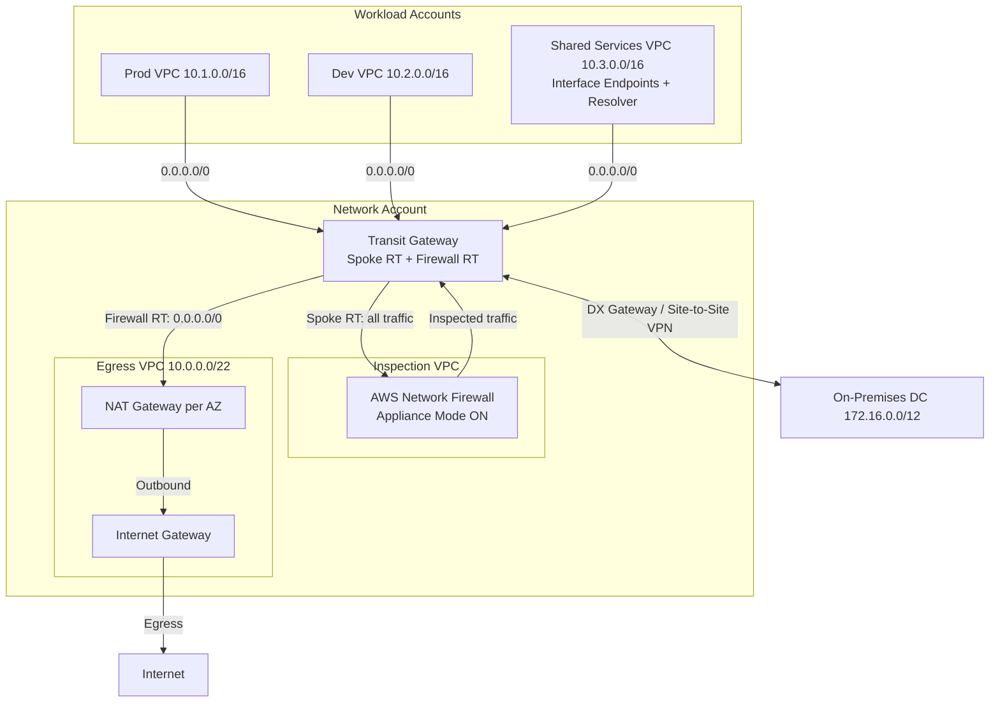

# VPC Network Design Deep-Dive on AWS

## 🌐 Introduction
The Virtual Private Cloud (VPC) is the foundation every other AWS workload sits on, and it is the hardest thing to change later. A bad CIDR choice, a single-AZ NAT Gateway, or a mesh of peering connections will follow a company for years. This guide covers how to plan address space, lay out subnet tiers, route traffic, and connect many VPCs and on-premises networks at scale.

> Related guides: security groups vs NACLs and edge protection are covered in [Security & Compliance](security-and-compliance.md); Route 53 routing policies and load balancers in [Networking & API Fundamentals](networking-and-api-fundamentals.md); Direct Connect and VPN in [Hybrid Cloud & Migration](hybrid-cloud-and-migration.md); OU and account structure in [Multi-Account Strategy](multi-account-strategy.md).

---

## 🧮 CIDR Planning

### 1. Rules of Thumb
*   **Never overlap**: Every VPC, on-premises range, and partner network that may *ever* need to talk must use unique CIDRs. Peering, Transit Gateway, and VPN routing cannot resolve overlapping ranges (only NAT or PrivateLink can work around them).
*   **Allocate big, carve small**: Use a `/16` per VPC (65,536 addresses) from a larger organizational block (e.g., `10.0.0.0/8` split by region then environment). IPs are free; re-IPing is not.
*   **VPC size limits**: A VPC CIDR block must be between `/16` and `/28`. You can add secondary CIDRs later (5 per VPC by default, adjustable), including from `100.64.0.0/10` for EKS pod IPs.
*   **Leave room**: Reserve unused `/20`s per VPC for future tiers (e.g., a new EKS cluster or a firewall subnet).

### 2. The 5 Reserved IPs per Subnet
AWS reserves 5 addresses in every subnet. For `10.0.1.0/24`:

| Address | Reserved For |
| :--- | :--- |
| `10.0.1.0` | Network address |
| `10.0.1.1` | VPC router |
| `10.0.1.2` | Amazon DNS resolver (VPC base + 2) |
| `10.0.1.3` | Reserved for future use |
| `10.0.1.255` | Broadcast (not supported, but reserved) |

So a `/24` gives **251** usable IPs, and a `/28` (the smallest allowed) gives only **11**.

### 3. Sizing Subnets
| Tier | Typical Size | Why |
| :--- | :--- | :--- |
| Public (ALB, NAT GW) | `/24`–`/26` | Few ENIs; ALBs need at least 8 free IPs per subnet. |
| Private app / EKS nodes | `/20` or larger | Auto Scaling, Fargate tasks, and VPC CNI pod IPs consume addresses fast. |
| Isolated data (RDS, ElastiCache) | `/24` | Small, predictable number of ENIs. |
| TGW attachment / Firewall endpoints | `/28` | Dedicated tiny subnets, per AWS guidance. |

### 4. Amazon VPC IPAM
**VPC IP Address Manager (IPAM)** centralizes CIDR allocation across an Organization using hierarchical **pools** (e.g., `global → us-east-1 → prod`) with allocation rules. VPCs created by Terraform/CloudFormation request a CIDR from a pool automatically, and IPAM flags overlapping or non-compliant CIDRs.

---

## 🏗️ Subnet Tiers & Routing

A subnet is "public" or "private" purely because of its **route table**, not a setting on the subnet.

| Tier | Default Route (`0.0.0.0/0`) | Inbound from Internet | Typical Residents |
| :--- | :--- | :--- | :--- |
| **Public** | Internet Gateway (IGW) | Yes (if resource has public IP + SG allows) | ALB, NLB, NAT Gateway, bastion (prefer SSM instead) |
| **Private** | NAT Gateway (same AZ) or TGW | No | App servers, ECS/EKS nodes, Lambda ENIs |
| **Isolated** | None (only `local` + VPC endpoints) | No | Databases, caches, sensitive batch jobs |

### Route Table Essentials
*   Every route table has an immutable **`local`** route for the VPC CIDR(s).
*   **Longest prefix match** wins: `10.1.0.0/16 → pcx-...` beats `0.0.0.0/0 → tgw-...`.
*   Use **one private route table per AZ**, each pointing to the NAT Gateway in the same AZ.
*   **Gateway route tables** (edge association) can be attached to the IGW or a Virtual Private Gateway to force inbound traffic through an inspection appliance.

### IGW vs NAT Gateway
| Feature | Internet Gateway | NAT Gateway |
| :--- | :--- | :--- |
| Direction | Bidirectional (inbound + outbound) | Outbound-only for private subnets |
| Scope | One per VPC, horizontally scaled, HA by design | **Zonal** – lives in one AZ's public subnet |
| Cost | Free (you pay data transfer out) | ~$0.045/hour **plus** ~$0.045/GB processed (us-east-1) |
| HA pattern | N/A | **One NAT GW per AZ**; each AZ routes to its own |

> [!WARNING]
> A single NAT Gateway for all AZs is a **single point of failure** (one AZ outage kills all egress) and a **cost trap** (cross-AZ transfer on top of NAT processing). Use per-AZ NAT in production; a shared NAT is an acceptable trade-off for dev.

---

## 🚪 VPC Endpoints

VPC endpoints let private resources reach AWS services without traversing an IGW or NAT, cutting cost and exposure.

| Aspect | Gateway Endpoint | Interface Endpoint (PrivateLink) |
| :--- | :--- | :--- |
| Services | **S3 and DynamoDB only** | 100+ AWS services, SaaS, your own NLB-fronted services |
| Mechanism | Prefix-list route in the route table | ENI with private IP in your subnet |
| Cost | **Free** | ~$0.01/hour per AZ + $0.01/GB |
| DNS | Uses public service DNS, routed privately | Private DNS overrides public hostname in the VPC |
| Access from on-prem / peered VPC | No (not transitive) | Yes (reachable over DX/VPN/TGW) |
| Security | Endpoint policy | Endpoint policy + security group |

**Design tip**: Always deploy the free S3/DynamoDB gateway endpoints. Centralize interface endpoints in a **shared services VPC** and expose them to spokes via Route 53 private hosted zones, rather than paying for each endpoint in every VPC.

---

## 🔗 Connecting VPCs: Peering vs TGW vs PrivateLink vs Cloud WAN

| Criteria | VPC Peering | Transit Gateway | PrivateLink | Cloud WAN |
| :--- | :--- | :--- | :--- | :--- |
| Topology | 1:1, non-transitive mesh | Hub-and-spoke, transitive | Service provider → consumers (one-way) | Global managed WAN, policy-defined segments |
| Scale | 125 peerings per VPC; `n(n-1)/2` links | Thousands of attachments per TGW | Thousands of consumers | Multi-region, many TGWs/VPCs/sites |
| Overlapping CIDRs | Not supported | Not supported | **Supported** (only NLB/endpoint IPs matter) | Not supported |
| Cost | No hourly; data transfer only (free same-AZ) | Per attachment-hour + ~$0.02/GB | Per endpoint-hour + per GB | Core network edge-hour + attachments + data |
| Segmentation | None | Multiple TGW route tables | Per-service exposure only | Segments defined in a JSON network policy |
| Best for | A few VPCs, high-bandwidth, lowest latency | 10+ VPCs, hybrid, central inspection | Exposing one service (SaaS, shared API) without network access | Global enterprises with multiple regions and SD-WAN |

**Rule of thumb**: Peering for 2–5 VPCs, TGW once you have a real network, PrivateLink for "share a service, not a network", Cloud WAN when you are stitching together TGWs across many regions and want central policy.

---

## 🛰️ Hub-and-Spoke with Transit Gateway & Centralized Inspection

In a landing zone, the **Network account** owns the TGW (shared via AWS RAM) plus an **Egress VPC** and an **Inspection VPC** running **AWS Network Firewall**. Spoke route tables send `0.0.0.0/0` to the TGW; TGW route tables steer spoke traffic through the firewall before it reaches other spokes, on-prem, or the internet.

### Key Design Points
*   **Appliance mode** must be enabled on the inspection VPC attachment so both directions of a flow go through the same AZ's firewall endpoint (otherwise stateful inspection drops asymmetric traffic).
*   **Two TGW route tables**: spokes associate with a *Spoke RT* whose only route is `0.0.0.0/0 → inspection attachment`; the inspection VPC associates with a *Firewall RT* that has propagated routes back to every spoke and on-prem.
*   **Dev/Prod isolation**: firewall rules, or separate TGW route tables that don't propagate each other's routes.
*   Centralized egress saves NAT Gateways at scale but adds TGW processing (~$0.02/GB); model the break-even for high-volume egress.

---

## 🧭 Hybrid DNS with Route 53 Resolver

Every VPC has the **Amazon-provided DNS resolver** at VPC base + 2 (also `169.254.169.253`). It resolves public names, private hosted zones associated with the VPC, and VPC-internal names. To integrate with on-premises DNS:

| Component | Direction | Purpose |
| :--- | :--- | :--- |
| **Inbound Endpoint** | On-prem → AWS | ENIs in your VPC that on-prem DNS servers forward to (conditional forwarder for `aws.corp.example.com`). |
| **Outbound Endpoint** | AWS → On-prem | ENIs that Resolver uses to send queries out. |
| **Forwarding Rule** | AWS → On-prem | "Forward `corp.example.com` to `172.16.0.10, 172.16.0.11` via outbound endpoint". |
| **DNS Firewall** | Outbound filtering | Block or alert on queries to malicious or unapproved domains. |

**Pattern**: Put inbound/outbound endpoints in the **Shared Services VPC** (2+ AZs), share forwarding rules via **AWS RAM** to every spoke, and associate private hosted zones with all spokes.

---

## 🌍 IPv6 & Egress-Only Internet Gateway

*   A VPC gets a `/56` (Amazon-provided or BYOIP) and each subnet a `/64`. **IPv6 addresses are globally unique and routable** – no NAT.
*   For outbound-only IPv6, route `::/0` to an **Egress-Only Internet Gateway (EIGW)**, the stateful IPv6 equivalent of NAT (no hourly charge).
*   **IPv6-only subnets** with **DNS64 + NAT64** on the NAT Gateway can still reach IPv4-only endpoints.
*   Drivers: **IPv4 exhaustion** in EKS and the public IPv4 charge (~$0.005/hour per address since 2024).

---

## 🔍 Visibility & Troubleshooting Tools

### VPC Flow Logs
Capture traffic metadata (IPs, ports, bytes, `ACCEPT`/`REJECT`) at VPC, subnet, or ENI level to CloudWatch Logs, S3, or Firehose; custom formats add `pkt-srcaddr`, `tcp-flags`, and `traffic-path`. They **do not** capture payloads, Amazon DNS resolver traffic, instance metadata, or DHCP. Query with Athena (see [Observability & Monitoring](observability-and-monitoring.md)).

### Reachability Analyzer
A **static configuration analysis** (no packets sent) between a source and destination (ENI, instance, IGW, TGW, endpoint, peering). It walks route tables, SGs, NACLs, and TGW routes and names the exact component blocking the path. Its sibling, **Network Access Analyzer**, checks intent such as "no internet path to the data tier".

---

## Common Pitfalls in VPC Design
*   **Overlapping CIDRs** because every team used `10.0.0.0/16`. Fix with IPAM from day one.
*   **Subnets too small** for EKS or Lambda, causing IP exhaustion during scale-out.
*   **Peering mesh** that cannot do transitive routing or central inspection.
*   **S3 traffic through NAT** because no gateway endpoint was deployed – a silent, large bill for data-heavy workloads.

---

## 📋 SA Interview Questions on VPC Network Design

### Question 1: An EC2 instance in a private subnet cannot reach the internet to download packages. How do you troubleshoot?
**Answer**:
Work outward from the instance, layer by layer:
1.  **Route table** of the instance's subnet: is there `0.0.0.0/0 → nat-xxxx` (or `→ tgw-xxxx` for centralized egress)?
2.  **NAT Gateway**: is it in a **public** subnet whose route table has `0.0.0.0/0 → igw-xxxx`, and is its state `available`?
3.  **Security group**: outbound rule allows 443/80 (SGs are stateful, so no inbound rule needed for replies).
4.  **NACLs** on both the private and public subnets: outbound 443 **and** inbound ephemeral ports `1024-65535` for return traffic (stateless).
5.  Run **Reachability Analyzer** from the ENI to the IGW, and check **VPC Flow Logs** for `REJECT` records to pinpoint SG vs NACL.
For TGW-based egress, also verify TGW route tables and the egress VPC's return route to the spoke CIDR.

### Question 2: How would you plan IP addressing for 200 VPCs across 3 regions and an on-prem network?
**Answer**:
Carve a non-overlapping supernet (e.g., `10.0.0.0/8`) excluding on-prem ranges. Build a **VPC IPAM** pool hierarchy: top-level → regional pools (`10.0.0.0/10`, `10.64.0.0/10`, ...) → prod/non-prod pools with allocation rules. Wire IPAM into account vending so VPCs get CIDRs automatically, and use `100.64.0.0/10` secondary CIDRs for EKS pods that never route on-prem.

### Question 3: When would you choose PrivateLink over Transit Gateway?
**Answer**:
Choose **PrivateLink** when a consumer needs **one specific service** rather than a network (a SaaS API, or a platform team's shared service for hundreds of accounts). It is one-directional, works with **overlapping CIDRs**, and exposes nothing else in the provider VPC. Choose **Transit Gateway** for general, bidirectional, routed connectivity between many VPCs and on-prem with central inspection.

### Question 4: Explain how you would design centralized egress with traffic inspection. What are the trade-offs?
**Answer**:
Use the hub-and-spoke pattern above: spokes → TGW → **Inspection VPC** (Network Firewall, appliance mode) → **Egress VPC** (per-AZ NAT + IGW).
*   **Pros**: One place for domain allow-lists, IDS/IPS, and logging; fewer NAT Gateways; consistent policy.
*   **Cons**: TGW + firewall processing charges, added latency, and a shared blast radius (one bad rule breaks every spoke). Mitigate with staged rule rollouts.

### Question 5: Your company's two acquired subsidiaries both use `10.0.0.0/16`. How do you connect them?
**Answer**:
Peering and TGW cannot route overlapping ranges. Options:
1.  **PrivateLink**: expose only the needed services behind an NLB; consumers use interface endpoints in their own IP space.
2.  **Private NAT Gateway**: add a non-overlapping "routable" secondary CIDR, place a private NAT Gateway there, and attach only that range to TGW.
3.  **Re-IP** one environment long-term. Most answers pair PrivateLink now with a re-IP plan.

### Question 6: Gateway endpoint vs interface endpoint for S3 – which and why?
**Answer**:
For workloads **inside the VPC**, use the free **gateway endpoint** with an endpoint policy (e.g., restrict to the org's buckets via `aws:ResourceOrgID`). Use an **S3 interface endpoint** for access from **on-prem over DX/VPN or TGW-connected VPCs**, because gateway endpoints are not transitive. Many designs use both.

### Question 7: On-prem applications need to resolve names of RDS instances in AWS, and EC2 instances need to resolve `corp.example.com`. Design this.
**Answer**:
Deploy **Route 53 Resolver inbound and outbound endpoints** in a shared services VPC (2+ AZs). On-prem DNS gets a **conditional forwarder** for the AWS zones pointing at the inbound endpoint IPs. A **forwarding rule** for `corp.example.com` targets on-prem DNS via the outbound endpoint and is shared via **AWS RAM** to all spokes. Endpoint security groups must allow TCP/UDP 53, and DX/VPN must route to the endpoint ENIs.

### Question 8: Traffic between two spokes through a Network Firewall works intermittently. What is likely wrong?
**Answer**:
Classic **asymmetric routing**. Without **appliance mode** on the inspection VPC's TGW attachment, the request may pass the firewall endpoint in AZ-a and the response the endpoint in AZ-b. The second endpoint has no session state and drops the packet. Fix: enable appliance mode, then verify with Flow Logs and Network Firewall alert logs.
