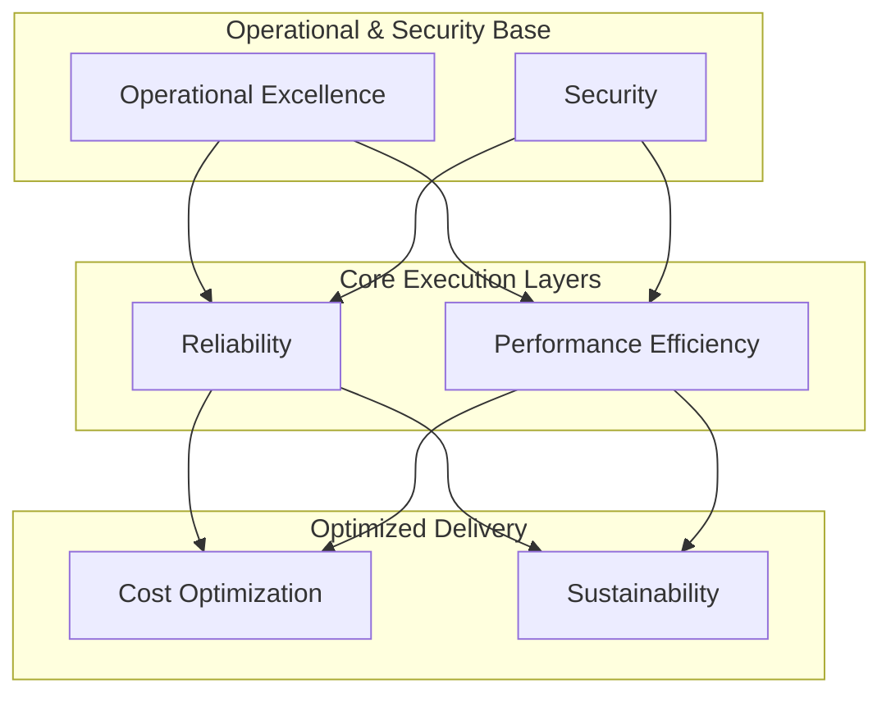

# AWS Well-Architected Framework Deep Dive

The AWS Well-Architected Framework provides a consistent set of design principles, key architectural questions, and best practices to design and operate secure, high-performing, resilient, efficient, and sustainable workloads in the cloud.

---

## The 6 Pillars of Well-Architected Framework

### 1. Operational Excellence
Focuses on running and monitoring systems to deliver business value, and continually improving processes and procedures.

*   **Design Principles**: Perform operations as code, make frequent, small, reversible changes, anticipate failure, and learn from all operational failures.
*   **Key AWS Services**:
    *   **AWS CloudFormation / AWS CDK**: For infrastructure-as-code (IaC).
    *   **Amazon CloudWatch**: Monitor application and system health, gather logs, and trigger alerts.
    *   **AWS Systems Manager**: Automate operational tasks, patch management, and state configuration.

### 2. Security
Focuses on protecting data, systems, and assets while taking advantage of cloud technologies to improve security posture.

*   **Design Principles**: Implement a strong identity foundation (least privilege), enable traceability, apply security at all layers, automate security best practices, protect data in transit and at rest, keep people away from data, and prepare for security events.
*   **Key AWS Services**:
    *   **AWS Identity and Access Management (IAM)**: Fine-grained access control policies.
    *   **AWS Key Management Service (KMS)**: Managed customer-controlled encryption key lifecycle.
    *   **AWS WAF (Web Application Firewall)**: Shield endpoints from common web exploits.
    *   **Amazon GuardDuty**: Intelligent, threat-monitoring system running in the background.

### 3. Reliability
Focuses on ensuring a workload performs its intended function correctly and consistently when it’s expected to.

*   **Design Principles**: Automatically recover from failure, test recovery procedures, scale horizontally to increase workload availability, stop guessing capacity, and manage change through automation.
*   **Key AWS Services**:
    *   **Amazon Route 53**: Active-passive routing, failover, and health checking.
    *   **AWS Auto Scaling**: Dynamically adjusts capacity based on traffic metrics.
    *   **Amazon S3 / Aurora Global Databases**: Multi-region durability and multi-AZ replication.

### 4. Performance Efficiency
Focuses on using computing resources efficiently to meet system requirements, and maintaining that efficiency as demand changes and technologies evolve.

*   **Design Principles**: Democratize advanced technologies, go global in minutes, use serverless architectures, experiment more often, and consider mechanical sympathy (choose the correct hardware profiles).
*   **Key AWS Services**:
    *   **AWS Lambda & Amazon Fargate**: Serverless compute scaling instantly.
    *   **Amazon ElastiCache**: Microsecond caches offloading resource-heavy database queries.
    *   **Amazon CloudFront**: Global content caching and connection termination at edge locations.

### 5. Cost Optimization
Focuses on avoiding unnecessary costs and running systems as cost-effectively as possible.

*   **Design Principles**: Implement Cloud Financial Management (FinOps), pay only for what is used, measure overall efficiency, analyze and attribute expenditure, and stop spending money on undifferentiated heavy lifting.
*   **Key AWS Services**:
    *   **AWS Budgets / Cost Explorer**: Analyze expenditures and set notification limits.
    *   **AWS Trusted Advisor**: Automatically flags underutilized EC2 instances, EBS volumes, and idle resources.
    *   **Compute Optimizer**: Uses machine learning to recommend optimal instance configurations.

### 6. Sustainability
Focuses on environmental impacts, especially energy consumption and efficiency, encouraging architects to minimize the resources required to run workloads.

*   **Design Principles**: Understand your impact, establish sustainability goals, maximize utilization, anticipate and adopt new, more efficient hardware/software offerings, use managed services, and reduce the downstream impact of your cloud workloads.
*   **Key AWS Services**:
    *   **AWS Graviton Instances**: ARM-based processors offering up to 60% better energy efficiency than comparable x86 processors.
    *   **Amazon S3 Lifecycle Policies**: Moving raw files automatically to lower-energy archival classes (Glacier Flexible/Deep Archive).
    *   **AWS Lambda**: Only uses server compute capacity when actively handling event payloads.

---

## 🏛️ Pillar Relationship Mapping

The following diagram maps how the pillars are structurally interconnected. Security and Operational Excellence form the foundation, supporting Reliability and Performance, which collectively allow optimizing Cost and Sustainability.

---

## Common Pitfalls in Well-Architected Reviews
1.  **Treating Reviews as an Audit**: WA Reviews are collaborative design tools. Treating them as a grading system leads to teams hiding architectural deficiencies.
2.  **Skipping Automation (Manual Infrastructure)**: Relying on AWS Console clicks instead of standardized CloudFormation/CDK templates violates Operational Excellence.
3.  **Hardcoding Configurations & Secrets**: Storing KMS keys, database credentials, or IP addresses in application code instead of using AWS Secrets Manager or Parameter Store.
4.  **Static Capacity Planning**: Provisioning high-spec EC2 instances to handle peak workload bursts instead of building dynamic auto-scaling clusters.

---

## SA Interview Questions on the Framework

### Question 1: How do you balance performance and cost when designing a data analytical pipeline?
**Answer**: 
*   Leverage serverless querying engines like **Amazon Athena** over raw raw format storage (Apache Parquet on S3) to avoid maintaining running EMR clusters 24/7.
*   Apply **Amazon S3 Lifecycle Policies** to transition stale analytical data into lower-tier storage classes (Glacier Instant Retrieval).
*   Utilize **AWS Glue Auto-scaling** to adjust processing resources based on pipeline stage complexity.

### Question 2: What is "Mechanical Sympathy" in cloud architecture? Give an AWS example.
**Answer**: 
Mechanical Sympathy means aligning design decisions with the underlying technology details. For example, using **AWS Graviton3 instances** instead of standard Intel instances for CPU-intensive microservices. This choice leverages custom ARM silicon tailored for massive concurrency, lowering power draw, improving performance efficiency by up to 25%, and reducing costs.

### Question 3: How do you design a system to be reliable when third-party APIs you consume are highly unstable?
**Answer**: 
Apply the **Circuit Breaker Pattern** using **AWS Step Functions** or custom code. If a third-party API begins returning 500 errors, the circuit trips to immediately reject subsequent outgoing calls with a default fallback message. This prevents application threads from blocking, queues from backing up, and system resources from exhausting. Additionally, use an **SQS Dead Letter Queue (DLQ)** to isolate failed webhook notifications for retrospective replay.
