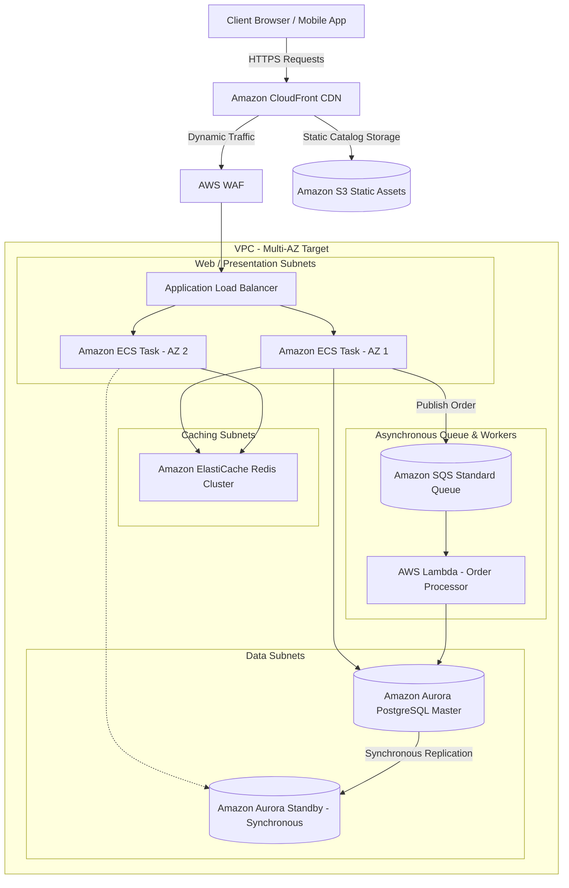

# Scenario 01: Highly Available E-Commerce Platform on AWS

## 1. Problem Statement
A rapidly growing global retail brand requires a highly available, scalable, and resilient e-commerce platform. The system must process high transaction volumes (including massive flash sales), protect customer transaction data, and maintain low latency globally.

---

## 2. Requirements

### Functional
*   Browse dynamic product catalogs and search items.
*   Manage user shopping carts and checkout products.
*   Process secure online payments.
*   Generate real-time order confirmation updates.

### Non-Functional
*   **Availability**: 99.99% SLA (Multi-AZ architecture).
*   **Latency**: Sub-second page load times globally.
*   **Scale**: Handle a baseline of 5,000 requests/sec, scaling to 50,000 requests/sec during flash sales.
*   **Security**: PCI-DSS compliant transactions.

---

## 3. Architecture Diagram

### Interactive Mermaid Blueprint

---

## 4. Key AWS Services Used

| Service | Architectural Role | Scoped Purpose |
| :--- | :--- | :--- |
| **Amazon CloudFront**| Content Delivery Network (CDN). | Caches static assets (images, CSS) at edge locations, offloading ALB. |
| **AWS WAF** | Web Application Firewall. | Blocks malicious traffic (SQLi, XSS) and rate-limits client requests. |
| **Amazon ECS (Fargate)**| Container Orchestrator (Serverless). | Hosts web application containers, auto-scaling compute instantly. |
| **Amazon ElastiCache (Redis)**| In-memory caching database. | Caches dynamic catalog items and active user session shopping carts. |
| **Amazon Aurora (PostgreSQL)**| Enterprise Relational DB (Multi-AZ). | Handles transactional records, ensuring high-durability ACID consistency. |
| **Amazon SQS** | Distributed Message Queue. | Decouples order checkout from database writing, preventing connection timeouts. |
| **AWS Lambda** | Serverless Compute Worker. | Processes buffered order checkout messages asynchronously from SQS. |

---

## 5. Step-by-Step Design Walkthrough
1.  **Client Entry**: Users access the platform via HTTPS. Requests resolve to **Amazon CloudFront** to fetch cached static images and CSS styles directly from **Amazon S3**.
2.  **API Routing**: Dynamic application requests (e.g., login, catalog queries) bypass cache and resolve to **AWS WAF** for security sanitization before hitting the **Application Load Balancer (ALB)**.
3.  **Compute Layer**: The ALB distributes traffic across running **Amazon ECS container tasks** running serverless on **AWS Fargate** across two separate Availability Zones (AZs).
4.  **Session & Read Caching**: ECS tasks query **Amazon ElastiCache (Redis)** to quickly fetch user session states, shopping carts, and frequently viewed catalog details to limit database overhead.
5.  **Relational Database**: Relational transactions (e.g., account updates, checkout requests) are written to the **Amazon Aurora PostgreSQL Primary Master**. Data is synchronously replicated to an **Aurora Standby Replica** in a second AZ.
6.  **Asynchronous Checkout Flow**: When a user clicks "Checkout", the ECS task writes a lightweight transaction message containing the cart data to an **Amazon SQS Queue** and returns an immediate success response to the user.
7.  **Order Processing**: An **AWS Lambda function** polls the SQS queue, processes payments via a secure payment gateway, writes the finalized transaction records to the Aurora DB, and triggers email notifications.

---

## 6. Design Patterns Applied
*   **Cache-Aside Pattern**: Applications query ElastiCache first. If a cache miss occurs, data is fetched from Aurora, written to the cache, and returned.
*   **Asynchronous Decoupling (Queue-Based Load Leveling)**: Isolates the database from sudden spikes during flash sales by buffering order creations in SQS.
*   **Database Read Replica Split**: Read requests are routed to the Aurora Read Replica, while write transactions are bound strictly to the primary writer node.

---

## 7. Trade-offs

### Pros
*   **Exceptional Resiliency**: If an entire data center goes dark, ALB redirects traffic to the secondary AZ within seconds. Aurora fails over automatically.
*   **Elastic Scaling**: Fargate containers and Lambda scale rapidly based on CPU utilization and incoming queue lengths.
*   **Cost-Efficient Dynamic Scaling**: Avoids provisioning peak-level server limits 24/7.

### Cons
*   **Increased Complexity**: Maintaining asynchronous pipelines and data caches introduces event-consistency considerations.
*   **Database Write Bottle-neck**: Aurora is a single-master writer. Scaling massive write volumes requires database sharding or switching to DynamoDB.

---

## 8. When to Use This Pattern
*   High-traffic retail applications with fluctuating transaction patterns (e.g., Black Friday Sales).
*   Any transactional application that requires strict ACID guarantees but experiences unpredictable traffic spikes.

---

## 9. Cost Estimate

*   **Total Monthly Cost**: ~$1,500 - $3,500 (scaling with traffic).
*   **Key Cost Drivers**:
    *   *Aurora PostgreSQL Cluster*: Multi-AZ instances (approx. $400 - $1,000/month).
    *   *ECS Fargate Compute*: Dynamic running containers (approx. $300 - $800/month).
    *   *Amazon CloudFront & ALB*: Egress network data transfer charges.

---

## 10. Alternatives Considered & Why Rejected
*   **Host on EC2 manually instead of ECS**: Rejected due to high operational burden. Scaling EC2 takes minutes (vs. seconds on Fargate) and requires manual OS patch management.
*   **Use DynamoDB instead of Aurora PostgreSQL**: Rejected. Although DynamoDB scales writes infinitely, e-commerce applications require highly relational structures, complex table joins, and ACID compliance for stock ledgers, which is easier to maintain in a SQL engine.

---

## 11. Failure Modes & Mitigations

### 1. Database Primary Node Outage
*   **Effect**: Writes fail.
*   **Mitigation**: Aurora detects failure automatically, promotes the Standby Replica to Master, and updates DNS records within 30 seconds.

### 2. Cache Invalidation Storm
*   **Effect**: Stale data or sudden cache eviction causes all ECS tasks to query Aurora simultaneously, overloading the DB.
*   **Mitigation**: Implement **Jitter** in cache expiration times and leverage **Connection Pooling (RDS Proxy)** to restrict database connection counts.

---

## 12. SA Interview Questions

### Question 1: How do you prevent stock inventory "double-selling" during flash sales?
**Answer**: 
1.  Implement pessimistic or optimistic locking at the database level. In PostgreSQL, use `SELECT FOR UPDATE` on the target inventory row within a database transaction.
2.  Route all checkout inventory checks through **Redis** using atomic operations (like `DECRBY`). Since Redis is single-threaded, it guarantees sequential updates, rejecting orders when stock reaches 0 before writing to SQS.

### Question 2: Why do we place Amazon SQS between ECS and the Lambda Worker?
**Answer**: 
If ECS wrote directly to Aurora during a flash sale (e.g., 50,000 concurrent checkouts), the database would crash from connection exhaustion and write bottlenecks. SQS acts as a buffer (rate smoothing). It stores checkout messages securely, allowing Lambda to consume and write them to the database at a controlled, sustainable rate.

### Question 3: How do you design an application to be highly scalable for a high-scale, high-burst traffic event (e.g., flash sales or major releases)?
**Answer**: 
Scaling under high-burst traffic (massive spikes in a few seconds) requires mitigating provisioning latencies and throttling bottlenecks at every layer of the architecture:

1.  **Load Balancer Level**: Classic DNS scaling is too slow for sudden spikes. Submit a support request in advance to **pre-warm the Application Load Balancers (ALBs)** so they are pre-provisioned with adequate capacity.
2.  **Compute Auto-Scaling Layer**: 
    *   Utilize **Scheduled Scaling** to scale out compute capacity (EC2 instances/ECS tasks) before the event begins.
    *   Implement **Warm Pools** in the Auto Scaling Group. This maintains a pool of pre-initialized, stopped instances that can be brought online in seconds (avoiding long OS/application boot times).
    *   Maintain highly lightweight **AMIs/container images** by stripping unnecessary libraries to minimize cold-start provisioning latency.
3.  **Database Connection Pooling**: Avoid connection exhaustion during sudden scaling. Implement **Amazon RDS Proxy** between the application tasks and the database to manage a shared connection pool, reuse database connections, and preserve DB memory.
4.  **Limits & Simulation**: Run an **AWS Countdown** simulation (load testing with the AWS account team) prior to the event, and proactively request limit increases for soft service limits to prevent API-level throttling. If traffic exceeds hard account limits, deploy the architecture across multiple AWS accounts or regions.

