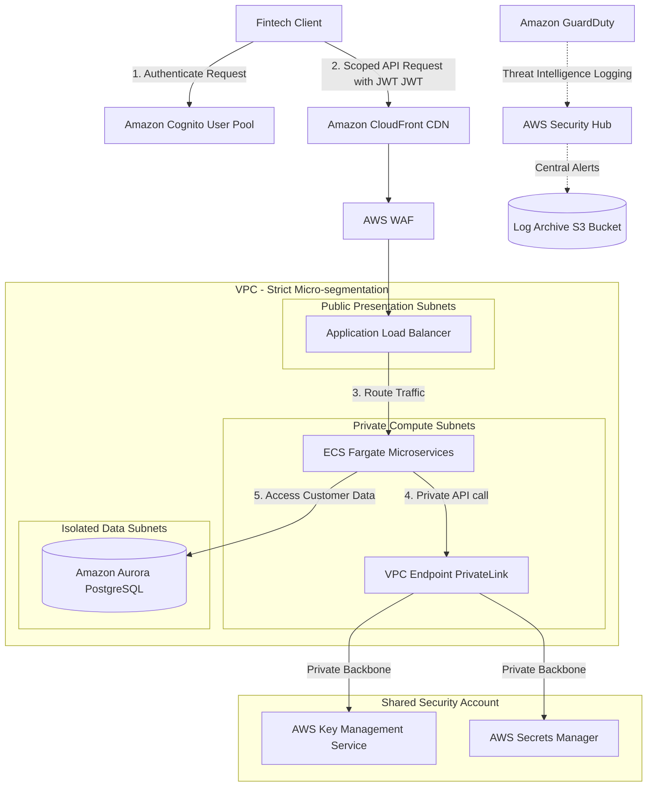

# Scenario 02: Zero-Trust Security Architecture for a Fintech Company

## 1. Problem Statement
A digital fintech company handles sensitive banking transactions, loan processing, and personal financial data. The architecture must adhere to regulatory compliance (PCI-DSS, SOC2) and enforce a strict **Zero-Trust Security Model**—where no user, device, or service is trusted by default, regardless of its location inside the network perimeter.

---

## 2. Requirements

### Functional
*   Enable secure customer login and multi-factor authentication (MFA).
*   Process bank account details and initiate money transfers securely.
*   Log all system administrator activities and access requests for compliance auditing.

### Non-Functional
*   **Security**: Implement strict Zero-Trust (Micro-segmentation, Identity-based authorization, Envelope Encryption).
*   **Auditability**: Complete audit trails of all API calls and modifications (100% compliance).
*   **Resiliency**: Protect endpoints from advanced cyber-attacks (Layer 7 DDoS, credential stuffing).

---

## 3. Architecture Diagram

---

## 4. Key AWS Services Used

| Service | Architectural Role | Scoped Purpose |
| :--- | :--- | :--- |
| **Amazon Cognito** | CIAM identity provider. | Handles customer registration, secure login, MFA, and JWT token issuance. |
| **AWS WAF** | Web Application Firewall. | Sanitizes HTTP requests, blocks bot attacks, and filters SQLi/XSS signatures. |
| **AWS PrivateLink** | Private network bridging. | Creates secure **Interface VPC Endpoints** to connect VPC services privately, bypassing the internet. |
| **AWS KMS** | Managed Encryption Keys. | Handles envelope encryption using Customer Managed Keys (CMKs) with auto-rotation. |
| **AWS Secrets Manager**| Vault database credentials. | Rotates and injects RDS database passwords securely into ECS Fargate containers at runtime. |
| **Amazon GuardDuty** | AI Threat Detection. | Monitors VPC Flow Logs, DNS queries, and CloudTrail logs for anomalies or intrusions. |
| **AWS Security Hub** | Compliance Dashboard. | Aggregates security alerts from GuardDuty, Inspector, and IAM Analyzer in a single view. |

---

## 5. Step-by-Step Design Walkthrough
1.  **Identity Verification**: The client app prompts users to log in via **Amazon Cognito**, which enforces multi-factor authentication (MFA) and returns a signed JSON Web Token (JWT).
2.  **API Entry Guard**: The client forwards the JWT in the Authorization header of HTTPS requests. Traffic routes through **Amazon CloudFront** protected by **AWS WAF** rules to block bots and suspicious request payloads.
3.  **Compute Authentication**: The **Application Load Balancer (ALB)** verifies the Cognito JWT signature at the boundary before forwarding the request to **Amazon ECS Fargate** microservices in private subnets.
4.  **Least-Privilege Services**: Each ECS Fargate container runs with a dedicated **Task IAM Role** that only allows actions required for its specific task. Container storage utilizes encrypted volumes.
5.  **Private Cloud Routing**: When the ECS service requires database credentials or decryption keys, it queries **AWS Secrets Manager** and **AWS KMS** privately via **Interface VPC Endpoints (AWS PrivateLink)**, preventing traffic from traversing the public internet.
6.  **Secure Storage**: Database tables inside the isolated private subnets are encrypted at rest using **KMS Customer Managed Keys (CMKs)**. Backups are automated and encrypted.
7.  **Continuous Threat Monitoring**: **Amazon GuardDuty** analyzes VPC flow logs and CloudTrail configurations in the background. If a threat is detected (e.g., an unauthorized API call), it triggers an alert in **AWS Security Hub** and forwards the audit trail to an immutable S3 bucket.

---

## 6. Design Patterns Applied
*   **Zero-Trust Network Access (ZTNA)**: No perimeter trust. Subnets are micro-segmented using Security Groups restricting ingress strictly to specific, verified source ports.
*   **Least Privilege Identity Federation**: Access to systems administrators is managed via **IAM Identity Center** using temporary, short-lived tokens and single sign-on (SSO).
*   **Envelope Encryption**: All sensitive financial data rows are encrypted locally within the application layer using data keys before writing to the database.

---

## 7. Trade-offs

### Pros
*   **Maximum Compliance & Protection**: Completely satisfies regulatory frameworks (PCI-DSS Level 1, SOC2, HIPAA) through pervasive encryption and micro-segmentation.
*   **Decoupled Secret Management**: Developers do not have access to database passwords or raw master encryption keys.
*   **Elimination of Internet Egress**: VPC endpoints route AWS service traffic internally, minimizing the risk of network snooping.

### Cons
*   **High Network Overhead Cost**: Deploying VPC Interface Endpoints across multiple subnets and AZs generates hourly endpoint fees and per-GB data processing charges.
*   **Key Lifecycle Risk**: Misconfiguring key rotation policies or losing access to KMS key policies can result in irreversible data loss.

---

## 8. When to Use This Pattern
*   Fintech, banking, and payment processing platforms.
*   Healthcare applications handling electronic health records (EHR).
*   Any enterprise application subject to strict compliance auditing.

---

## 9. Cost Estimate

*   **Total Monthly Cost**: ~$2,500 - $5,000 (higher due to security tooling).
*   **Key Cost Drivers**:
    *   *AWS PrivateLink Endpoints*: Billed per endpoint per hour per AZ (~$600 - $1,200/month for extensive VPC setups).
    *   *AWS KMS & Secrets Manager API Requests*: High throughput token evaluations.
    *   *Amazon GuardDuty & Security Hub*: Charges scale with volume of VPC logs analyzed.

---

## 10. Alternatives Considered & Why Rejected
*   **VPN Tunneling between Subnets**: Rejected. Traditional VPNs trust all traffic inside the tunnel. Zero-Trust requires continuous verification at each hop using application-level security and IAM policies.
*   **Host credentials in environment variables manually**: Rejected. Storing raw API keys or database passwords in environment variables exposes them to logging frameworks and developers, violating security compliance policies.

---

## 11. Failure Modes & Mitigations

### 1. KMS Key Policy Lockout
*   **Effect**: Applications lose access to decryption keys, shutting down the entire platform.
*   **Mitigation**: Restrict modification of KMS policies to a designated security master role, and enforce dual-authorization (multi-party approval) policies for key alterations.

### 2. GuardDuty Alerts Flood
*   **Effect**: Alert fatigue causes administrators to ignore critical intrusion warnings.
*   **Mitigation**: Configure **AWS Systems Manager Incident Manager** to automatically classify alerts, filtering out low-priority threats while escalating high-risk incidents immediately.

---

## 12. SA Interview Questions

### Question 1: How do you verify Cognito JWT tokens inside your backend microservices?
**Answer**: 
1.  Download the **JSON Web Key Set (JWKS)** public keys from the Cognito user pool endpoint.
2.  Validate the JWT signature locally using the public keys to verify the token was issued by your Cognito pool.
3.  Check the **Expiration time (`exp`)** claim to ensure the token is active.
4.  Verify the **Audience (`aud`)** claim matches your client application ID to prevent token substitution attacks.

### Question 2: Why do we use VPC Interface Endpoints instead of a standard NAT Gateway?
**Answer**: 
*   A **NAT Gateway** routes traffic from private subnets over the public internet to reach external AWS endpoints. This exposes traffic pathing to public routing layers and incurs high outbound data charges.
*   An **Interface VPC Endpoint (AWS PrivateLink)** provisions a private ENI inside your subnet. Traffic to AWS services is routed entirely within the private AWS network backbone, never touching the public internet. This enhances security and satisfies strict compliance regulations.
