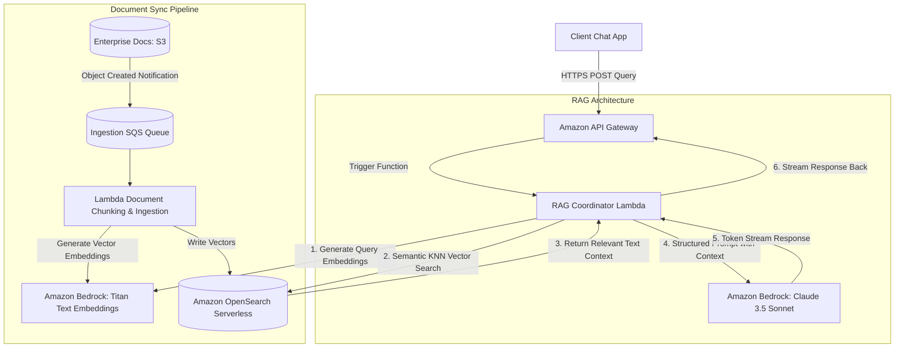

# Scenario 03: GenAI-Powered Document Q&A System on AWS

## 1. Problem Statement
An enterprise organization wants a secure Generative AI system that allows employees to ask natural language questions against internal corporate documents (PDFs, wikis, compliance guides). The system must restrict answer sources strictly to private files, prevent data leaks, and exclude public model training loops.

---

## 2. Requirements

### Functional
*   Allow users to submit natural language questions via a web chat interface.
*   Securely ingest, parse, and index massive corp document folders (S3).
*   Provide grounded answers referencing the exact source documents (RAG pattern).

### Non-Functional
*   **Accuracy**: Eliminate AI hallucinations by anchoring models to retrieved text context.
*   **Security**: Enforce encryption at rest for document assets and vector indexes.
*   **Performance**: Respond to user queries within 3 seconds, supporting token-by-token streaming.

---

## 3. Architecture Diagram

---

## 4. Key AWS Services Used

| Service | Architectural Role | Scoped Purpose |
| :--- | :--- | :--- |
| **Amazon Bedrock** | Serverless LLM Platform. | Exposes foundation models for text generation (Claude) and embeddings generation (Titan). |
| **Amazon S3** | Raw Document Lake. | Secure, durable storage for raw PDF, DOCX, and text source files. |
| **Amazon OpenSearch Serverless**| Vector Database (Serverless). | Stores and queries vector embeddings using k-nearest neighbors (k-NN) search. |
| **AWS Lambda** | Serverless Orchestrator. | Coordinates the RAG process (retrieving context and query forwarding). |
| **Amazon API Gateway** | Web API Entry Point. | Manages HTTP/WebSocket integrations to route client chat requests. |

---

## 5. Step-by-Step Design Walkthrough
### Phase A: Document Ingestion & Vector Indexing
1.  **Storage**: Administrators upload corporate documents (PDFs, manuals) to a secure **Amazon S3 Bucket**.
2.  **Notification & Parsing**: S3 triggers an event notification to an **Amazon SQS Queue**, which invokes the **Ingestion Lambda**. The Lambda downloads the file and parses the text into smaller, overlapping chunks (e.g., 500 characters).
3.  **Embedding Creation**: For each chunk, the Lambda calls **Amazon Bedrock** using the **Titan Text Embeddings** model to convert the text into a mathematical vector representation.
4.  **Index Storage**: The vector representations are stored in **Amazon OpenSearch Serverless (AOSS)** alongside the source document metadata (file path, author, date).

### Phase B: RAG Query Execution
1.  **Client Request**: A user submits a query (e.g., *"What is our travel reimbursement policy?"*) through **API Gateway** to the **RAG Coordinator Lambda**.
2.  **Semantic Retrieval**:
    *   The Lambda converts the user query into a vector representation using the **Titan Embeddings API**.
    *   The Lambda runs a **k-Nearest Neighbors (k-NN) search** against the vector index in OpenSearch Serverless to identify the top 3 most semantically similar text chunks.
3.  **Prompt Synthesis**: The Lambda constructs a structured prompt containing the retrieved context and the user query, wrapping them inside strict system constraints:
    > *Instructions: Answer the question using ONLY the provided context. If the answer cannot be found in the context, respond with "I do not know."*
4.  **Inference**: The Lambda sends the synthesized prompt to **Amazon Bedrock (Claude 3.5 Sonnet)**.
5.  **Streaming Output**: Claude generates the answer, streaming the tokens back to the Lambda. The Lambda forwards the stream to API Gateway WebSockets, providing a real-time typing experience to the client.

---

## 6. Design Patterns Applied
*   **Retrieval-Augmented Generation (RAG)**: Anchoring an LLM to external reference sources before generating a response.
*   **Semantic Search**: Searching database entries using meaning and context rather than exact keyword matching.
*   **Claim Check Pattern**: Vector indexes store lightweight text snippets and reference pointers, while S3 holds the master PDF document assets.

---

## 7. Trade-offs

### Pros
*   **Hallucination Prevention**: Restricts model responses to the provided document context, ensuring accurate answers.
*   **Serverless Efficiency**: Zero server operations or node maintenance required for Bedrock, AOSS, and Lambda.
*   **Strict Security Isolation**: Corporate data is never processed over the public internet or used to train third-party foundation models.

### Cons
*   **Embedding/Token Costs**: High API request rates can scale costs rapidly depending on the size of the retrieved context.
*   **Cold Starts**: Large python libraries (like LangChain or PyPDF) can introduce cold-start latency in Lambdas.

---

## 8. When to Use This Pattern
*   Enterprise search platforms, customer support chatbots, and internal HR wikis.
*   Any application requiring grounded, accurate natural language queries against large document datasets.

---

## 9. Cost Estimate

*   **Total Monthly Cost**: ~$500 - $1,500 (highly dependent on model usage).
*   **Key Cost Drivers**:
    *   *Amazon OpenSearch Serverless*: Ingestion & Query OCU capacity charges (~$400/month baseline fee).
    *   *Amazon Bedrock API Usage*: Claude charges per 1,000 input/output tokens. Claude 3.5 Sonnet is highly cost-effective, but costs scale with request volume.

---

## 10. Alternatives Considered & Why Rejected
*   **Fine-tuning Claude with corporate docs**: Rejected. Fine-tuning modifies internal weights but cannot guarantee accuracy or prevent hallucinations. Additionally, updating data requires running expensive training pipelines repeatedly.
*   **Use self-hosted OpenSearch on EC2**: Rejected. High administrative burden. Managing clusters, index shards, and scaling policies manually violates the Operational Excellence pillar.

---

## 11. Failure Modes & Mitigations

### 1. Document Format Parsing Failures
*   **Effect**: Ingestion pipeline crashes on scanned images or complex tables.
*   **Mitigation**: Integrate **Amazon Textract** to extract layout structures, tabular data, and scanned text accurately before running embedding pipelines.

### 2. Context Window Exhaustion
*   **Effect**: Retrieving too many text chunks exceeds the model input capacity, triggering API failures.
*   **Mitigation**: Optimize text chunk sizes (e.g., 512 tokens with 10% overlap) and set a strict limit on the number of retrieved context blocks returned by the vector query.

---

## 12. SA Interview Questions

### Question 1: How does Amazon Bedrock ensure private data isolation?
**Answer**: 
Amazon Bedrock prioritizes enterprise data security:
*   Your documents, prompt templates, and vector embeddings are stored inside your secure AWS account.
*   API calls to foundation models are fully isolated. The model provider (e.g., Anthropic) never receives your prompts or outputs.
*   None of your private corporate data is used to train the base public foundation models, preventing data leakage.

### Question 2: Why do we use OpenSearch Serverless instead of standard relational SQL databases for document search?
**Answer**: 
Relational databases rely on exact keyword matches (e.g., matching "travel policy"). If a user asks, *"Can I get refunded for my flight ticket?"*, a standard SQL query will return zero matches because the word "refunded" does not exist in the "travel policy" text. 
OpenSearch Serverless supports **Vector Embeddings and k-NN Search**, converting words into semantic vector maps. This allows identifying matching text chunks based on meaning (e.g., connecting "refunded flight" semantically to "travel reimbursement") to provide accurate search results.
