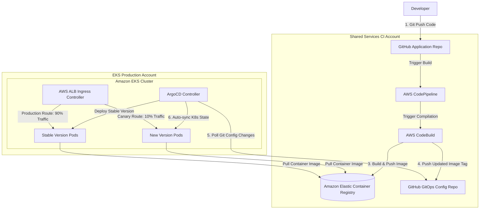

# Scenario 04: CI/CD Platform for Microservices on EKS (GitOps)

## 1. Problem Statement
An enterprise engineering team requires a secure, scalable CI/CD platform to deploy microservices onto an Amazon Elastic Kubernetes Service (EKS) cluster. The deployment process must prevent drift, isolate credentials, and support automated canary rollouts while maintaining separation of concerns between code builds and infrastructure configurations.

---

## 2. Requirements

### Functional
*   Automate code compilation, unit testing, and Docker image generation on Git commits.
*   Store built container images securely with automated vulnerability scanning.
*   Deploy microservices into targeted environments (Dev, Staging, Production) automatically.
*   Allow rollbacks in the event of deployment failures.

### Non-Functional
*   **Security**: No admin Kubernetes credentials stored outside the EKS cluster boundary.
*   **Traceability**: Infrastructure state must match Git configurations exactly (GitOps pattern).
*   **Reliability**: Deploy updates with zero downtime.

---

## 3. Architecture Diagram

---

## 4. Key AWS Services Used

| Service | Architectural Role | Scoped Purpose |
| :--- | :--- | :--- |
| **Amazon EKS** | Managed Kubernetes. | Hosts microservice applications across private subnets. |
| **AWS CodePipeline** | CI Orchestrator. | Automates build, test, and release pipeline triggers. |
| **AWS CodeBuild** | Serverless Compilation. | Compiles code, runs tests, builds Docker files, and updates Git repositories. |
| **Amazon ECR** | Container Image Registry. | Stores built Docker images securely, running automated vulnerability scans. |
| **AWS ALB Ingress**| Kubernetes Load Balancer.| Dynamically provisions AWS Application Load Balancers for ingress routing. |
| **ArgoCD** | GitOps Reconciliation Engine.| Runs inside EKS to poll Git configs and reconcile EKS clusters to match Git. |

---

## 5. Step-by-Step Design Walkthrough
1.  **Code Commit**: A developer pushes application code changes to the **GitHub Application Repository**.
2.  **Continuous Integration**: **AWS CodePipeline** detects the commit and triggers **AWS CodeBuild**.
3.  **Compilation & Packaging**: CodeBuild compiles the application, runs unit tests, builds a Docker container image, and pushes the image to **Amazon ECR** using a unique git commit hash tag. ECR automatically scans the image for vulnerabilities.
4.  **Configuration Release**: CodeBuild runs a final script that modifies the deployment manifest file (e.g., updating the image tag version in a Helm values file) inside a dedicated **GitHub GitOps Config Repository**.
5.  **GitOps Synchronization**: **ArgoCD**, running inside the **Amazon EKS Cluster**, detects the update inside the GitOps Config repository.
6.  **Declarative Deployment**:
    *   ArgoCD compares the desired Git configuration state with the actual running state of the EKS cluster.
    *   Since a drift exists (new image tag), ArgoCD applies the K8s manifest changes.
    *   EKS pulls the new container image from **Amazon ECR** and launches new pods.
7.  **Traffic Control**: The **AWS ALB Ingress Controller** detects the deployment update and splits traffic (e.g., routing 10% to the newly deployed green version, and 90% to the blue version) to perform canary testing before completing the rollout.

---

## 6. Design Patterns Applied
*   **GitOps Pattern**: Git acts as the single source of truth for infrastructure and deployment states.
*   **Blue/Green Deployments (Canary style)**: Routing a small slice of traffic to a new release to verify stability before deploying fully.
*   **Separation of Concerns**: Decoupling the Application Code Repository from the GitOps Configuration Repository.

---

## 7. Trade-offs

### Pros
*   **Unparalleled Security**: EKS credentials never leave the cluster, minimizing the risk of unauthorized access.
*   **Automatic Drift Reversal**: If a system administrator manually alters an EKS setting in the AWS Console, ArgoCD detects the change and automatically rolls it back to match the Git configuration.
*   **Declarative Rollbacks**: To roll back a bad deployment, simply revert the last commit in the Git configurations repository.

### Cons
*   **High Repository Count**: Requires maintaining separate repositories for code and deployment manifests, increasing configuration overhead.
*   **Reconciliation Lag**: ArgoCD polling intervals introduce a minor delay (usually seconds to minutes) between code merge and active deployment.

---

## 8. When to Use This Pattern
*   Enterprise Kubernetes architectures with strict separation between development and operations teams.
*   High-availability microservice systems requiring zero-downtime canary rollouts.

---

## 9. Cost Estimate

*   **Total Monthly Cost**: ~$500 - $1,200/month.
*   **Key Cost Drivers**:
    *   *Amazon EKS Control Plane Fee*: Fixed cluster fee ($0.10/hour, approx. $73/month).
    *   *CodeBuild Compute Engine*: Charged per build minute. Highly cost-effective for typical build cycles.
    *   *Amazon ECR Storage*: Negligible (charged per GB storage).

---

## 10. Alternatives Considered & Why Rejected
*   **Direct Push Deployments (CodePipeline directly applying kubectl changes)**: Rejected. Requires storing EKS administrative IAM credentials inside the pipeline runner, exposing the cluster to security risks in the event of a pipeline compromise.
*   **Host self-managed Jenkins on EC2**: Rejected due to high administrative overhead. Managing Jenkins servers, updating operating systems, and securing host environments manually violates Operational Excellence principles.

---

## 11. Failure Modes & Mitigations

### 1. Compromised Config Repo
*   **Effect**: Attackers push malicious manifest files to Git, prompting ArgoCD to deploy them.
*   **Mitigation**: Restrict write access to the GitOps Config repository. Enforce signed commits, require multi-party code reviews, and automate pipeline security scans.

### 2. ECR Image Access Failures
*   **Effect**: EKS is unable to download container images, stalling deployments.
*   **Mitigation**: Configure IAM permissions properly using **EKS Node IAM roles** or EKS Pod Identity, allowing tasks to assume the necessary ECR read access.

---

## 12. SA Interview Questions

### Question 1: Explain the difference between Push and Pull deployment pipelines.
**Answer**: 
*   In a **Push Pipeline** (e.g., GitLab CI pushing to EKS), an external CI server connects to the target cluster to run deployment commands. This model is easy to set up initially but requires exposing administrative credentials to the CI server.
*   In a **Pull Pipeline (GitOps)**, an agent (e.g., ArgoCD) runs inside the target cluster and continuously pulls deployment configurations from a Git repository. This model is highly secure, as deployment credentials never leave the cluster boundary, and it supports automatic drift detection and correction.

### Question 2: Why do GitOps architectures use separate repositories for application code and Kubernetes manifests?
**Answer**: 
Using separate repositories provides clear separation of concerns:
1.  **Infinite Loops**: If code and manifests are in the same repository, a pipeline update (like changing an image version tag) triggers a new Git commit, which can run the CI pipeline recursively in an infinite loop.
2.  **Access Control**: Developers can hold write access to the application code repository, while access to the GitOps Configuration repository is restricted to release managers or automated pipelines.
3.  **Clean Audit Trail**: The configuration repository contains a clean, uncluttered audit trail of all infrastructure changes and environment deployment versions.
