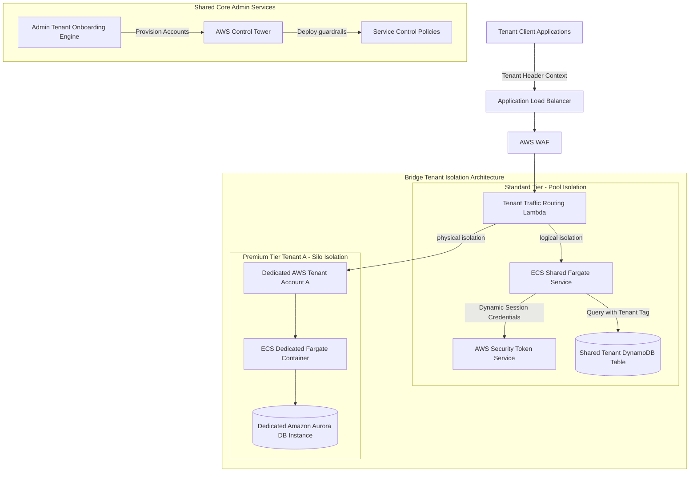

# Scenario 05: SaaS Multi-Tenant Architecture on AWS

## 1. Problem Statement
A software-as-a-service (SaaS) provider is building a multi-tenant enterprise application. The platform must isolate customer data securely (mitigating "noisy neighbor" issues and preventing cross-tenant data leaks), scale cost-effectively, and automate onboarding for new tenants dynamically.

---

## 2. Requirements

### Functional
*   Automate tenant onboarding and environment provisioning dynamically.
*   Enforce strict isolation policies for tenant databases and compute environments.
*   Track and attribute AWS usage costs accurately per tenant for accurate billing.

### Non-Functional
*   **Tenant Security**: Prevent cross-tenant data access (100% data isolation guarantee).
*   **Scale**: Support hundreds of tenants without hitches, handling high transaction loads.
*   **Operational Excellence**: Manage all tenant configurations and environments from a central console.

---

## 3. Architecture Diagram

This architecture illustrates a **Bridge Isolation Model**, combining **Silo Isolation** (dedicated, isolated resources for high-tier enterprise tenants) and **Pool Isolation** (shared compute resources with logical IAM-based data isolation for standard-tier tenants).


### Interactive Mermaid Blueprint


---

## 4. Key AWS Services Used

| Service | Architectural Role | Scoped Purpose |
| :--- | :--- | :--- |
| **AWS Control Tower** | Tenant Provisioning. | Automates the creation of isolated tenant accounts ("Silo") via account factories. |
| **AWS Organizations** | Account Management. | Consolidates billing and applies security policies across all tenant accounts. |
| **AWS STS** | Temporary Credentials. | Generates dynamic, short-lived IAM credentials containing tenant-context tags. |
| **Amazon DynamoDB** | Shared Pooled Database. | Stores pooled tenant data, enforcing row-level security using tenant partitioning. |
| **Amazon Aurora** | Dedicated Silo Database. | Stores data for high-tier enterprise tenants in isolated databases. |
| **Service Control Policies (SCPs)**| Core Security Guardrails.| Prevents tenant accounts from modifying logging, network, or security settings. |

---

## 5. Step-by-Step Design Walkthrough
### Phase A: Tenant Onboarding & Provisioning
1.  **Onboarding Trigger**: A new customer signs up for the SaaS service. The **Admin Tenant Onboarding Engine** receives the registration payload.
2.  **Tier Routing**:
    *   **Premium Tier (Silo)**: The onboarding engine calls the **AWS Control Tower Account Factory** API to provision a dedicated, isolated AWS account for the tenant. AWS Control Tower applies default OUs, security guardrails, and VPC configurations.
    *   **Standard Tier (Pool)**: The onboarding engine registers the new customer metadata inside a shared **DynamoDB Table**, assigning them a unique Tenant ID tag.

### Phase B: Query Routing & Isolation Enforcement
1.  **Client Egress**: Customer requests hit the **Application Load Balancer (ALB)**, which evaluates the tenant context header (e.g., `Tenant-ID: TenantA`).
2.  **Premium Route**: If the request belongs to a Premium Silo tenant, the **Traffic Routing Lambda** routes the request directly to the dedicated AWS account. Data is saved in a dedicated **Amazon Aurora DB** instance.
3.  **Standard Route**: If the request belongs to a Standard Pool tenant:
    *   The request routes to the shared **ECS Fargate** cluster.
    *   The ECS task queries the **AWS Security Token Service (STS)** to assume a dynamic IAM role containing session context attributes (e.g., `TenantID = TenantStandard`).
    *   STS returns temporary credentials. The application uses these keys to read/write data to a shared DynamoDB table. The DynamoDB IAM policy restricts query access strictly to rows matching the dynamic `TenantID` attribute (Row-level security).

---

## 6. Design Patterns Applied
*   **Silo Isolation Model**: Placing a tenant's entire compute and database stack inside a dedicated, physically isolated AWS account.
*   **Pool Isolation Model**: Tenants share the same compute resources and database instances. Isolation is enforced logically using IAM policies and application routing rules.
*   **Bridge Isolation Model**: Combining Silo and Pool architectures within the same platform to support different customer tiers.

---

## 7. Trade-offs

### Pros
*   **Tiered Pricing Capabilities**: Allows selling lower-cost logical tiers to standard customers, and premium, highly isolated physical tiers to enterprise clients.
*   **Zero Data Leakage (Silo)**: Physical account separation completely eliminates the risk of cross-tenant database access.
*   **High Cost-Efficiency (Pool)**: Shared resources minimize idle capacity costs, maximizing overall resource utilization.

### Cons
*   **High Complexity**: Managing two separate deployment and isolation architectures simultaneously requires significant engineering effort.
*   **Account Limit Barriers**: Running hundreds of dedicated silo accounts can hit default AWS Organization account limits.

---

## 8. When to Use This Pattern
*   B2B SaaS platforms selling services to diverse customer tiers (e.g., small business vs. massive enterprise).
*   Applications with strict regulatory compliance guidelines requiring complete physical data isolation for enterprise clients.

---

## 9. Cost Estimate

*   **Total Monthly Cost**: Highly variable (scales with tenant count).
*   **Key Cost Drivers**:
    *   *Silo Accounts*: Base costs multiply per silo account (e.g., running VPCs, ALBs, NAT Gateways per tenant).
    *   *Pooled Accounts*: Highly cost-effective (shared DynamoDB scales based on active requests).

---

## 10. Alternatives Considered & Why Rejected
*   **Silo-only Model**: Rejected. Running dedicated AWS accounts for small, low-paying standard customers is cost-prohibitive due to duplicate resource overhead (e.g., NAT Gateways, Load Balancers).
*   **Pool-only Model**: Rejected. Large enterprise clients often refuse to share databases with other tenants due to strict security guidelines and compliance regulations.

---

## 11. Failure Modes & Mitigations

### 1. Noisy Neighbor Performance Drops
*   **Effect**: A single pooled standard tenant runs massive, resource-heavy reports, slowing down performance for all other standard tenants.
*   **Mitigation**: Implement strict **API rate-limiting (WAF)** and resource throttling policies per tenant context.

### 2. Tenant Context Injection
*   **Effect**: A malicious tenant alters their header context, spoofing another tenant's identity to steal private data.
*   **Mitigation**: Enforce cryptographically signed JWT tokens for all tenant authentication. The routing layers must verify the signature before resolving tenant contexts.

---

## 12. SA Interview Questions

### Question 1: How do you enforce data isolation in a shared DynamoDB table (Pool model)?
**Answer**: 
1.  Design the DynamoDB table using `TenantID` as the Partition Key (PK).
2.  Configure your application to query **AWS Security Token Service (STS)** when handling tenant requests, requesting temporary credentials.
3.  Assign an **IAM Policy** to the assumed role that uses **IAM Policy Conditions** containing a dynamic policy variable:
    ```json
    {
      "Effect": "Allow",
      "Action": ["dynamodb:GetItem", "dynamodb:PutItem"],
      "Resource": "arn:aws:dynamodb:*:table/TenantSharedTable",
      "Condition": {
        "ForAllValues:StringEquals": {
          "dynamodb:LeadingKeys": ["${aws:PrincipalTag/TenantID}"]
        }
      }
    }
    ```
4.  DynamoDB automatically rejects any requests attempting to read partitions matching other Tenant IDs, securing your data layer.

### Question 2: Why is AWS Control Tower preferred over basic CloudFormation for provisioning Silo tenant environments?
**Answer**: 
*   **CloudFormation** is a template engine that provisions resources within an existing AWS account. It does not create accounts, set up organizational hierarchies, or configure external security guardrails automatically.
*   **AWS Control Tower** operates at the Organizations level. Its **Account Factory** automates account creation, applies default security guardrails (Service Control Policies), establishes network paths, and registers accounts to centralized logging services in a single step, ensuring consistent governance.
