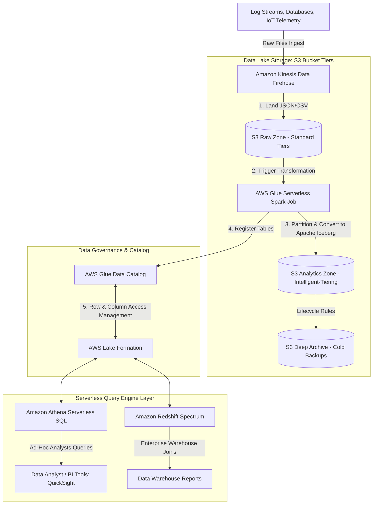

# Scenario 06: Cost-Optimized Data Lake on AWS (Modern Data Stack)

## 1. Problem Statement
An enterprise organization aggregates gigabytes of raw multi-source telemetry, transactional, and logging data daily. The data platform must ingest, structure, and analyze this information securely and cost-effectively, bypassing expensive, continuous database server costs while supporting high-performance BI reporting.

---

## 2. Requirements

### Functional
*   Ingest raw, unstructured log files and database tables from diverse sources.
*   Catalog, clean, and convert raw inputs automatically into structured analytical formats.
*   Allow data analysts to run fast ad-hoc SQL queries against the raw data pool.
*   Enforce fine-grained data access controls (column and row-level masking).

### Non-Functional
*   **Cost Efficiency**: Eliminate running database compute costs when the platform is idle.
*   **Scale**: Store petabytes of structured historical records securely.
*   **Agnostic Data Access**: Support modern open-table formats (Apache Iceberg) to prevent vendor lock-in.

---

## 3. Architecture Diagram

This data stack implements a modern **Lakehouse Architecture**, utilizing serverless analytics engines to query open-table datasets stored directly on Amazon S3.

### Interactive Mermaid Blueprint

---

## 4. Key AWS Services Used

| Service | Architectural Role | Scoped Purpose |
| :--- | :--- | :--- |
| **Amazon S3** | Object Data Lake. | Serves as the primary storage layer, leveraging intelligent-tiering to optimize costs. |
| **Kinesis Data Firehose**| Ingestion Stream Engine. | Ingests, aggregates, and flushes streaming data directly to S3. |
| **AWS Glue** | Serverless ETL. | Transforms unstructured JSON data into optimized Apache Iceberg (Parquet) formats. |
| **AWS Glue Data Catalog**| Central Metadata Registry.| Indexes database schemas and partition locations for analytical engines. |
| **AWS Lake Formation** | Data Governance Center. | Enforces fine-grained, row/column-level access control permissions. |
| **Amazon Athena** | Serverless SQL Engine. | Queries S3 tables directly using standard SQL without provisioning databases. |
| **Amazon Redshift Spectrum**| Serverless Queries. | Extends Redshift queries to scan S3 raw data directly, joining S3 and warehouse tables. |

---

## 5. Step-by-Step Design Walkthrough
1.  **Ingestion**: Multi-source logs and streaming payloads are collected by **Amazon Kinesis Data Firehose**, which aggregates events and writes raw CSV/JSON files directly to the **S3 Raw Zone**.
2.  **ETL Processing**: S3 upload triggers an **AWS Glue ETL Spark Job**. The job cleanses records, removes duplicate fields, and converts data into **Apache Iceberg** table format (backing data with column-oriented **Apache Parquet** files).
3.  **Analytics Storage**: The optimized Iceberg tables are stored in the **S3 Analytics Zone** configured with **S3 Intelligent-Tiering** to optimize costs dynamically as files age.
4.  **Metadata Registration**: Glue registers the Iceberg schema and file partition updates inside the **AWS Glue Data Catalog**.
5.  **Access Management**: **AWS Lake Formation** manages security, defining who can access specific database columns and rows.
6.  **Serverless Querying**:
    *   Data analysts run ad-hoc queries against S3 directly using **Amazon Athena**, paying only for the volume of data scanned per query.
    *   Enterprise reports join historical S3 data with real-time operational database tables inside Amazon Redshift using **Redshift Spectrum**.
7.  **Archival**: S3 lifecycle policies automatically move raw, un-cleansed legacy log files from the raw zone into **S3 Glacier Deep Archive** to minimize long-term storage costs.

---

## 6. Design Patterns Applied
*   **Lakehouse Architecture**: Running serverless SQL query engines directly over file storage (S3) without importing data into expensive relational databases.
*   **Open-Table Format (Apache Iceberg)**: Supports transactional consistency (ACID), schema evolution, and high performance for multi-engine analytical environments on S3.
*   **Column-Oriented Storage Conversion**: Converting flat text formats (CSV, JSON) into compressed, columnar formats (Parquet) to optimize search speeds and lower costs.

---

## 7. Trade-offs

### Pros
*   **Exceptional Cost Efficiency**: Serverless Athena, Glue, and S3 eliminate idle server fees entirely. If no queries run, you pay strictly for storage.
*   **Massive Scalability**: S3 scales storage infinitely, while serverless query engines handle petabyte-scale datasets.
*   **Unified Governance**: Lake Formation enforces security across all analytics engines from a central console.

### Cons
*   **Query Performance Variations**: Scanning cold, unstructured S3 files is slower than querying fully indexed operational warehouses (like a native Redshift cluster).
*   **Complex Transformation Management**: Developing and maintaining Spark Glue ETL jobs requires data engineering expertise.

---

## 8. When to Use This Pattern
*   Enterprise data platforms holding massive historical datasets with variable query rates.
*   Ad-hoc analysis pipelines where maintaining running database clusters 24/7 is not cost-effective.

---

## 9. Cost Estimate

*   **Total Monthly Cost**: ~$300 - $1,500/month (varies with query volume).
*   **Key Cost Drivers**:
    *   *Amazon S3 Storage*: Billed per GB. Using Glacier and Intelligent-Tiering minimizes base costs.
    *   *Amazon Athena Queries*: $5 per TB of data scanned.
    *   *AWS Glue Spark execution fees*: Billed per DPU (Data Processing Unit) hour consumed during ETL runs.

---

## 10. Alternatives Considered & Why Rejected
*   **Store all analytical records in Amazon Redshift**: Rejected. Storing petabytes of historical logs inside a running Redshift cluster is extremely expensive, as you pay continuously for active compute nodes even when queries are not running.
*   **Use self-managed Hadoop/Presto on EC2 (EMR)**: Rejected. High operational overhead. Provisioning, scaling, and managing clusters manually violates operational excellence principles.

---

## 11. Failure Modes & Mitigations

### 1. High Athena Query Costs
*   **Effect**: Users run un-optimized queries (e.g., `SELECT *` without filters), scanning terabytes of data and generating high bills.
*   **Mitigation**: Enforce **partitioning** inside the data catalog. Ensure Athena queries use where filters to restrict searches to specific partition dates. Configure Athena **query limits** to cancel expensive queries automatically.

### 2. Schema Drift Failures
*   **Effect**: Source database updates change columns, crashing the Glue ETL ingestion jobs.
*   **Mitigation**: Configure the Glue Crawler or ETL Spark job to automatically detect schema drifts and log alerts, updating target tables dynamically without disrupting operations.

---

## 12. SA Interview Questions

### Question 1: What is the benefit of using Apache Iceberg format over basic Parquet files in an S3 Data Lake?
**Answer**: 
*   **Basic Parquet on S3** lacks a transactional management layer. You cannot run `UPDATE` or `DELETE` statements easily, schema changes (like renaming columns) require rewriting all historical files, and query engines can return inconsistent results if files are written and read simultaneously.
*   **Apache Iceberg** is an open-table format that brings relational database features directly to S3. It supports full ACID transactions, allows safe column updates and schema evolution without data rewrites, and optimizes performance via smart partition pruning, making S3 look and perform like an operational SQL database.

### Question 2: How does converting CSV files to Parquet format lower your Amazon Athena bill?
**Answer**: 
Amazon Athena bills strictly based on the volume of data scanned ($5.00 per Terabyte scanned).
1.  **Compression**: Parquet format uses advanced algorithms to compress data, reducing raw storage size by up to 80% compared to flat CSV files.
2.  **Columnar Storage**: CSV is row-oriented; to find values in a single column, Athena must scan the entire file. Parquet is column-oriented. If a query only requests the `sales_revenue` column, Athena only scans that specific column block in S3, bypassing all other columns. This can reduce data scan volumes by over 90%, lowering costs proportionally.
