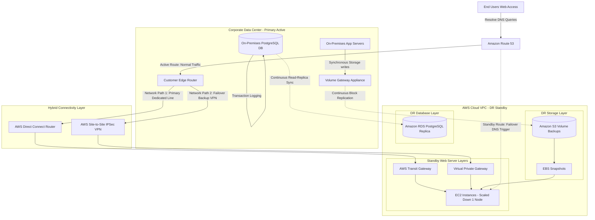

# Scenario 07: Hybrid Cloud Disaster Recovery (Warm Standby)

## 1. Problem Statement
An enterprise organization hosts its core operational applications and database servers inside a physical, on-premises data center. To satisfy compliance requirements and protect against catastrophic events, the company requires a high-performance **Disaster Recovery (DR) Warm Standby** environment on AWS, targeting a strict **RTO < 1 hour** and **RPO < 1 minute** recovery SLA.

---

## 2. Requirements

### Functional
*   Continuously replicate on-premises server volumes and database transactions to AWS in real-time.
*   Automate DNS failover to AWS when the primary on-premises data center goes dark.
*   Support testing of the DR environment without impacting primary on-premises operations.

### Non-Functional
*   **Recovery Objectives**: RTO < 1 Hour, RPO < 1 Minute.
*   **Performance**: The DR network path must handle high synchronization bandwidth private to the public internet.
*   **Resiliency**: Provide redundant network paths to prevent single points of network failure.

---

## 3. Architecture Diagram

---

## 4. Key AWS Services Used

| Service | Architectural Role | Scoped Purpose |
| :--- | :--- | :--- |
| **AWS Direct Connect** | Primary Dedicated Link.| Provides high-bandwidth, private fiber connectivity between on-premises and AWS. |
| **AWS Site-to-Site VPN**| Failover Network Bridge. | Establishes a secure, encrypted backup IPSec tunnel over the public internet. |
| **Amazon RDS (PostgreSQL)**| Standby Database. | Hosts the database replica, continuously replicating on-prem transactions. |
| **AWS Storage Gateway** | Volume Backup Sync. | Runs local VM caching, continuously syncing block storage volumes to S3. |
| **Amazon Route 53** | DNS Failover Routing. | Monitors on-premises endpoint health, routing client traffic to AWS in a disaster. |
| **AWS Transit Gateway** | Central Network Router. | Hub router connecting Direct Connect virtual interfaces to multiple VPC resources. |

---

## 5. Step-by-Step Design Walkthrough
### Phase A: Continuous Warm Synchronization
1.  **Database Replication**: The **On-Premises PostgreSQL Database** continuously replicates transactions asynchronously over the **AWS Direct Connect** private connection to an **Amazon RDS PostgreSQL Read Replica** in the AWS DR VPC. This maintains an RPO under 1 minute.
2.  **File/Volume Sync**: On-premises servers write storage data through a local **AWS Storage Gateway VM (Volume Gateway)**. The gateway continuously syncs block volumes to **Amazon S3** as EBS snapshots.
3.  **Standby Compute**: A scaled-down, single-node **EC2 instance** runs inside the AWS DR VPC to maintain minimal active configurations at low cost.
4.  **Network Redundancy**: If the primary Direct Connect line fails due to a physical fiber cut, network traffic automatically reroutes to the backup **AWS Site-to-Site IPSec VPN** tunnel over the public internet.

### Phase B: Catastrophic Failover Execution (RTO < 1 Hour)
1.  **Disaster Event**: The primary data center suffers a catastrophic power grid collapse or natural disaster.
2.  **DNS Failover**: **Amazon Route 53 health checks** detect that the primary on-premises endpoint is offline. Within 2 minutes, Route 53 updates DNS routing, directing user traffic to the AWS DR VPC.
3.  **Compute Auto-Scaling**: The Route 53 trigger or CloudWatch alarm fires, prompting **AWS Auto Scaling** to scale up the EC2 instances from a single node to a full production cluster (e.g., 10 nodes) to handle active client traffic.
4.  **Database Promotion**: The RDS Read Replica in the DR VPC is promoted to a standalone primary database writer.
5.  **Storage Mount**: The latest EBS snapshots (replicated via Storage Gateway) are attached as high-performance EBS volumes to the newly scaled EC2 instances.
6.  **Restored Operations**: User requests are resolved by the fully scaled AWS infrastructure, achieving recovery in under 15 minutes.

---

## 6. Design Patterns Applied
*   **Warm Standby DR Pattern**: A scaled-down but fully functional copy of the primary infrastructure runs continuously on AWS, ready to scale up in a disaster.
*   **DNS Failover Pattern**: Automating client routing shifts based on continuous endpoint health checks.
*   **Network Path Failover Pattern**: Using a backup IPSec VPN to route traffic automatically if the primary Direct Connect line fails.

---

## 7. Trade-offs

### Pros
*   **Ultra-Low Recovery Metrics (RTO/RPO)**: Promotes databases and scales compute in minutes, satisfying strict SLA guidelines.
*   **Cost-Effective Warm Layer**: Scaled-down compute nodes and serverless backups minimize running costs compared to full active-active dual deployments.
*   **High Network Durability**: Dual network paths (Direct Connect + VPN) eliminate network connection single points of failure.

### Cons
*   **Active Maintenance Overhead**: Running database replication and storage synchronization requires continuous monitoring of replication lag.
*   **Data Consistency Risk**: Asynchronous replication carries a risk of minor data loss if transactions are written immediately before a sudden data center failure.

---

## 8. When to Use This Pattern
*   Traditional enterprise applications hosted on-premises that require robust, low-downtime DR protection on the cloud.
*   Regulated financial, healthcare, or public sector platforms subject to strict disaster recovery compliance guidelines.

---

## 9. Cost Estimate

*   **Total Monthly Cost**: ~$1,500 - $3,000/month.
*   **Key Cost Drivers**:
    *   *AWS Direct Connect Connection*: Monthly port hours + DX location cross-connect charges (~$1,000/month baseline fee).
    *   *RDS Standby Replica DB Instance*: Multi-AZ running costs.
    *   *AWS Storage Gateway*: Billed per GB of data written and storage used.

---

## 10. Alternatives Considered & Why Rejected
*   **Active-Active Dual Deployment (On-Prem + AWS)**: Rejected due to high costs and complex active data synchronization challenges. Running full-scale production compute environments simultaneously on both networks is cost-prohibitive for DR purposes.
*   **Backup & Restore (RTO > 24 Hours)**: Rejected. Backing up data to S3 and recreating the entire server infrastructure using templates only after a disaster occurs takes hours or days to complete, failing the strict RTO < 1-hour requirement.

---

## 11. Failure Modes & Mitigations

### 1. High Replication Lag
*   **Effect**: Network congestion slows database replication, blowing out the RPO beyond 1 minute.
*   **Mitigation**: Configure CloudWatch Alarms to monitor the `ReplicationLag` metric in RDS. Set up notifications to alert administrators if lag exceeds 45 seconds.

### 2. DNS Split-Brain Outages
*   **Effect**: Health check jitter prompts Route 53 to fail over to AWS while the primary data center is still partially online, creating split-brain database inconsistencies.
*   **Mitigation**: Set Route 53 health check thresholds to a conservative limit (e.g., 5 consecutive failed pings) to prevent premature failover triggers during minor network blips.

---

## 12. SA Interview Questions

### Question 1: How do you promote an RDS PostgreSQL Read Replica to Primary during a disaster, and what happens to replication?
**Answer**: 
1.  Connect to the AWS Console, CLI, or run an automation script (AWS Systems Manager) to call the `PromoteReadReplica` API.
2.  RDS terminates the replication relationship, reboots the instance, and opens it as a standalone primary database writer.
3.  **Replication Impact**: The link between on-premises and AWS is severed. When the primary data center is recovered, you must configure it as a replica of the AWS database (reversing replication direction) to sync updates before failing back.

### Question 2: Why do we use AWS Transit Gateway in hybrid networking instead of basic VPC Peering?
**Answer**: 
*   **VPC Peering** is point-to-point and not transitive. If you have on-premises connectivity to VPC A, and VPC A is peered with VPC B, you cannot route traffic from on-premises to VPC B. You must configure individual VPN/DX connections or peering relationships to every single VPC, creating a complex mesh network.
*   **AWS Transit Gateway** acts as a centralized cloud router (hub-and-spoke model). You attach your Direct Connect connection, VPN links, and all VPCs directly to the Transit Gateway. It manages routing transitively across all connections from a central routing table, simplifying hybrid architectures.
