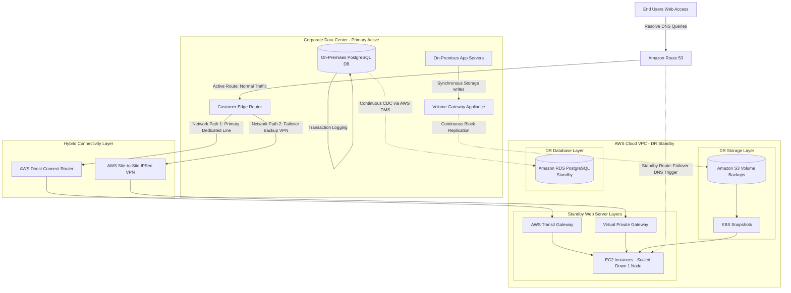

# Scenario 07: Hybrid Cloud Disaster Recovery (Warm Standby)

## 1. Problem Statement
An enterprise organization hosts its core operational applications and database servers inside a physical, on-premises data center. To satisfy compliance requirements and protect against catastrophic events, the company requires a high-performance **Disaster Recovery (DR) Warm Standby** environment on AWS, targeting a strict **RTO < 1 hour** and **RPO < 1 minute** recovery SLA.

---

## 2. Requirements

### Functional
*   Continuously replicate on-premises server volumes and database transactions to AWS in real-time.
*   Automate DNS failover to AWS when the primary on-premises data center goes dark.
*   Support testing of the DR environment without impacting primary on-premises operations.

### Non-Functional
*   **Recovery Objectives**: RTO < 1 Hour, RPO < 1 Minute.
*   **Performance**: The DR network path must handle high synchronization bandwidth private to the public internet.
*   **Resiliency**: Provide redundant network paths to prevent single points of network failure.

---

## 3. Architecture Diagram

### Interactive Mermaid Blueprint

```mermaid
graph TD
    subgraph Corporate_Data_Center [Corporate Data Center - Primary Active]
        OnPremClient[On-Premises App Servers]
        OnPremDB[(On-Premises PostgreSQL DB)]
        StorageGateway[Volume Gateway Appliance]
        CustomerRouter[Customer Edge Router]
        
        OnPremClient -->|Synchronous Storage writes| StorageGateway
        OnPremDB -->|Transaction Logging| OnPremDB
    end
    
    subgraph Network_Transit [Hybrid Connectivity Layer]
        CustomerRouter -->|Network Path 1: Primary Dedicated Line| DX[AWS Direct Connect Router]
        CustomerRouter -->|Network Path 2: Failover Backup VPN| VPN[AWS Site-to-Site IPSec VPN]
    end
    
    subgraph AWS_Disaster_Recovery_VPC [AWS Cloud VPC - DR Standby]
        DX --> TGW[AWS Transit Gateway]
        VPN --> VGW[Virtual Private Gateway]
        
        subgraph Compute_Auto_Scaling [Standby Web Server Layers]
            TGW --> AppStandby[EC2 Instances - Scaled Down 1 Node]
            VGW --> AppStandby
        end
        
        subgraph Storage_Synchronicity [DR Storage Layer]
            StorageGateway -.->|Continuous Block Replication| S3[(Amazon S3 Volume Backups)]
            S3 --> Snapshot[EBS Snapshots]
            Snapshot --> AppStandby
        end
        
        subgraph Database_Synchronicity [DR Database Layer]
            OnPremDB -.->|Continuous CDC via AWS DMS| RDS_Standby[(Amazon RDS PostgreSQL Standby)]
        end
    end
    
    Client[End Users Web Access] -->|Resolve DNS Queries| Route53[Amazon Route 53]
    Route53 -->|Active Route: Normal Traffic| CustomerRouter
    Route53 -.->|Standby Route: Failover DNS Trigger| AppStandby
```

---

## 4. Key AWS Services Used

| Service | Architectural Role | Scoped Purpose |
| :--- | :--- | :--- |
| **AWS Direct Connect** | Primary Dedicated Link.| Provides high-bandwidth, private fiber connectivity between on-premises and AWS. |
| **AWS Site-to-Site VPN**| Failover Network Bridge. | Establishes a secure, encrypted backup IPSec tunnel over the public internet. |
| **AWS Database Migration Service (DMS)** | Continuous Replication. | Streams on-prem PostgreSQL changes (full load plus change data capture) to the RDS target. Native logical replication is an alternative. |
| **Amazon RDS (PostgreSQL)**| Standby Database. | Hosts a standalone, writable standby instance that receives the on-prem transactions. |
| **AWS Storage Gateway** | Volume Backup Sync. | Runs local VM caching, continuously syncing block storage volumes to S3. |
| **Amazon Route 53** | DNS Failover Routing. | Monitors on-premises endpoint health, routing client traffic to AWS in a disaster. |
| **AWS Transit Gateway** | Central Network Router. | Hub router connecting Direct Connect virtual interfaces to multiple VPC resources. |

---

## 5. Step-by-Step Design Walkthrough
### Phase A: Continuous Warm Synchronization
1.  **Database Replication**: The **On-Premises PostgreSQL Database** is continuously replicated, asynchronously and over the **AWS Direct Connect** private connection, into a standalone **Amazon RDS for PostgreSQL** instance in the AWS DR VPC. Use **AWS DMS** (full load plus **change data capture**) or PostgreSQL **native logical replication**. RDS cannot be a native read replica of a database outside AWS, so a read-replica design does not apply here. Create the schema up front, because DMS does not copy secondary indexes, foreign keys, or sequences. This maintains an RPO under 1 minute.
2.  **File/Volume Sync**: On-premises servers write storage data through a local **AWS Storage Gateway VM (Volume Gateway)**. The gateway continuously syncs block volumes to **Amazon S3** as EBS snapshots.
3.  **Standby Compute**: A scaled-down, single-node **EC2 instance** runs inside the AWS DR VPC to maintain minimal active configurations at low cost.
4.  **Network Redundancy**: If the primary Direct Connect line fails due to a physical fiber cut, network traffic automatically reroutes to the backup **AWS Site-to-Site IPSec VPN** tunnel over the public internet.

### Phase B: Catastrophic Failover Execution (RTO < 1 Hour)
1.  **Disaster Event**: The primary data center suffers a catastrophic power grid collapse or natural disaster.
2.  **DNS Failover**: **Amazon Route 53 health checks** detect that the primary on-premises endpoint is offline. Within 2 minutes, Route 53 updates DNS routing, directing user traffic to the AWS DR VPC.
3.  **Compute Auto-Scaling**: The Route 53 trigger or CloudWatch alarm fires, prompting **AWS Auto Scaling** to scale up the EC2 instances from a single node to a full production cluster (e.g., 10 nodes) to handle active client traffic.
4.  **Database Cutover**: Stop the DMS task (or disable the logical replication subscription), reset sequences above the source's last values, and repoint the application to the RDS instance. It is already a standalone, writable primary, so no promotion step is needed.
5.  **Storage Mount**: The latest EBS snapshots (replicated via Storage Gateway) are attached as high-performance EBS volumes to the newly scaled EC2 instances.
6.  **Restored Operations**: User requests are resolved by the fully scaled AWS infrastructure, achieving recovery in under 15 minutes.

---

## 6. Design Patterns Applied
*   **Warm Standby DR Pattern**: A scaled-down but fully functional copy of the primary infrastructure runs continuously on AWS, ready to scale up in a disaster.
*   **DNS Failover Pattern**: Automating client routing shifts based on continuous endpoint health checks.
*   **Network Path Failover Pattern**: Using a backup IPSec VPN to route traffic automatically if the primary Direct Connect line fails.

---

## 7. Trade-offs

### Pros
*   **Ultra-Low Recovery Metrics (RTO/RPO)**: Cuts over the database and scales compute in minutes, satisfying strict SLA guidelines.
*   **Cost-Effective Warm Layer**: Scaled-down compute nodes and serverless backups minimize running costs compared to full active-active dual deployments.
*   **High Network Durability**: Dual network paths (Direct Connect + VPN) eliminate network connection single points of failure.

### Cons
*   **Active Maintenance Overhead**: Running database replication and storage synchronization requires continuous monitoring of replication lag.
*   **Data Consistency Risk**: Asynchronous replication carries a risk of minor data loss if transactions are written immediately before a sudden data center failure.

---

## 8. When to Use This Pattern
*   Traditional enterprise applications hosted on-premises that require robust, low-downtime DR protection on the cloud.
*   Regulated financial, healthcare, or public sector platforms subject to strict disaster recovery compliance guidelines.

---

## 9. Cost Estimate

*   **Total Monthly Cost**: ~$1,500 - $3,000/month.
*   **Key Cost Drivers**:
    *   *AWS Direct Connect Connection*: Monthly port hours + DX location cross-connect charges (~$1,000/month baseline fee).
    *   *RDS Standby DB Instance and DMS Replication Instance*: Multi-AZ running costs.
    *   *AWS Storage Gateway*: Billed per GB of data written and storage used.

---

## 10. Alternatives Considered & Why Rejected
*   **Active-Active Dual Deployment (On-Prem + AWS)**: Rejected due to high costs and complex active data synchronization challenges. Running full-scale production compute environments simultaneously on both networks is cost-prohibitive for DR purposes.
*   **Backup & Restore (RTO > 24 Hours)**: Rejected. Backing up data to S3 and recreating the entire server infrastructure using templates only after a disaster occurs takes hours or days to complete, failing the strict RTO < 1-hour requirement.

---

## 11. Failure Modes & Mitigations

### 1. High Replication Lag
*   **Effect**: Network congestion slows database replication, blowing out the RPO beyond 1 minute.
*   **Mitigation**: Configure CloudWatch Alarms on the DMS `CDCLatencyTarget` metric (or replication slot lag on the source when using native logical replication). Note that the RDS `ReplicaLag` metric only applies to RDS read replicas. Set up notifications to alert administrators if lag exceeds 45 seconds.

### 2. DNS Split-Brain Outages
*   **Effect**: Health check jitter prompts Route 53 to fail over to AWS while the primary data center is still partially online, creating split-brain database inconsistencies.
*   **Mitigation**: Set Route 53 health check thresholds to a conservative limit (e.g., 5 consecutive failed pings) to prevent premature failover triggers during minor network blips.

---

## 12. SA Interview Questions

### Question 1: How do you cut over to the RDS PostgreSQL standby during a disaster, and what happens to replication?
**Answer**: 
1.  **Why there is no promotion**: RDS read replicas can only replicate from another RDS or Aurora database in AWS, never from an on-premises server. This design therefore uses **AWS DMS (CDC)** or PostgreSQL **logical replication** into a standalone RDS instance, and `PromoteReadReplica` does not apply.
2.  **Cutover**: The target is already writable. Run an **SSM Automation** runbook that stops the DMS task (or disables the subscription), **resets sequences** (neither DMS nor logical replication syncs sequence values), and repoints the application connection string or a DNS alias to RDS.
3.  **Prepare in advance**: DMS creates tables and primary keys but not secondary indexes, foreign keys, or sequences. Apply the full schema beforehand (for example `pg_dump --schema-only`) and rehearse the cutover.
4.  **Replication Impact**: The link between on-premises and AWS is severed. To fail back after recovery, reverse the direction (set `rds.logical_replication = 1` and publish from RDS, or run a DMS task from RDS to on-prem), sync, then cut back.

### Question 2: Why do we use AWS Transit Gateway in hybrid networking instead of basic VPC Peering?
**Answer**: 
*   **VPC Peering** is point-to-point and not transitive. If you have on-premises connectivity to VPC A, and VPC A is peered with VPC B, you cannot route traffic from on-premises to VPC B. You must configure individual VPN/DX connections or peering relationships to every single VPC, creating a complex mesh network.
*   **AWS Transit Gateway** acts as a centralized cloud router (hub-and-spoke model). You attach your Direct Connect connection, VPN links, and all VPCs directly to the Transit Gateway. It manages routing transitively across all connections from a central routing table, simplifying hybrid architectures.

---

## 🔁 Interviewer Follow-Up Drills

Real interviews push past the first design. Practice defending it against these follow-ups.

### Follow-Up 1: The on-premises data change rate grows 10x. What breaks first, and how do you fix it?
**Answer**: 
*   **First to break**: **Replication bandwidth, and with it the RPO.** Database replication and **Storage Gateway** block sync compete for the **Direct Connect** link, so replication latency (DMS `CDCLatencyTarget`) climbs past 1 minute. Worse, if DX fails, the backup **Site-to-Site VPN** (about 1.25 Gbps per tunnel) can't carry 10x the traffic, so failing over to the VPN silently breaks the RPO.
*   **Fixes**:
    1.  Upgrade to a larger DX port or a **LAG**, and add a **second DX at a different DX location** (the maximum-resiliency model).
    2.  Move the VPN from the VGW onto the **Transit Gateway** and use **ECMP across multiple tunnels** to aggregate backup bandwidth.
    3.  Size the Storage Gateway **upload buffer and cache disks** for the new write rate.
*   **Failover side**: Scaling 1 node to 10x the fleet stresses EC2 capacity and snapshot hydration. Use **EBS Fast Snapshot Restore** and **On-Demand Capacity Reservations** in the DR region.

### Follow-Up 2: Cut the DR bill by 40%. What do you change, and what do you give up?
**Answer**: 
*   **Direct Connect** (~$1,000/month baseline) is the biggest item. Downsize to a smaller **hosted connection**, or go VPN-only if steady replication bandwidth allows. *Give up*: Predictable latency and RPO headroom during bursts.
*   **RDS standby**: Run it **Single-AZ** in steady state on a **Graviton Reserved Instance** (and right-size the DMS replication instance), and convert to Multi-AZ after cutover. *Give up*: A few extra minutes of RTO, and exposure to an AZ failure during a disaster.
*   **Compute**: Drop the always-on EC2 node and move to **Pilot Light** (AMIs and launch templates only, with 0 instances running). RTO rises but can stay under 1 hour if scale-out is automated.
*   **Evaluate AWS Elastic Disaster Recovery (DRS)** to replace Storage Gateway and snapshot plumbing. It uses low-cost staging and launches recovery instances on demand.

### Follow-Up 3: Leadership decides to exit the data center and make AWS the permanent primary. How do you cut over with (near) zero downtime?
**Answer**: 
1.  **Prep**: Lower the **Route 53 TTLs** days in advance. Scale the AWS environment to full production size and warm it with synthetic traffic.
2.  **Sync**: Confirm DMS CDC latency is near zero and Storage Gateway volumes are fully uploaded.
3.  **Cutover window** (seconds of write freeze, not an outage): Stop writes on-prem by setting the app to read-only, wait for latency to reach 0, then use an **SSM Automation** runbook to stop the DMS task, reset sequences, and repoint the app to RDS before flipping Route 53 to AWS.
4.  **Fallback path**: Immediately **reverse replication** (logical replication or a DMS task from RDS to on-prem) so the on-prem PostgreSQL stays in sync with AWS. You can fail back if issues appear.
5.  Decommission on-prem only after a stability window. Resize DX or replace it with a VPN once replication traffic stops.

### Follow-Up 4: The Direct Connect link fails, but the data center is still up. What's the blast radius, and how do you recover?
**Answer**: 
*   **Blast radius**: **End users are unaffected**, because they reach the on-prem app over the internet through Route 53. The impact is on **DR readiness**: replication moves to the backup VPN with lower bandwidth and higher latency, so replication latency grows and the **RPO < 1 minute guarantee is at risk**. If a real disaster hits during this window, you lose more data.
*   **Automatic path failover**: Run **BGP with BFD** on DX for sub-second detection, and use AS-path prepending or lower local preference so the VPN is preferred only when DX is down.
*   **Detection**: Set CloudWatch alarms on DX `ConnectionState`, VPN `TunnelState`, and DMS `CDCLatencyTarget`, and declare a "DR degraded" state to the business.
*   **Recovery**: Fix the carrier or cross-connect fault. Long term, add a **second DX connection** so one fiber cut doesn't downgrade DR posture.

### Follow-Up 5: Auditors require a full DR test every quarter with zero impact on production and without breaking replication. How do you run it?
**Answer**: 
*   **Never cut over the live standby for a test.** Stopping replication and writing to the standby forces a full resync afterward. Instead, **snapshot the RDS standby** (or use Storage Gateway volume snapshots) and restore **copies** into an **isolated test VPC or subnets**.
*   The test VPC has **no route back to on-premises** (separate Transit Gateway route table), so test instances can't write to production systems.
*   Launch the app tier from the same launch templates and AMIs, and use a **Route 53 private hosted zone** or a test subdomain so real users never resolve to the test stack.
*   Drive the test with an **SSM Automation runbook** that times each step, producing **measured RTO and RPO evidence** for auditors. Optionally add **AWS Fault Injection Service** experiments.
*   Tear everything down automatically afterward to control cost.
