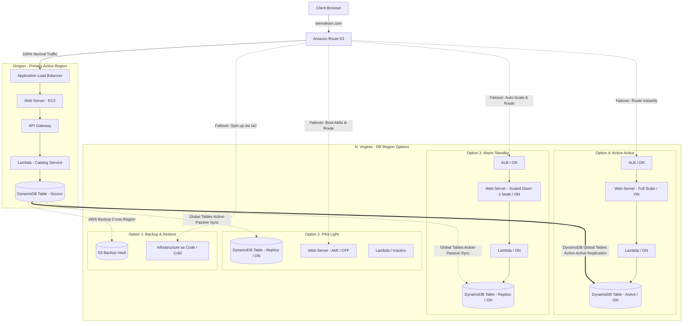

# Scenario 08: Cloud-Native Multi-Region Disaster Recovery (Comparison of 4 Strategies)

## 1. Problem Statement
A global e-commerce enterprise hosts its core **Product Catalog Application** on AWS. The catalog serves millions of active users and must maintain high availability. To comply with business continuity mandates, the cloud architecture team must evaluate and document the deployment of the application across a primary region (**Oregon - us-west-2**) and a disaster recovery region (**N. Virginia - us-east-1**) under all four AWS disaster recovery (DR) strategies.

The team must compare the trade-offs of:
1. **Backup and Restore**
2. **Pilot Light**
3. **Warm Standby**
4. **Multi-Site Active-Active**

---

## 2. Requirements

### Functional
*   Provide a CRUD interface for the product catalog (Read, Add, Edit, Delete items).
*   Search products by ID, category, or title.
*   Automate traffic redirection to the recovery region during a primary region outage.

### Non-Functional
*   **Infrastructure Stack**: Route 53 (`demolearn.com`) -> Application Load Balancer (ALB) -> Web Server (EC2) -> API Gateway -> Lambda Function -> DynamoDB.
*   **Resiliency Evaluation**: Detail specific RTO, RPO, cost, and operational complexity trade-offs for each of the 4 strategies.
*   **Data Integrity**: Address conflict resolution and data replication lag across regions.

---

## 3. Architecture Blueprints

### Interactive Mermaid Blueprint: DR Strategies Compared

---

## 4. Key AWS Services Used

| Service | Architectural Role | Scoped Purpose |
| :--- | :--- | :--- |
| **Amazon Route 53** | Global DNS Router. | Monitors us-west-2 health checks and handles failover routing policies. |
| **Amazon DynamoDB** | Database Layer. | Serves as the catalog data store; upgraded to **Global Tables** for multi-region replication. |
| **AWS Backup** | Centralized Backup Engine. | Automates database and volume backups, copying them to a secondary region vault. |
| **AWS Elastic Disaster Recovery (DRS)** | Block-level Replicator. | Continuously replicates EC2 web server volumes to staging areas in `us-east-1`. |
| **AWS Lambda & API Gateway** | Serverless Backend. | Runs the application logic and REST API endpoints. |
| **Terraform / AWS CloudFormation** | Infrastructure as Code. | Automates resource provisioning in the recovery region during failover. |

---

## 5. Walkthrough of the 4 DR Strategies

### Strategy 1: Backup and Restore
*   **Continuous Synchronization**: 
    *   **AWS Backup** takes hourly snapshots of the EC2 Web Server volumes and daily backups of the DynamoDB table.
    *   Backups are automatically copied to a backup vault in the **us-east-1** region.
*   **Failover Process (RTO: ~4-8 Hours)**:
    1.  The primary region (`us-west-2`) experiences an outage.
    2.  An administrator initiates recovery manually.
    3.  A Terraform pipeline runs in `us-east-1` to build the VPC, ALB, API Gateway, and Lambda functions.
    4.  The DynamoDB table is restored from the latest copied backup in `us-east-1`.
    5.  A new EC2 Web Server instance is launched, and the restored EBS volumes are attached.
    6.  Route 53 DNS records are updated to point to the new ALB in `us-east-1`.
*   **Failback Process**:
    1.  Create a backup of the running DynamoDB table in `us-east-1`.
    2.  Copy the backup back to `us-west-2` and restore it.
    3.  Redeploy primary infrastructure and shift Route 53 DNS traffic back.

### Strategy 2: Pilot Light
*   **Continuous Synchronization**:
    *   DynamoDB is configured with **Global Tables** (active-passive mode where reads are done in both, but writes go to the primary region).
    *   Web Server AMIs and Lambda zip files are replicated and kept ready in `us-east-1`.
    *   A database replica is kept online and active, but no web server EC2 instances are running.
*   **Failover Process (RTO: ~15-30 Minutes)**:
    1.  `us-west-2` goes offline.
    2.  Route 53 health check fails.
    3.  A Lambda script or systems administrator triggers the launch of EC2 Web Server instances using the pre-replicated AMIs in `us-east-1`.
    4.  API Gateway and Lambda functions are enabled to process traffic.
    5.  Route 53 changes the active endpoint to `us-east-1`.
*   **Failback Process**:
    1.  Verify database replication from the DR region back to `us-west-2` is in sync.
    2.  Shut down EC2 Web Server instances in `us-east-1` to prevent split-brain writes.
    3.  Redirect Route 53 traffic back to `us-west-2`.

### Strategy 3: Warm Standby
*   **Continuous Synchronization**:
    *   DynamoDB Global Tables replicate writes in real-time.
    *   A scaled-down, fully operational stack is always running in `us-east-1` (e.g., 1 EC2 Web Server instance, active API Gateway, and Lambda).
*   **Failover Process (RTO: ~5-10 Minutes)**:
    1.  Route 53 health check detects the primary region failure.
    2.  Route 53 DNS Failover routing automatically redirects 100% of client traffic to the `us-east-1` ALB.
    3.  The influx of traffic triggers a CloudWatch Alarm, causing the **Auto Scaling Group** in `us-east-1` to scale up the EC2 instances from `1` to the full production size (e.g., `10` instances) to handle the load.
*   **Failback Process**:
    1.  Ensure primary region databases are healthy and caught up.
    2.  Change Route 53 DNS weighting back to 100% primary.
    3.  Scale down the compute layer in the DR region back to a single instance.

### Strategy 4: Multi-Site Active-Active
*   **Continuous Synchronization**:
    *   Full-scale application environments run concurrently in both `us-west-2` and `us-east-1`.
    *   **DynamoDB Global Tables** replicate writes bi-directionally across both regions (latency < 1 second).
*   **Failover Process (RTO: Near Zero / Sub-second)**:
    1.  `us-west-2` suffers an outage.
    2.  Route 53 Active-Active routing (configured with Latency or Weighted policy and health checks) automatically detects the regional failure.
    3.  Healthy DNS endpoints in `us-east-1` immediately serve 100% of queries.
    4.  No resource provisioning or database promotion is required; the secondary region is already fully scaled.
*   **Failback Process**:
    1.  Once `us-west-2` recovery is complete, Route 53 health checks succeed.
    2.  Route 53 automatically resumes sending traffic to both regions based on latency.

---

## 6. Comprehensive Strategy Trade-offs

| Dimension | Backup & Restore | Pilot Light | Warm Standby | Active-Active |
| :--- | :--- | :--- | :--- | :--- |
| **RTO** | Hours (4–8+ hours) | Tens of Minutes | Minutes (5–10 mins) | Sub-second (Real-time) |
| **RPO** | Hours (up to 24 hours) | Seconds to Minutes | Seconds to Minutes | Near-zero (< 1 second) |
| **Relative Cost** | **$** (Very Low) | **$$** (Low) | **$$$** (Medium) | **$$$$** (High) |
| **Complexity** | Low (Straightforward) | Medium | High | Very High |
| **Failover Action**| Manual restore & deploy | Manual/Scripted compute spin-up | Automatic DNS failover + Auto-scaling | Automatic DNS routing failover |
| **Data Engine** | Restore from S3 | Active DynamoDB replica | Active DynamoDB replica | DynamoDB Global Table |

---

## 7. Cost Estimates (Product Catalog Application)

Assuming a baseline database size of **500 GB** and average traffic of **10,000 requests/sec**:

### 1. Backup & Restore (~$150/month)
*   *us-west-2*: Primary resources (~$800/month).
*   *us-east-1*: Cold backups. AWS Backup storage and cross-region replication fees (~$150/month). No active compute running.

### 2. Pilot Light (~$400/month)
*   *us-east-1*: DynamoDB Global Table replication active ($250/month). EC2 instances are off; AMI storage is minimal ($10/month). API Gateway & Lambda are billed per request (zero idle cost). Route 53 active health checks ($140/month).

### 3. Warm Standby (~$1,200/month)
*   *us-east-1*: DynamoDB Global Table replication active ($250/month). 1 active EC2 instance running 24/7 ($150/month). ALB running ($25/month). API Gateway & Lambda active. Route 53 ARC health routing and check fees (~$775/month).

### 4. Multi-Site Active-Active (~$2,200/month)
*   *us-east-1*: Fully replicated production environment ($1,000/month). DynamoDB Global Table active-active writes ($450/month). Route 53 routing and Global Accelerator traffic routing ($750/month).

---

## 8. Failure Modes & Mitigations

### 1. DynamoDB Write Conflict (Split-Brain) in Active-Active
*   **Effect**: Two different clients edit the same product record in different regions at the same time during a split-brain networking event, causing data divergence.
*   **Mitigation**: DynamoDB Global Tables resolve conflicts using **Last-Writer-Wins (LWW)** based on internal system physical timestamps. To avoid LWW anomalies, the application layer should implement **conditional writes** using `attribute_exists` or version checks.

### 2. DNS Failover Jitter
*   **Effect**: Flapping health checks cause Route 53 to repeatedly route traffic back and forth between regions, causing session drops and database lag confusion.
*   **Mitigation**: Set Route 53 health check evaluation periods to a conservative threshold (e.g., 3 checks at 30-second intervals) and implement **Route 53 Application Recovery Controller (ARC)** routing controls for manual, safety-guaranteed failover control.

### 3. Application Throttling in Recovery Region
*   **Effect**: Upon failover, a sudden dump of 100% traffic on the DR region triggers concurrency throttles in Lambda or RDS database connection limits.
*   **Mitigation**: Request matching **Service Quotas** (e.g., Lambda concurrent executions) in both regions. Implement pre-warmed ALBs and use RDS Proxy if employing relational databases.

---

## 9. SA Interview Questions

### Question 1: How does Amazon DynamoDB Global Tables resolve write conflicts, and how can an architect manage it?
**Answer**: 
DynamoDB Global Tables utilize a **Last-Writer-Wins (LWW)** reconciliation algorithm. If two updates are made to the same item concurrently in different regions, DynamoDB compares the update timestamps and the latest write wins. 
*   To manage this risk, architects can implement **Region Pinning** (e.g., routing users from Region A only to Region A's endpoint using Route 53 Geolocation routing).
*   Alternatively, developers can use **Optimistic Locking** (using a version attribute). Writes check if the version matches the local read version. If a conflict occurred, the write fails, and the application must read the latest version and retry.

### Question 2: What is the purpose of Route 53 Application Recovery Controller (ARC) in enterprise DR?
**Answer**: 
Standard Route 53 health checks perform automated failovers. However, for complex enterprise systems, automated DNS switches during a transient blip can cause major database split-brain risks and data corruption. 
**Route 53 ARC** provides:
1.  **Routing Controls**: Manual "on/off" traffic switches that operate at the global DNS level, allowing operators to trigger DR failovers safely with a single API call or CLI command.
2.  **Readiness Checks**: Continually audits the capacity and configuration of your recovery region resources to ensure they match the primary region and are ready to scale up before traffic is sent.

### Question 3: Why is a relational database failover (e.g. Aurora Global Database) more complex than DynamoDB in an Active-Active setup?
**Answer**: 
*   **DynamoDB Global Tables** natively support multi-region active-active writes (multi-primary). Writes can occur anywhere and replicate bi-directionally.
*   **Amazon Aurora Global Database** uses a single-primary writer architecture. The primary database in us-west-2 handles all write transactions, while the replica database in us-east-1 is read-only (asynchronous replication). 
*   If us-west-2 fails, you must initiate a database promotion to turn the us-east-1 replica into the new primary writer. During this promotion window, writes are blocked. Achieving true active-active write capability on relational databases requires application-level sharding or write forwarding, which introduces significant latency and code complexity.
